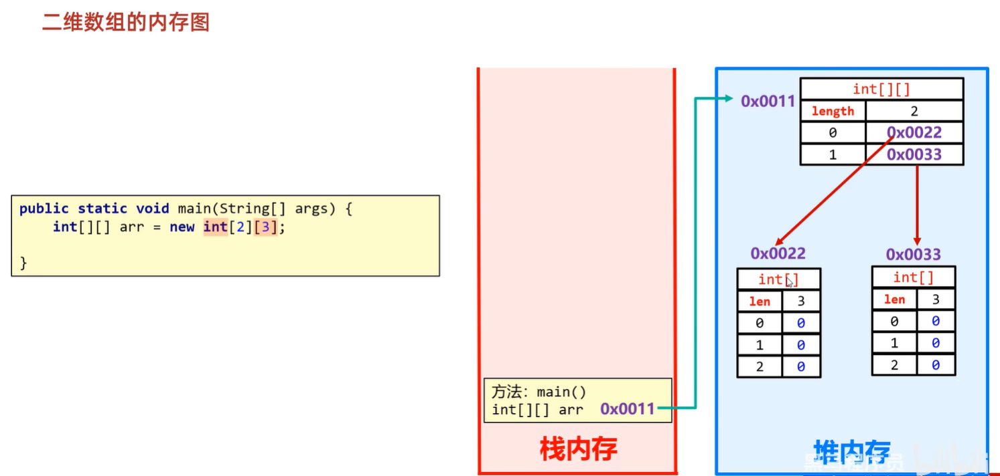

# 数组介绍

数组是一种容器,可以用来存储同种数据类型的多个值    
数组容器在存储数据的时候,需要结合隐式转换考虑  
**容器的类型和存储的数据类型保持一致**  

# 数组的定义

1. 第一种格式: `数据类型[] 数组名`   
范例: `int[] array`
2. 第二种格式: `数据类型 数组名[]`   
范例: `int array[]`  

# 数组静态初始化

初始化: 在内存中为数组容器开辟空间,并将数据存入容器中的过程  

完整格式: `数据类型[] 数组名 = new 数据类型[]{元素1,元素2,元素3...};`   
范例: `int[] array = new int[]{11,22,33};`   

简化格式: `数据类型[] 数组名 = {元素1,元素2,元素3...};`   
范例: `int[] array = {11,22,33};`   

练习: 

定义数组分别存储3个学生的年龄、姓名、身高

```java
public class test {
    public static void main(String[] args) {
        int[] age = {12,13,18};
        String[] name = {"李华","张非","顾涛"};
        double[] height = {1.72,1.80,1.75};
    }
}
```

# 数组动态初始化

动态初始化: 初始化时只指定数组长度,由系统为数组分配初始值   

格式: `数据类型[] 数组名 = new 数据类型[数组长度];`   
范例: `int[] array = new int[3];`  

练习: 

定义一个数组,用来存储班级中50个学生的姓名

```java
public class test {
    public static void main(String[] args) {
        String[] name = new String[50];
        name[0] = "张三";
        name[1] = "李四";
        System.out.println(name[0]);
        System.out.println(name[1]);
        // 打印出来的是默认初始值null
        System.out.println(name[2]);
    }
}
```

数组默认初始化值的规律: 

- 整数类型: 默认初始化值为0     
- 小数类型: 默认初始化值为0.0    
- 字符类型: 默认初始化值为/u0000(空格)    
- 布尔类型: 默认初始化值为false    
- 引用数据类型: 默认初始化值为null    

# 初始化对比

1. 动态初始化: 手动指定数组长度,由系统给出默认的初始化值  
**只明确元素个数,不明确具体数值,推荐使用动态初始化**   

练习: 

使用数组容器来存储键盘录入的5个整数

```java
import java.util.Scanner;

public class test {
    public static void main(String[] args) {
        Scanner sc = new Scanner(System.in);
        int[] arr = new int[5];
        int n = 1;
        for (int i = 0; i < 5; i++) {
            System.out.println("请输入第" + n + "个数: ");
            arr[i] = sc.nextInt();
            n++;
        }
        System.out.println("数组存储的数为: ");
        for (int i = 0; i < 5; i++) {
            System.out.println(arr[i]);
        }
    }
}
```

2. 静态初始化: 手动指定数组元素,系统会根据元素个数,计算出数组的长度   
**需求中已经明确了要操作的具体数据,推荐使用静态初始化**   

练习: 

将三个人的成绩: 100,97,80存入数组中

```java
public class test {
    public static void main(String[] args) {
        int[] grade = {100, 97, 80};
        for (int i = 0; i < 3; i++) {
            System.out.println(grade[i]);
        }
    }
}
```

# 数组元素访问

1. 数组的地址值  

`System.out.println(age);// [I@b4c966a`打印的是数组的地址值   

- `[`表示当前是一个数组    
- i表示当前数组的元素都是int类型的  
- `@`表示一个间隔符(固定格式)  
- `b4c966a`表示数组真正的地址值(十六进制)  

2. 数组元素访问  
格式: `数组名[索引];`

3. 索引: 也叫下标、角标   
索引的特点: 从0开始,逐个+1增长,连续不间断  
最小索引: 0  
最大索引: 数组长度-1  

4. 把数据存储到数组当中   
格式: `数组名[索引] = 具体数据/变量;`

范例: 

```java
public class test {
    public static void main(String[] args) {
        // 获取数组里面的元素,格式: 数组名[索引]
        int[] age = {12,13,18};
        System.out.println(age[2]);
        // 把数据存储到数组当中,格式: 数组名[索引] = 具体数据/变量;
        // 一旦覆盖之后,原来的数据就不存在了
        age[1] = 44;
        System.out.println(age[1]);
    }
}
```

# 数组遍历

将数组中的所有内容取出来,取出来之后可以打印、求和、判断...

练习: 

```java
public class test {
    public static void main(String[] args) {
        int[] array = {12,213,414};
        for (int i = 0; i < 3; i++) {
            System.out.println(array[i]);
        }
    }
}
```

**其中i表示数组里面每一个元素的索引,array[i]表示数组里面的每一个元素**  

在Java中,关于数组的一个长度属性: length  
调用方式: `数组名.length`   

范例: 

```java
public class test {
    public static void main(String[] args) {
        int[] array = {12,213,414};
        for (int i = 0; i < array.length; i++) {
            System.out.println(array[i]);
        }
    }
}
```

练习: 

定义一个数组,存储1,2,3,4,5,遍历数组得到每一个元素并求和

```java
public class test {
    public static void main(String[] args) {
        int[] array = {1, 2, 3, 4, 5};
        int sum = 0;
        for (int i = 0; i < array.length; i++) {
            sum += array[i];
        }
        System.out.println(sum);
    }
}
```

练习: 

定义一个数组,存储1,2,3,4,5,6,7,8,9,10  
遍历数组得到每一个元素,统计数组里面一共有多少个能被3整除的数字  

```java
public class test {
    public static void main(String[] args) {
        int[] array = {1, 2, 3, 4, 5, 6, 7, 8, 9, 10};
        int count = 0;
        for (int i = 0; i < array.length; i++) {
            if(array[i] % 3 == 0){
                count++;
            }
        }
        System.out.println("数组中一共有"+ count + "个能被3整除的数字");
    }
}
```

练习: 

定义一个数组,存储1,2,3,4,5,6,7,8,9,10,遍历数组得到每一个元素  
要求: 如果是奇数,则将当前的数字扩大两倍;如果是偶数,则将当前的数字变成二分之一  

```java
public class test {
    public static void main(String[] args) {
        int[] array = {1, 2, 3, 4, 5, 6, 7, 8, 9, 10};
        int count = 0;
        for (int i = 0; i < array.length; i++) {
            if (array[i] % 2 != 0) {
                array[i] *= 2;
            } else {
                array[i] /= 2;
            }
        }
        for (int i = 0; i < array.length; i++) {
            System.out.println(array[i]);
        }
    }
}
```

# 数组内存图


1. 栈: 方法运行时使用的内存
比如main方法运行,进入方法栈中执行
2. 堆: 存储对象或者数组
new来创建的,都存储在堆内存
3. 元空间(方法区): 存储可以运行的class文件
4. 本地方法栈: JVM在使用操作系统功能的时候使用
5. 寄存器: 供CPU使用


## 变量内存


## 数组内存


注意事项: 
1. **只要是new出来的一定是在堆里面开辟了一个小空间**
2. **如果new了多次,那么堆里面有很多小空间,小空间中都有各自的数据**


注意事项: 
1. **当两个数组指向同一个小空间时,其中一个数组对小空间中的值发生了改变**
3. **那么其他数组再次访问的时候,就都是修改之后的结果**

# 数组常见问题

1. 索引越界异常  
当访问了数组中不存在的索引,就会引发索引越界异常  
解决: 索引的范围  

范例: 

```java
public class test {
    public static void main(String[] args) {
        int[] arr = {1, 2, 3, 4, 5};
        // 报错 ArrayIndexOutOfBoundsException: Index 10 out of bounds for length 5
        System.out.println(arr[10]);
    }
}
```

# 二维数组

应用场景: **数据分组管理**  

arr[i][j],其中arr表示二维数组  
- i表示获取二维数组的索引,获取出来的是里面的一维数组  
- j表示维数组的索引,获取出来的是里面的一维数组的元素  

## 二维数组的静态初始化

完整格式: `数据类型[][] 数组名 = new 数据类型[][] {{元素1,元素2,...},{元素1,元素2,...}};`    
范例: `int[][] arr = new int[][] {{1,2},{2,3}};`   

简化格式: `数据类型[][] 数组名 = {{元素1,元素2,...},{元素1,元素2,...}};`  
范例: `int[][] arr = {{1,2},{2,3}};`   

范例: 

```java
public class test {
    public static void main(String[] args) {
        int[][] arr1 = new int[][]{{1, 2, 3}, {4, 5, 6, 7, 8}};
        int[][] arr2 = {{1, 2, 3}, {4, 5, 6, 7, 8}};
        // 建议把每一个一维数组单独写成一行
        // 每一个一维数组其实是二维数组中的元素,所以每一个一维数组之间需要用`,`隔开
        int[][] arr3 = {
                {1, 2, 3},
                {4, 5, 6, 7, 8}
        };
        // 表示获取二维数组中的第一个一维数组(地址)
        System.out.println("打印二维数组中的第一个一维数组地址: " + arr3[0]);
        // 表示获取二维数组中的第一个一维数组的0索引元素1
        System.out.println("打印二维数组中的第一个一维数组的0索引元素: " + arr3[0][0]);
        System.out.println("打印二维数组: ");
        // 遍历二维数组,得到里面的每一个一维数组
        for (int i = 0; i < arr3.length; i++) {
            // 遍历一维数组,得到里面的每一个元素
            // i表示二维数组的每一个索引
            // arr3[i]表示二维数组中的每一个元素(一维数组)
            for (int j = 0; j < arr3[i].length; j++) {
                // arr3[i][j]表示二维数组中的每一个一维数组的每一个元素
                System.out.print(arr3[i][j] + " ");
            }
            // 换行
            System.out.println();
        }
    }
}
```

## 二维数组的动态初始化

格式: `数据类型[][] 数组名 = new 数据类型[m][n]`      
其中m表示二维数组中存放的一维数组数量,n表示一维数组的数组长度(即存放的元素数量)

范例: 

```java
public class test {
    public static void main(String[] args) {
        // 3表示二维数组中有3个一维数组,数组类型为int[]
        // 5表示一维数组的长度为5,可以装5个int类型的元素
        int[][] arr = new int[3][5];
        // 给二维数组的第一个一维数组的第一个元素赋值为10
        arr[0][0] = 10;
        // 遍历二维数组
        for (int i = 0; i < arr.length; i++) {
            for (int j = 0; j < arr[i].length; j++) {
                System.out.print(arr[i][j]+" ");
            }
            System.out.println();
        }
    }
}
```

## 二维数组的内存原理



arr[0]即获取二维数组中的第一个一维数组的地址: 0x0011  
arr[0][1]即获取第一个一维数组的第二个元素的值: 0   

1. 特殊情况1:     
先不去定义一维数组的数组长度,自己定义后将一维数组的地址赋值给二维数组


2. 特殊情况2:     
先定义一维数组的数组长度,自己重新定义后将一维数组的地址赋值给二维数组,即实现自己的定义覆盖原定义


练习: 

某商城每个季度的营业额如下(单位: 万元):   
第一季度: 22,66,44  
第二季度: 77,33,88  
第三季度: 25,45,65  
第四季度: 11,66,99   
要求: 计算出每个极度的总营业额和全年的总营业额   

```java
public class test {
    public static void main(String[] args) {
        int[][] arr = new int[4][3];
        int[] arr1 = {22, 66, 44};
        int[] arr2 = {77, 33, 88};
        int[] arr3 = {25, 45, 65};
        int[] arr4 = {11, 66, 99};
        arr[0] = arr1;
        arr[1] = arr2;
        arr[2] = arr3;
        arr[3] = arr4;
        // 创建数组存储季度的总营业额
        int[] quarterSum = new int[4];
        for (int i = 0; i < 4; i++) {
            int sum = getSum(arr[i]);
            System.out.println("第" + (i + 1) + "季度的总营业额为: " + sum + "万元");
            quarterSum[i] = sum;
        }
        int yearSum = getSum(quarterSum);
        System.out.println("全年的总营业额为: " + yearSum + "万元");

    }

    // 数组元素求和
    public static int getSum(int[] arr) {
        int sum = 0;
        for (int i = 0; i < arr.length; i++) {
            sum += arr[i];
        }
        return sum;
    }
}
```

练习: 

`int[] tempArr = {0, 1, 2, 3, 4, 5, 6, 7, 8, 9, 10, 11, 12, 13, 14, 15};`  
要求: 打乱一维数组中的数据,并按照4个一维数组的方式添加到二维数组中  

方法一: 

```java
import java.util.Random;

public class test {
    public static void main(String[] args) {
        // 创建一个一维数组
        int[] tempArr1 = {0, 1, 2, 3, 4, 5, 6, 7, 8, 9, 10, 11, 12, 13, 14, 15};
        Random random = new Random();
        // 遍历一维数组,得到每一个元素,拿着每一个元素跟随机索引上的数据进行交换
        for (int i = 0; i < tempArr1.length; i++) {
            // 获取随机索引
            int randomIndex = random.nextInt(16);
            // 拿着每一个元素跟随机索引上的数据进行交换
            int temp = tempArr1[i];
            tempArr1[i] = tempArr1[randomIndex];
            tempArr1[randomIndex] = temp;
        }
        // 创建一个4*4的二维数组
        int[][] tempArr2 = new int[4][4];
        // 遍历一维数组
        for (int i = 0; i < tempArr1.length; ) {
            if (i < 4) {
                // 将一维数组中索引0~3的元素添加到第1个一维数组中
                for (int j = 0; j < 4; j++) {
                    tempArr2[0][j] = tempArr1[i];
                    i++;
                }
                // 将一维数组中索引4~7的元素添加到第2个一维数组中
            } else if (i < 8) {
                for (int j = 0; j < 4; j++) {
                    tempArr2[1][j] = tempArr1[i];
                    i++;
                }
                // 将一维数组中索引8~11的元素添加到第3个一维数组中
            } else if (i < 12) {
                for (int j = 0; j < 4; j++) {
                    tempArr2[2][j] = tempArr1[i];
                    i++;
                }
                // 将一维数组中索引12~15的元素添加到第4个一维数组中
            } else {
                for (int j = 0; j < 4; j++) {
                    tempArr2[3][j] = tempArr1[i];
                    i++;
                }
            }
        }
        // 遍历二维数组
        for (int[] i: tempArr2) {
            for (int j: i) {
                System.out.print(j + " ");
            }
            System.out.println();
        }
    }
}
```

方法二: 

```java
import java.util.Random;

public class test {
    public static void main(String[] args) {
        // 创建一个一维数组
        int[] tempArr1 = {0, 1, 2, 3, 4, 5, 6, 7, 8, 9, 10, 11, 12, 13, 14, 15};
        Random random = new Random();
        // 遍历一维数组,得到每一个元素,拿着每一个元素跟随机索引上的数据进行交换
        for (int i = 0; i < tempArr1.length; i++) {
            // 获取随机索引
            int randomIndex = random.nextInt(16);
            // 拿着每一个元素跟随机索引上的数据进行交换
            int temp = tempArr1[i];
            tempArr1[i] = tempArr1[randomIndex];
            tempArr1[randomIndex] = temp;
        }
        // 创建一个4*4的二维数组
        int[][] tempArr2 = new int[4][4];
        // 遍历一维数组
        for (int i = 0; i < tempArr1.length; i++) {
            // 将一维数组中索引0~3,4~7,8~11,12~15的元素分别添加到二维数组中
            // 0~3 / 4 = 0; 0~3 % 4 = 0~3
            // 4~7 / 4 = 1; 4~7 % 4 = 0~3
            // 8~11 / 4 = 2; 8~11 % 4 = 0~3
            // 12~15 / 4 = 3; 12~15 % 4 = 0~3
            tempArr2[i / 4][i % 4] = tempArr1[i];
        }
        // 遍历二维数组
        for (int[] i: tempArr2) {
            for (int j: i) {
                System.out.print(j + " ");
            }
            System.out.println();
        }
    }
}
```

方法三: 

```java
import java.util.Random;

public class test {
    public static void main(String[] args) {
        // 创建一个一维数组
        int[] tempArr1 = {0, 1, 2, 3, 4, 5, 6, 7, 8, 9, 10, 11, 12, 13, 14, 15};
        Random random = new Random();
        // 遍历一维数组,得到每一个元素,拿着每一个元素跟随机索引上的数据进行交换
        for (int i = 0; i < tempArr1.length; i++) {
            // 获取随机索引
            int randomIndex = random.nextInt(16);
            // 拿着每一个元素跟随机索引上的数据进行交换
            int temp = tempArr1[i];
            tempArr1[i] = tempArr1[randomIndex];
            tempArr1[randomIndex] = temp;
        }
        // 创建一个4*4的二维数组
        int[][] tempArr2 = new int[4][4];
        // 遍历二维数组
        int index = 0;
        for (int i = 0; i < tempArr2.length; i++) {
            for (int j = 0; j < tempArr2[i].length; j++) {
                // 给其中的每一个数据赋一维数组中每一个元素的值
                tempArr2[i][j] = tempArr1[index];
                index++;
            }
        }
        // 遍历二维数组
        for (int[] i: tempArr2) {
            for (int j: i) {
                System.out.print(j + " ");
            }
            System.out.println();
        }
    }
}
```

练习: 

判断data数组中的数据是否跟win数组中的数据一致   

注意事项:    
1. **数组的比较必须去遍历数组元素进行比较**   
2. 不能用data == win去比较,因为这个比较的是两个数组的地址值,而不是数组中的数据
    
```java
public boolean victory(){
    for (int i = 0; i < data.length; i++) {
        for (int j = 0; j < data[i].length; j++) {
            if(data[i][j] != win[i][j]){
                return false;
            }
        }
    }
    return true;
}
```