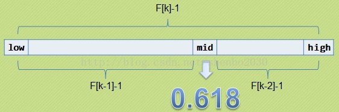

# 斐波那契查找

黄金比例又称黄金分割,是指事物各部分间一定的数学比例关系,即将整体一分为二,较大部分与较小部分之比等于整体与较大部分之比,其比值约为1:0.618或1.618:1,而0.618被公认为最具有审美意义的比例数字,这个数值的作用不仅仅体现在诸如绘画、雕塑、音乐、建筑等艺术领域,而且在管理、工程设计等方面也有着不可忽视的作用,因此被称为黄金分割

在数学中有一个非常有名的数学规律: 斐波那契数列: 1,1,2,3,5,8,13,21,34,55,89...(从第三个数开始,后边每一个数都是前两个数的和),随着斐波那契数列的递增,前后两个数的比值会越来越接近0.618,利用这个特性,就可以将黄金比例运用到查找技术中

# 基本思路

在斐波那契数列中的元素满足这样的关系: F[k]=F[k-1]+F[k-2]              
此处将这个数组稍微改一下,改成: (F[k]-1)=(F[k-1]-1)+(F[k-2]-1)+1

 

找出一个中间mid值,以便将数组按斐波那契数列的规律,分割成两部分

# 范例

```java
import java.util.Arrays;

public class Test {
    public static int LENGTH = 20;

    public static void main(String[] args) {
        int[] arr = {1,8,10,89,100,134};
        int target = 89;
        System.out.println(fibSearch(arr,target));
    }

    public static int[] fib() {
        int[] f = new int[LENGTH];
        f[0] = 1;
        f[1] = 1;
        for (int i = 2; i < LENGTH; i++) {
            f[i] = f[i - 1] + f[i - 2];
        }
        return f;
    }

    public static int fibSearch(int[] arr,int target) {
        int min = 0;
        int max = arr.length - 1;
        int k = 0;
        int mid = 0;
        int[] f = fib();
        // 获取最相邻的斐波那契数组中元素的值,该值略大于数组的长度
        while (max > f[k] - 1) {
            k++;
        }
        // 因为f[k]值可能大于arr的长度,如果大于时,需要构造一个新的数组temp[],将arr数组中的元素拷贝过去,不足的部分会使用0填充
        int[] temp = Arrays.copyOf(arr,f[k]);
        // 然后将temp后面填充的0,替换为最后一位数字
        // 如将temp数组由{1,8,10,89,100,134,0,0}变换为{1,8,10,89,100,134,134,134}
        for (int i = max + 1; i < temp.length; i++) {
            temp[i] = arr[max];
        }

        while (min <= max) {
            mid = min + f[k - 1] - 1;
            if (target < temp[mid]) {
                max = mid - 1;
                // 因为f[k]=f[k-1]+f[k-2],所以k--就相当于取temp数组的左边部分
                k--;
            } else if (target > temp[mid]) {
                min = mid + 1;
                // 同理,f[k]=f[k-1]+f[k-2],k -= 2就相当于取temp数组的右边部分
                k -= 2;
            } else {
                // 原arr数组中的值
                if (mid <= max) {
                    return mid;
                    // 在temp中,扩展出来的高位的值
                } else {
                    return max;
                }
            }
        }
        return -1;
    }
}
```

# 复杂度

**最坏情况下,时间复杂度为O(logn),且其期望复杂度也为O(logn)**

# 二分查找、插值查找、斐波那契查找各自的特点

相同点: 都是通过不断的缩小范围来查找对应的数据           

不同点: 计算mid的方式不一样
- 二分查找: mid每次都是指向范围的中间位置
- 插值查找: mid尽可能的靠近要查找的数据,但是要求数据尽可能的分布均匀
- 斐波那契查找: 根据黄金分割点来计算mid指向的位置