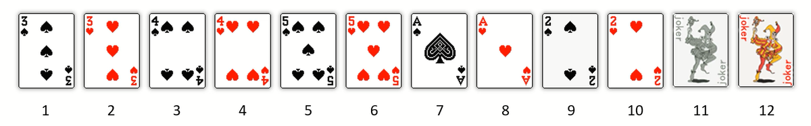
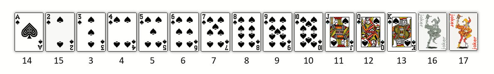
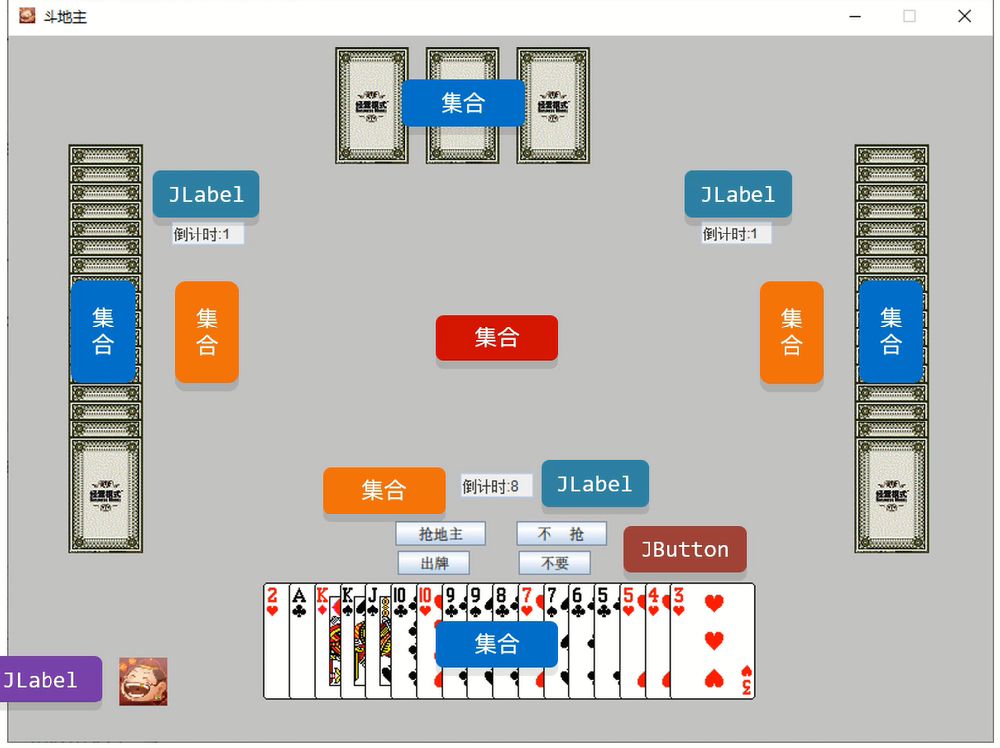

# Terminal版斗地主游戏

## 准备牌、洗牌、发牌

步骤:
1. 准备牌
2. 洗牌
3. 发牌

```java
import java.util.ArrayList;
import java.util.Collections;

public class PokerGame {

    // 牌盒
    static ArrayList<String> list = new ArrayList<>();

    static {
        // 准备牌
        String[] color = new String[]{"♦", "♣", "♥", "♠"};
        String[] number = new String[]{"3", "4", "5", "6", "7", "8", "9", "10", "J", "Q", "K", "A", "2"};
        // 外循环:花色
        for (String c : color) {
            // 内循环:数字
            for (String n : number) {
                list.add(c + n);
            }
        }
        list.add("大王");
        list.add("小王");
    }

    public PokerGame() {
        // 洗牌
        Collections.shuffle(list);
        // 发牌
        ArrayList<String> lordPoker = new ArrayList<>();
        ArrayList<String> player1Poker = new ArrayList<>();
        ArrayList<String> player2Poker = new ArrayList<>();
        ArrayList<String> player3Poker = new ArrayList<>();

        for (int i = 0; i < list.size(); i++) {
            String poker = list.get(i);
            // 三张地主牌(底牌)
            if (i <= 2) {
                lordPoker.add(poker);
                continue;
            }
            // 给三个玩家依次发牌
            if (i % 3 == 0) {
                player1Poker.add(poker);
            } else if (i % 3 == 1) {
                player2Poker.add(poker);
            } else {
                player3Poker.add(poker);
            }
        }

        // 看牌
        lookPoker("底牌", lordPoker);
        lookPoker("玩家1", player1Poker);
        lookPoker("玩家2", player2Poker);
        lookPoker("玩家3", player3Poker);
    }

    // 看牌
    public void lookPoker(String playerName, ArrayList<String> playerPoker) {
        StringBuilder stringBuilder = new StringBuilder(playerName + ":");
        for (String poker : playerPoker) {
            stringBuilder.append(poker).append(" ");
        }
        System.out.println(stringBuilder);
    }
}
```

```java
public class Game {
    public static void main(String[] args) {
        new PokerGame();
    }
}
```

## 排序

### 利用序号进行排序



- 如果原始数据的规律非常复杂,可以先手动排序让每一个数据跟唯一的序号产生对应关系
- 序号就是数字,规律非常简单,后续的所有操作就以序号为准
- 当真正需要操作原始数据的时候,再通过序号找到原始数据即可

```java
import java.util.*;

public class PokerGame {

    // 牌盒
    static HashMap<Integer, String> map = new HashMap<>();
    static ArrayList<Integer> list = new ArrayList<>();

    static {
        // 准备牌
        String[] color = new String[]{"♦", "♣", "♥", "♠"};
        String[] number = new String[]{"3", "4", "5", "6", "7", "8", "9", "10", "J", "Q", "K", "A", "2"};
        // 牌的序号
        int serialNumber = 1;
        // 外循环:数字花色
        for (String n : number) {
            // 内循环:花色
            for (String c : color) {
                map.put(serialNumber, c + n);
                list.add(serialNumber);
                serialNumber++;
            }
        }
        map.put(serialNumber, "小王");
        list.add(serialNumber);
        serialNumber++;
        map.put(serialNumber, "大王");
        list.add(serialNumber);
    }

    public PokerGame() {
        // 洗牌
        Collections.shuffle(list);

        // 发牌
        TreeSet<Integer> lordPoker = new TreeSet<>();
        TreeSet<Integer> player1Poker = new TreeSet<>();
        TreeSet<Integer> player2Poker = new TreeSet<>();
        TreeSet<Integer> player3Poker = new TreeSet<>();

        for (int i = 0; i < list.size(); i++) {
            // 牌的序号
            int serialNumber = list.get(i);
            // 三张地主牌(底牌)
            if (i <= 2) {
                lordPoker.add(serialNumber);
                continue;
            }
            // 给三个玩家依次发牌
            if (i % 3 == 0) {
                player1Poker.add(serialNumber);
            } else if (i % 3 == 1) {
                player2Poker.add(serialNumber);
            } else {
                player3Poker.add(serialNumber);
            }
        }

        // 看牌
        lookPoker("底牌", lordPoker);
        lookPoker("玩家1", player1Poker);
        lookPoker("玩家2", player2Poker);
        lookPoker("玩家3", player3Poker);
    }

    // 看牌
    public void lookPoker(String playerName, TreeSet<Integer> playerPokerSerialNumber) {
        StringBuilder stringBuilder = new StringBuilder(playerName + ":");
        for (Integer serialNumber : playerPokerSerialNumber) {
            String poker = map.get(serialNumber);
            stringBuilder.append(poker).append(" ");
        }
        System.out.println(stringBuilder);
    }
}
```

```java
public class Game {
    public static void main(String[] args) {
        new PokerGame();
    }
}
```

### 给每一张牌计算价值



根据牌的大小关系定义每一张牌的价值

```java
import java.util.ArrayList;
import java.util.Collections;
import java.util.Comparator;
import java.util.HashMap;

public class PokerGame {

    // 牌盒
    static ArrayList<String> list = new ArrayList<>();

    // 牌的价值
    static HashMap<String, Integer> map = new HashMap<>();

    static {
        // 准备牌
        String[] color = new String[]{"♦", "♣", "♥", "♠"};
        String[] number = new String[]{"3", "4", "5", "6", "7", "8", "9", "10", "J", "Q", "K", "A", "2"};
        
        // 通过调整内外循环顺序,实现数字优先排序
        // 外循环:花色
        for (String c : color) {
            // 内循环:数字
            for (String n : number) {
                list.add(c + n);
            }
        }

        // 小王、大王前留一个空格,避免字符串截取时的报错
        // 获取到小王、大王,再进行map中的匹配返回其价值
        list.add(" 大王");
        list.add(" 小王");

        // 指定牌的价值
        map.put("J", 11);
        map.put("Q", 12);
        map.put("K", 13);
        map.put("A", 14);
        map.put("2", 15);
        map.put("小王", 16);
        map.put("大王", 17);
    }

    public PokerGame() {
        // 洗牌
        Collections.shuffle(list);
        // 发牌
        ArrayList<String> lordPoker = new ArrayList<>();
        ArrayList<String> player1Poker = new ArrayList<>();
        ArrayList<String> player2Poker = new ArrayList<>();
        ArrayList<String> player3Poker = new ArrayList<>();

        for (int i = 0; i < list.size(); i++) {
            String poker = list.get(i);
            // 三张地主牌(底牌)
            if (i <= 2) {
                lordPoker.add(poker);
                continue;
            }
            // 给三个玩家依次发牌
            if (i % 3 == 0) {
                player1Poker.add(poker);
            } else if (i % 3 == 1) {
                player2Poker.add(poker);
            } else {
                player3Poker.add(poker);
            }
        }

        // 排序
        pokerSort(player1Poker);
        pokerSort(player2Poker);
        pokerSort(player3Poker);

        // 看牌
        lookPoker("底牌", lordPoker);
        lookPoker("玩家1", player1Poker);
        lookPoker("玩家2", player2Poker);
        lookPoker("玩家3", player3Poker);
    }

    // 排序
    public static void pokerSort(ArrayList<String> playerPoker) {
        // sort底层是Arrays.sort,即插入排序+二分查找
        Collections.sort(playerPoker, new Comparator<String>() {
            @Override
            public int compare(String o1, String o2) {
                // o1:表示当前要插入到有序序列中的牌
                // o2:表示已经在有序序列中存在的牌
                // 负数:o1小,插入到前面
                // 正数:o1大,插入到后面
                // 0:o1和o2数字一样大,需要按照花色再次排序

                // 计算o1的花色和价值
                String color1 = o1.substring(0, 1);
                int value1 = getValue(o1);

                // 计算o2的花色和价值
                String color2 = o2.substring(0, 1);
                int value2 = getValue(o2);

                int numberResult = value1 - value2;
                return numberResult == 0 ? color1.compareTo(color2) : numberResult;
            }
        });
    }

    // 计算牌的价值
    public static int getValue(String poker) {
        // 获取牌上的数字
        String number = poker.substring(1);
        // 判断数字是否在map上存在
        if (map.containsKey(number)) {
            // 如果存在,则返回其map上对应的价值
            return map.get(number);
        } else {
            // 如果不存在,则通过类型转换,返回其对应数字的价值
            return Integer.parseInt(number);
        }
    }

    // 看牌
    public void lookPoker(String playerName, ArrayList<String> playerPoker) {
        StringBuilder stringBuilder = new StringBuilder(playerName + ":");
        for (String poker : playerPoker) {
            stringBuilder.append(poker).append(" ");
        }
        System.out.println(stringBuilder);
    }
}
```

```java
public class Game {
    public static void main(String[] args) {
        new PokerGame();
    }
}
```

# GUI版斗地主游戏

## JavaBean类

```java
package domain;

import java.util.Objects;

public class User {
    private String username;
    private String password;

    public User() {
    }

    public User(String username, String password) {
        this.username = username;
        this.password = password;
    }

    public String getUsername() {
        return username;
    }

    public void setUsername(String username) {
        this.username = username;
    }

    public String getPassword() {
        return password;
    }

    public void setPassword(String password) {
        this.password = password;
    }

    @Override
    public String toString() {
        return "User{" +
                "username='" + username + '\'' +
                ", password='" + password + '\'' +
                '}';
    }

    @Override
    public boolean equals(Object o) {
        if (this == o) return true;
        if (o == null || getClass() != o.getClass()) return false;
        User user = (User) o;
        return Objects.equals(username, user.username) && Objects.equals(password, user.password);
    }

    @Override
    public int hashCode() {
        return Objects.hash(username, password);
    }

}
```

## 启动入口

```java
import ui.LoginJFrame;

public class Game {
    public static void main(String[] args) {
        new LoginJFrame();
    }
}
```

## 工具类

### 生成随机验证码

```java
package util;

import java.util.Random;

public class captchaUtil {
    // 随机生成验证码
    public static String getCaptcha() {
        Random random = new Random();
        // 创建字符数组存储52个大小写字母
        char[] letterArr = new char[52];
        for (int i = 0; i < letterArr.length; i++) {
            if (i < 26) {
                letterArr[i] = (char) ('a' + i);
            } else {
                letterArr[i] = (char) ('A' + i - 26);
            }
        }
        // 验证码第1~4位为随机生成的大小写字母
        StringBuilder result = new StringBuilder();
        for (int i = 0; i < 4; i++) {
            int index = random.nextInt(52);
            result.append(letterArr[index]);
        }
        // 验证码第5位为随机生成的数字
        result.append(random.nextInt(10));
        // 将字符串转变成字符数组
        char[] captchaArr = result.toString().toCharArray();
        // 将第5位元素,即数字和随机索引指向的元素交换位置
        int index = random.nextInt(5);
        char temp = captchaArr[index];
        captchaArr[index] = captchaArr[captchaArr.length - 1];
        captchaArr[captchaArr.length - 1] = temp;
        return new String(captchaArr);
    }
}
```

## 界面类

### 登录界面


```java
package ui;
import GUI.domain.User;
import GUI.util.captchaUtil;

import javax.swing.*;
import java.awt.*;
import java.awt.event.MouseEvent;
import java.awt.event.MouseListener;
import java.util.ArrayList;

public class LoginJFrame extends JFrame implements MouseListener {

    // 设置用户集合
    static ArrayList<User> allUsers = new ArrayList<>();

    static {
        allUsers.add(new User("admin", "123456"));
    }

    // 设置用户名输入框
    JTextField usernameField = new JTextField();

    // 设置密码输入框
    JPasswordField passwordField = new JPasswordField();

    // 设置验证码输入框
    JTextField captchaField = new JTextField();

    // 设置随机验证码
    JLabel rightCaptcha = new JLabel();

    // 登录按钮
    JButton loginButton = new JButton(new ImageIcon("image/login/登录按钮.png"));

    // 注册按钮
    JButton registerButton = new JButton(new ImageIcon("image/login/注册按钮.png"));

    // 初始化
    public LoginJFrame() {
        initGameJFrame();
        initView();
        // 设置可见
        this.setVisible(true);
    }

    // 往界面中添加元素
    public void initView() {

        // 获取随机验证码
        String captcha = captchaUtil.getCaptcha();
        // 设置内容
        rightCaptcha.setText(captcha);
        // 设置正确验证码的位置和宽高
        rightCaptcha.setBounds(365, 152, 65, 20);
        // 设置字体
        Font captchaFont = new Font(null, Font.BOLD, 16);
        rightCaptcha.setFont(captchaFont);
        // 设置字体颜色
        rightCaptcha.setForeground(Color.white);
        // 验证码绑定鼠标监听事件
        rightCaptcha.addMouseListener(this);
        // 将管理容器添加到界面当中
        this.getContentPane().add(rightCaptcha);

        // 设置验证码输入框位置和宽高
        captchaField.setBounds(275, 152, 75, 20);
        // 将管理容器添加到界面当中
        this.getContentPane().add(captchaField);

        // 设置验证码
        JLabel captchaText = new JLabel("验证码");
        // 设置位置和宽高
        captchaText.setBounds(200, 150, 100, 20);
        // 设置字体
        captchaText.setFont(captchaFont);
        // 设置字体颜色
        captchaText.setForeground(Color.white);
        // 将管理容器添加到界面当中
        this.getContentPane().add(captchaText);

        // 设置密码输入框位置和宽高
        passwordField.setBounds(275, 127, 150, 20);
        // 将管理容器添加到界面当中
        this.getContentPane().add(passwordField);

        // 设置密码
        JLabel passwordText = new JLabel("密    码");
        // 设置位置和宽高
        passwordText.setBounds(200, 125, 100, 20);
        // 设置字体
        Font usernameFont = new Font(null, Font.BOLD, 16);
        passwordText.setFont(usernameFont);
        // 设置字体颜色
        passwordText.setForeground(Color.white);
        // 将管理容器添加到界面当中
        this.getContentPane().add(passwordText);

        // 设置用户名输入框位置和宽高
        usernameField.setBounds(275, 102, 150, 20);
        // 将管理容器添加到界面当中
        this.getContentPane().add(usernameField);

        // 设置用户名
        JLabel usernameText = new JLabel("用户名");
        // 设置位置和宽高
        usernameText.setBounds(200, 100, 100, 20);
        // 设置字体
        Font passwordFont = new Font(null, Font.BOLD, 16);
        usernameText.setFont(passwordFont);
        // 设置字体颜色
        usernameText.setForeground(Color.white);
        // 将管理容器添加到界面当中
        this.getContentPane().add(usernameText);

        // 设置注册按钮的位置和宽高
        registerButton.setBounds(175, 180, 128, 47);
        // 去除按钮的边框
        registerButton.setBorderPainted(false);
        // 去除按钮的背景
        registerButton.setContentAreaFilled(false);
        // 按钮绑定鼠标监听事件
        registerButton.addMouseListener(this);
        // 将管理容器添加到界面当中
        this.getContentPane().add(registerButton);

        // 设置登录按钮的位置和宽高
        loginButton.setBounds(325, 180, 128, 47);
        // 去除按钮的边框
        loginButton.setBorderPainted(false);
        // 去除按钮的背景
        loginButton.setContentAreaFilled(false);
        // 按钮绑定鼠标监听事件
        loginButton.addMouseListener(this);
        // 将管理容器添加到界面当中
        this.getContentPane().add(loginButton);

        // 设置背景图片
        JLabel background = new JLabel(new ImageIcon("image/login/background.png"));
        // 设置位置和宽高
        background.setBounds(0, 0, 633, 423);
        // 将管理容器添加到界面当中
        this.getContentPane().add(background);
    }

    // 初始化界面
    public void initGameJFrame() {
        // 设置界面的宽高
        this.setSize(633, 423);
        // 设置界面的标题
        this.setTitle("斗地主");
        // 取消内部默认布局
        this.setLayout(null);
        // 设置界面置顶
        this.setAlwaysOnTop(true);
        // 设置界面居中
        this.setLocationRelativeTo(null);
        // 设置关闭模式
        this.setDefaultCloseOperation(WindowConstants.EXIT_ON_CLOSE);
    }

    // 重写鼠标监听MouseListener接口的方法
    @Override
    public void mouseClicked(MouseEvent e) {
        if (e.getSource() == loginButton) {
            // 获取输入的用户名
            String usernameInput = usernameField.getText();
            // 获取输入的密码
            String passwordInput = String.valueOf(passwordField.getPassword());
            // 获取输入的验证码
            String captchaInput = captchaField.getText();

            // 创建一个User对象
            User userInfo = new User(usernameInput, passwordInput);

            // 判断验证码是否为空
            if (captchaInput.length() == 0) {
                // 展示弹框
                showJDialog("验证码不能为空!");

                // 判断用户名和密码是否为空
            } else if (usernameInput.length() == 0 || passwordInput.length() == 0) {
                // 展示弹框
                showJDialog("用户名或者密码为空!");

                // 判断验证码(忽略大小写)是否正确
            } else if (!captchaInput.equalsIgnoreCase(rightCaptcha.getText())) {
                // 展示弹框
                showJDialog("验证码输入错误!");

                // 验证用户名和密码是否正确
            } else if (allUsers.contains(userInfo)) {
                // 关闭当前登录界面
                this.setVisible(false);
                // 打开游戏的主界面
                new GameJFrame();

            } else {
                // 展示弹框
                showJDialog("用户名或密码错误!");
            }

            // 点击注册按钮
        } else if (e.getSource() == registerButton) {
            // 进入注册界面
            System.out.println("点击了注册按钮");

            // 点击验证码
        } else if (e.getSource() == rightCaptcha) {
            // 获取一个新的验证码
            String captcha = captchaUtil.getCaptcha();
            rightCaptcha.setText(captcha);
        }
    }

    @Override
    public void mousePressed(MouseEvent e) {
        if (e.getSource() == loginButton) {
            loginButton.setIcon(new ImageIcon("image/login/登录按下.png"));
        } else if (e.getSource() == registerButton) {
            registerButton.setIcon(new ImageIcon("image/login/注册按下.png"));
        }
    }

    @Override
    public void mouseReleased(MouseEvent e) {
        if (e.getSource() == loginButton) {
            loginButton.setIcon(new ImageIcon("image/login/登录按钮.png"));
        } else if (e.getSource() == registerButton) {
            registerButton.setIcon(new ImageIcon("image/login/注册按钮.png"));
        }
    }

    @Override
    public void mouseEntered(MouseEvent e) {

    }

    @Override
    public void mouseExited(MouseEvent e) {

    }

    // 提示框
    public void showJDialog(String content) {
        // 创建一个弹框对象
        JDialog jDialog = new JDialog();
        // 设置弹框大小
        jDialog.setSize(200, 100);
        // 设置弹框置顶
        jDialog.setAlwaysOnTop(true);
        // 设置弹框居中
        jDialog.setLocationRelativeTo(null);
        // 设置弹框不关闭永远无法操作下面的界面
        jDialog.setModal(true);

        // 创建JLabel对象管理文字并添加到弹框当中
        JLabel warning = new JLabel(content);
        // 设置大小
        warning.setBounds(0, 0, 200, 100);
        // 将管理容器添加到界面(隐藏容器)当中
        jDialog.getContentPane().add(warning);
        // 展示弹框
        jDialog.setVisible(true);
    }
}
```

### 游戏界面



游戏界面组成:
- 牌盒 -- 小集合
- 底牌 -- 小集合 
- 3个玩家手中的牌 -- 大集合管理3个小集合
- 3个玩家打出的牌 -- 大集合管理3个小集合
- 3个玩家的游戏提示(出牌倒计时) -- 大数组管理3个JLabel
- 抢地主/不抢 -- 大数组管理2个JButton
- 出牌/不要 -- 大数组管理2个JButton
- 游戏图标 -- JLabel 