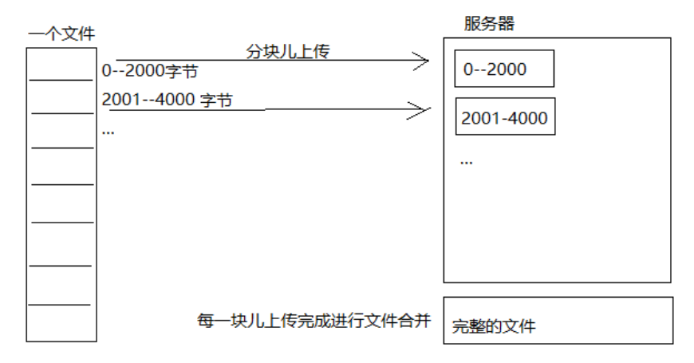

# 断点续传

断点续传指的是在下载或上传时,将下载或上传任务(一个文件或一个压缩包)人为的划分为几个部分,每一个部分采用一个线程进行上传或下载,如果碰到网络故障,可以从已经上传或下载的部分开始继续上传下载未完成的部分,而没有必要从头开始上传下载,断点续传可以提高节省操作时间,提高用户体验性



# 分块上传

范例:

```java
package com.xuecheng.media;

import org.apache.commons.codec.digest.DigestUtils;
import org.junit.jupiter.api.Test;

import java.io.File;
import java.io.FileInputStream;
import java.io.IOException;
import java.io.RandomAccessFile;
import java.util.Arrays;
import java.util.Collections;
import java.util.List;

/**
 * @description 测试断点续传
 */
public class BigFileTest {
    /**
     * 测试分块
     */
    @Test
    public void testChunk() throws IOException {
        // 源文件
        File sourceFile = new File("E:\\a.mp4");
        // 分块文件的存储路径
        String chunkFilePath = "E:\\chunk\\";
        // 分块文件的大小(MinIO接口合并最小分块大小为5M)
        int chunkSize = 1024 * 1024 * 5;
        // 分块文件的个数
        int chunkNum = (int) Math.ceil(sourceFile.length() * 1.0 / chunkSize);

        // 使用流从源文件中读数据,向分块文件中写数据
        // 源文件的读出流
        RandomAccessFile raf_r = new RandomAccessFile(sourceFile, "r");
        // 缓存区
        byte[] bytes = new byte[1024];
        for (int i = 0; i < chunkNum; i++) {
            File chunkFile = new File(chunkFilePath + i);
            // 分块文件的写入流
            RandomAccessFile raf_rw = new RandomAccessFile(chunkFile, "rw");
            int len = -1;
            while ((len = raf_r.read(bytes)) != -1) {
                raf_rw.write(bytes, 0, len);
                if (chunkFile.length() >= chunkSize) {
                    break;
                }
            }
            raf_rw.close();
        }
        raf_r.close();
    }

    /**
     * 测试合并
     */
    @Test
    public void testMerge() throws IOException {
        // 块文件目录
        File chunkFolder = new File("E:\\chunk\\");
        // 源文件
        File sourceFile = new File("E:\\a.mp4");
        // 合并后文件
        File mergeFile = new File("E:\\b.mp4");

        // 取出所有的分块文件
        File[] files = chunkFolder.listFiles();
        // 将数组转成list
        assert files != null;
        List<File> filesList = Arrays.asList(files);
        Collections.sort(filesList, (o1, o2) -> Integer.parseInt(o1.getName()) - Integer.parseInt(o2.getName()));

        // 遍历分块文件,向合并后文件写入
        // 合并后文件的写入流
        RandomAccessFile raf_rw = new RandomAccessFile(mergeFile, "rw");
        // 缓存区
        byte[] bytes = new byte[1024];
        for (File file : filesList) {
            // 分块文件的读出流
            RandomAccessFile raf_r = new RandomAccessFile(file, "r");
            int len = -1;
            while ((len = raf_r.read(bytes)) != -1) {
                raf_rw.write(bytes, 0, len);
            }
            raf_r.close();
        }
        raf_rw.close();

        // 对合并的文件进行校验
        FileInputStream sourceFileInputStream = new FileInputStream(sourceFile);
        String sourceMd5 = DigestUtils.md5Hex(sourceFileInputStream);
        FileInputStream mergeFileInputStream = new FileInputStream(mergeFile);
        String mergerMd5 = DigestUtils.md5Hex(mergeFileInputStream);
        if (sourceMd5.equals(mergerMd5)) {
            System.out.println("文件合并成功");
        } else {
            System.out.println("文件合并失败");
        }
    }
}
```