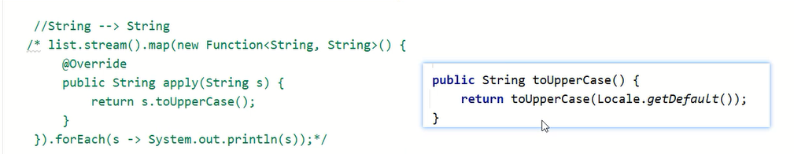

# 方法引用

方法引用就是把已经有的方法拿过来用,当作函数式接口中抽象方法的方法体

方法引用符:`::`

细节:
1. **引用处必须是函数式接口**
2. **被引用的方法必须已经存在**(可以是Java已经写好的,也可以是一些第三方工具类)
3. **被引用方法的形参和返回值需跟抽象方法保持一致**
4. **被引用方法的功能要满足当前需求**

范例:

```java
import java.util.Arrays;
import java.util.Comparator;

public class Test {
    public static void main(String[] args) {
        Integer[] arr = {3, 5, 4, 1, 6, 2};

        // 匿名内部类
        // Arrays.sort(arr, new Comparator<Integer>() {
        //     @Override
        //     public int compare(Integer o1, Integer o2) {
        //         return o2 - o1;
        //     }
        // });
        // System.out.println(Arrays.toString(arr));

        // Lambda表达式
        // Arrays.sort(arr, ((o1, o2) -> o2 - o1));
        // System.out.println(Arrays.toString(arr));

        // 方法引用
        // 表示引用Test类里面的subtraction方法,把这个方法当作抽象方法的方法体
        Arrays.sort(arr, Test::subtraction);
        System.out.println(Arrays.toString(arr));
    }

    public static int subtraction(int num1, int num2) {
        return num2 - num1;
    }
}
```

# 分类

## 引用静态方法

格式:`类名::静态方法`          
范例:`Integer::parseInt`

练习:

集合中有数字"1","2","3","4","5",把他们都变成int类型

```java
import java.util.ArrayList;
import java.util.Collections;

public class Test {
    public static void main(String[] args) {
        ArrayList<String> list = new ArrayList<>();
        Collections.addAll(list, "1", "2", "3", "4", "5");
        list.stream().map(Integer::parseInt).forEach(System.out::println);
    }
}
```

## 引用成员方法

格式:`对象::成员方法` 

细节:**可以引用所有类中的成员方法**
      
### 引用其他类的成员方法

格式:`其他类对象::成员方法`     

范例:

```java
public class StringOperation {
    public boolean isRight(String s) {
        return s.startsWith("张") && s.length() == 3;
    }
}
```

```java
import java.util.ArrayList;
import java.util.Collections;

public class Test {
    public static void main(String[] args) {
        ArrayList<String> list = new ArrayList<>();
        Collections.addAll(list, "张无忌", "张强", "张三丰", "赵敏", "周芷若");

        // list.stream().filter(new Predicate<String>() {
        //             @Override
        //             public boolean test(String s) {
        //                 return s.startsWith("张") && s.length() == 3;
        //             }
        //         })
        //         .forEach(System.out::println);

        list.stream().filter(new StringOperation()::isRight).forEach(System.out::println);
    }
}
```

### 引用本类的成员方法

格式:`this::成员方法`     

细节:**引用处不能是静态方法,因为静态方法中是没有this的**

范例:

```java
import java.util.ArrayList;
import java.util.Collections;

public class Test {
    public static void main(String[] args) {
        ArrayList<String> list = new ArrayList<>();
        Collections.addAll(list, "张无忌", "张强", "张三丰", "赵敏", "周芷若");

        // list.stream().filter(new Predicate<String>() {
        //             @Override
        //             public boolean test(String s) {
        //                 return s.startsWith("张") && s.length() == 3;
        //             }
        //         })
        //         .forEach(System.out::println);

        list.stream().filter(new Test()::isRight).forEach(System.out::println);
    }

    public boolean isRight(String s) {
        return s.startsWith("张") && s.length() == 3;
    }
}
```

范例:

```java
import javax.swing.*;
import java.awt.event.ActionEvent;

public class Test extends JFrame {
    public static void main(String[] args) {
        new Test();
    }

    public Test() {
        initView();
    }

    static JButton jButton = new JButton("按钮");

    public void initView() {
        JFrame jFrame = new JFrame("窗口");
        jFrame.setSize(300, 300);
        jFrame.setLayout(null);
        jFrame.setLocationRelativeTo(null);
        jFrame.setDefaultCloseOperation(WindowConstants.EXIT_ON_CLOSE);

        jButton.setBounds(90, 80, 100, 100);
        jButton.addActionListener(this::mouse);
        jFrame.getContentPane().add(jButton);

        jFrame.setVisible(true);
    }

    public void mouse(ActionEvent e) {
        if (e.getSource() == jButton) {
            System.out.println("按钮被点击了!");
        }
    }
}
```

### 引用父类的成员方法

格式:`super::成员方法`      

细节:**引用处不能是静态方法,因为静态方法中是没有super的**

范例:

```java
package Test;

import javax.swing.*;
import java.awt.event.ActionEvent;

import static Test.Test.jButton;

public class TestFu extends JFrame {
    public void mouse(ActionEvent e) {
        if (e.getSource() == jButton) {
            System.out.println("按钮被点击了!");
        }
    }
}
```

```java
package Test;

import javax.swing.*;

public class Test extends TestFu {
    public static void main(String[] args) {
        new Test();
    }

    public Test() {
        initView();
    }

    static JButton jButton = new JButton("按钮");

    public void initView() {
        JFrame jFrame = new JFrame("窗口");
        jFrame.setSize(300, 300);
        jFrame.setLayout(null);
        jFrame.setLocationRelativeTo(null);
        jFrame.setDefaultCloseOperation(WindowConstants.EXIT_ON_CLOSE);

        jButton.setBounds(90, 80, 100, 100);
        jButton.addActionListener(super::mouse);
        jFrame.getContentPane().add(jButton);

        jFrame.setVisible(true);
    }
}
```

## 引用构造方法

格式:`类名::new`            
范例:`Student::new`
 
练习:

集合里面存储姓名和年龄,比如:张无忌,15             

要求:将数据封装成Student对象并收集到List集合中

```java
public class Student {
    private String name;
    private int age;

    public Student() {
    }

    public Student(String str) {
        this.name = str.split("-")[0];
        this.age = Integer.parseInt(str.split("-")[1]);
    }

    public Student(String name, int age) {
        this.name = name;
        this.age = age;
    }

    public String getName() {
        return name;
    }

    public void setName(String name) {
        this.name = name;
    }

    public int getAge() {
        return age;
    }

    public void setAge(int age) {
        this.age = age;
    }

    @Override
    public String toString() {
        return "Student{" +
                "name='" + name + '\'' +
                ", age=" + age +
                '}';
    }
}
```

```java
import java.util.ArrayList;
import java.util.Collections;
import java.util.List;
import java.util.stream.Collectors;

public class Test {
    public static void main(String[] args) {
        ArrayList<String> list = new ArrayList<>();
        Collections.addAll(list, "张无忌-20", "张强-40", "张三丰-100", "张良-46", "谢广坤-68", "赵敏-22", "周芷若-23");

        List<Student> newList = list.stream().map(Student::new).collect(Collectors.toList());

        newList.forEach(person -> System.out.println(person.getName() + ":" + person.getAge()));
    }
}
```

## 其他调用方式

### 使用类名引用成员方法

格式:`类名::成员方法`              
范例:`String::substring`

细节:
1. **引用处必须是函数式接口**
2. **被引用的方法必须已经存在**(可以是Java已经写好的,也可以是一些第三方工具类)
3. **被引用方法的形参,需要跟抽象方法的第二个形参到最后一个形参保持一致**                                             
抽象方法的形参:          
a.**第一个参数:表示被引用方法的调用者,决定了可以引用哪些类中的方法**                           
在Stream流中,第一个参数一般都表示流里面的每一个数据       
假设流里面的数据是字符串,那么使用这种方式进行方法引用,只能引用String这个类中的方法                          
局限性:**不能引用所有类中的成员方法,这跟抽象方法中的第一个参数有关,这个参数是什么类型的,那么就只能引用这个类中的方法**                 
b.**第二个参数到最后一个参数:跟被引用方法的形参保持一致,如果没有第二个参数,说明被引用的方法需要是无参的成员方法**                   



4. **被引用方法的功能要满足当前需求**

练习:

集合里面有一些字符串,要求变成大写后进行输出

```java
import java.util.ArrayList;
import java.util.Collections;

public class Test {
    public static void main(String[] args) {
        ArrayList<String> list = new ArrayList<>();
        Collections.addAll(list, "sdfAdsfAAA", "dasfGGGw", "adgggxX");

        // list.stream().map(new Function<String, String>() {
        //     @Override
        //     public String apply(String s) {
        //         return s.toUpperCase();
        //     }
        // }).forEach(System.out::println);
        
        // 拿着流里面的每一个数据去调用String里面的toUpperCase方法,方法的返回值就是转换之后的结果
        list.stream().map(String::toUpperCase).forEach(System.out::println);
        // 打印结果:"SDFADSFAAA"
        // 打印结果:"DASFGGGW"
        // 打印结果:"ADGGGXX"
    }
}
```

### 引用数组的构造方法

格式:`数据类型[]::构造方法`              
范例:`int[]::new`

细节:**创建数组的类型,需要和流中数据的类型保持一致**

练习:

集合中存储一些整数,存储到数组当中     

```java
import java.util.ArrayList;
import java.util.Arrays;
import java.util.Collections;

public class Test {
    public static void main(String[] args) {
        ArrayList<Integer> list = new ArrayList<>();
        Collections.addAll(list, 1, 2, 3, 4, 5, 6);

        // Integer[] array = list.stream().toArray(new IntFunction<Integer[]>() {
        //     @Override
        //     public Integer[] apply(int value) {
        //         return new Integer[value];
        //     }
        // });

        Integer[] array = list.stream().toArray(Integer[]::new);
        // 打印结果:"[1, 2, 3, 4, 5, 6]"
        System.out.println(Arrays.toString(array));
    }
}
```

练习:

集合中存储一些字符串的数据,比如:张三,23            
收集到Student类型的数组中

```java
public class Student {
    private String name;
    private int age;

    public Student() {
    }

    public Student(String s) {
        this.name = s.split(",")[0];
        this.age = Integer.parseInt(s.split(",")[1]);
    }

    public Student(String name, int age) {
        this.name = name;
        this.age = age;
    }

    public String getName() {
        return name;
    }

    public void setName(String name) {
        this.name = name;
    }

    public int getAge() {
        return age;
    }

    public void setAge(int age) {
        this.age = age;
    }

    @Override
    public String toString() {
        return "Student{" +
                "name='" + name + '\'' +
                ", age=" + age +
                '}';
    }
}
```

```java
import java.util.ArrayList;
import java.util.Arrays;
import java.util.Collections;

public class Test {
    public static void main(String[] args) {
        ArrayList<String> list = new ArrayList<>();
        Collections.addAll(list, "张三,23", "李大炮,24", "王小五,25", "大大怪,27", "小小怪,29", "张飞,55");
        Student[] array = list.stream().map(Student::new).toArray(Student[]::new);
        // 打印结果:"[Student{name='张三', age=23}, Student{name='李大炮', age=24}, Student{name='王小五', age=25},"
        // 打印结果:"Student{name='大大怪', age=27}, Student{name='小小怪', age=29}, Student{name='张飞', age=55}]"
        System.out.println(Arrays.toString(array));
    }
}
```

练习:

创建集合添加学生对象,学生对象属性:name,age               

要求:
1. 只获取姓名并放到数组中
2. 把姓名和年龄拼接成:张三-23的字符串,并放到数组当中

```java
public class Student {
    private String name;
    private int age;

    public Student() {
    }

    public Student(String name, int age) {
        this.name = name;
        this.age = age;
    }

    public String getName() {
        return name;
    }

    public void setName(String name) {
        this.name = name;
    }

    public int getAge() {
        return age;
    }

    public void setAge(int age) {
        this.age = age;
    }

    @Override
    public String toString() {
        return name + "-" + age;
    }
}
```

```java
import java.util.ArrayList;
import java.util.Arrays;

public class Test {
    public static void main(String[] args) {
        ArrayList<Student> list = new ArrayList<>();
        Student stu1 = new Student("张三", 23);
        Student stu2 = new Student("李四", 24);
        Student stu3 = new Student("王五", 25);
        list.add(stu1);
        list.add(stu2);
        list.add(stu3);
        String[] nameArr = list.stream().map(Student::getName).toArray(String[]::new);
        // 打印结果:"[张三, 李四, 王五]"
        System.out.println(Arrays.toString(nameArr));

        String[] array = list.stream().map(Student::toString).toArray(String[]::new);
        // 打印结果:"[张三-23, 李四-24, 王五-25]"
        System.out.println(Arrays.toString(array));
    }
}
```