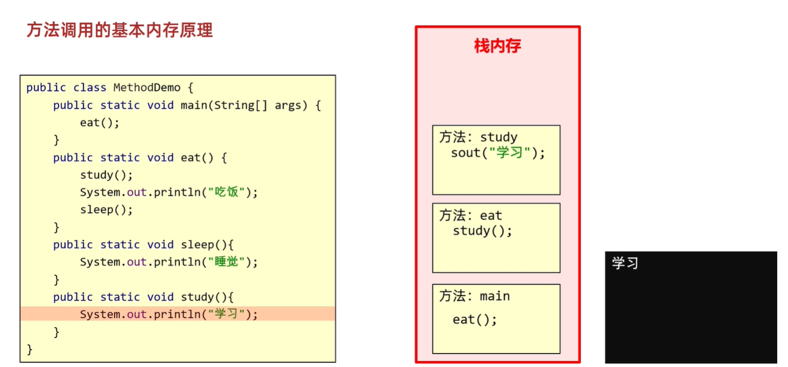
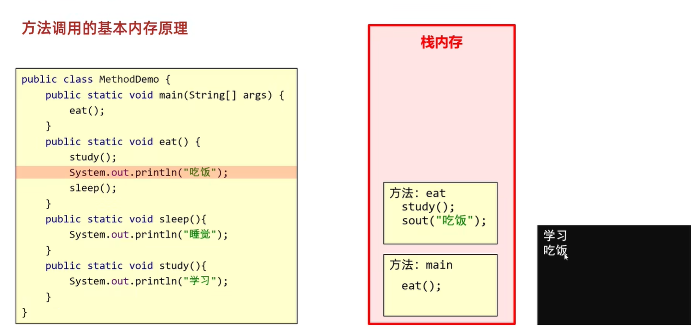
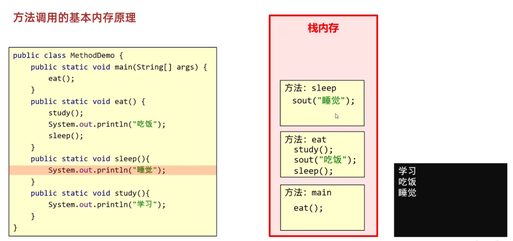
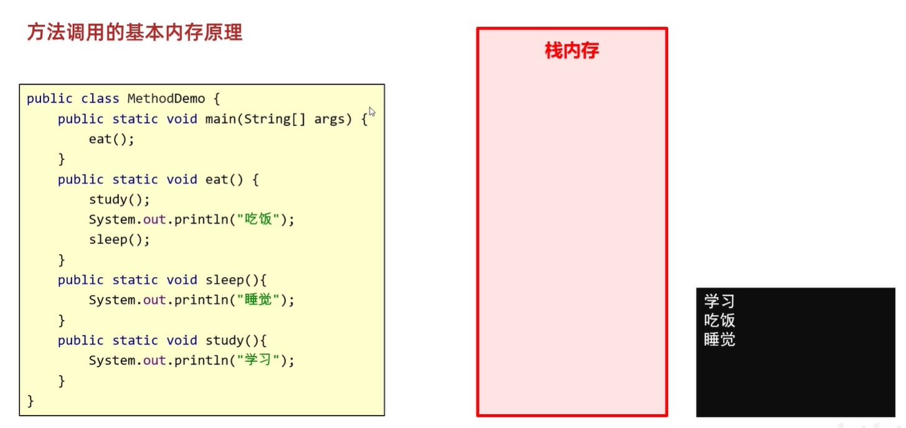
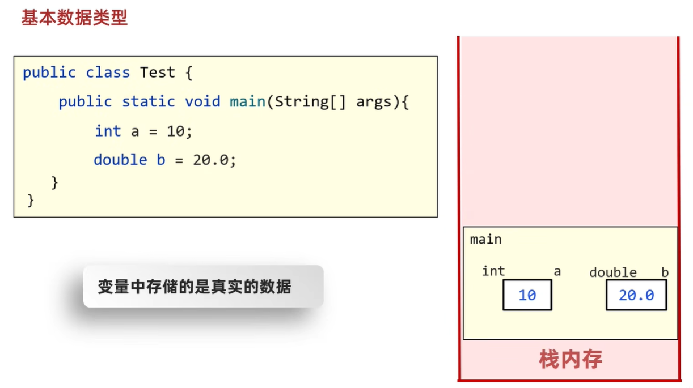
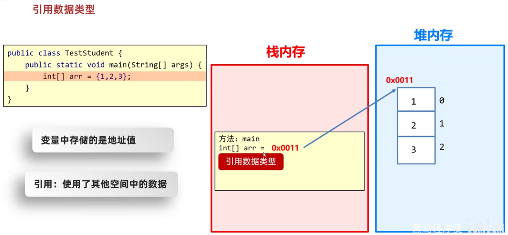
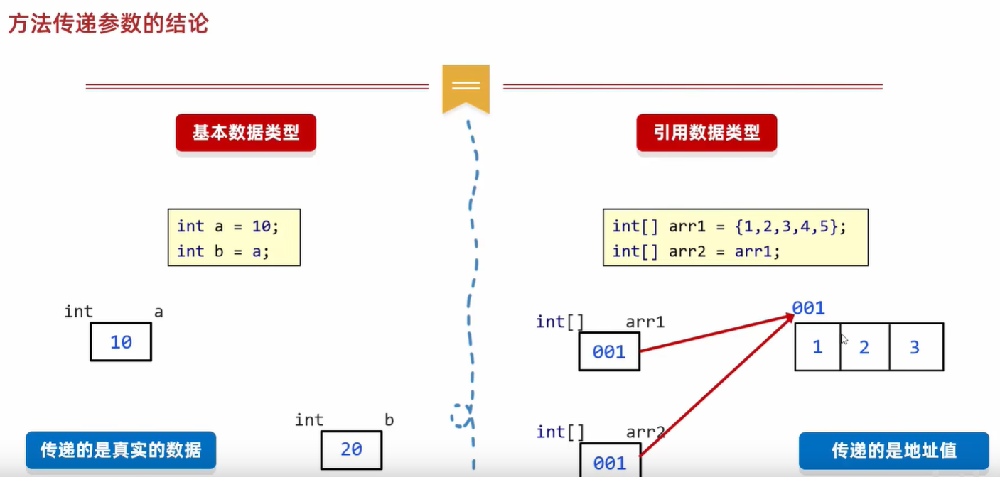

# 方法的基本内存原理

## 方法调用的基本内存原理

根据栈的规则: **先进后出**  



main()方法调用eat()方法,eat()方法调用study()方法  
study()方法实现打印学习,study()方法结束,回到调用处  



eat()方法实现打印吃饭



eat()方法调用sleep()方法,sleep()方法实现打印睡觉



sleep()方法结束,回到调用处,eat()方法结束,回到调用处,main()方法结束

## 方法传递基本数据类型的内存原理



基本数据类型范围: byte、short、int、long、float、double、char、boolean(8种基本数据类型)  

基本数据类型: 数据值存储在自己的空间中  

特点: 赋值给其他变量,也是赋的真实的值  

## 方法传递引用数据类型的内存原理



引用数据类型范围: 除了8种基本数据类型外的,其他所有数据类型是引用数据类型  

引用数据类型: 数据值存储在其他空间中,自己空间中存储的是地址值  

特点: 赋值给其他变量,赋的是地址值  

# 方法的值传递

## 传递基本数据类型

范例: 

```java
public class test {
    public static void main(String[] args) {
        // 实参
        int number = 100;
        // 打印100
        System.out.println("调用change()方法前,number为" + number);
        change(number);
        // 打印100
        System.out.println("调用change()方法后,number为" + number);
    }

    public static void change(int number) {
        // 形参
        number = 200;
    }
}
```

**传递基本数据类型时,传递的是真实的数据,形参的改变,不影响实参的值**

## 传递引用数据类型

**传递引用数据类型时,传递的是地址值,形参的改变,影响实参的值**

```java
public class test {
    public static void main(String[] args) {
        int[] arr = {10, 20, 30};
        // 打印索引1记录的值20
        System.out.println("调用change()方法前,arr[1]为" + arr[1]);
        // 形参为arr记录的地址值
        change(arr);
        // 打印索引1记录的值200
        System.out.println("调用change()方法后,arr[1]为" + arr[1]);
    }

    public static void change(int[] arr) {
        // 将200赋值给索引1记录的值
        arr[1] = 200;
    }
}
```

## 方法传递参数的结论



1. **传递基本数据类型时,传递的是真实的数据,形参的改变,不影响实参的值**  
2. **传递引用数据类型时,传递的是地址值,形参的改变,影响实参的值**  