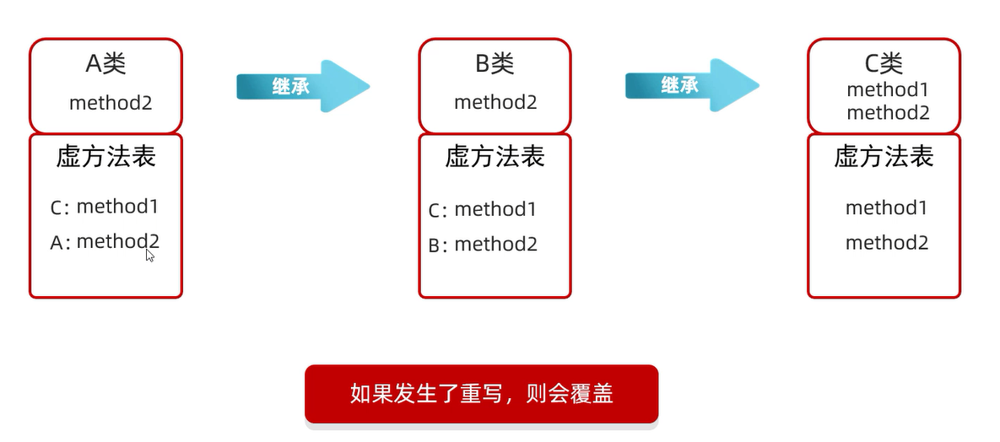

# 方法定义

方法是程序中最小的执行单元,重复的代码、具有独立功能的代码可以抽取到方法中   
方法可以提高代码的复用性和可维护性  

**方法必须先定义后调用**

1. 方法定义: 把一些代码打包在一起,该过程称为方法定义  
2. 方法调用: 手动调用方法才能执行,该过程称为方法调用  

## 最简单的方法定义和调用

定义格式: 

```markdown
public static void方法名(){
    方法体(打包起来的代码)
}
```

调用格式: 

```markdown
方法名();
```

范例: 

```java
public class test {
    public static void main(String[] args) {
        playGame();
    }

    public static void playGame() {
        System.out.println("开始");
        System.out.println("结束");
    }
}
```

练习: 

定义一个方法,在方法内部展示你全部的个人信息

```java
public class test {
    public static void main(String[] args) {
        information();
    }

    public static void information() {
        String name = "张三";
        int age = 23;
        double height = 1.72;
        System.out.println("姓名: " + name);
        System.out.println("年龄: " + age);
        System.out.println("身高: " + height);
    }
}
```

**看代码说结果**: 看到方法进入方法,执行完毕回到调用处   

练习: 

定义一个方法,在方法内部定义两个变量,求出他们的和并进行打印

```java
public class test {
    public static void main(String[] args) {
        sum();
    }

    public static void sum() {
        int a = 10;
        int b = 23;
        int result = a + b;
        System.out.println(result);
    }
}
```

## 带参数的方法定义和调用

1. 单个参数  
定义格式: `public static void 方法名(参数){...}`  
范例: `public static void method(int number){...}`  
调用格式: `方法名(参数)`  
范例: `method(10);`  

2. 多个参数  
定义格式: `public static void 方法名(参数1,参数2...){...}`  
范例: `public static void method(int number1,int number2,...){...}`  
调用格式: `方法名(参数1,参数2,...)`  
范例: `method(10,20,...);`  

**方法调用时,参数的数量和类型必须与方法定义中小括号内的变量一一对应**

练习: 

```java
import java.util.Scanner;

public class test {
    public static void main(String[] args) {
        Scanner sc = new Scanner(System.in);
        System.out.println("请输入第一个数: ");
        int number_1 = sc.nextInt();
        System.out.println("请输入第二个数: ");
        int number_2 = sc.nextInt();
        sum(number_1, number_2);
    }

    public static void sum(int num_1, int num_2) {
        int result = num_1 + num_2;
        System.out.println("和为: " + result);
    }
}
```

## 形参和实参

**方法调用时,形参和实参必须要一一对应**

1. 形参: 全称形式参数,是指方法定义中的参数  
2. 实参: 全称实际参数,是指方法调用中的参数  

练习: 

求长方形的面积

```java
import java.util.Scanner;

public class test {
    public static void main(String[] args) {
        Scanner sc = new Scanner(System.in);
        System.out.println("请输入长: ");
        int number_1 = sc.nextInt();
        System.out.println("请输入宽: ");
        int number_2 = sc.nextInt();
        getArea(number_1, number_2);
    }

    public static void getArea(int num_1, int num_2) {
        int result = num_1 * num_2;
        System.out.println("面积为: " + result);
    }
}
```

练习: 

求圆的面积

```java
import java.util.Scanner;

public class test {
    public static void main(String[] args) {
        Scanner sc = new Scanner(System.in);
        System.out.println("请输入半径: ");
        int radius = sc.nextInt();
        getArea(radius);
    }

    public static void getArea(int r) {
        double area = 3.14 * r * r;
        System.out.println("圆的面积为: " + area);
    }
}
```

## 带返回值的方法定义和调用

方法的返回值就是方法运行的最终结果  

定义格式: 

```markdown
public static 返回值类型 方法名(参数){
    方法体;
    return 返回值;
}
```

范例: 

```java
public static int getSum(int number_01, int number_02) {
    int sum = number_01 + number_02;
    return sum;
}
```

调用格式: 
1. 直接调用: `方法名(实参);`
2. 赋值调用: `整数类型 变量名 = 方法名(实参);`
3. 输出调用: `System.out.println(方法名(实参));`
 
练习: 

定义一个方法,该方法能够找出两个小数中的较小值并返回

```java
import java.util.Scanner;

public class test {
    public static void main(String[] args) {
        Scanner sc = new Scanner(System.in);
        System.out.println("请输入第一个数: ");
        int number1 = sc.nextInt();
        System.out.println("请输入第二个数: ");
        int number2 = sc.nextInt();
        int min = getMin(number1, number2);
        System.out.println("其中的较小值为: " + min);
    }

    public static int getMin(int a, int b) {
        return a <= b ? a :  b;

    }
}
```

练习: 

定义一个方法,该方法能够找出三个整数中的最大值并返回

```java
import java.util.Scanner;

public class test {
    public static void main(String[] args) {
        Scanner sc = new Scanner(System.in);
        System.out.println("请输入第一个数: ");
        int number1 = sc.nextInt();
        System.out.println("请输入第二个数: ");
        int number2 = sc.nextInt();
        System.out.println("请输入第三个数: ");
        int number3 = sc.nextInt();
        int max = getMax(number1, number2, number3);
        System.out.println("其中的最大值为: " + max);
    }

    public static int getMax(int a, int b, int c) {
        int max = a >= b ? a :  b;
        return max >= c ? max :  c;
    }
}
```

```java
import java.util.Scanner;

public class test {
    public static void main(String[] args) {
        Scanner sc = new Scanner(System.in);
        System.out.println("请输入第一个数: ");
        int number1 = sc.nextInt();
        System.out.println("请输入第二个数: ");
        int number2 = sc.nextInt();
        System.out.println("请输入第三个数: ");
        int number3 = sc.nextInt();
        int max = getMax(number1, number2, number3);
        System.out.println("其中的最大值为: " + max);
    }

    public static int getMax(int a, int b, int c) {
        if (a > b) {
            if (a > c) {
                return a;
            } else {
                return c;
            }
        } else {
            if (b > c) {
                return b;
            } else {
                return c;
            }
        }
    }
}
```

练习: 

在主方法中通过键盘录入三个整数  
定义一个方法,方法接收三个整数变量,在方法中从大到小依次打印三个变量   

```java
import java.util.Scanner;

public class test {
    public static void main(String[] args) {
        Scanner sc = new Scanner(System.in);
        System.out.println("请输入第一个数: ");
        int number1 = sc.nextInt();
        System.out.println("请输入第二个数: ");
        int number2 = sc.nextInt();
        System.out.println("请输入第三个数: ");
        int number3 = sc.nextInt();
        maxToMin(number1, number2, number3);
    }

    public static void maxToMin(int a, int b, int c) {
        // 最大值
        int temp1 = a > b ? a :  b;
        int max = temp1 > c ? temp1 :  c;
        // 最小值
        int temp2 = a < b ? a :  b;
        int min = temp2 < c ? temp2 :  c;
        // 中间值
        int sum = a + b + c;
        int middle = sum - max - min;
        System.out.println("从大到小以此为: " + max + " " + middle + " " + min);
    }
}
```

练习: 

数字是有绝对值的,负数的绝对值是它本身取反,非负数的绝对值是它本身  
请定义一个方法,方法能够得到小数类型数字的绝对值并返回,请定义方法并测试  

```java
public class test {
    public static void main(String[] args) {
        Scanner sc = new Scanner(System.in);
        System.out.println("请输入一个小数: ");
        double number = sc.nextDouble();
        System.out.println(number + "的绝对值为: " + getAbsoluteValue(number));
    }

    public static double getAbsoluteValue(double n) {
        if (n < 0) {
            return -n;
        } else {
            return n;
        }
    }
}
```

练习: 

键盘录入一个正整数  
定义一个方法,该方法的功能是计算该数字是几位数字,并将位数返回  

```java
import java.util.Scanner;

public class test {
    public static void main(String[] args) {
        Scanner sc = new Scanner(System.in);
        while (true) {
            System.out.println("请输入一个正整数: ");
            int number = sc.nextInt();
            int result = getNumber(number);
            if (result != -1) {
                System.out.println(number + "是" + result + "位数");
                break;
            } else {
                System.out.println("输入的不是正整数,请重新输入!");
            }
        }
    }

    public static int getNumber(int n) {
        if (n < 0) {
            return -1;
        }
        {
            // 计数器
            int count = 0;
            while (n != 0) {
                n = n / 10;
                count++;
            }
            return count;
        }
    }
}
```

练习: 

定义一个方法,先计算一家商场每个季度的营业额,根据方法结果再计算出全年的营业额

```java
import java.util.Scanner;

public class test {
    public static void main(String[] args) {
        Scanner sc = new Scanner(System.in);
        int[] arr = new int[13];
        // 计算每个季度的营业额
        for (int i = 1; i <= 12; i = i + 3) {
            System.out.println("请输入第" + i + "个月的营业额: ");
            int number_01 = sc.nextInt();
            System.out.println("请输入第" + (i + 1) + "个月的营业额: ");
            int number_02 = sc.nextInt();
            System.out.println("请输入第" + (i + 2) + "个月的营业额: ");
            int number_03 = sc.nextInt();
            arr[i] = getSum(number_01, number_02, number_03);
            System.out.println("第" + i + "个季度的营业额为: " + arr[i]);
        }
        // 计算全年的营业额
        int yearSum = 0;
        for (int i = 1; i <= 12; i = i + 3) {
            yearSum += arr[i];
        }
        System.out.println("全年的营业额为: " + yearSum);
    }

    public static int getSum(int num_1, int num_2, int num_3) {
        return num_1 + num_2 + num_3;
    }
}
```

练习: 

定义一个方法,用来比较两个长方形的面积

```java
import java.util.Scanner;

public class test {
    public static void main(String[] args) {
        Scanner sc = new Scanner(System.in);
        System.out.println("请输入第一个长方形的长: ");
        int length_1 = sc.nextInt();
        System.out.println("请输入第一个长方形的宽: ");
        int width_1 = sc.nextInt();
        System.out.println("请输入第二个长方形的长: ");
        int length_2 = sc.nextInt();
        System.out.println("请输入第二个长方形的宽: ");
        int width_2 = sc.nextInt();
        int area_1 = getArea(length_1, width_1);
        int area_2 = getArea(length_2, width_2);
        compare(area_1, area_2);
    }

    public static void compare(int area_1, int area_2) {
        // 比较两个长方形面积的大小
        if (area_1 > area_2) {
            System.out.println("第一个长方形的面积大");
        } else if (area_1 < area_2) {
            System.out.println("第二个长方形的面积大");
        } else {
            System.out.println("两个长方形的面积一样大");
        }
    }

    public static int getArea(int len, int wid) {
        // 计算长方形面积
        return len * wid;
    }
}
```

## 方法定义的技巧

1. 干什么?  
对应方法体
2. 干这件事需要什么才能完成?  
对应形参
3. 方法的调用处,是否需要继续使用方法的结果?  
如果要用,那么方法必须有返回值  
如果不用,那么方法可以写返回值,也可以不写返回值  

## 注意事项

1. **方法不调用就不执行**
2. **方法和方法之间是平级关系,不能互相嵌套定义**
3. **方法的执行顺序和编写顺序无关,执行顺序与调用顺序有关**
4. **方法的返回值类型为void,表示该方法没有返回值**  
**没有返回值的方法,可以省略return语句不写**  
**如果要编写return语句,则后面不能跟具体的数据**  

范例: 

```java
public class test {
    public static void main(String[] args) {
        callMe();
    }

    public static void callMe() {
        System.out.println("Call Me");
        // return后面不能跟具体的数据,`return`表示结束方法
        return;
    }
}
```

5. **return语句的下面,不能编写代码**  
**因为永远执行不到,属于无效代码**

## return关键字

1. 方法没有返回值,可以省略不写
如果书写,表示**结束方法**
2. 方法有返回值,必须要写
表示**结束方法和返回结果**

## return与break关键字的区别

return: 跟循环没有关系,跟方法有关  
如果方法执行到了return,那么整个方法全部结束  
表示: 结束方法和返回结果  

break: 跟方法没有关系,跟循环和switch有关  
表示: 结束循环或者结束switch  

# 方法重载

在**同一个类中**,定义了多个**同名的方法**,这些同名的方法具有同种的功能  
每个方法具有**不同的参数类型或参数个数**,这些同名的方法,就构成了重载关系  

简单记忆:      
1. **同一个类中,方法名相同,参数不同**的方法(**与返回值无关**)  
2. **参数不同: 个数不同、类型不同、顺序不同**  

顺序不同可以构成重载,但是不建议  
因为JVM会通过参数的不同来区分同名的方法  


练习: 

使用方法重载的思想,设计比较两个整数是否相同的方法  
兼容所有的整数类型(byte、short、int、long)  

```java
import java.util.Scanner;

public class test {
    public static void main(String[] args) {
        Scanner sc = new Scanner(System.in);
        System.out.println("请输入第一个数: ");
        // 要调用哪个类型的方法,就把实参类型改成对应的形参类型
        int number_1 = sc.nextInt();
        System.out.println("请输入第二个数: ");
        // 要调用哪个类型的方法,就把实参类型改成对应的形参类型
        int number_2 = sc.nextInt();
        if(getSame(number_1,number_2)){
            System.out.println("相同!");
        }else{
            System.out.println("不同!");
        }
    }
    public static boolean getSame(byte a, byte b) {
        return a == b;
    }
    public static boolean getSame(short a, short b) {
        return a == b;
    }
    public static boolean getSame(int a, int b) {
        return a == b;
    }
    public static boolean getSame(long a, long b) {
        return a == b;
    }
}
```

方法重载的好处: 
1. 定义方法的时候,不需要那么多单词
2. 调用方法的时候,不需要那么麻烦

# 方法重写

当父类的方法不能满足子类现在的需求时,需要进行方法重写  
在继承体系中,子类出现了和父类一模一样的方法声明,就称这个子类的这个方法是重写的方法  

## @Override重写注解

1. @Override是放在重写后的方法上,校验子类重写时语法是否正确  
2. 加上注解(给JVM看的)后,如果有红色波浪线,表示语法错误  
3. **建议重写方法都加@Override注解,代码安全、优雅**  

## 方法重写的本质

**覆盖虚方法表中的方法**



## 注意事项

1. 重写方法的名称、形参列表必须与父类中的一致  
2. 子类重写父类方法时,访问权限子类必须大于等于父类         
空着不写 < proetected < public  
3. 子类重写父类方法时,返回值类型子类必须小于等于父类  
4. **建议重写的方法尽量和父类保持一致**  
5. 只有被添加到虚方法表中的方法才能被重写  