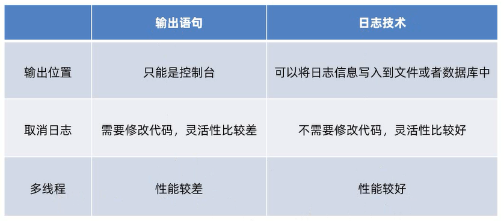
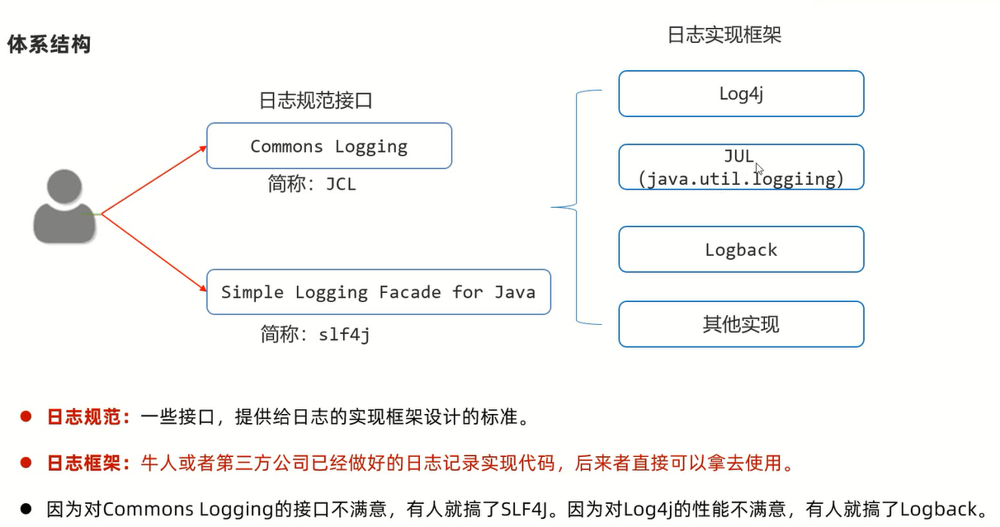

# 日志

程序中的日志:用来记录程序运行过程中的信息,并可以进行永久存储

# 优势



# 体系结构



# Logback

Logback是基于slf4j的日志规范实现的框架,性能比之前使用的log4j要好

[官方网站](https://logback.qos.ch/index.html)

## 技术模块

1. logback-core:该模块为其他两个模块提供基础代码,必须有
2. logback-classic:完整实现了slf4j API的模块
3. logback-access:与Tomcat和Jetty等Servlet容器集成,以提供HTTP访问日志功能

## 使用步骤

1. 需要导包,使用3个模块:              
slf4j-api:日志规范           
logback-core:基础模块          
logback-classic:功能模块            

2. src目录下新建logback的核心配置文件logback.xml

3. 在代码中获取日志对象:`public static final Logger LOGGER = LoggerFactory.getLogger("类对象");`

4. 使用日志对象的方法记录系统的日志信息

范例:

```java
package com.jinzhao.test1;

import org.slf4j.Logger;
import org.slf4j.LoggerFactory;

import java.util.Scanner;

public class Test {

    // 获取日志对象
    public static final Logger LOGGER = LoggerFactory.getLogger("Test.class");

    public static void main(String[] args) {
        // 记录用户登录的操作日志
        Scanner sc = new Scanner(System.in);
        System.out.print("请输入用户名:");
        String username = sc.nextLine();
        System.out.print("请输入密码:");
        String password = sc.nextLine();
        if (username.equals("张三") && password.equals("123456")) {
            System.out.println("登录成功");
            LOGGER.info("用户名为" + username + ",用户密码为" + password + ",登录成功");
        } else {
            System.out.println("登录失败");
            LOGGER.info("用户名为" + username + ",用户密码为" + password + ",登录失败");
        }
    }
}
```

## 配置文件详解

logback日志系统的特性都是通过核心配置文件logback.xml控制的

```xml
<?xml version="1.0" encoding="UTF-8"?>
<configuration>
    <!--
        CONSOLE:表示当前的日志信息是可以输出到控制台的
    -->
    <appender name="CONSOLE" class="ch.qos.logback.core.ConsoleAppender">
        <!--输出流对象:默认System.out,可以改为System.err-->
        <target>System.out</target>
        <encoder>
            <!--格式化输出:%d表示日期,%thread表示线程名,%-5level:级别从左显示5个字符宽度
                %msg:日志消息,%n是换行符-->
            <pattern>%d{yyyy-MM-dd HH:mm:ss.SSS} [%-5level]  %c [%thread] : %msg%n</pattern>
        </encoder>
    </appender>

    <!-- File是输出的方向通向文件的 -->
    <appender name="FILE" class="ch.qos.logback.core.rolling.RollingFileAppender">
        <encoder>
            <pattern>%d{yyyy-MM-dd HH:mm:ss.SSS} [%thread] %-5level %logger{36} - %msg%n</pattern>
            <charset>utf-8</charset>
        </encoder>
        <!--日志输出路径-->
        <file>D:/ProjectLog/data.log</file>
        <!--指定日志文件拆分和压缩规则-->
        <rollingPolicy
                class="ch.qos.logback.core.rolling.SizeAndTimeBasedRollingPolicy">
            <!--通过指定压缩文件名称,来确定分割文件方式-->
            <fileNamePattern>D:/ProjectLog/data2-%d{yyyy-MMdd}.log%i.gz</fileNamePattern>
            <!--文件拆分大小-->
            <maxFileSize>1MB</maxFileSize>
        </rollingPolicy>
    </appender>
    <!--
    level:用来设置打印级别,大小写无关:TRACE,DEBUG,INFO,WARN,ERROR,ALL和OFF,默认debug
    <root>可以包含零个或多个<appender-ref>元素,标识这个输出位置将会被本日志级别控制
    -->
    <root level="ALL">
        <appender-ref ref="CONSOLE"/>
        <appender-ref ref="FILE"/>
    </root>
</configuration>
```

### 输出位置

- 通过logback.xml中的`<appender>`标签可以设置输出位置和日志信息的详细格式
- 通常可以设置2个日志的输出位置:**一个是控制台、一个是系统文件**

输出到控制台的配置标志:`<appender name="CONSOLE" class="ch.qos.logback.core.ConsoleAppender">`

输出到系统文件的配置标志:`<appender name="FILE" class="ch.qos.logback.core.rolling.RollingFileAppender">`

### 格式设置

1. 输出流对象:默认`System.out`,可以改为`System.err`                 

`<target>System.out</target>`

2. 格式化输出:     
%d:日期                 
%thread:线程名                       
%-5level:级别从左显示5个字符宽度               
%msg:日志消息                    
%n:换行符  

```xml
<encoder>
    <pattern>%d{yyyy-MM-dd HH:mm:ss.SSS} [%-5level]  %c [%thread] : %msg%n</pattern>
</encoder>
```

### 日志级别

级别程度依次是:`TRACE` < `DEBUG` < `INFO` < `WARN` < `ERROR`              
默认级别是`debug`(忽略大小写),对应其方法
 
作用:**用于控制系统中哪些日志级别是可以输出的,只输出级别不低于设定级别的日志信息**

`ALL`和`OFF`分别是打开和关闭全部日志信息

```xml
<root level="日志级别">
    <appender-ref ref="CONSOLE"/>
    <appender-ref ref="FILE"/>
</root>
```