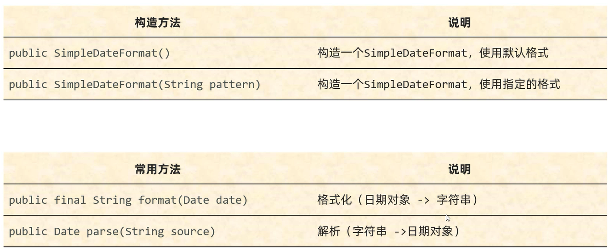
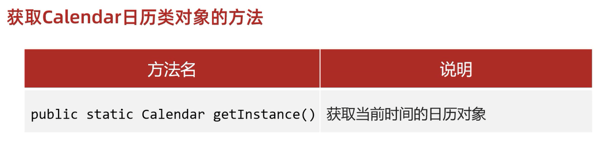
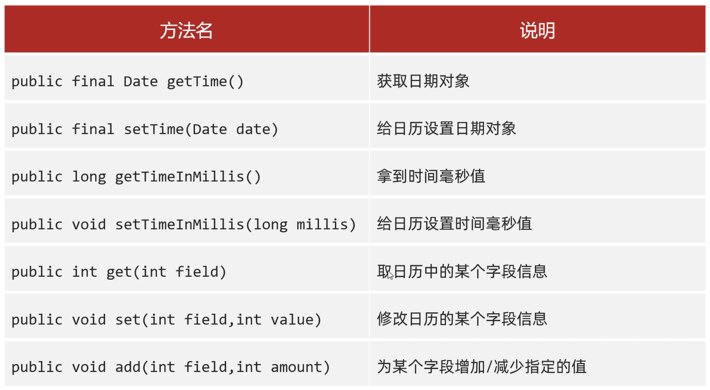
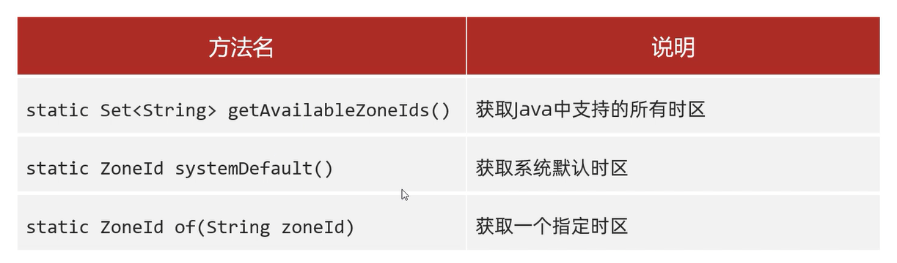
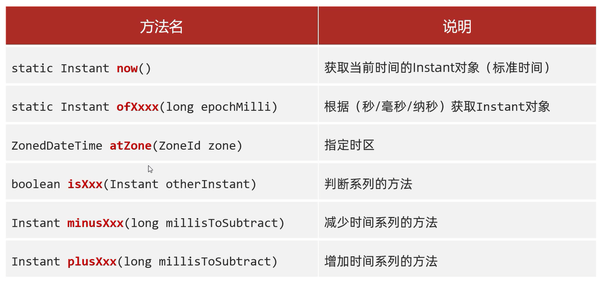
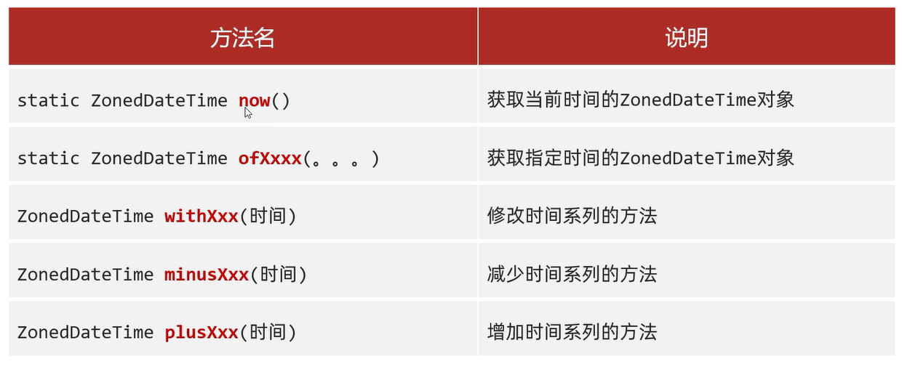
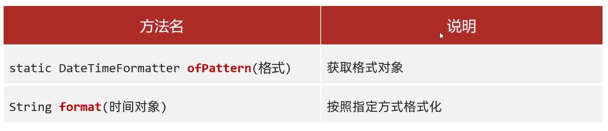
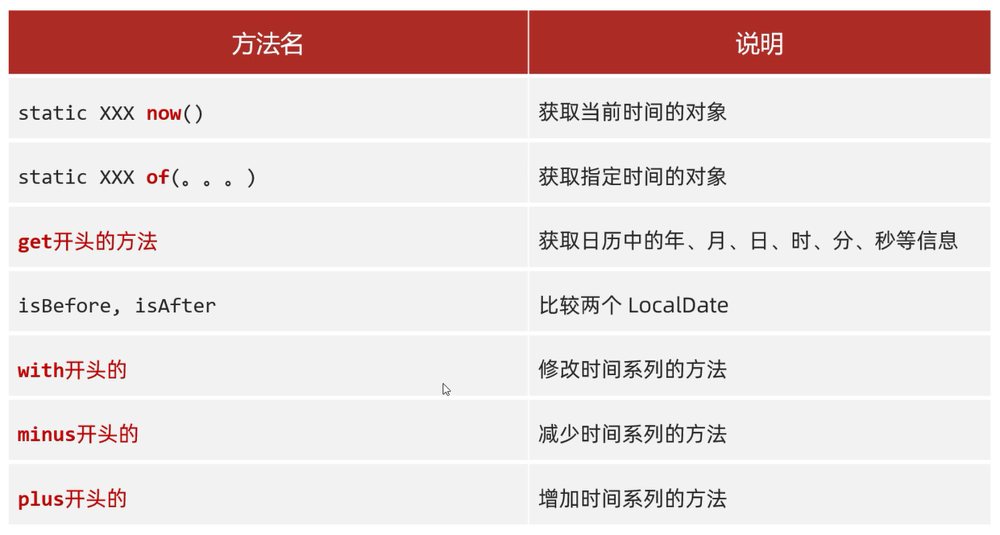
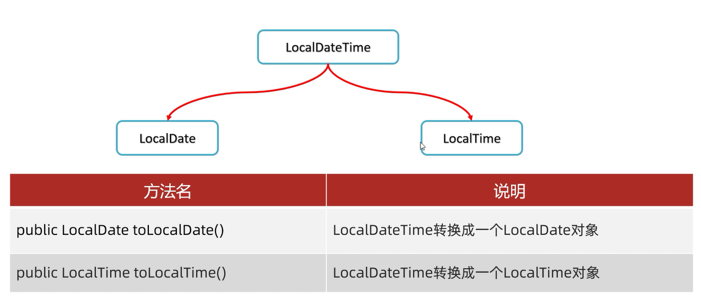

# 时间的相关知识点

全世界的时间,有一个统一的计算标准: 格林尼治时间/格林威治时间(Greenwich Mean Time,简称GMT)   

计算核心: 地球自转一天是24小时,太阳直射时为正午12点   

原子钟: 利用铯原子的震动的频率计算出来的时间,目前作为世界标准时间(UTC)        

中国标准时间: 世界标准时间 + 8小时

时间单位换算: 
- 1秒 = 1000 毫秒
- 1毫秒 = 1000 微秒
- 1微秒 = 1000 纳秒

# JDK7以前时间相关类

## Date

Date类是Java写好的一个JavaBean类,用来描述时间,**精确到毫秒**     

利用空参构造创建的对象,默认表示系统当前时间     

利用有参构造创建的对象,表示指定时间   

创建日期对象: 
1. `Date date = new Date();`   
2. `Date date = new Date(指定毫秒值);`    

修改时间对象中的毫秒值: `setTime(毫秒值);`     

获取时间对象中的毫秒值: `getTime(毫秒值);`    

范例:   

```java
import java.util.Date;

public class Test {
    public static void main(String[] args) {
        // 空参构造
        Date d1 = new Date();
        System.out.println(d1);

        // 有参构造
        Date d2 = new Date(0L);
        System.out.println(d2);

        // setTime(): 修改时间
        d2.setTime(1000L);
        System.out.println(d2);

        // getTime(): 获取当前时间的毫秒值
        System.out.println(d2.getTime());
    }
}
```

练习:     

1. 打印时间原点开始一年后的时间
2. 定义任意两个Date对象,比较一下哪个时间在前,哪个时间在后

```java
import java.util.Date;
import java.util.Random;

public class Test {
    public static void main(String[] args) {
        // 要求1
        Date d1 = new Date(0L);
        long time1 = d1.getTime();
        time1 += 1000L * 60 * 60 * 24 * 365;
        d1.setTime(time1);
        System.out.println("时间原点开始一年之后的时间: " + d1);

        // 要求2
        Random r = new Random();
        Date d2 = new Date(Math.abs(r.nextInt()));
        System.out.println(d2);
        long time2 = d2.getTime();

        Date d3 = new Date(Math.abs(r.nextInt()));
        System.out.println(d3);
        long time3 = d3.getTime();

        long minTime = Math.min(time2,time3);
        Date minDate = new Date();
        minDate.setTime(minTime);
        System.out.println("其中时间较早的是: " + minDate);
    }
}
```

## SimpleDateFormat

作用:      
1. 格式化时间: 把时间变成要求的格式   
2. 解析: 把字符串表示的时间变成Date对象    

格式化的时间形式的常用的模式对应关系:    
- `y` -- 年 
- `M` -- 月
- `d` -- 日
- `H` -- 时 
- `m` -- 分 
- `s` -- 秒

例如:      
1. 2024-04-04 16:09:09 -- `yyyy-MM-dd HH:mm:ss`
1. 2024年04月04日 16:09:09 -- `yyyy年MM月dd日 HH:mm:ss`

## 构造方法和成员方法



范例:    

```java
import java.text.ParseException;
import java.text.SimpleDateFormat;
import java.util.Date;

public class Test {
    public static void main(String[] args) throws ParseException {
        Date d = new Date(0L);

        // 默认格式
        SimpleDateFormat sdf1 = new SimpleDateFormat();
        String str1 = sdf1.format(d);
        System.out.println(str1);

        // 指定格式
        String pattern = "yyyy年MM月dd日 HH:mm:ss EE";
        SimpleDateFormat sdf2 = new SimpleDateFormat(pattern);
        String str2 = sdf2.format(d);
        System.out.println(str2);

        // 解析
        String str = "2024-01-01 12:12:12";
        SimpleDateFormat sdf3 = new SimpleDateFormat("yyyy-MM-dd HH:mm:ss");
        Date date = sdf3.parse(str);
        System.out.println(date);
        System.out.println(date.getTime());
    }
}
```

练习:  

假设你的出生年月日为:2001-02-05,请用字符串表示这个数据,并将其转换成2001年02月05日

```java
import java.text.ParseException;
import java.text.SimpleDateFormat;
import java.util.Date;

public class Test {
    public static void main(String[] args) throws ParseException {
        String birthDate = "2001-02-05";
        // 先解析
        SimpleDateFormat sdf = new SimpleDateFormat("yyyy-MM-dd");
        Date date = sdf.parse(birthDate);
        // 再格式化
        SimpleDateFormat afterSdf = new SimpleDateFormat("yyyy年MM月dd日");
        String afterDate = afterSdf.format(date);
        System.out.println(afterDate);
    }
}
```

练习:      


```java
import java.text.ParseException;
import java.text.SimpleDateFormat;
import java.util.Date;

public class Test {
    public static void main(String[] args) throws ParseException {
        String putInTime = "2023年11月11日 00:01:00";
        String startTime = "2023年11月11日 00:00:00";
        String endTime = "2023年11月11日 00:10:00";

        SimpleDateFormat sdf = new SimpleDateFormat("yyyy年MM月dd日 HH:mm:ss");

        Date startDate = sdf.parse(startTime);
        Date endDate = sdf.parse(endTime);
        Date putInDate = sdf.parse(putInTime);

        long start = startDate.getTime();
        long end = endDate.getTime();
        long putIn = putInDate.getTime();

        if (putIn >= start && putIn <= end) {
            System.out.println("秒杀成功!");
        } else {
            System.out.println("秒杀失败!");
        }
    }
}
```

## Calendar

Calendar表示系统当前时间的日历对象,可以**单独修改、获取时间中的年月日等**  

细节: 
1. **Calendar是一个抽象类,不能直接new,而是通过一个静态方法获取到子类对象**    
底层原理:      
会根据系统的不同时区来获取不同的日历对象,默认表示当前时间      
把会把时间中的纪元、年、月、日、时、分、秒、星期等等的都放到一个数组当中     
Java在Calendar类中,把索引对应的数字都定义成常量          
- 0(`Calendar.ERA`): 纪元
- 1(`Calendar.YEAR`): 年
- 2(`Calendar.MONTH`): 月
- 3(`Calendar.WEEK_OF_YEAR`): 一年中的第几周
- 4(`Calendar.WEEK_OF_MONTH`): 一个月中的第几周
- 5(`Calendar.DATE`): 一个月中的第几天(日期)
- ....

2. **月份: 范围0 ~ 11,如果获取出来的是0,那么实际上是1月,因此需要+1**   
3. **星期: 星期日是一周中的第一天**    
- 1(星期日) 
- 2(星期一) 
- 3(星期二) 
- 4(星期三) 
- 5(星期四) 
- 6(星期五) 
- 7(星期六)

## getInstance()



范例:     

```java
import java.util.Calendar;

public class Test {
    public static void main(String[] args) {
        Calendar c = Calendar.getInstance();
        System.out.println(c);
    }
}
```

## Calendar常用方法      



### getTime()

获取日期对象

范例: 

```java
import java.text.SimpleDateFormat;
import java.util.Calendar;
import java.util.Date;

public class Test {
    public static void main(String[] args) {
        Calendar c = Calendar.getInstance();
        Date date = c.getTime();
        SimpleDateFormat sdf = new SimpleDateFormat();
        String dateStr = sdf.format(date);
        System.out.println(dateStr);
    }
}
```

### setTime(Date date)

给日历设置日期对象

范例: 

```java
import java.util.Calendar;
import java.util.Date;

public class Test {
    public static void main(String[] args) {
        Calendar c = Calendar.getInstance();
        Date date = new Date(0L);
        c.setTime(date);
        System.out.println(c);
    }
}
```

### getTimeInMillis()

拿到时间毫秒值

范例: 

```java
import java.util.Calendar;

public class Test {
    public static void main(String[] args) {
        Calendar c = Calendar.getInstance();
        long time = c.getTimeInMillis();
        System.out.println(time);
    }
}
```

### setTimeInMillis(long millis)

给日历设置时间毫秒值

范例: 

```java
import java.util.Calendar;

public class Test {
    public static void main(String[] args) {
        Calendar c = Calendar.getInstance();
        long time = 0;
        c.setTimeInMillis(time);
        System.out.println(c);
    }
}
```

### get(int field)

获取日期中的某个字段信息

范例:     

```java
import java.util.Calendar;
import java.util.Date;

public class Test {
    public static void main(String[] args) {
        // 获取当前时间的日历对象
        Calendar c = Calendar.getInstance();

        Date d = new Date(0L);
        c.setTime(d);

        // 获取日期中的某个字段信息
        // Java在Calendar类中,把索引对应的数字都定义成常量
        int year = c.get(Calendar.YEAR);
        int month = c.get(Calendar.MONTH) + 1;
        int date = c.get(Calendar.DATE);
        // 返回1~7
        int week = c.get(Calendar.DAY_OF_WEEK);
        String chineseWeek = getWeek(week);

        System.out.print(year + "年" + month + "月" + date + "日 ");
        System.out.println(chineseWeek);
    }

    // 传入对应的数字,返回对应的星期
    public static String getWeek(int week) {
        String[] weekArr = {"","星期日","星期一","星期二","星期三","星期四","星期五","星期六"};
        return weekArr[week];
    }
}
```

### set(int field,int value)

修改日历的某个字段信息

范例 :

```java
import java.util.Calendar;

public class Test {
    public static void main(String[] args) {
        Calendar c = Calendar.getInstance();
        // 修改年份为2000年
        c.set(Calendar.YEAR,2000);
        // 修改月份为23月,月份范围是0~11,所以没有23,直接加到年份上,变成了11,即2001年的12月
        c.set(Calendar.MONTH,23);
        // 打印结果:"2001"
        System.out.println(c.get(Calendar.YEAR));
        // 打印结果:"11"
        System.out.println(c.get(Calendar.MONTH));
    }
}
```

### add(int field,int amount)

为某个字段增加/减少指定的值

细节: **amount值为正数即增加,值为负数即减少**

范例 :

```java
import java.util.Calendar;

public class Test {
    public static void main(String[] args) {
        Calendar c = Calendar.getInstance();
        c.set(Calendar.YEAR,2000);
        c.set(Calendar.MONTH,8);
        
        // 增加一个月
        c.add(Calendar.MONTH,1);
        System.out.println(c.get(Calendar.MONTH));

        // 减少一年
        c.add(Calendar.YEAR,-1);
        System.out.println(c.get(Calendar.YEAR));
    }
}
```

# JDK8新增时间相关类

好处:     
1. 代码层面: 更加简单,新增了判断的方法、计算时间间隔的方法
2. 安全层面: 解决了多线程环境下会导致的数据安全问题(解决办法: **时间日期对象都是不可变的**)

## Date类

## ZoneId

时区

格式: 洲名/城市名(国家名/城市名)



范例: 

```java
import java.time.ZoneId;
import java.util.Set;

public class Test {
    public static void main(String[] args) {
        // 获取所有的时区名称
        Set<String> zoneIds = ZoneId.getAvailableZoneIds();
        // 打印结果:"599"
        System.out.println(zoneIds.size());
        System.out.println(zoneIds);

        // 获取当前系统的默认时区
        ZoneId zoneId1 = ZoneId.systemDefault();
        // 打印结果:"Asia/Shanghai"
        System.out.println(zoneId1);

        // 获取指定的时区
        ZoneId zoneId2 = ZoneId.of("Asia/Pontianak");
        // 打印结果:"Asia/Pontianak"
        System.out.println(zoneId2);
    }
}
```

## Instant

时间戳



范例: 

```java
import java.time.Instant;
import java.time.ZoneId;
import java.time.ZonedDateTime;

public class Test {
    public static void main(String[] args) {
        // 获取当前时间的Instant对象(标准时间)
        Instant now = Instant.now();
        System.out.println(now);

        // 根据(秒/毫秒/纳秒)获取Instant对象
        // 从时间原点过了1纳秒的时间
        Instant instant1 = Instant.ofEpochSecond(0L,1L);
        // 从时间原点过了1毫秒的时间
        Instant instant2 = Instant.ofEpochMilli(1L);
        // 从时间原点过了2秒的时间
        Instant instant3 = Instant.ofEpochSecond(2L);
        // 打印结果:"1970-01-01T00:00:00.001Z"
        System.out.println(instant1);
        // 打印结果:"1970-01-01T00:00:00.000000001Z"
        System.out.println(instant2);
        // 打印结果:"1970-01-01T00:00:02Z"
        System.out.println(instant3);

        // 指定时区
        ZonedDateTime time = Instant.now().atZone(ZoneId.of("Asia/Shanghai"));
        System.out.println(time);

        // 判断系列的方法
        // isAfter: 判断调用者表示的时间是否在参数表示的时间之后
        boolean result1 = instant1.isAfter(instant2);
        // isBefore: 判断调用者表示的时间是否在参数表示的时间之前
        boolean result2 = instant2.isBefore(instant3);
        System.out.println(result1);
        System.out.println(result2);

        // 减少时间系列的方法
        // instant3的时间减少1秒
        Instant instant4 = instant3.minusSeconds(1L);
        // instant2的时间减少20毫秒
        Instant instant5 = instant2.minusMillis(20L);
        // instant1的时间减少1纳秒
        Instant instant6 = instant1.minusNanos(1L);
        // 打印结果:"1970-01-01T00:00:01Z"
        System.out.println(instant4);
        // 打印结果:"1969-12-31T23:59:59.981Z"
        System.out.println(instant5);
        // 打印结果:"1970-01-01T00:00:00Z"
        System.out.println(instant6);

        // 增加时间系列的方法
        // instant4的时间增加20秒
        Instant instant7 = instant4.plusSeconds(20L);
        // instant5的时间增加20毫秒
        Instant instant8 = instant5.plusMillis(20L);
        // instant6的时间增加20纳秒
        Instant instant9 = instant6.plusSeconds(20L);
        // 打印结果:"1970-01-01T00:00:21Z"
        System.out.println(instant7);
        // 打印结果:"1970-01-01T00:00:00.001Z"
        System.out.println(instant8);
        // 打印结果:"1970-01-01T00:00:20Z"
        System.out.println(instant9);
    }
}
```

## ZoneDateTime

带时区的时间



范例:  

```java
import java.time.Instant;
import java.time.ZoneId;
import java.time.ZonedDateTime;

public class Test {
    public static void main(String[] args) {
        // 获取当前时间对象(带时区)
        ZonedDateTime now = ZonedDateTime.now();
        System.out.println(now);

        // 通过ZoneDateTime指定年、月、日、时、分、秒、纳秒的方式获取带时区的时间对象
        ZonedDateTime time1 = ZonedDateTime.of(2023,10,1,11,12,12,0,ZoneId.of("Asia/Shanghai"));
        // 打印结果:"2023-10-01T11:12:12+08:00[Asia/Shanghai]"
        System.out.println(time1);

        // 通过Instant+时区的方式指定获取带时区的时间对象
        Instant instant = Instant.ofEpochMilli(0L);
        ZoneId zoneId = ZoneId.of("Asia/Shanghai");
        ZonedDateTime time2 = ZonedDateTime.ofInstant(instant,zoneId);
        // 打印结果:"1970-01-01T08:00+08:00[Asia/Shanghai]"
        System.out.println(time2);


        // 修改时间系列的方法
        ZonedDateTime time3 = time2.withYear(2000);
        // 打印结果:"2000-01-01T08:00+08:00[Asia/Shanghai]"
        System.out.println(time3);

        // 减少时间
        ZonedDateTime time4 = time3.minusYears(1);
        // 打印结果:"1999-01-01T08:00+08:00[Asia/Shanghai]"
        System.out.println(time4);

        // 增加时间
        ZonedDateTime time5 = time4.plusYears(1);
        // 打印结果:"2000-01-01T08:00+08:00[Asia/Shanghai]"
        System.out.println(time5);
    }
}
```

## 日期格式化类DateTimeFormatter

用于时间的格式化和解析



1. `ofPattern(格式)` -- 获取格式对象
2. `format(时间对象)` -- 按照指定格式格式化

范例: 

```java
import java.time.Instant;
import java.time.ZoneId;
import java.time.ZonedDateTime;
import java.time.format.DateTimeFormatter;

public class Test {
    public static void main(String[] args) {
        // 获取时间对象
        ZonedDateTime time = Instant.now().atZone(ZoneId.of("Asia/Shanghai"));
        // 解析/格式化器
        DateTimeFormatter dtf1 = DateTimeFormatter.ofPattern("yyyy-MM-dd HH:mm;ss EE a");
        // 格式化
        System.out.println(dtf1.format(time));
    }
}
```

## 日历类

1. `LocalDate` -- 年、月、日
2. `LocalTime` -- 时、分、秒
3. `LocalDateTime` -- 年、月、日、时、分、秒



`LocalDateTime`转成`LocalDate`、`LocalTime`: 



## `LocalDate` 

年、月、日

范例: 

```java
import java.time.DayOfWeek;
import java.time.LocalDate;
import java.time.Month;

public class Test {
    public static void main(String[] args) {
        // 获取当前时间的日历对象(包含年月日)
        LocalDate nowDate = LocalDate.now();
        System.out.println(nowDate);

        // 获取指定的时间的日历对象
        LocalDate idDate = LocalDate.of(2012,12,12);
        // 打印结果:"2012-12-12"
        System.out.println(idDate);

        // get系列方法获取日历中的每一个属性值
        // 获取年
        int year = idDate.getYear();
        // 打印结果:"2012"
        System.out.println(year);

        // 获取月
        // 方式一
        Month m = idDate.getMonth();
        // 打印结果:"DECEMBER"
        System.out.println(m);
        // 打印结果:"12"
        System.out.println(m.getValue());

        // 方式二
        int month = idDate.getMonthValue();
        // 打印结果:"12"
        System.out.println(month);

        // 获取日
        int day = idDate.getDayOfMonth();
        // 打印结果:"12"
        System.out.println(day);

        // 获取一年的第几天
        int dayOfYear = idDate.getDayOfYear();
        // 打印结果:"347"
        System.out.println(dayOfYear);

        // 获取星期
        DayOfWeek dayOfWeek = idDate.getDayOfWeek();
        // 打印结果:"WEDNESDAY"
        System.out.println(dayOfWeek);
        // 打印结果:"3"
        System.out.println(dayOfWeek.getValue());

        LocalDate oldIdDate = LocalDate.of(2011,11,11);

        // is开头的方法表示判断
        // 打印结果:"false"
        System.out.println(idDate.isBefore(oldIdDate));
        // 打印结果:"true"
        System.out.println(idDate.isAfter(oldIdDate));

        // with开头的方法表示修改,只能修改年月日
        LocalDate withLocalDate = idDate.withYear(2000);
        // 打印结果:"2000-12-12"
        System.out.println(withLocalDate);

        // minus开头的方法表示减少,只能减少年月日
        LocalDate minusLocalDate = idDate.minusYears(1);
        // 打印结果:"2011-12-12"
        System.out.println(minusLocalDate);


        // plus开头的方法表示增加,只能增加年月日
        LocalDate plusLocalDate = idDate.plusYears(1).plusMonths(1).plusDays(1);
        // 打印结果:"2014-01-13"(2012 + 1 = 2013,12 + 1 = 13,月超12年加1,因此年2013变2014,月变01,日变13) 
        System.out.println(plusLocalDate);
    }
}
```

练习:  

在生日那天发送祝福

```java
import java.time.LocalDate;

public class Test {
    public static void main(String[] args) {
        LocalDate birthDate = LocalDate.of(2001,2,5);
        LocalDate nowDate = LocalDate.now();
        if (birthDate.equals(nowDate)) {
            System.out.println("祝你生日快乐!");
        } else {
            System.out.println("今天不是你的生日!");
        }
    }
}
```

## LocalTime

时、分、秒

范例:  

```java
import java.time.LocalTime;

public class Test {
    public static void main(String[] args) {
        // 获取本地时间的日历对象(包含时分秒)
        LocalTime nowTime = LocalTime.now();
        System.out.println(nowTime);

        LocalTime time = LocalTime.of(8,2,37,24);
        // 打印结果:"08:02:37.000000024"
        System.out.println(time);

        // 时
        int hour = time.getHour();
        // 打印结果:"8"
        System.out.println(hour);

        // 分
        int minute = time.getMinute();
        // 打印结果:"2"
        System.out.println(minute);

        // 秒
        int second = time.getSecond();
        // 打印结果:"37"
        System.out.println(second);

        // 纳秒
        int nano = time.getNano();
        // 打印结果:"24"
        System.out.println(nano);

        LocalTime mTime = LocalTime.of(8,20,30,150);

        // is系列的方法
        // 打印结果:"true"
        System.out.println(time.isBefore(mTime));
        // 打印结果:"false"
        System.out.println(time.isAfter(mTime));

        // with系列的方法,只能修改时、分、秒
        // 打印结果:"10:02:37.000000024"
        System.out.println(time.withHour(10));

        // plus系列的方法,只能修改时、分、秒
        // 打印结果:"18:02:37.000000024"
        System.out.println(time.plusHours(10));
    }
}
```

## LocalDateTime

年、月、日、时、分、秒

范例: 

```java
import java.time.LocalDate;
import java.time.LocalDateTime;
import java.time.LocalTime;

public class Test {
    public static void main(String[] args) {
        // 当前时间的的日历对象(包含年月日时分秒)
        LocalDateTime nowDateTime = LocalDateTime.now();
        System.out.println(nowDateTime);

        LocalDateTime dateTime = LocalDateTime.of(2022,1,2,3,24,6,123);

        // 年
        // 打印结果:"2022"
        System.out.println(dateTime.getYear());

        // 月
        // 打印结果:"1"
        System.out.println(dateTime.getMonthValue());

        // 日
        // 打印结果:"2"
        System.out.println(dateTime.getDayOfMonth());

        // 时
        // 打印结果:"3"
        System.out.println(dateTime.getHour());

        // 分
        // 打印结果:"24"
        System.out.println(dateTime.getMinute());

        // 秒
        // 打印结果:"6"
        System.out.println(dateTime.getSecond());

        // 纳秒
        // 打印结果:"123"
        System.out.println(dateTime.getNano());

        // 日:当年的第几天
        // 打印结果:"2"
        System.out.println(dateTime.getDayOfYear());

        // 星期
        // 打印结果:"SUNDAY"
        System.out.println(dateTime.getDayOfWeek());
        // 打印结果:"7"
        System.out.println(dateTime.getDayOfWeek().getValue());

        // 月份
        // 打印结果:"JANUARY"
        System.out.println(dateTime.getMonth());
        // 打印结果:"1"
        System.out.println(dateTime.getMonth().getValue());

        // 从LocalDateTime中获取LocalDate
        LocalDate ld = dateTime.toLocalDate();
        // 打印结果:"2022-01-02"
        System.out.println(ld);

        // 从LocalDateTime中获取LocalTime
        LocalTime lt = dateTime.toLocalTime();
        // 打印结果:"3"
        System.out.println(lt.getHour());
        // 打印结果:"24"
        System.out.println(lt.getMinute());
        // 打印结果:"6"
        System.out.println(lt.getSecond());
    }
}
```

## 工具类

## Duration

用于计算两个"时间"间隔(秒、纳秒)

范例: 

```java
import java.time.Duration;
import java.time.LocalDateTime;

public class Test {
    public static void main(String[] args) {
        LocalDateTime oneTime = LocalDateTime.of(2012,12,12,11,12,20,0);
        // 打印结果:"2012-12-12T11:12:20"
        System.out.println(oneTime);

        LocalDateTime birthDate = LocalDateTime.of(2001,2,5,0,0,0);
        // 打印结果:"2001-02-05T00:00"
        System.out.println(birthDate);

        // 第二个参数减第一个参数
        Duration duration = Duration.between(birthDate,oneTime);
        // 打印结果:"相差的时间间隔对象: PT103883H12M20S"
        System.out.println("相差的时间间隔对象: " + duration);

        // 两个时间差的天数
        // 打印结果:"4328"
        System.out.println(duration.toDays());

        // 两个时间差的小时数
        // 打印结果:"103883"
        System.out.println(duration.toHours());

        // 两个时间差的分钟数
        // 打印结果:"6232992"
        System.out.println(duration.toMinutes());

        // 两个时间差的秒数
        // 打印结果:"373979540"
        System.out.println(duration.toSeconds());

        // 两个时间差的毫秒数
        // 打印结果:"373979540000"
        System.out.println(duration.toMillis());

        // 两个时间差的纳秒数
        // 打印结果:"373979540000000000"
        System.out.println(duration.toNanos());
    }
}
```

## Period

用于计算两个"日期"间隔(年、月、日)

范例: 

```java
import java.time.LocalDate;
import java.time.Period;

public class Test {
    public static void main(String[] args) {
        LocalDate oneDay = LocalDate.of(2012,12,12);
        // 打印结果:"2012-12-12"
        System.out.println(oneDay);

        LocalDate birthDate = LocalDate.of(2001,2,5);
        // 打印结果:"2001-02-05"
        System.out.println(birthDate);

        // 第二个参数减第一个参数
        Period period = Period.between(birthDate,oneDay);
        // 打印结果:"相差的时间间隔对象: P11Y10M7D"
        System.out.println("相差的时间间隔对象: " + period);

        // 两个日期差的年数
        // 打印结果:"11"
        System.out.println(period.getYears());

        // 两个日期差的月数
        // 打印结果:"10"
        System.out.println(period.getMonths());

        // 两个日期差的天数
        // 打印结果:"7"
        System.out.println(period.getDays());

        // 两个日期差的总月数
        // 打印结果:"142"(总共相隔142个月)
        System.out.println(period.toTotalMonths());
    }
}
```

## ChronoUnit

用于计算两个"日期时间"间隔(所有单位)

范例: 

```java
import java.time.LocalDateTime;
import java.time.temporal.ChronoUnit;

public class Test {
    public static void main(String[] args) {
        LocalDateTime oneDay = LocalDateTime.of(2012,12,12,12,12,12);
        // 打印结果:"2012-12-12T12:12:12"
        System.out.println(oneDay);

        LocalDateTime birthDate = LocalDateTime.of(2001,2,5,0,0,0);
        // 打印结果:"2001-02-05T00:00"
        System.out.println(birthDate);

        System.out.println("相差的年数: " + ChronoUnit.YEARS.between(birthDate,oneDay));
        System.out.println("相差的月数: " + ChronoUnit.MONTHS.between(birthDate,oneDay));
        System.out.println("相差的周数: " + ChronoUnit.WEEKS.between(birthDate,oneDay));
        System.out.println("相差的天数: " + ChronoUnit.DAYS.between(birthDate,oneDay));
        System.out.println("相差的时数: " + ChronoUnit.HOURS.between(birthDate,oneDay));
        System.out.println("相差的分数: " + ChronoUnit.MINUTES.between(birthDate,oneDay));
        System.out.println("相差的秒数: " + ChronoUnit.SECONDS.between(birthDate,oneDay));
        System.out.println("相差的毫秒数: " + ChronoUnit.MILLIS.between(birthDate,oneDay));
        System.out.println("相差的微秒数: " + ChronoUnit.MICROS.between(birthDate,oneDay));
        System.out.println("相差的纳秒数: " + ChronoUnit.NANOS.between(birthDate,oneDay));
        System.out.println("相差的半天数: " + ChronoUnit.HALF_DAYS.between(birthDate,oneDay));
        System.out.println("相差的十年数: " + ChronoUnit.DECADES.between(birthDate,oneDay));
        System.out.println("相差的世纪数: " + ChronoUnit.CENTURIES.between(birthDate,oneDay));
        System.out.println("相差的千年数: " + ChronoUnit.MILLENNIA.between(birthDate,oneDay));
        System.out.println("相差的纪元数: " + ChronoUnit.ERAS.between(birthDate,oneDay));
    }
}
```