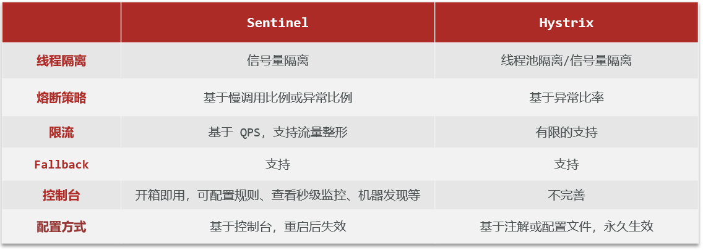
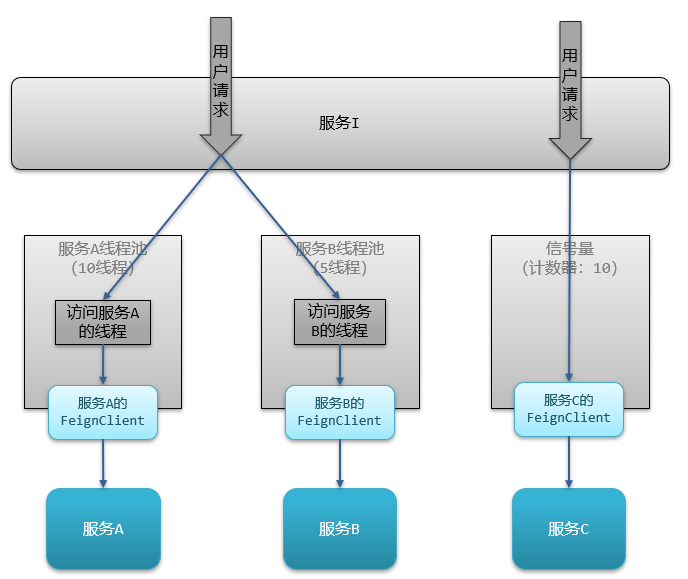
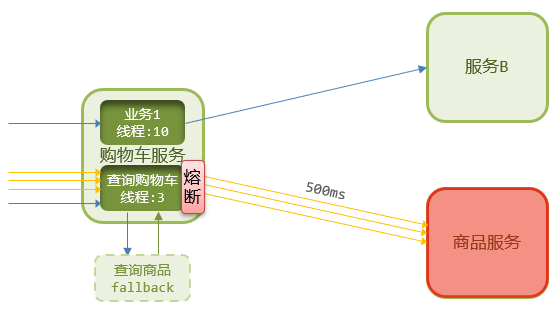
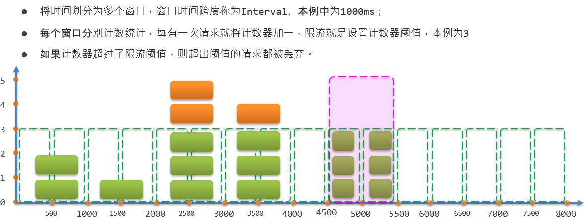
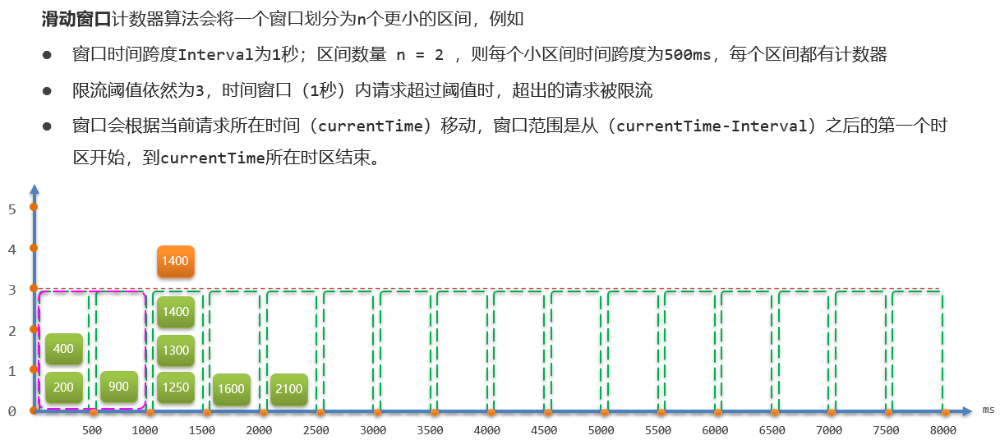
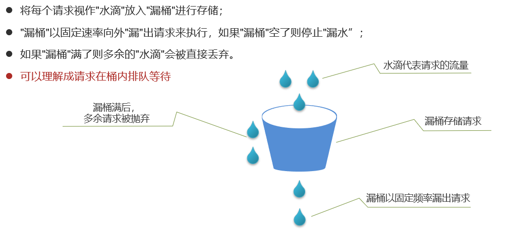
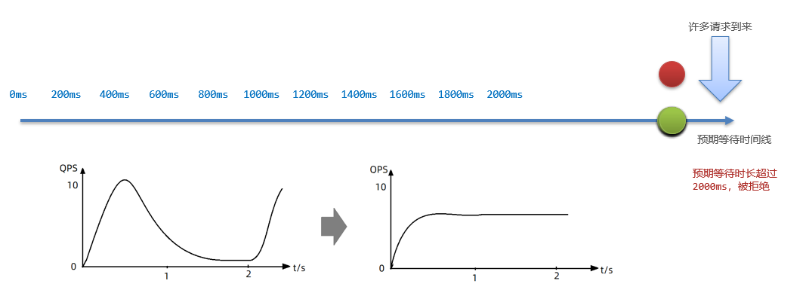
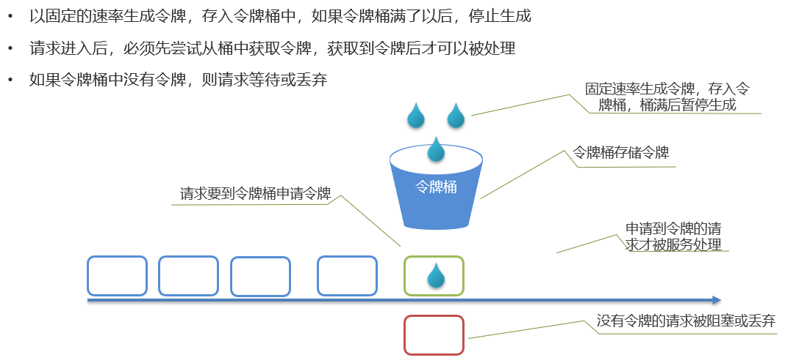

# 雪崩问题

微服务调用链路中的某个服务故障,引起整个链路中的所有微服务都不可用,就是雪崩

雪崩问题产生的原因:
- 微服务相互调用,服务提供者出现故障或阻塞
- 服务调用者没有做好异常处理,导致自身故障
- 调用链中的所有服务级联失败,导致整个集群故障 

解决问题的思路:
1. 尽量避免服务出现故障或阻塞
- 保证代码的健壮性
- 保证网络畅通
- 能应对较高的并发请求
2. 服务调用者做好远程调用异常的后备方案,避免故障扩散

# 服务保护方案

- 请求限流:限制访问微服务的请求的并发量,避免服务因流量激增出现故障
- 线程隔离:也叫做舱壁模式,模拟船舱隔板的防水原理,通过限定每个业务能使用的线程数量而将故障业务隔离,避免故障扩散
- 服务熔断:由**断路器**统计请求的异常比例或慢调用比例,如果超出阈值则会**熔断**该业务,拦截该业务的请求,熔断期间,所有请求快速失败,全都走fallback逻辑
- 失败处理:给业务编写一个调用失败时的处理的逻辑,称为fallback,当调用出现故障(比如无线程可用)时,按照失败处理逻辑执行业务(返回默认数据或友好提示)并返回,而不是直接抛出异常

# 服务保护技术



# Sentinel

Sentinel是阿里巴巴开源的一款微服务流量控制组件

[Sentinel官方网址](https://sentinelguard.io/zh-cn/index.html)

## 搭建

下载jar包后,通过如下命令启动Sentinel控制台:

```cmd
java -Dserver.port=8090 -Dcsp.sentinel.dashboard.server=localhost:8090 -Dproject.name=sentinel-dashboard -jar sentinel-dashboard.jar
```

## 微服务整合

1. 引入Maven依赖

```xml
<!--sentinel-->
<dependency>
    <groupId>com.alibaba.cloud</groupId> 
    <artifactId>spring-cloud-starter-alibaba-sentinel</artifactId>
</dependency>
```

2. 配置控制台

application.yaml:

```yaml
spring:
  cloud: 
    sentinel:
      transport:
        dashboard: localhost:8090
```

## 簇点链路

**簇点链路**,就是单机调用链路,是一次请求进入服务后经过的每一个被Sentinel监控的资源链

默认Sentinel会监控SpringMVC的每一个Endpoint(http接口)

限流、熔断等都是针对簇点链路中的**资源**设置的,而资源名默认就是接口的请求路径

Restful风格的API请求路径一般都相同,这会导致簇点资源名称重复,因此要修改配置,把请求方式+请求路径作为簇点资源名称:

```yaml
spring:
  cloud:
    sentinel:
      transport:
        dashboard: localhost:8090
      http-method-specify: true # 开启请求方式前缀
```

## 请求限流

请求限流:限制访问微服务的请求的并发量,避免服务因流量激增出现故障

Sentinel控制台 --> 簇点链路 --> 流控 --> 设置QPS阈值

## 线程隔离

线程隔离:也叫做舱壁模式,模拟船舱隔板的防水原理,通过限定每个业务能使用的线程数量而将故障业务隔离,避免故障扩散

Sentinel控制台 --> 簇点链路 --> 流控 --> 设置线程数阈值

线程隔离有两种方式实现:
- **线程池隔离(Hystix默认采用)**
  优点:轻量级,无额外开销
  缺点:不支持主动超时,不支持异步调用
  场景:高频调用,高扇出

- **信号量隔离(Sentinel默认采用)**
  优点:支持超时,支持异步调用
  缺点:线程的额外开销比较大
  场景:低扇出



Sentinel的线程隔离与Hystix的线程隔离有什么差别?

线程隔离可以采用线程池隔离或者信号量隔离                                  
- Hystix默认是基于线程池实现的线程隔离,每一个被隔离的业务都要创建一个独立的线程池,线程过多会带来额外的CPU开销,性能一般,但是隔离性更强
- Sentinel则是基于信号量隔离的原理,这种方式不用创建线程池,性能较好,但是隔离性一般

## 失败处理(Fallback)

给业务编写一个调用失败时的处理的逻辑,称为Fallback,当调用出现故障(比如无线程可用)时,按照失败处理逻辑执行业务(编写失败后的降级逻辑:返回默认数据或友好提示)并返回,而不是直接抛出异常

触发限流或熔断后的请求不一定要直接报错,也可以返回一些默认数据或者友好提示,用户体验会更好

给FeignClient编写失败后的降级逻辑有两种方式:
- 方式一:FallbackClass,无法对远程调用的异常做处理
- 方式二:FallbackFactory,可以对远程调用的异常做处理,**一般选择这种方式**

### 方式二

1. 在hm-api模块中给ItemClient定义降级处理类,实现FallbackFactory

ItemClientFallbackFactory.java:

```java
package com.hmall.api.client.fallback;

import com.hmall.api.client.ItemClient;
import com.hmall.api.dto.ItemDTO;
import com.hmall.api.dto.OrderDetailDTO;
import com.hmall.common.utils.CollUtils;
import lombok.extern.slf4j.Slf4j;
import org.springframework.cloud.openfeign.FallbackFactory;

import java.util.Collection;
import java.util.List;

@Slf4j
public class ItemClientFallbackFactory implements FallbackFactory<ItemClient> {
    @Override
    public ItemClient create(Throwable cause) {
        return new ItemClient() {
            @Override
            public List<ItemDTO> queryItemByIds(Collection<Long> ids) {
                log.error("查询商品失败:", cause);
                return CollUtils.emptyList();
            }

            @Override
            public void deductStock(List<OrderDetailDTO> items) {
                log.error("扣减商品库存失败:", cause);
                throw new RuntimeException(cause);
            }
        };
    }
}
```

2. 在hm-api模块中的com.hmall.api.config.DefaultFeignConfig类中将ItemClientFallback注册为一个Bean

```java
@Bean
public ItemClientFallbackFactory itemClientFallbackFactory(){
    return new ItemClientFallbackFactory();
}
```

3. 在hm-api模块中的ItemClient接口中使用ItemClientFallbackFactory

```java
package com.hmall.api.client;

import com.hmall.api.client.fallback.ItemClientFallbackFactory;
import com.hmall.api.dto.ItemDTO;
import com.hmall.api.dto.OrderDetailDTO;
import org.springframework.cloud.openfeign.FeignClient;
import org.springframework.web.bind.annotation.GetMapping;
import org.springframework.web.bind.annotation.PutMapping;
import org.springframework.web.bind.annotation.RequestBody;
import org.springframework.web.bind.annotation.RequestParam;

import java.util.Collection;
import java.util.List;

@FeignClient(value = "item-service", fallbackFactory = ItemClientFallbackFactory.class)
public interface ItemClient {
    @GetMapping("/items")
    List<ItemDTO> queryItemByIds(@RequestParam("ids") Collection<Long> ids);

    @PutMapping("/items/stock/deduct")
    void deductStock(@RequestBody List<OrderDetailDTO> items);
}
```

4. 开启OpenFeign的Sentinel监控

application.yaml:

```yaml
feign:
  okhttp:
    enabled: true # 开启OKHttp连接池支持
  sentinel:
    enabled: true # 开启Sentinel监控
```

## 服务熔断                 

**熔断是解决雪崩问题的重要手段**

服务熔断:由**断路器**统计请求的异常比例或慢调用比例,如果超出阈值则会**熔断**该业务,即拦截访问该服务的一切请求;而当服务恢复时,断路器会放行访问该服务的请求

熔断期间,所有请求快速失败,全都走fallback逻辑




Sentinel控制台 --> 簇点链路 --> 熔断 --> 设置熔断规则

## 限流算法

### 滑动窗口计数器算法

在熔断功能中,需要统计异常请求或慢请求比例,也就是计数

在限流的时候,要统计每秒钟的QPS,同样是计数

可见计数算法在熔断限流中的应用非常多

**Sentinel中采用的计数器算法就是滑动窗口计数算法**

要了解滑动窗口计数器算法,必须先知道固定窗口计数器算法

**固定窗口计数器算法**:



- 第1、2秒,请求数量都小于3,没问题
- 第3秒,请求数量为5,超过阈值,超出的请求被拒绝
- 假如在第5、6秒,请求数量都为3,没有超过阈值,全部放行
- 但是,如果第5秒的3次请求都是在4.5s与5s之间进来,而第6秒的3次请求是在5s与5.5s之间进来,那么第4.5s与5.5s之间就有6次请求,也就是说每秒的QPS达到了6,远超阈值

固定窗口计数器算法的问题:**只能统计当前某1个时间窗的请求数量是否到达阈值,无法结合前后的时间窗的数据做综合统计**

固定窗口计数器算法中窗口有很多,其跨度和位置是与时间区间绑定,因此是很多固定不动的窗口

而**滑动窗口计数器算法中只包含1个固定跨度的窗口,但窗口是可移动动的,与时间区间无关**

**滑动窗口计数器算法**:



限流阈值依然为3,绿色小块就是请求,上面的数字是其currentTime值
- 在第1300ms时接收到一个请求,其所在时区就是1000~1500
- 按照规则,currentTime-Interval值为300ms,300ms之后的第一个时区是500~1000,因此窗口范围包含两个时区:500~1000、1000~1500,也就是粉红色方框部分
- 统计窗口内的请求总数,发现是3,未达到上限
若第1400ms又来一个请求,会落在1000~1500时区,虽然该时区请求总数是3,但滑动窗口内总数已经达到4,因此该请求会被拒绝

**滑动窗口内划分的时区越多,这种统计就越准确,Sentinel中默认划分为2**

### 漏桶算法



**Sentinel内部基于漏桶算法实现了排队等待效果**,**桶的容量**取决限流的**QPS阈值**以及允许等待的**最大超时时间**:
  
范例:

限流QPS=5,队列超时时间为2000ms                         
让所有请求进入一个队列中,如同进入漏桶中                    
由于漏桶是固定频率执行,因此QPS为5就是每200ms执行一个请求                       
那第N个请求的预期的执行时间是第(N - 1)*200ms                         
如果请求预期的执行时间超出最大时长2000ms,说明"桶满了",新的请求则会被拒绝                    



### 令牌桶算法

限流的另一种常见算法是令牌桶算法,**Sentinel中的热点参数限流正是基于令牌桶算法实现的**



基于令牌桶算法,每秒产生的令牌数量基本就是QPS上限

当然也有例外情况,例如:
- 某一秒令牌桶中产生了很多令牌,达到令牌桶上限N,缓存在令牌桶中,但是这一秒没有请求进入
- 下一秒的前半秒涌入了超过2N个请求,之前缓存的令牌桶的令牌耗尽,同时这一秒又生成了N个令牌,于是总共放行了2N个请求,超出了设定的QPS阈值

细节:**在使用令牌桶算法时,尽量不要将令牌上限设定到服务能承受的QPS上限,而是预留一定的波动空间,这样才能应对突发流量**

Sentinel的限流与Gateway的限流有什么差别?

限流算法常见的有三种实现:滑动时间窗口、令牌桶算法、漏桶算法                 
- Gateway采用了基于Redis实现的令牌桶算法             
- 而Sentinel内部却比较复杂:                  
  默认限流模式是基于滑动窗口计数器算法,另外Sentinel中断路器的计数也是基于滑动窗口计数器算法
  限流后可以快速失败和排队等待,其中排队等待基于漏桶算法
  而热点参数限流则是基于令牌桶算法