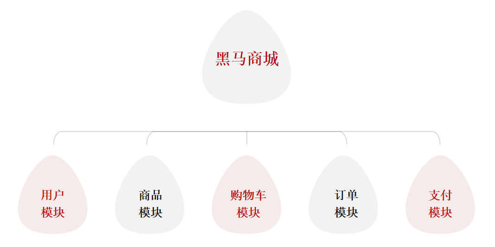

# 服务拆分

服务拆分以黑马商城为例:



# 拆分原则

1. 什么时候拆分
2. 怎么拆分

## 什么时候拆分

- 创业型项目:先采用单体架构,快速开发,快速试错,随着规模扩大,逐渐拆分
- 确定的大型项目:资金充足,目标明确,可以直接选择微服务架构,避免后续拆分的麻烦

## 怎么拆分

1. 从拆分目标来说,要做到:
- **高内聚**:每个微服务的职责要尽量单一,包含的业务相互关联度高、完整度高
- **低耦合**:每个微服务的功能要相对独立,尽量减少对其它微服务的依赖

2. 从拆分方式来说,一般包含两种方式:
- **纵向拆分(垂直拆分)**:按照业务模块来拆分
- **横向拆分(水平拆分)**:抽取公共服务,提高复用性

# 工程结构

1. 独立Project


2. Maven聚合


# 拆分服务

需求:
1. 将hm-service中与商品管理相关功能拆分到一个微服务module中,命名为item-service
2. 将hm-service中与购物车管理相关的功能拆分到一个微服务module中,命名为cart-service
3. 将hm-service中与用户管理相关的功能拆分到一个微服务module中,命名为user-service
4. 将hm-service中与交易管理相关的功能拆分到一个微服务module中,命名为trade-service
5. 将hm-service中与支付管理相关的功能拆分到一个微服务module中,命名为pay-service

# 远程调用

服务拆分之后,不可避免的会出现跨微服务的业务,此时微服务之间就需要进行远程调用

**微服务之间的远程调用被称为RPC(Remote Process Call)**,即远程过程调用

RPC的实现方式有很多,比如:
- 基于Http协议
- 基于Dubbo协议

Spring提供了一个RestTemplate工具,可以方便的实现Http请求的发送

使用步骤:
1. 注入RestTemplate到Spring容器

```java
@Bean
public RestTemplate restTemplate(){
    return new RestTemplate();
}
```

2. 发起远程调用

调用RestTemplate的API发送请求,常见方法有:
- `getForObject`:发送Get请求并返回指定类型对象
- `PostForObject`:发送Post请求并返回指定类型对象
- `put`:发送PUT请求
- `delete`:发送Delete请求
- `exchange`:发送任意类型请求,返回ResponseEntity

```java
public <T> ResponseEntity<T> exchange(
	String url, // 请求路径
	HttpMethod method, // 请求方式
	@Nullable HttpEntity<?> requestEntity, // 请求实体,可以为空
 	Class<T> responseType, // 返回值类型
	Map<String, ?> uriVariables // 请求参数
)
```

返回值类型:**RestTemplate可以把JSON的字符值自动反序列化成对应的实体类**

## 范例

购物车cart中查询商品item的信息(根据id批量查询商品)

CartApplication中注入RestTemplate:

```java
package com.hmall.cart;

import org.mybatis.spring.annotation.MapperScan;
import org.springframework.boot.SpringApplication;
import org.springframework.boot.autoconfigure.SpringBootApplication;
import org.springframework.context.annotation.Bean;
import org.springframework.web.client.RestTemplate;

@MapperScan("com.hmall.cart.mapper")
@SpringBootApplication
public class CartApplication {
    public static void main(String[] args) {
        SpringApplication.run(CartApplication.class, args);
    }

    @Bean
    public RestTemplate restTemplate() {
        return new RestTemplate();
    }
}
```

CartServiceImpl中查询商品,利用RestTemplate发起http请求,得到http响应,再通过解析响应获得商品信息

```java
// 2.查询商品
// List<ItemDTO> items = itemService.queryItemByIds(itemIds);

// 利用RestTemplate发起http请求,得到http响应
ResponseEntity<List<ItemDTO>> response = restTemplate.exchange(
        "http://localhost:8081/items?ids={ids}",
        HttpMethod.GET,
        null,
        new ParameterizedTypeReference<List<ItemDTO>>() {
        },
        Map.of("ids", CollUtil.join(itemIds, ","))
);
// 解析响应
if (!response.getStatusCode().is2xxSuccessful()) {
    // 查询失败,直接结束
    return;
}
List<ItemDTO> items = response.getBody();
```