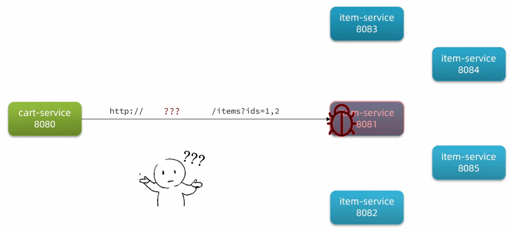
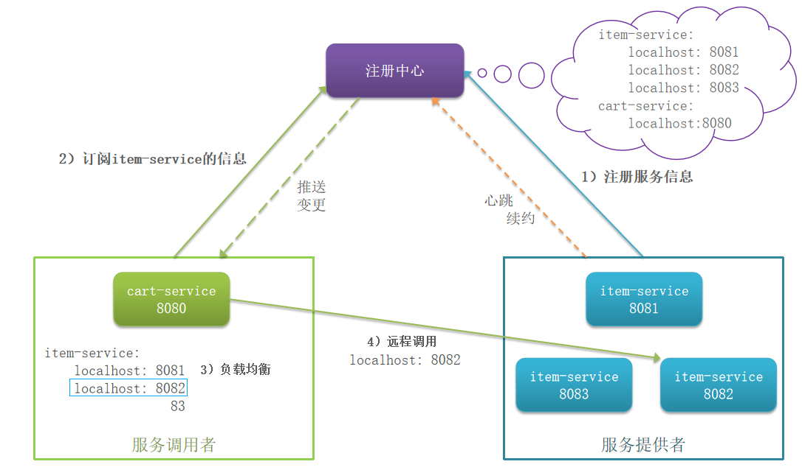
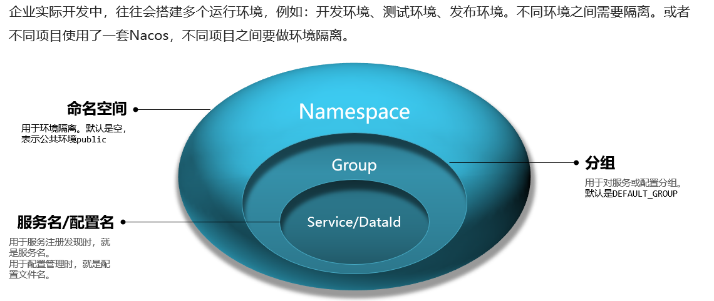
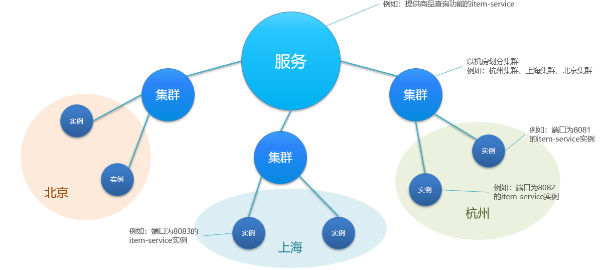
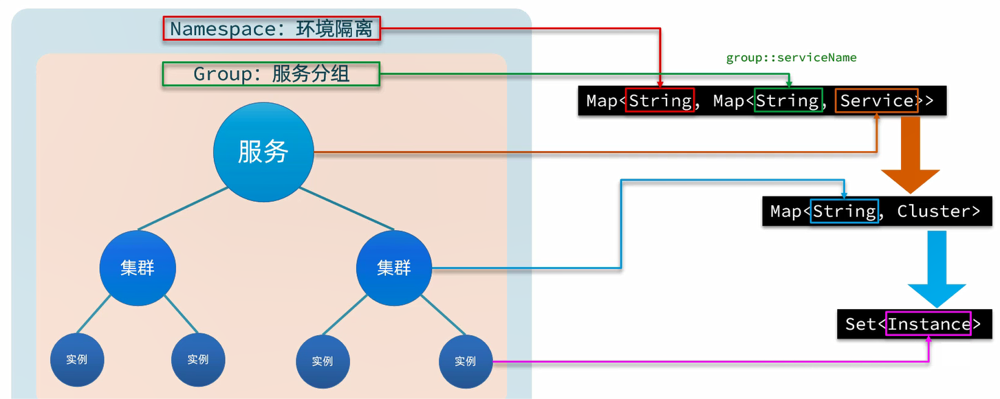
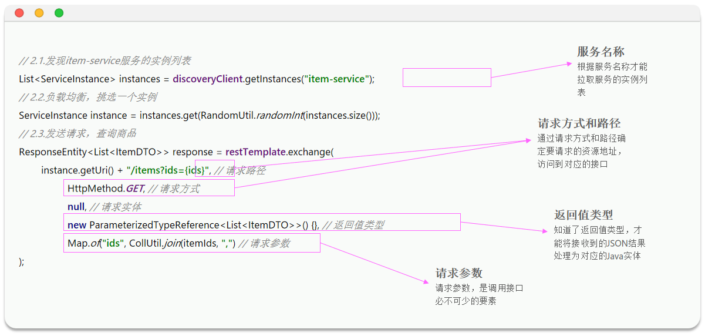
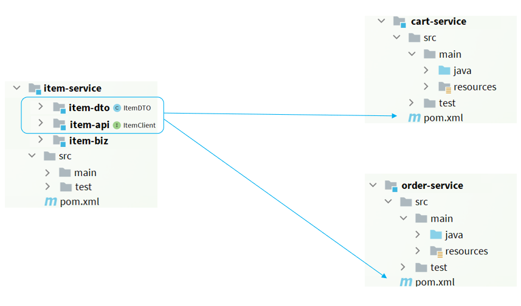
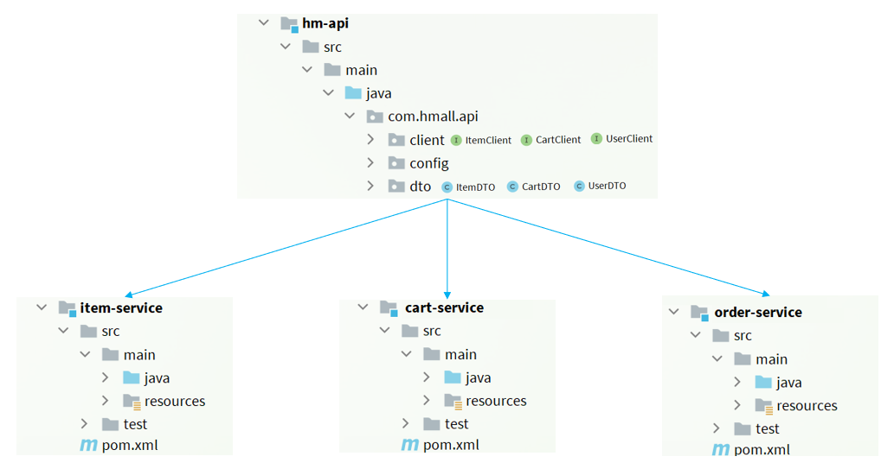
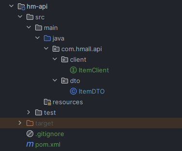

# 远程调用存在的问题(服务治理问题)

通过Http请求实现了跨微服务的远程调用,不过这种手动发送Http请求的方式存在一些问题

试想一下,假如商品微服务被调用较多,为了应对更高的并发,进行了多实例部署,如图:



此时,每个item-service的实例其IP或端口不同,问题来了:
- item-service这么多实例,cart-service如何知道每一个实例的地址?
- http请求要写url地址,cart-service服务到底该调用哪个实例呢?
- 如果在运行过程中,某一个item-service实例宕机,cart-service依然在调用该怎么办?
- 如果并发太高,item-service临时多部署了N台实例,cart-service如何知道新实例的地址?

# 注册中心原理



1. 服务治理中的三个角色分别是什么?                    
- 服务提供者:暴露服务接口,供其它服务调用
- 服务消费者:调用其它服务提供的接口
- 注册中心:记录并监控微服务各实例状态,推送服务变更信息

2. 消费者如何知道提供者的地址?                      
服务提供者会在启动时注册自己信息到注册中心,消费者可以从注册中心订阅和拉取服务信息

3. 消费者如何得知服务状态变更?                          
服务提供者通过心跳机制向注册中心报告自己的健康状态,当心跳异常时注册中心会将异常服务剔除,并通知订阅了该服务的消费者

4. 当提供者有多个实例时,消费者该选择哪一个?                         
消费者可以通过负载均衡算法,从多个实例中选择一个

# 注册中心

目前开源的注册中心框架有很多,国内比较常见的有:
- **Eureka**:Netflix公司出品,目前被集成在SpringCloud当中,一般用于Java应用
- **Nacos**:Alibaba公司出品,目前被集成在SpringCloudAlibaba中,一般用于Java应用
- **Consul**:HashiCorp公司出品,目前集成在SpringCloud中,不限制微服务语言

# Nacos

[Nacos官方网站](https://nacos.io/)

## 服务注册

1. 引入nacos discovery依赖

```xml
<!--nacos服务注册发现-->
<dependency>
    <groupId>com.alibaba.cloud</groupId>
    <artifactId>spring-cloud-starter-alibaba-nacos-discovery</artifactId>
</dependency>
```

2. 配置Nacos地址

application.yaml:

```yaml
server:
  cloud:
    nacos:
      discovery:
        server-addr: 192.168.149.127:8848
```

## 服务发现

消费者需要连接nacos以拉取和订阅服务,因此服务发现的前两步与服务注册是一样,后面再加上服务调用即可:

1. 引入nacos discovery依赖                        
... 

2. 配置nacos地址                    
... 

3. 服务发现                        

```java
private final DiscoveryClient discoveryClient;

private void handleCartItems(List<CartVO> vos) {
    // 1.根据服务名称,拉取服务的实例列表
    List<ServiceInstance> instances = discoveryClient.getInstances("item-service");
    // 2.随机负载均衡,挑选一个实例
    ServiceInstance instance = instances.get(RandomUtil.randomInt(instances.size()));
    // 3.获取实例的IP和端口
    URI uri = instance.getUri();
    // ... 略
}
```

### 范例

CartServiceImpl中查询商品:

```java
// 获取商品id
Set<Long> itemIds = vos.stream().map(CartVO::getItemId).collect(Collectors.toSet());
// 2.查询商品
// List<ItemDTO> items = itemService.queryItemByIds(itemIds);
// 根据服务的名称获取服务的实例列表
List<ServiceInstance> instances = discoveryClient.getInstances("item-service");
if (CollUtil.isEmpty(instances)) {
    return;
}
// 负载均衡,从实例列表中挑选一个实例
ServiceInstance instance = instances.get(RandomUtil.randomInt(instances.size()));
// 利用RestTemplate发起http请求,得到http响应
ResponseEntity<List<ItemDTO>> response = restTemplate.exchange(
        instance.getUri() + "/items?ids={ids}",
        HttpMethod.GET,
        null,
        new ParameterizedTypeReference<List<ItemDTO>>() {
        },
        Map.of("ids", CollUtil.join(itemIds, ","))
);
// 解析响应
if (!response.getStatusCode().is2xxSuccessful()) {
    // 查询失败,直接结束
    return;
}
List<ItemDTO> items = response.getBody();

if (CollUtils.isEmpty(items)) {
    return;
}
```

## 环境隔离



在微服务中,可以通过配置文件指定当前服务所属的namespace,通过namespace隔离不同环境的服务

范例:通过bootstrap.yml修改item-service的服务到另一个命名空间

```yml
spring:
  application:
    name: item-service # 服务名称
  profiles:
    active: dev
  cloud:
    nacos:
      server-addr: 192.168.149.127 # nacos地址
      config: # 服务配置管理
        file-extension: yaml # 文件后缀名
        shared-configs: # 共享配置
          - dataId: shared-jdbc.yaml # 共享mybatis配置
          - dataId: shared-log.yaml # 共享日志配置
          - dataId: shared-swagger.yaml # 共享swagger配置
          - dataId: shared-sentinel.yaml # 共享sentinel配置
          - dataId: shared-seata.yaml # 共享seata配置
        namespace: "344f9499-c0a2-4d98-b004-66ae172aafd5" # 设置namespace命名空间,必须用id
      discovery: # 服务注册中心
        namespace: "344f9499-c0a2-4d98-b004-66ae172aafd5" # 设置namespace命名空间,必须用id
```

其中,第一个命名空间是config下的,用于指定Nacos的配置中心,第二个命名空间是discovery下的,用于指定Nacos的服务注册中心

查看nacos控制台,会发现默认情况下所有服务的集群都是default

要修改服务所在集群,只需要修改bootstrap.yml即可

范例:通过bootstrap.yml修改item-service的集群为BJ

```yml
spring:
  application:
    name: item-service # 服务名称
  profiles:
    active: dev
  cloud:
    nacos:
      server-addr: 192.168.149.127 # nacos地址
      config: # 服务配置管理
        file-extension: yaml # 文件后缀名
        shared-configs: # 共享配置
          - dataId: shared-jdbc.yaml # 共享mybatis配置
          - dataId: shared-log.yaml # 共享日志配置
          - dataId: shared-swagger.yaml # 共享swagger配置
          - dataId: shared-sentinel.yaml # 共享sentinel配置
          - dataId: shared-seata.yaml # 共享seata配置
        namespace: "344f9499-c0a2-4d98-b004-66ae172aafd5" # 设置namespace命名空间,必须用id
      discovery: # 服务注册中心
        namespace: "344f9499-c0a2-4d98-b004-66ae172aafd5" # 设置namespace命名空间,必须用id
        cluster-name: BJ # 集群名称,自定义
```

## 分级模型

大厂的服务可能部署在多个不同机房,物理上被隔离为多个集群,Nacos支持对于这种集群的划分





首先最外层是一个Map,结构为:`Map<String, Map<String, Service>>`:

- key:是namespace_id,起到环境隔离的作用,namespace下可以有多个group
- value:又是一个`Map<String, Service>`,代表分组及组内的服务,一个组内可以有多个服务
  - key:代表group分组,不过作为key时格式是group_name:service_name
  - value:分组下的某一个服务,例如userservice,用户服务,类型为`Service`,内部也包含一个`Map<String,Cluster>`,一个服务下可以有多个集群
    - key:集群名称
    - value:`Cluster`类型,包含集群的具体信息,一个集群中可能包含多个实例,也就是具体的节点信息,其中包含一个`Set<Instance>`,就是该集群下的实例的集合
      - Instance:实例信息,包含实例的IP、Port、健康状态、权重等等信息

## Eureka和Nacos

Eureka是Netflix公司开源的一个服务注册中心组件,早期版本的SpringCloud都是使用Eureka作为注册中心

由于Eureka和Nacos的starter中提供的功能都是基于SpringCloudCommon规范,因此两者使用起来差别不大


Nacos与eureka的共同点:
- 都支持服务注册和服务拉取
- 都支持服务提供者心跳方式做健康检测

Nacos与Eureka的区别:
- Nacos支持服务端主动检测提供者状态:临时实例采用心跳模式,非临时实例采用主动检测模式
- 临时实例心跳不正常会被剔除,非临时实例则不会被剔除
- Nacos支持服务列表变更的消息推送模式,服务列表更新更及时
- Nacos集群默认采用AP方式,但也支持CP;Eureka采用AP方式

# OpenFeign

OpenFeign是一个声明式的http客户端,是SpringCloud在Eureka公司开源的Feign基础上改造而来,其作用就是基于SpringMVC的常见注解,优雅的实现http请求的发送

[OpenFeign官方地址](https://github.com/OpenFeign/feign)



## 快速入门

1. 引入依赖,包括OpenFeign和负载均衡组件SpringCloudLoadBalancer

```xml
<!--openFeign-->
<dependency>
    <groupId>org.springframework.cloud</groupId>
    <artifactId>spring-cloud-starter-openfeign</artifactId>
</dependency>
<!--负载均衡-->
<dependency>
    <groupId>org.springframework.cloud</groupId>
    <artifactId>spring-cloud-starter-loadbalancer</artifactId>
</dependency>
```

2. 通过`@EnableFeignClients`注解,启用OpenFeign功能

```java
@EnableFeignClients
@SpringBootApplication
public class CartApplication { 
    ... 
}
```

3. 编写FeignClient

```java
@FeignClient(value = "item-service")
public interface ItemClient {
    @GetMapping("/items")
    List<ItemDTO> queryItemByIds(@RequestParam("ids") Collection<Long> ids);
}
```

4. 使用FeignClient,实现远程调用

```java
...
List<ItemDTO> items = itemClient.queryItemByIds(itemIds);
...
```

## 连接池

OpenFeign对Http请求做了优雅的伪装,不过其底层发起http请求,依赖于其它的框架

这些框架可以自己选择,包括以下三种:
- **HttpURLConnection**:默认实现,不支持连接池
- **Apache HttpClient**:支持连接池
- **OKHttp**:支持连接池

具体源码可以参考FeignBlockingLoadBalancerClient类中的delegate成员变量

### OKHttp

1. 引入依赖

```xml
<!--OKHttp-->
<dependency>
    <groupId>io.github.openfeign</groupId>
    <artifactId>feign-okhttp</artifactId>
</dependency>
```

2. 开启连接池功能

```yaml
feign:
  okhttp:
    enabled: true # 开启OKHttp连接池支持
```

## 最佳实践

实践思路:
- 实践思路1:抽取到微服务之外的公共module
- 实践思路2:每个微服务自己抽取一个module

**实践1抽取更加简单,工程结构也比较清晰,但缺点是整个项目耦合度偏高**                          
**实践2抽取相对麻烦,工程结构相对更复杂,但服务之间耦合度降低**    


实践1:



实践2:



### 实践2

1. 在hmall下定义一个新的module,命名为hm-api

hm-api的pom.xml中:

```xml
<dependencies>
    <!--openFeign-->
    <dependency>
        <groupId>org.springframework.cloud</groupId>
        <artifactId>spring-cloud-starter-openfeign</artifactId>
    </dependency>
    <!--负载均衡器-->
    <dependency>
        <groupId>org.springframework.cloud</groupId>
        <artifactId>spring-cloud-starter-loadbalancer</artifactId>
    </dependency>
    <!--swagger-->
    <dependency>
        <groupId>io.swagger</groupId>
        <artifactId>swagger-annotations</artifactId>
        <version>1.6.6</version>
        <scope>compile</scope>
    </dependency>
</dependencies>
```

2. 把ItemDTO和ItemClient都拷贝到hm-api中(修改导包),结构如下:



3. 在cart-service中引入hm-api模块,删除cart-service中原来的ItemDTO和ItemClient

cart-service的pom.xml中:

```xml
<!--hm-api-->
<dependency>
    <groupId>com.heima</groupId>
    <artifactId>hm-api</artifactId>
    <version>1.0.0</version>
</dependency>
```

4. 在cart-service的启动类上添加声明以扫描到ItemClient

原因:ItemClient现在定义到了com.hmall.api.client包下,而cart-service的启动类定义在com.hmall.cart包下,扫描不到ItemClient

有两种方式添加声明:

第一种方式:声明扫描包

```java
@MapperScan("com.hmall.cart.mapper")
@SpringBootApplication
@EnableFeignClients(basePackages = "com.hmall.api.client")
public class CartApplication {
    public static void main(String[] args) {
        SpringApplication.run(CartApplication.class, args);
    }
}
```

第二种方式:声明要用的FeignClient

```java
@MapperScan("com.hmall.cart.mapper")
@SpringBootApplication
@EnableFeignClients(clients = {com.hmall.api.client.ItemClient.class})
public class CartApplication {
    public static void main(String[] args) {
        SpringApplication.run(CartApplication.class, args);
    }
}
```

## 日志

OpenFeign只会在FeignClient所在包的日志级别为**DEBUG**时,才会输出日志(**建议调试时开启**),而且其日志级别有4级:

- **NONE**:不记录任何日志信息,这是默认值,
- **BASIC**:仅记录请求的方法,URL以及响应状态码和执行时间
- **HEADERS**:在BASIC的基础上,额外记录了请求和响应的头信息
- **FULL**:记录所有请求和响应的明细,包括头信息、请求体、元数据

由于Feign默认的日志级别就是NONE,所以默认看不到请求日志

### 自定义日志级别

要自定义日志级别,需要声明一个类型为Logger.Level的Bean,在其中定义日志级别

- **局部生效**:在某个FeignClient中配置,只对当前FeignClient生效

```java
@FeignClient(value = "item-service", configuration = DefaultFeignConfig.class)
```

- **全局生效**:在启动类的`@EnableFeignClients`中配置,针对所有FeignClient生效

```java
@EnableFeignClients(defaultConfiguration = DefaultFeignConfig.class)
```