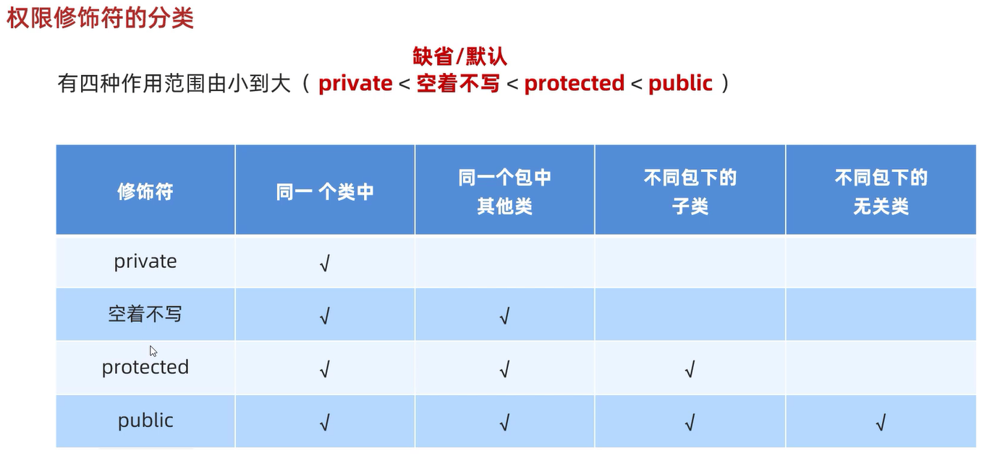

# 权限修饰符

用来控制一个成员能够被访问的范围  
可以修饰成员变量、方法、构造方法、内部类  



1. private: 只能在同一个类中被访问

范例: 

```java
package demo1;

public class Animal {
    private String name;

    public void show() {
        // 打印结果:"null"
        System.out.println(name);
    }
}
```

2. 空着不写: 能在同一个类中、在同一个包的其他类中被访问

范例: 

```java
package demo1;

public class Animal {
    String name;

    public void show() {
        // 打印结果:"null"
        System.out.println(name);
    }
}
```

```java
package demo1;

public class Test {
    public static void main(String[] args) {
        Animal a = new Animal();
        // 打印结果:"null"
        System.out.println(a.name);
    }
}
```

3. protected: 能在同一个类中、在同一个包的其他类中、不同包下的子类中被访问

范例: 

```java
package demo1;

public class Animal {
    protected String name;

    public void show() {
        // 打印结果:"null"
        System.out.println(name);
    }
}
```

```java
package demo1;

public class Test {
    public static void main(String[] args) {
        Animal a = new Animal();
        // 打印结果:"null"
        System.out.println(a.name);
    }
}
```

```java
package demo2;

import demo1.Animal;

public class Dog extends Animal {
    public void show(){
        // 打印结果:"null"
        System.out.println(name);
    }
}
```

4. public: 能在同一个类中、在同一个包的其他类中、不同包下的子类、不同包下的无关类中被访问

范例: 

```java
package demo1;

public class Animal {
    public String name;

    public void show() {
        // 打印结果:"null"
        System.out.println(name);
    }
}
```

```java
package demo1;

public class Test {
    public static void main(String[] args) {
        Animal a = new Animal();
        // 打印结果:"null"
        System.out.println(a.name);
    }
}
```

```java
package demo2;

import demo1.Animal;

public class Dog extends Animal {
    public void show(){
        // 打印结果:"null"
        System.out.println(name);
    }
}
```

```java
package demo2;

import demo1.Animal;

public class Test {
    public static void main(String[] args) {
        Animal a = new Animal();
        System.out.println(a.name);
    }
}
```

## 使用规则

实际开发中,一般只用private和public  
**成员变量私有**  
**方法公开**  
**特例**: 如果方法中的代码是抽取其他方法中的共性代码,这个方法一般也私有  

# 代码块

## 局部代码块

写在方法里的代码块  

作用: 提前结束变量的生命周期

范例: 

```java
public class Test {
    public static void main(String[] args) {
        {
           int a = 10;
        }
        // 代码执行到这里时,变量a就从内存里消失
        // `System.out.println(a);`报错
    }
}
```

## 构造代码块

写在方法外、类里面的代码块(即写在成员位置的代码块)  

作用: 可以把多个构造方法中重复的代码抽取出来  

执行时机: 在创建本类对象的时候,会优先执行构造代码块,再执行构造方法  
即构造代码块优先于构造方法而执行,**创建一次执行一次**  

范例: 

```java
public class Student {
    private String name;
    private int age;

    {
        System.out.println("开始创建对象了");
    }

    public Student() {
        System.out.println("空参构造");
    }

    public Student(String name,int age) {
        System.out.println("带参构造");
        this.name = name;
        this.age = age;
    }

    public String getName() {
        return name;
    }

    public void setName(String name) {
        this.name = name;
    }

    public int getAge() {
        return age;
    }

    public void setAge(int age) {
        this.age = age;
    }
}
```

```java
public class StudentTest {
    public static void main(String[] args) {
        // 打印结果:"开始创建对象了"
        // 打印结果:"空参构造"
        Student student1 = new Student();
        // 打印结果:"开始创建对象了"
        // 打印结果:"带参构造"
        Student student2 = new Student("张三",23);
    }
}
```

## 新的构造代码块的方式

以上构造代码块的方式已经渐渐淘汰,因为不够灵活: 构造代码块先于所有的构造方法而执行  
为解决有的构造方法需要重复代码,而有的构造方法不需要重复的代码  

### 第一种方式

将重复的代码写在一个构造方法中,在其他需要用到重复代码的构造方法中  
通过this关键字来调用本类的其他构造  

范例: 

```java
public class Student {
    private String name;
    private int age;

    public Student() {
        // 调用带全部参数的构造方法
        this(null,0);
    }

    public Student(String name,int age) {
        System.out.println("开始创建对象了");
        this.name = name;
        this.age = age;
    }

    public Student(String name) {
        System.out.println("只有一个参数的构造");
    }

    public String getName() {
        return name;
    }

    public void setName(String name) {
        this.name = name;
    }

    public int getAge() {
        return age;
    }

    public void setAge(int age) {
        this.age = age;
    }
}
```

```java
public class StudentTest {
    public static void main(String[] args) {
        // 打印结果:"开始创建对象了"
        Student student1 = new Student();
        // 打印结果:"开始创建对象了"
        Student student2 = new Student("张三",23);
        // 打印结果:"只有一个参数的构造"
        Student student3 = new Student("张三");
    }
}
```

### 第二种方式

将重复的代码抽取成一个方法,在需要重复代码的构造方法中调用这个方法  

范例: 

```java
public class Student {
    private String name;
    private int age;

    public Student() {
        // 调用方法
        code();
        System.out.println("无参构造");
    }

    public Student(String name,int age) {
        // 调用方法
        code();
        System.out.println("带全部参数的构造");
        this.name = name;
        this.age = age;
    }

    public Student(String name) {
        System.out.println("只有一个参数的构造");
    }

    // 将重复的代码抽取成一个方法
    public static void code() {
        System.out.println("开始创建对象了");
    }

    public String getName() {
        return name;
    }

    public void setName(String name) {
        this.name = name;
    }

    public int getAge() {
        return age;
    }

    public void setAge(int age) {
        this.age = age;
    }
}
```

```java
public class StudentTest {
    public static void main(String[] args) {
        // 打印结果:"开始创建对象了"
        // 打印结果:"无参构造"
        Student student1 = new Student();
        // 打印结果:"开始创建对象了"
        // 打印结果:"带全部参数的构造"
        Student student2 = new Student("张三",23);
        // 打印结果:"只有一个参数的构造"
        Student student3 = new Student("张三");
    }
}
```

## 静态代码块

加上static修饰的代码块    

格式: `static{}`  

特点: 需要通过static关键字修饰,随着类的加载而加载,并且自动触发、**只执行一次**  

使用场景: 在类加载的时候,做一些数据初始化的时候使用  

范例: 

```java
public class Student {
    private String name;
    private int age;

    // 执行时机: 随着类的加载而加载,并且自动触发、只执行一次
    static {
        System.out.println("静态代码块执行了");
    }

    public Student() {
        System.out.println("无参构造");
    }

    public Student(String name,int age) {
        System.out.println("带全部参数的构造");
        this.name = name;
        this.age = age;
    }

    public Student(String name) {
        System.out.println("只有一个参数的构造");
    }

    public String getName() {
        return name;
    }

    public void setName(String name) {
        this.name = name;
    }

    public int getAge() {
        return age;
    }

    public void setAge(int age) {
        this.age = age;
    }
}
```

```java
public class StudentTest {
    public static void main(String[] args) {
        // 打印结果:"静态代码块执行了"
        // 打印结果:"无参构造"
        Student student1 = new Student();
        // 打印结果:"带全部参数的构造"
        Student student2 = new Student("张三",23);
        // 打印结果:"只有一个参数的构造"
        Student student3 = new Student("张三");
    }
}
```

练习: 

将学生管理系统中存入一些初始用户数据

```java
import java.util.ArrayList;
import java.util.Random;
import java.util.Scanner;

public class StudentSystem {
    ArrayList<User> list = new ArrayList<>();

    // 用户初始化
    static {
        list.add(new User("admin01","123","321283200102055410","15195209909"));
    }

    // 主菜单
    public static void main(String[] args) {
        user();
    }

    // 学生管理系统登录界面
    public static void user() {
        Scanner scanner = new Scanner(System.in);
        while (true) {
            System.out.println("---------------------");
            System.out.println("| 学生管理系统登录界面\t|");
            System.out.println("|\t  1: 用户注册\t|");
            System.out.println("|\t  2: 用户登录\t|");
            System.out.println("|\t  3: 忘记密码\t|");
            System.out.println("|\t  4: 退出系统\t|");
            System.out.println("---------------------");
            System.out.print("请输入您的选择: ");
            String choose = scanner.next();
            switch (choose) {
                case "1" -> userRegistration(list);
                case "2" -> userLogin(list);
                case "3" -> forgetPassword(list);
                case "4" -> System.exit(0);
                default -> System.out.println("没有这个选项,请重新输入!");
            }
        }
    }
    ...
}
```

相比于直接在方法中初始化用户的方式(如下),通过静态代码块进行初始化用户  
可以避免main()方法被调用时,重复添加用户数据  

```java
import java.util.ArrayList;
import java.util.Random;
import java.util.Scanner;

public class StudentSystem {
    // 主菜单
    public static void main(String[] args) {
        user();
    }

    // 学生管理系统登录界面
    public static void user() {
        Scanner scanner = new Scanner(System.in);
        // 用户初始化
        ArrayList<User> list = new ArrayList<>();
        User user1 = new User("admin01","123","321283200102055410","15195209909");
        User user2 = new User("admin02","123","321283200102055410","15195209909");
        list.add(user1);
        list.add(user2);
       
        while (true) {
            System.out.println("---------------------");
            System.out.println("| 学生管理系统登录界面\t|");
            System.out.println("|\t  1: 用户注册\t|");
            System.out.println("|\t  2: 用户登录\t|");
            System.out.println("|\t  3: 忘记密码\t|");
            System.out.println("|\t  4: 退出系统\t|");
            System.out.println("---------------------");
            System.out.print("请输入您的选择: ");
            String choose = scanner.next();
            switch (choose) {
                case "1" -> userRegistration(list);
                case "2" -> userLogin(list);
                case "3" -> forgetPassword(list);
                case "4" -> System.exit(0);
                default -> System.out.println("没有这个选项,请重新输入!");
            }
        }
    }
    ...
}
```