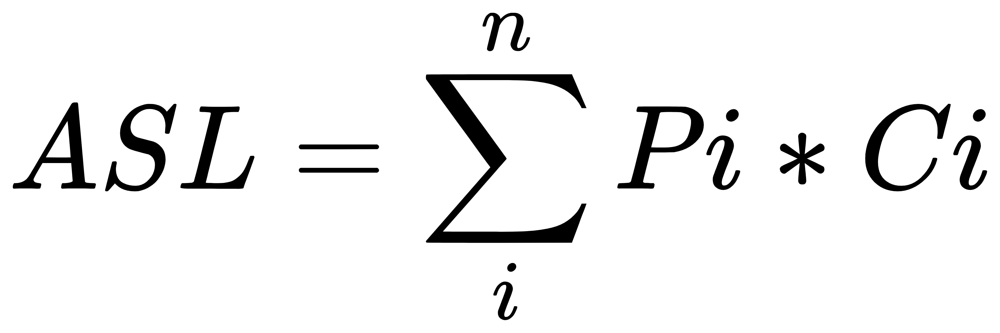

# 基本概念

## 查找表      

由同一类型的数据元素构成的集合,由于数据元素之间存在着完全松散的关系,因此查找表是一种非常灵活的结构,可以利用任意数据结构实现

## 关键字     

数据元素的某个数据项的值,用它可以标识查找表中一个或一组数据元素,如果一个关键字可以唯一标识查找表中的一个数据元素,则称其为主关键字,否则为次关键字,当数据元素仅有一个数据项时,其关键字即为该数据元素的值

## 查找

根据给定的关键字值,在查找表中确定一个关键字与给定值相同的数据元素,并返回该数据元素在查找表中的位置,若找到相应数据元素,则称查找成功,否则称查找失败,此时返回空地址

## 平均查找长度 

为确定数据元素在查找表中的位置,需要和给定的值进行比较的关键字个数的期望值,称为查找算法在查找成功时的平均查找长度

平均查找长度: Average Search Length(简称: ASL)

对于含有n个数据元素的查找表,查找成功的平均查找长度为:     
      
Pi: 查找表中第i个数据元素的概率     　    
Ci: 找到第i个数据元素时已经比较过的次数   

# 分类

查找算法有两种分类方式:    

1. 静态查找和动态查找    
- 静态查找: 只做查找操作的查找表   
a.查询某个"特定的"数据元素是否在表中    
b.检索某个"特定的"数据元素和各种属性    
- 动态查找: 在查找中同时进行插入或删除等操作   

2. 无序查找和有序查找       
- 无序查找: 被查找数列有序无序均可
- 有序查找: 被查找数列必须为有序数列    