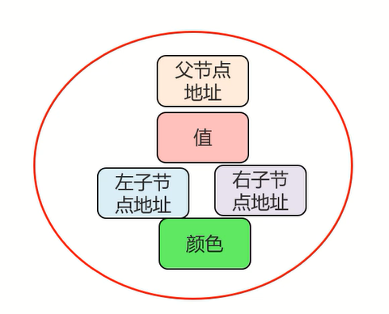
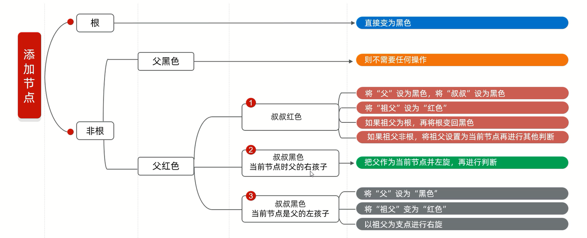

# 树

结点: 

树的相关概念: 

# 二叉树

# 二叉查找树

二叉查找树又被称为二叉排序树/二叉搜索树

## 添加结点 

## 查找结点

和添加结点异曲同工,满足规则: 
1. 小的查左边
2. 大的查右边

## 遍历结点

1. **前序遍历**: 从根结点开始,然后按照**当前结点,左子结点,右子结点**的顺序遍历            
例如: 20 --> 18 --> 16 --> 19 --> 23 --> 22 --> 24
2. **中序遍历**: 从最左边的子结点开始,然后按照**左子结点,当前结点,右子结点**的顺序遍历                  
例如: 16 --> 18 --> 19 --> 20 --> 22 --> 23 --> 24
3. **后序遍历**: 从最左边的子结点开始,然后按照**左子结点,右子结点,当前结点**的顺序遍历      
例如: 16 --> 19 --> 18 --> 22 --> 24 --> 23 --> 20               
4. **层序遍历**: 从根结点开始,**一层一层的遍历**          
例如: 20 --> 18 --> 23 --> 16 --> 19 --> 22 --> 24      

## 弊端

例如二叉查找树添加结点: 7,10,11,12,13,会出现以下情况:              

而树的左右子结点高度差不多的时候,二叉树的效率才高            

# 平衡二叉树

平衡二叉树是高度平衡的

在二叉查找树的基础上,再增加一个规则: **任意结点左右子树高度差不超过1**  

## 旋转机制

触发时机: 当添加一个结点之后,该树不再是一颗平衡二叉树   

1. 左旋 
2. 右旋 

## 左旋

简单范例: 

复杂范例 :

## 右旋

简单范例: 

复杂范例 :

## 需要旋转的四种情况

1. 左左 -- **一次右旋**
2. 左右 -- **先局部左旋,再整体右旋**
3. 右右 -- **一次左旋**
4. 右左 -- **先局部右旋,再整体左旋**

## 左左

右旋1次: 

## 左右

先局部左旋1次: 

再整体右旋1次: 

## 右右

左旋1次: 

## 右左

先局部右旋1次: 

再整体左旋1次: 

# 红黑树

红黑树是一种自平衡的二叉查找树,是计算机科学中用到的一种数据结构

红黑树是一种特殊的二叉查找树,红黑树的每一个结点上都有存储位表示结点的颜色

**每一个结点可以是红或者黑**;红黑树**不是高度平衡的**,它的平衡是通过"**红黑规则**"进行实现的

二叉树缺点:**大数据量的情况下,层级较深,检索速度慢**

## 红黑规则   

1. 每一个结点或是红色的,或是黑色的
2. 根结点必须是黑色
3. 如果一个结点没有子结点或者父结点,则该结点相应的指针属性值为Nil,这些Nil视为叶结点,每个叶结点(Nil)是黑色的

4. 如果某一个结点是红色,那么它的子结点必须是黑色的(不能不出现两个红色结点相连的情况)
5. 对每一个结点,从该结点到其所有后代结点的简单路径上,均包含相同数目的黑色结点

## 添加结点的规则

默认颜色:添加结点默认是红色的(效率高)

**红黑树增删改查的性能都很好**

# B树

B树的搜索,从根结点开始,对结点内的关键字(有序)序列进行二分查找              
如果命中则结束,否则进入查询关键字所属范围的子结点,重复直到其所对应的子结点指针为空,或已经是叶子结点

3阶B树:

B树,每个结点存储M/2到M个关键字,非叶子结点存储指向关键字范围的子结点,所有关键字在整颗树中出现,且只出现一次,非叶子结点可以命中

## 定义

一棵m阶B树是一棵平衡的m路搜索树,它或者是空树,或者是满足下列性质的树:
1. 根结点至少有2个子结点
2. 每个非根结点所包含的关键字个数j满足:┌m/2┐-1 <= j <= m-1
3. 除根结点以外的所有结点(不包括叶子结点)的度数正好是关键字总数加1,故内部子结点个数k满足:┌m/2┐ <= k <= m
4. 所有的叶子结点都位于同一层

## 特点

1. 定义任意非叶子结点最多只有M个儿子,且M>2
2. 根结点的子结点数为[2,M]
3. 除根结点以外的非叶子结点的子结点数为[M/2,M]
4. 每个结点存放至少M/2-1(取上整)和至多M-1个关键字(至少2个关键字)
5. 非叶子结点的关键字个数=指向其子结点的指针个数-1
6. 非叶子结点的关键字:K[1], K[2], …, K[M-1],且K[i] < K[i+1]
7. 非叶子结点的指针:P[1], P[2], …, P[M],其中P[1]指向关键字小于K[1]的子结点,P[M]指向关键字大于K[M-1]的子结点,其它P[i]指向关键字属于(K[i-1], K[i])的子结点
8. 所有叶子结点位于同一层

# B+树

B+树是应文件系统所需而出的一种B树的变型树          

一棵m阶的B+树和m阶的B树的差异在于:
1. **有n个子结点的结点中含有n个关键字,每个关键字不保存数据,只用来索引,所有数据都保存在叶子结点**
2. 所有的叶子结点中包含了全部关键字的信息,及指向含这些关键字记录的指针,且叶子结点本身依关键字的大小,自小而大的顺序链接
3. 所有的非终端结点可以看成是索引部分,结点中仅含其子树(根结点)中的最大(或最小)关键字,通常在B+树上有两个头指针,一个指向根结点,一个指向关键字最小的叶子结点

3阶B+树:

在B树基础上,为叶子结点增加链表指针,所有关键字都在叶子结点中出现,非叶子结点作为叶子结点的索引,B+树总是到叶子结点才命中