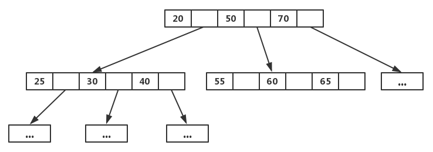
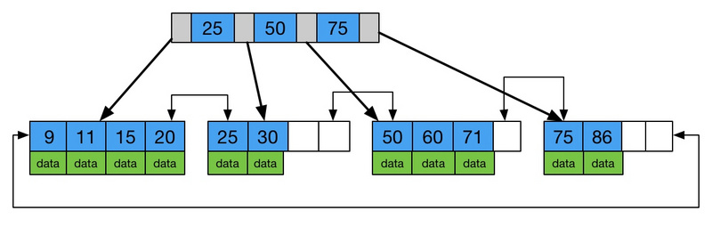
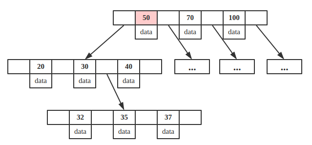
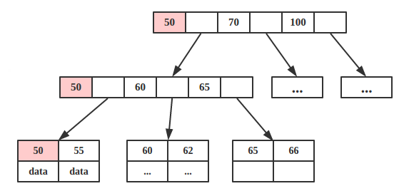

# 树

结点: 

树的相关概念: 

# 二叉树

# 二叉查找树

二叉查找树又被称为二叉排序树/二叉搜索树

## 添加结点 

## 查找结点

和添加结点异曲同工,满足规则: 
1. 小的查左边
2. 大的查右边

## 遍历结点

1. **前序遍历**: 从根结点开始,然后按照**当前结点,左子结点,右子结点**的顺序遍历            
例如: 20 --> 18 --> 16 --> 19 --> 23 --> 22 --> 24
2. **中序遍历**: 从最左边的子结点开始,然后按照**左子结点,当前结点,右子结点**的顺序遍历                  
例如: 16 --> 18 --> 19 --> 20 --> 22 --> 23 --> 24
3. **后序遍历**: 从最左边的子结点开始,然后按照**左子结点,右子结点,当前结点**的顺序遍历      
例如: 16 --> 19 --> 18 --> 22 --> 24 --> 23 --> 20               
4. **层序遍历**: 从根结点开始,**一层一层的遍历**          
例如: 20 --> 18 --> 23 --> 16 --> 19 --> 22 --> 24      

## 弊端

例如二叉查找树添加结点: 7,10,11,12,13,会出现以下情况:              

而树的左右子结点高度差不多的时候,二叉树的效率才高            

# 平衡二叉树

平衡二叉树是高度平衡的

在二叉查找树的基础上,再增加一个规则: **任意结点左右子树高度差不超过1**  

## 旋转机制

触发时机: 当添加一个结点之后,该树不再是一颗平衡二叉树   

1. 左旋 
2. 右旋 

## 左旋

简单范例: 

复杂范例 :

## 右旋

简单范例: 

复杂范例 :

## 需要旋转的四种情况

1. 左左 -- **一次右旋**
2. 左右 -- **先局部左旋,再整体右旋**
3. 右右 -- **一次左旋**
4. 右左 -- **先局部右旋,再整体左旋**

## 左左

右旋1次: 

## 左右

先局部左旋1次: 

再整体右旋1次: 

## 右右

左旋1次: 

## 右左

先局部右旋1次: 

再整体左旋1次: 

# 红黑树

红黑树是一种自平衡的二叉查找树,是计算机科学中用到的一种数据结构

红黑树是一种特殊的二叉查找树,红黑树的每一个结点上都有存储位表示结点的颜色

**每一个结点可以是红或者黑**;红黑树**不是高度平衡的**,它的平衡是通过"**红黑规则**"进行实现的

二叉树缺点:**大数据量的情况下,层级较深,检索速度慢**

## 红黑规则   

1. 每一个结点或是红色的,或是黑色的
2. 根结点必须是黑色
3. 如果一个结点没有子结点或者父结点,则该结点相应的指针属性值为Nil,这些Nil视为叶结点,每个叶结点(Nil)是黑色的

4. 如果某一个结点是红色,那么它的子结点必须是黑色的(不能不出现两个红色结点相连的情况)
5. 对每一个结点,从该结点到其所有后代结点的简单路径上,均包含相同数目的黑色结点

## 添加结点的规则

默认颜色:添加结点默认是红色的(效率高)

**红黑树增删改查的性能都很好**

# B树

B树,这里的B表示balance(平衡的意思),B树是一种多路自平衡的搜索树(B树是一颗多路平衡查找树)             

它类似普通的平衡二叉树,不同的是**B树允许每个结点有更多的子结点**

范例:

特点:
1. 所有键值分布在整颗树中(索引值和具体data都在每个结点里)
2. 任何一个关键字出现且只出现在一个结点中
3. 搜索有可能在非叶子结点结束(最好情况O(1)就能找到数据)
4. 在关键字全集内做一次查找,性能逼近二分查找

B树是专门为外部存储器设计的,如磁盘,它对于读取和写入大块数据有良好的性能,所以一般被用在文件系统及数据库中

## B+树

B+树是B树的变体,也是一种多路搜索树

它与B树的不同之处在于:
1. 所有关键字存储在叶子结点出现,内部结点(非叶子结点并不存储真正的data)
2. 为所有叶子结点增加了一个链指针

因为内结点并不存储data,所以一般B+树的叶结点和内结点大小不同,而B树的每个结点大小一般是相同的,为一页

为了增加区间访问性,一般会对B+树做一些优化,如下图带顺序访问的B+树

范例:

## B树和B+树的区别

1. B+树内结点不存储数据,所有data存储在叶结点导致查询时间复杂度固定为O(log n),而B树查询时间复杂度不固定,与key在树中的位置有关,最好为O(1)

B树查询结点key为50的data:

key为50的结点就在第一层,B树只需要一次磁盘IO即可完成查找,所以说B树的查询最好时间复杂度是O(1)

B+树查询结点key为50的data:

由于B+树所有的data域都在根结点,所以查询key为50的结点必须从根结点索引到叶结点,时间复杂度固定为O(log n)

2. B+树叶结点两两相连可大大增加区间访问性,可使用在范围查询等,而B树每个结点key和data在一起,则无法区间查找

由于B+树的叶子结点的数据都是使用链表连接起来的,而且他们在磁盘里是顺序存储的,所以当读到某个值的时候,磁盘预读原理(空间局部性原理)就会提前把这些数据都读进内存,使得范围查询和排序都很快

3. B+树更适合外部存储,由于内结点无data域,每个结点能索引的范围更大更精确

由于B树的结点都存了key和data,而B+树只有叶子结点存data,非叶子结点都只是索引值,没有实际的数据,这就使B+树在一次IO里面,能读出的索引值更多,从而减少查询时候需要的IO次数