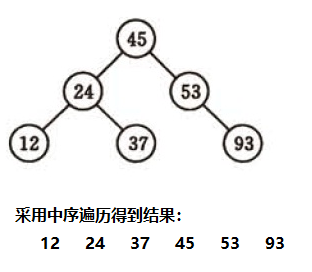

# 树表查找

基于树的查找方法是将待查表组织成特定的树结构,并在树结构的基础上实现查找的方法

基于二叉查找树进行优化,进而可以得到其他的树表查找算法,如平衡树、红黑树等高效算法不管是二叉查找树,还是平衡二叉树,还是红黑树,查找的性能都比较高

## 二叉查找树

二叉查找树(BinarySearch Tree),也叫二叉搜索树,或称二叉排序树(Binary Sort Tree)

## 性质

1. 若左子树不空,则左子树上所有结点的键值均小于或等于它的根结点的键值; 
2. 若右子树不空,则右子树上所有结点的键值均大于或等于它的根结点的键值; 
3. 左、右子树也分别为二叉树

## 中序遍历

二叉树中序遍历的方式: 左节点、根节点、右节点

 

# 基本思路

1. 对查找的数据进行生成树,确保树的左分支的值小于右分支的值
2. 和每个节点的父节点比较大小,查找最适合的范围

# 范例 

```java
public class BinaryTree {
    int value;
    BinaryTree left;
    BinaryTree right;
    public BinaryTree(int value) {
        this.value = value;
    }
}
```

```java
public class Test {
    public static void main(String[] args) {
        int[] array = {35,76,6,22,16,49,49,98,46,9,40};
        BinaryTree root = new BinaryTree(array[0]);
        for (int i = 1; i < array.length; i++) {
            createBST(root,array[i]);
        }
        System.out.println("中序遍历结果 ：");
        midOrderPrint(root);
        System.out.println();
        searchBST(root,22,null);
        searchBST(root,100,null);
    }

    // 创建二叉排序树
    public static void createBST(BinaryTree root,int element) {
        BinaryTree newNode = new BinaryTree(element);
        if (element > root.value) {
            if (root.right == null)
                root.right = newNode;
            else
                createBST(root.right,element);
        } else if (element < root.value) {
            if (root.left == null)
                root.left = newNode;
            else
                createBST(root.left,element);
        } else {
            System.out.println("该节点" + element + "已存在");
        }
    }

    // 二叉树中查找元素
    public static void searchBST(BinaryTree root,int target,BinaryTree p) {
        if (root == null) {
            System.out.println("查找" + target + "失败");
        } else if (root.value == target) {
            System.out.println("查找" + target + "成功");
        } else if (root.value >= target) {
            searchBST(root.left,target,root);
        } else {
            searchBST(root.right,target,root);
        }
    }

    // 二叉树的中序遍历
    public static void midOrderPrint(BinaryTree rt) {
        if (rt != null) {
            midOrderPrint(rt.left);
            System.out.print(rt.value + " ");
            midOrderPrint(rt.right);
        }
    }
}
```