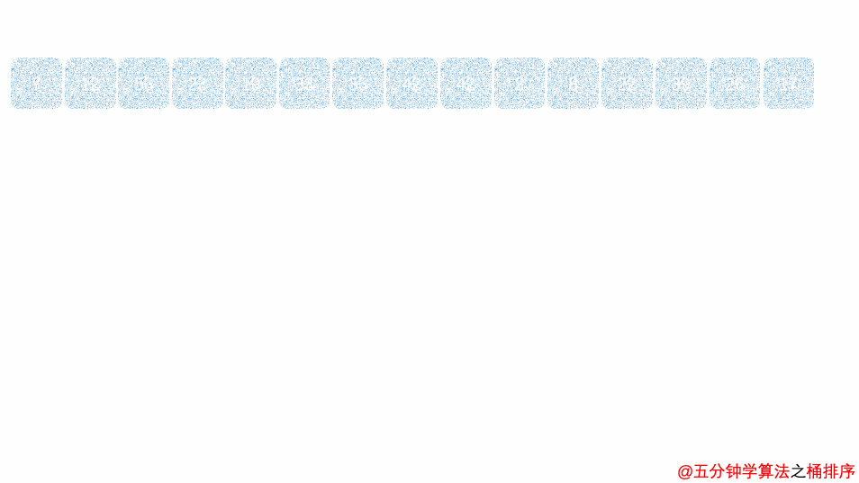

## 桶排序

桶排序(`Bucket Sort`)是一种线性排序算法         

它通过将要排序的元素分配到若干个桶中,对每个桶中的元素进行排序               
最后将每个桶中的元素按顺序依次收集起来,即可得到有序序列

## 基本思路

1. 首先确定桶的数量以及每个桶所对应的元素取值范围
2. 将要排序的元素逐个放入对应的桶中
3. 对每个桶中的元素进行排序(可以选择任意排序算法,如冒泡排序、插入排序等)
4. 将每个桶中的元素按顺序依次收集起来,即可得到有序序列

## 动图演示



## 范例 

```java
import java.util.ArrayList;
import java.util.Arrays;

public class Test {
    public static void main(String[] args) {
        int[] arr = {6,1,2,7,9,3,4,5,10,8};
        bucketSort(arr);
        printArr(arr);
    }

    public static void bucketSort(int[] arr) {
        int n = arr.length;

        //定义桶的数量
        int bucketNum = 5;

        //初始化桶
        ArrayList<Integer>[] buckets = new ArrayList[bucketNum];
        for (int i = 0; i < bucketNum; i++) {
            buckets[i] = new ArrayList<>();
        }

        //将每个元素放入对应的桶中
        for (int i = 0; i < n; i++) {
            int index = arr[i] / bucketNum;
            buckets[index].add(arr[i]);
        }

        //对每个桶中的元素进行排序,并将排序后的元素放回原数组
        int k = 0;
        for (int i = 0; i < bucketNum; i++) {
            int size = buckets[i].size();
            if (size > 0) {
                //如果桶中只有一个元素,则无需排序,直接放回原数组
                if (size == 1) {
                    arr[k++] = buckets[i].get(0);
                } else {
                    //对桶中的元素进行排序
                    int[] temp = new int[size];
                    for (int j = 0; j < size; j++) {
                        temp[j] = buckets[i].get(j);
                    }
                    Arrays.sort(temp);

                    //将排序后的元素放回原数组
                    for (int j = 0; j < size; j++) {
                        arr[k++] = temp[j];
                    }
                }
            }
        }
    }

    public static void printArr(int[] arr) {
        for (int i = 0; i < arr.length; i++) {
            System.out.print(arr[i] + " ");
        }
        System.out.println();
    }
}
```

## 复杂度

**时间复杂度 :**   
1. **最好情况: O(n+k)**    
2. **最坏情况: O(k)**    

**空间复杂度: O(n+k)**

## 特点总结

桶排序是不稳定排序