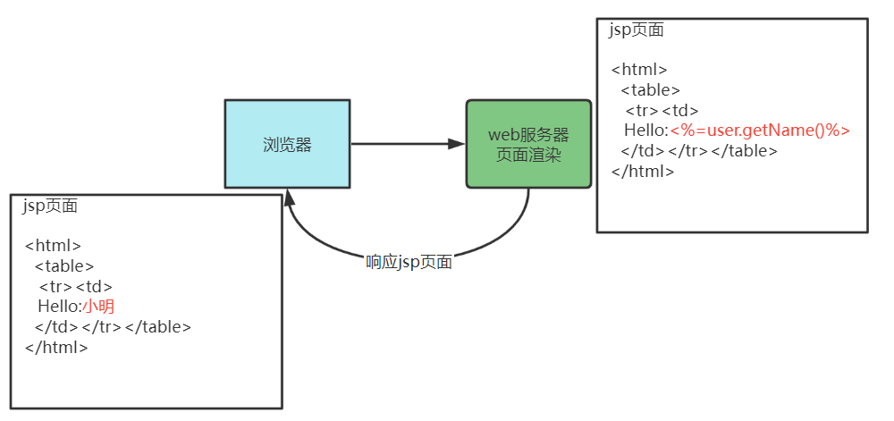

# 模板引擎

Jsp技术就是一种模板引擎技术,如下图:

1. 浏览器请求web服务器
2. 服务器渲染页面,渲染的过程就是向jsp页面(模板)内填充数据(模型)
3. 服务器将渲染生成的页面返回给浏览器

模板引擎就是:模板+数据=输出,Jsp页面就是模板,页面中嵌入的jsp标签就是数据,两者相结合输出html网页

常用的java模板引擎:Jsp、Freemarker、Thymeleaf、Velocity 

# Freemarker

[Freemarker官方网站](http://freemarker.foofun.cn/)

FreeMarker是一款模板引擎:即一种基于模板和要改变的数据,并用来生成输出文本(HTML网页,电子邮件,配置文件,源代码等)的通用工具

它不是面向最终用户的,而是一个Java类库,是一款程序员可以嵌入他们所开发产品的组件

