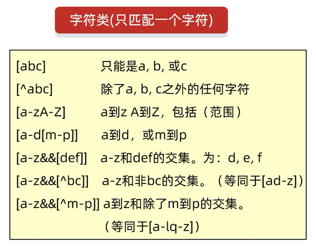
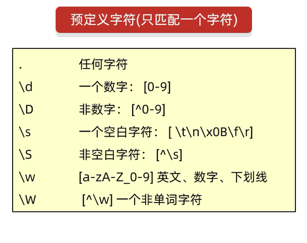
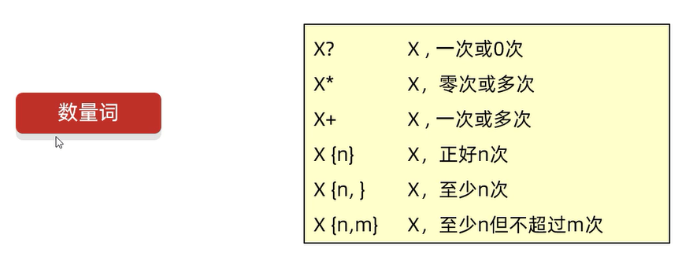
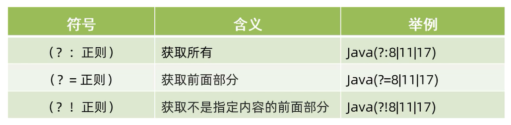
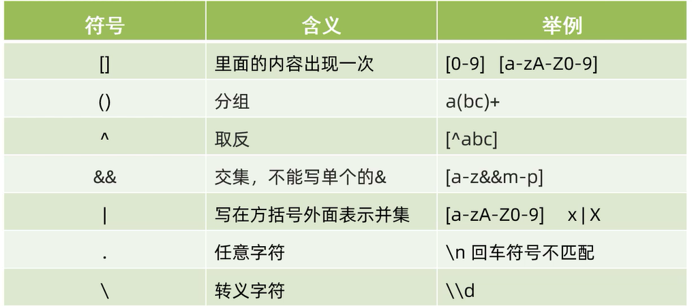
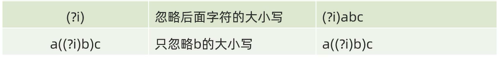
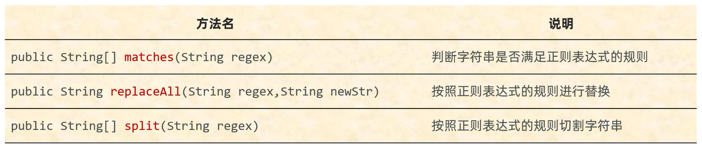

# 正则表达式

正则表达式可以校验字符串是否满足一定的规则,并用来校验数据格式的合法性     

细节: **编写正则表达式,拿着一个正确的数据,从左到右依次去写**

练习:      

校验QQ号码是否正确     

要求:        
1. 6位及20位以内    
2. 0不能在开头    
3. 必须全部是数字   

之前的知识点校验:       

```java
import java.util.Scanner;

public class Test {
    public static void main(String[] args) {
        Scanner sc = new Scanner(System.in);
        System.out.print("请输入一个QQ号: ");
        String qqNumber = sc.next();
        char[] arr = qqNumber.toCharArray();
        boolean result = arr.length >= 6 && arr.length <= 20 && arr[0] != '0' && isNumber(arr);
        if (result) {
            System.out.println("输入的QQ号码正确!");
        } else {
            System.out.println("输入的QQ号码不正确!");
        }
    }

    // 验证是否全部是数字
    public static boolean isNumber(char[] arr) {
        for (char c: arr) {
            if (c < '0' || c > '9') {
                return false;
            }
        }
        return true;
    }
}
```

正则表达式校验:       

```java
import java.util.Scanner;

public class Test {
    public static void main(String[] args) {
        Scanner sc = new Scanner(System.in);
        System.out.print("请输入一个QQ号: ");
        String qqNumber = sc.next();
        // 正则表达式: 第1个数字不为0,即"[1~9]"; 全部位数字,即"\\d"; 6位及20位以内,即"{5,19}"
        boolean result = qqNumber.matches("[1-9]\\d{5,19}");
        if (result) {
            System.out.println("输入的QQ号码正确!");
        } else {
            System.out.println("输入的QQ号码不正确!");
        }
    }
}
```

## 作用

1. 校验字符串是否满足规则     
2. 在一段文本中查找满足要求的内容

## 格式

## 字符类



范例:       

```java
public class Test {
    public static void main(String[] args) {
        System.out.println("----------------[abc]----------------");
        // 打印结果:"true"
        System.out.println("a".matches("[abc]"));
        // 打印结果:"false"
        System.out.println("z".matches("[abc]"));
        // 打印结果:"false"
        System.out.println("ab".matches("[abc]"));
        // 打印结果:"true"
        System.out.println("ab".matches("[abc][abc]"));

        System.out.println("----------------[^abc]----------------");
        // 打印结果:"false"
        System.out.println("a".matches("[^abc]"));
        // 打印结果:"true"
        System.out.println("z".matches("[^abc]"));
        // 打印结果:"false"
        System.out.println("ab".matches("[^abc]"));
        // 打印结果:"false"
        System.out.println("ab".matches("[^abc][^abc]"));

        System.out.println("----------------[a-zA-Z]----------------");
        // 打印结果:"true"
        System.out.println("a".matches("[a-zA-Z]"));
        // 打印结果:"true"
        System.out.println("z".matches("[a-zA-Z]"));
        // 打印结果:"false"
        System.out.println("ab".matches("[a-zA-Z]"));
        // 打印结果:"false"
        System.out.println("0".matches("[a-zA-Z]"));
        // 打印结果:"true"
        System.out.println("0".matches("[a-zA-Z0-9]"));
        // 打印结果:"true"
        System.out.println("ab".matches("[a-zA-Z][a-zA-Z]"));

        System.out.println("----------------[a-d[m-p]]----------------");
        // 打印结果:"true"
        System.out.println("a".matches("[a-d[m-p]]"));
        // 打印结果:"false"
        System.out.println("z".matches("[a-d[m-p]]"));
        // 打印结果:"false"
        System.out.println("ab".matches("[a-d[m-p]]"));
        // 打印结果:"true"
        System.out.println("ab".matches("[a-d[m-p]][a-d[m-p]]"));

        System.out.println("----------------[a-z&&[def]]----------------");
        // 打印结果:"true"
        System.out.println("d".matches("[a-z&&[def]]"));
        // 打印结果:"false"
        System.out.println("z".matches("[a-z&&[def]]"));
        // 打印结果:"false"
        System.out.println("ab".matches("[a-z&&[def]]"));
        // 打印结果:"true"
        System.out.println("ef".matches("[a-z&&[def]][a-z&&[def]]"));

        System.out.println("----------------[a-z&&[^bc]]----------------");
        // 打印结果:"true"
        System.out.println("d".matches("[a-z&&[^bc]]"));
        // 打印结果:"false"
        System.out.println("b".matches("[a-z&&[^bc]]"));
        // 打印结果:"false"
        System.out.println("ab".matches("[a-z&&[^bc]]"));
        // 打印结果:"true"
        System.out.println("ef".matches("[a-z&&[^bc]][a-z&&[^bc]]"));

        System.out.println("----------------[a-z&&[^m-p]]----------------");
        // 打印结果:"true"
        System.out.println("d".matches("[a-z&&[^m-p]]"));
        // 打印结果:"false"
        System.out.println("m".matches("[a-z&&[^m-p]]"));
        // 打印结果:"false"
        System.out.println("ab".matches("[a-z&&[^m-p]]"));
        // 打印结果:"true"
        System.out.println("ef".matches("[a-z&&[^m-p]][a-z&&[^m-p]]"));
    }
}
```

## 预定义字符



范例:      

```java
public class Test {
    public static void main(String[] args) {
        System.out.println("----------------.表示一个字符----------------");
        // 打印结果:"true"
        System.out.println("你".matches("."));
        // 打印结果:"false"
        System.out.println("你好!".matches(".."));

        System.out.println("----------------\\d表示一个数字[0-9]----------------");
        // 打印结果:"true"
        System.out.println("1".matches("\\d"));
        // 打印结果:"false"
        System.out.println("你".matches("\\d"));
        // 打印结果:"false"
        System.out.println("12".matches("\\d"));

        System.out.println("----------------\\D表示一个非数字[^0-9]----------------");
        // 打印结果:"true"
        System.out.println("你".matches("\\D"));
        // 打印结果:"false"
        System.out.println("1".matches("\\D"));
        // 打印结果:"false"
        System.out.println("12".matches("\\D"));

        System.out.println("----------------\\s表示一个空白字符----------------");
        // 打印结果:"true"
        System.out.println(" ".matches("\\s"));
        // 打印结果:"true"
        System.out.println("\t".matches("\\s"));
        // 打印结果:"true"
        System.out.println("\n".matches("\\s"));
        // 打印结果:"true"
        System.out.println("\f".matches("\\s"));
        // 打印结果:"true"
        System.out.println("\r".matches("\\s"));
        // 打印结果:"false"
        System.out.println("1".matches("\\s"));
        // 打印结果:"false"
        System.out.println("12".matches("\\s"));

        System.out.println("----------------\\S表示一个非空白字符[^\\s]----------------");
        // 打印结果:"true"
        System.out.println("1".matches("\\S"));
        // 打印结果:"false"
        System.out.println(" ".matches("\\S"));
        // 打印结果:"false"
        System.out.println("12".matches("\\S"));

        System.out.println("----------------\\w表示一个单词字符[a-zA-Z_0-9]----------------");
        // 打印结果:"true"
        System.out.println("a".matches("\\w"));
        // 打印结果:"true"
        System.out.println("0".matches("\\w"));
        // 打印结果:"true"
        System.out.println("_".matches("\\w"));
        // 打印结果:"false"
        System.out.println("你".matches("\\w"));
        // 打印结果:"false"
        System.out.println("aw".matches("\\w"));

        System.out.println("----------------\\W表示一个非单词字符[^\\w]----------------");
        // 打印结果:"true"
        System.out.println("!".matches("\\W"));
        // 打印结果:"false"
        System.out.println("a".matches("\\W"));
        // 打印结果:"true"
        System.out.println("你".matches("\\W"));
        // 打印结果:"false"
        System.out.println("aw".matches("\\W"));
    }
}
```

## 数量词



范例:      

```java
public class Test {
    public static void main(String[] args) {
        System.out.println("---------------X?----------------");
        // 打印结果:"false"
        System.out.println("1234SSS".matches("\\w?"));
        // 打印结果:"true"
        System.out.println("你".matches("\\W?"));

        System.out.println("----------------X*----------------");
        // 打印结果:"true"
        System.out.println("1234SSS".matches("\\w*"));
        // 打印结果:"true"
        System.out.println("你".matches("\\W*"));

        System.out.println("----------------X+----------------");
        // 打印结果:"true"
        System.out.println("1234SSS".matches("\\w+"));
        // 打印结果:"true"
        System.out.println("你".matches("\\W+"));

        System.out.println("----------------X{n}----------------");
        // 打印结果:"true"
        System.out.println("1234SSS".matches("\\w{7}"));
        // 打印结果:"false"
        System.out.println("你".matches("\\W{2}"));


        System.out.println("----------------X{n,}----------------");
        // 打印结果:"true"
        System.out.println("1234SSS".matches("\\w{6,}"));
        // 打印结果:"false"
        System.out.println("你好啊".matches("\\W{4,}"));

        System.out.println("----------------X{n,m}----------------");
        // 打印结果:"true"
        System.out.println("1234SSS".matches("\\w{6,7}"));
        // 打印结果:"true"
        System.out.println("你好啊".matches("\\W{1,3}"));
    }
}
```

## 分组

`()` -- 分组(默认是捕获分组)

细节: **每组是有组号的,也就是序号**
1. 从1开始,连续不间断
2. 以左括号为基准,最左边的是第一组,其次为第二组,以此类推

例如: `(\\d+(\\d)+)(\\d+)`中共有三个分组

### 捕获分组

后续还要继续使用本组的数据

格式: 
1. 正则内部使用: `\\组号` -- 表示组号的分组内容,再次出现
2. 正则外部使用: `组号` -- 表示把正则表达式中对应组号的分组内容,再拿出来用

练习:  

判断一个字符串的开始字符和结束字符是否一致?只考虑一个字符   
举例: a123a、b456b、17891、&abc&、a123b(false) 

```java
import java.util.Scanner;

public class Test {
    public static void main(String[] args) {
        Scanner sc = new Scanner(System.in);
        System.out.println("请输入: ");
        String inPut = sc.next();
        String regex = "(.).+\\1";
        System.out.println(inPut.matches(regex));
    }
}
```

练习:  

判断一个字符串的开始部分和结束部分是否一致?可以有多个字符     
举例: abc123abc、b456b、123789123、&!@abc&!@、abc123abd(false)

```java
import java.util.Scanner;

public class Test {
    public static void main(String[] args) {
        Scanner sc = new Scanner(System.in);
        System.out.println("请输入: ");
        String inPut = sc.next();
        String regex = "(.+).+\\1";
        System.out.println(inPut.matches(regex));
    }
}
```

练习:  

判断一个字符串的开始部分和结束部分是否一致?开始部分内部每个字符也需要一致     
举例: aaa123aaa、bbb456bbb、111789111、&&abc&!(false) 

```java
import java.util.Scanner;

public class Test {
    public static void main(String[] args) {
        Scanner sc = new Scanner(System.in);
        System.out.println("请输入: ");
        String inPut = sc.next();
        String regex = "((.)\\2*).+\\1";
        System.out.println(inPut.matches(regex));
    }
}
```

练习:   

将字符串"我要学学编编编编程程程程程程"替换成"我要学编程"     

```java
public class Test {
    public static void main(String[] args) {
        String str = "我要学学编编编编程程程程程程";
        String regex = "(.)\\1+";
        String newStr = str.replaceAll(regex,"1");
        System.out.println(newStr);
    }
}
```

### 非捕获分组

分组之后不需要再用本组的数据,仅仅是把数据括起来



1. `(?:正则)` -- 获取满足正则的全部数据
2. `(?=正则)` -- 获取满足正则的前面部分数据
3. `(?!正则)` -- 获取不满足正则的前面部分数据

细节: **不占用组号**

## 其他常用符号  





`\` -- 转义字符(改变后面那个字符的含义)            
例如\\前面的\是一个转义字符,改变了后面的\原本的含义,把它变成了一个普通的\    

细节: **正则表达式中`.`表示任意字符,如果想要输出.,则应该通过转义字符(Java中\\来表示\)写\\.**

范例:       

```java
public class Test {
    public static void main(String[] args) {
        // 以字符串的形式打印一个双引号
        // 打印结果:"""
        System.out.println("\"");
        // 打印结果:"\"
        System.out.println("\\");
    }
}
```

练习:      

验证用户输入的手机号码是否满足要求    

验证手机号码 13112345678、13712345667、13945679027、139456790271        

```java
import java.util.Scanner;

public class Test {
    public static void main(String[] args) {
        Scanner sc = new Scanner(System.in);
        System.out.println("请输入一个手机号码: ");
        String number = sc.next();
        boolean result = number.matches("1[3-9]\\d{9}");
        if(result){
            System.out.println("正确!");
        }else{
            System.out.println("错误!");
        }
    }
}
```

练习:      

验证用户输入的邮箱号码是否满足要求   

验证邮箱号码 3232323@qq.com、zhangsan@itcast.cnn、dlei0009@163.com、dlei0009@pci.com.cn      

```java
import java.util.Scanner;

public class Test {
    public static void main(String[] args) {
        Scanner sc = new Scanner(System.in);
        System.out.println("请输入一个邮箱号码: ");
        String number = sc.next();
        boolean result = number.matches("\\w+@[\\w&&[^_]]{2,6}(\\.[a-zA-Z]{2,3}){1,2}");
        if (result) {
            System.out.println("正确!");
        } else {
            System.out.println("错误!");
        }
    }
}
```

练习:      

验证用户输入的座机电话号码是否满足要求    

验证座机电话号码 020-2324242、02122442、027-42424、0712-3242434     

```java
import java.util.Scanner;

public class Test {
    public static void main(String[] args) {
        Scanner sc = new Scanner(System.in);
        System.out.println("请输入一个座机电话号码: ");
        String number = sc.next();
        boolean result = number.matches("0\\d{2,3}-?[1-9]\\d{4,6}");
        if(result){
            System.out.println("正确!");
        }else{
            System.out.println("错误!");
        }
    }
}
```

练习:     

请编写正则表达式验证用户名是否满足要求      

要求: 大小写字母,数字,下划线一共 4 ~ 16 位     

```java
import java.util.Scanner;

public class Test {
    public static void main(String[] args) {
        Scanner sc = new Scanner(System.in);
        System.out.println("请输入用户名: ");
        String number = sc.next();
        boolean result = number.matches("\\w{4,16}");
        if (result) {
            System.out.println("正确!");
        } else {
            System.out.println("错误!");
        }
    }
}
```

练习:     

请编写正则表达式验证身份证号码是否满足要求                  

简单要求:             
1. 18位
2. 首位不为0     
3. 前 2 ~ 17 位为任意数字      
4. 最后1位可以是数字,也可以是大写或小写的x    

```java
import java.util.Scanner;

public class Test {
    public static void main(String[] args) {
        Scanner sc = new Scanner(System.in);
        System.out.println("请输入身份证号码: ");
        String number = sc.next();
        // 或者boolean result = number.matches("[1-9]\\d{16}[\\dxX]");
        boolean result = number.matches("[1-9]\\d{16}(\\d|x|X)");
        if (result) {
            System.out.println("正确!");
        } else {
            System.out.println("错误!");
        }
    }
}
```

5. 忽略x的大小写

```java
import java.util.Scanner;

public class Test {
    public static void main(String[] args) {
        Scanner sc = new Scanner(System.in);
        System.out.println("请输入身份证号码: ");
        String number = sc.next();
        boolean result = number.matches("[1-9]\\d{16}(\\d|(?i)x)");
        if (result) {
            System.out.println("正确!");
        } else {
            System.out.println("错误!");
        }
    }
}
```

复杂要求: 按照身份证号码的格式严格要求    

正常的数据: 321283 2001 0205 541 0        

1. 前面6位: 省份、市区、派出所等信息,第1位不能是0,后面5位是任意数字    
2. 出生年     
a.年的前半段: 19、20    
b.年的后半段: 任意数字,出现两次    
3. 出生月日     
a.月: 01 ~ 09、10、11、12   
b.日: 01 ~ 09、10 ~ 19、20 ~ 29、30、31    
4. 后面4位   
a.后面3位: 任意数字出现3次    
b.最后1位: 可以是数字,也可以是大写或小写的x  

```java
import java.util.Scanner;

public class Test {
    public static void main(String[] args) {
        Scanner sc = new Scanner(System.in);
        System.out.println("请输入身份证号码: ");
        String number = sc.next();
        boolean result = number.matches("[1-9]\\d{5}(18|19|20)(\\d{2})((0[1-9])|(1[0-2]))((0[1-9])|[12]\\d|3[01])\\d{3}(\\d|(?i)x)");
        if (result) {
            System.out.println("正确!");
        } else {
            System.out.println("错误!");
        }
    }
}
```

## 快速生成正则表达式

步骤:                 
1. 安装IDEA插件: any-rule     
2. 右键点击AnyRule,选择要用的正则表达式    
3. 删除前后的`/^`和`/`,这个表示从头开始匹配到末尾,这个在Java的matches方法已经实现,所以重复,可删除
4. 在正则表达式中的`\`中再加上一个`\`,因为在Java中`\\`表示`\`

范例:      

```java
import java.util.Scanner;

public class Test {
    public static void main(String[] args) {
        Scanner sc = new Scanner(System.in);
        System.out.println("请输入一个24小时制时间: ");
        String number = sc.next();
        boolean result = number.matches("([01]\\d|2[0-3])(:[0-5]\\d){2}");
        if (result) {
            System.out.println("正确!");
        } else {
            System.out.println("错误!");
        }
    }
}
```

## 爬虫

正则表达式的对象: Pattern  

文本匹配器(文本解析器): Matcher    
作用: 按照正则表达式的规则区读取字符串(从头开始读取),在字符串中寻找匹配规则的子串

## 本地爬取

练习:     

有如下文本,请按照要求爬取数据    

```
Java自从95年问世以来,经历了很多版本,目前企业中用的最多的是Java8和Java11,              
因为这两个是长期支持版本,下一个长期支持版本是Java17,相信在未来不久Java17也会逐渐登上历史舞台
```

要求: 找出里面所有的JavaXX    

```java
import java.util.regex.Matcher;
import java.util.regex.Pattern;

public class Test {
    public static void main(String[] args) {
        String str = "Java自从95年问世以来,经历了很多版本,目前企业中用的最多的是Java8和Java11,因为这两个是长期支持版本,下一个长期支持版本是Java17,相信在未来不久Java17也会逐渐登上历史舞台";
        String regex = "Java\\d{0,2}";
        method(str,regex);
    }

    // 找到字符串str中符合p规则的子串并打印
    public static void method(String str,String regex) {
        // 获取正则表达式的对象p
        Pattern p = Pattern.compile(regex);
        // 获取文本匹配器的对象m
        Matcher m = p.matcher(str);
        // 利用循环获取所有子串
        // 拿着m去读取str,找符合p规则的子串
        // 如果没有,find方法返回false; 如果有,find方法返回true并在底层记录字串的起始索引和结束索引+1
        while (m.find()) {
            // group方法底层会根据find方法记录的索引进行字符串的截取,返回截取的子串
            String s = m.group();
            System.out.println(s);
        }
    }
}
```

练习:     

把下面文本中的座机电话,邮箱,手机号,热线都爬取出来        

```
手机号:18512516758,18512508907        
联系邮箱:boniu@itcast.cn         
座机电话:01036517895,010-98951256     
邮箱:bozai@itcast.cn      
热线电话:400-618-9090,400-618-4000,4006184000,4006189090      
```

```java
import java.util.regex.Matcher;
import java.util.regex.Pattern;

public class Test {
    public static void main(String[] args) {
        String str = "电话: 18512508907,15195209908,13376033415" +
                "邮箱:boniu@itcast.cn,bozai@itcast.cn" +
                "座机电话:01036517895,010-98951256" +
                "热线电话:400-618-9090,400-618-4000,4006184000,4006189090";
        ;
        String regex = "(1[3-9]\\d{9})" +
                "|(\\w+@[\\w&&[^_]]{2,6}(\\.[a-zA-Z]{2,3}){1,2})" +
                "|(0\\d{2,3}-?[1-9]\\d{4,9})" +
                "|(400-?[1-9]\\d{2}-?[1-9]\\d{3})";
        method(str,regex);
    }

    // 找到字符串str中符合p规则的子串并打印
    public static void method(String str,String regex) {
        // 获取正则表达式的对象p
        Pattern p = Pattern.compile(regex);
        // 获取文本匹配器的对象m
        Matcher m = p.matcher(str);
        // 利用循环获取所有子串
        // 拿着m去读取str,找符合p规则的子串
        // 如果没有,find方法返回false; 如果有,find方法返回true并在底层记录字串的起始索引和结束索引+1
        while (m.find()) {
            // group方法底层会根据find方法记录的索引进行字符串的截取,返回截取的子串
            String s = m.group();
            System.out.println(s);
        }
    }
}
```

## 网络爬取

练习:     

把链接[博客文章: JVM、JDK和JRE](https:// markdown-blog-gjt.vercel.app/2023/12/03/JVM%E3%80%81JDK%E5%92%8CJRE/)中所有首字母为大写J的单词(如Java、JVM、JDK等)都爬取出来

```java
import java.io.BufferedReader;
import java.io.IOException;
import java.io.InputStreamReader;
import java.net.URL;
import java.net.URLConnection;
import java.util.regex.Matcher;
import java.util.regex.Pattern;

public class Test {
    public static void main(String[] args) throws IOException {
        // 创建一个URL对象
        URL url = new URL("https:// blog-gujintao.netlify.app/posts/jvmjdk%E5%92%8Cjre/");
        // 连接上这个网址
        URLConnection conn = url.openConnection();
        // 创建一个对象去读取网络中的数据
        BufferedReader br = new BufferedReader(new InputStreamReader(conn.getInputStream()));
        String line;
        // 获取正则表达式的对象pattern
        String regex = "J\\w{2,3}";
        Pattern pattern = Pattern.compile(regex);
        // 在读取的时候每次读一整行
        while ((line = br.readLine()) != null) {
            // 拿着文本匹配器的对象matcher按照pattern的规则去读取当前的这一行信息
            Matcher matcher = pattern.matcher(line);
            while (matcher.find()) {
                System.out.println(matcher.group());
            }
        }
        br.close();
    }
}
```

## 带条件爬取

利用非捕获分组:    
1. `(?:正则)` -- 获取满足正则的全部数据
2. `(?=正则)` -- 获取满足正则的前面部分数据
3. `(?!正则)` -- 获取不满足正则的前面部分数据

练习:    

有如下文本,按要求爬取数据   

```   
Java自从95年问世以来,经历了很多版本,目前企业中用的最多的是Java8和Java11,          
因为这两个是长期支持版本,下一个长期支持版本是Java17,相信在未来不久Java17也会逐渐登上历史舞台    
```

要求:   
1. 爬取版本号为8,11.17的Java文本,但是只要Java,不显示版本号      
正确爬取结果为: Java Java Java Java     
2. 爬取版本号为8,11,17的Java文本              
正确爬取结果为: Java8 Java11 Java17 Java17      
3. 爬取除了版本号为8,11,17的Java文本    
正确爬取结果为: Java     

```java
import java.util.regex.Matcher;
import java.util.regex.Pattern;

public class Test {
    public static void main(String[] args) {
        String str = "Java自从95年问世以来,经历了很多版本,目前企业中用的最多的是Java8和Java11,因为这两个是长期支持版本,下一个长期支持版本是Java17,相信在未来不久Java17也会逐渐登上历史舞台";
        // 这里的?可以理解为前面的Java,后面的=表示在Java后面要包含的数据,但是在获取的时候只获取前半部分
        String regex1 = "Java(?=8|11|17)";
        // 这里的?可以理解为前面的Java,后面的:表示在Java后面要包含的数据,在获取的时候获取全部
        String regex2 = "Java(?:8|11|17)";
        // 这里的?可以理解为前面的Java,后面的!表示在Java后面不包含的数据
        String regex3 = "Java(?!8|11|17)";
        System.out.println("----要求1----");
        method(str,regex1);
        System.out.println("----要求2----");
        method(str,regex2);
        System.out.println("----要求3----");
        method(str,regex3);
    }

    // 找到字符串str中符合p规则的子串并打印
    public static void method(String str,String regex) {
        // 获取正则表达式的对象p
        Pattern p = Pattern.compile(regex);
        // 获取文本匹配器的对象m
        Matcher m = p.matcher(str);
        // 拿着m去读取str,找符合p规则的子串
        // 如果没有,find方法返回false; 如果有,find方法返回true并在底层记录字串的起始索引和结束索引+1
        // 利用循环获取所有子串
        while (m.find()) {
            // group方法底层会根据find方法记录的索引进行字符串的截取,返回截取的子串
            String s = m.group();
            System.out.println(s);
        }
    }
}
```

## (非)贪婪爬取

贪婪爬取: 在爬取数据的时候,尽可能多获取数据           
非贪婪爬取: 在爬取数据的时候,尽可能少获取数据       

细节:    
1. **Java中默认的是贪婪爬取**
2. **如果在数量词`+`、`*`的后面加上`?`,就是非贪婪爬取**     

练习:    

有如下文本,按要求爬取数据     

```
Java自从95年问世以来,abbbbbbbbbbbbaaaaaaaaaaaaaaaaaa,经历了很多版本,目前企业中用的最多的是Java8和Java11,          
因为这两个是长期支持版本,下一个长期支持版本是Java17,相信在未来不久Java17也会逐渐登上历史舞台    
```

要求:  
1. 按照ab+的方式爬取ab,b尽可能多获取    
正确爬取结果为: abbbbbbbbbbbb
2. 按照ab+的方式爬取ab,b尽可能少获取      
正确爬取结果为: ab

```java
import java.util.regex.Matcher;
import java.util.regex.Pattern;

public class Test {
    public static void main(String[] args) {
        String str = "Java自从95年问世以来,abbbbbbbbbbbbaaaaaaaaaaaaaaaaaa,经历了很多版本,目前企业中用的最多的是Java8和Java11,因为这两个是长期支持版本,下一个长期支持版本是Java17,相信在未来不久Java17也会逐渐登上历史舞台";
        // 贪婪爬取
        String regex1 = "ab+";
        // 非贪婪爬取
        String regex2 = "ab+?";
        System.out.println("----要求1----");
        method(str,regex1);
        System.out.println("----要求2----");
        method(str,regex2);
    }

    // 找到字符串str中符合p规则的子串并打印
    public static void method(String str,String regex) {
        // 获取正则表达式的对象p
        Pattern p = Pattern.compile(regex);
        // 获取文本匹配器的对象m
        Matcher m = p.matcher(str);
        // 拿着m去读取str,找符合p规则的子串
        // 如果没有,find方法返回false; 如果有,find方法返回true并在底层记录字串的起始索引和结束索引+1
        // 利用循环获取所有子串
        while (m.find()) {
            // group方法底层会根据find方法记录的索引进行字符串的截取,返回截取的子串
            String s = m.group();
            System.out.println(s);
        }
    }
}
```

## 正则表达式在字符串方法中的使用



细节: **如果一个方法的形参是String regex,那么这个方法一定识别正则表达式**     

## matches(String regex)

判断字符串是否满足正则表达式的规则

练习:   

验证QQ是否正确

```java
import java.util.Scanner;

public class Test {
    public static void main(String[] args) {
        Scanner sc = new Scanner(System.in);
        System.out.print("请输入一个QQ号: ");
        String qqNumber = sc.next();
        // 正则表达式: 第1个数字不为0,即"[1~9]"; 全部位数字,即"\\d"; 6位及20位以内,即"{5,19}"
        boolean result = qqNumber.matches("[1-9]\\d{5,19}");
        if (result) {
            System.out.println("输入的QQ号码正确!");
        } else {
            System.out.println("输入的QQ号码不正确!");
        }
    }
}
```

## replaceAll(String regex,String newStr)

按照正则表达式的规则进行替换

1. 参数1: 正则表达式的规则    
2. 参数2: 替换文本

细节: **方法在底层会创建Matcher的对象,然后从头开始去读取字符串中的内容,只要有满足的,就用第二个参数去替换**     

练习:   

```
小诗诗dqwefqwfqwfwq12312小丹丹dqwefqwfqwfwq12312小惠惠
```

要求: 把字符串中三个姓名之间的字母替换为vs      

```java
public class Test {
    public static void main(String[] args) {
        String str = "小诗诗dqwefqwfqwfwq12312小丹丹dqwefqwfqwfwq12312小惠惠";
        String regex = "[\\w&&[^_]]+";
        String newStr = str.replaceAll(regex,"vs");
        System.out.println(newStr);
    }
}
```

## split(String regex)

按照正则表达式的规则切割字符串     

细节: **方法在底层会创建Matcher的对象,然后从头开始去读取字符串中的内容,只要有满足的,就将大字符串切割并将切割后的小字符串存入数组中**      

练习:   

```
小诗诗dqwefqwfqwfwq12312小丹丹dqwefqwfqwfwq12312小惠惠     
```

要求: 把字符串中的三个姓名切割出来           

```java
public class Test {
    public static void main(String[] args) {
        String str = "小诗诗dqwefqwfqwfwq12312小丹丹dqwefqwfqwfwq12312小惠惠";   
        String regex = "[\\w&&[^_]]+";
        String[] newStrArr = str.split(regex);
        for (String s: newStrArr) {
            System.out.print(s + " ");
        }
    }
}
```    