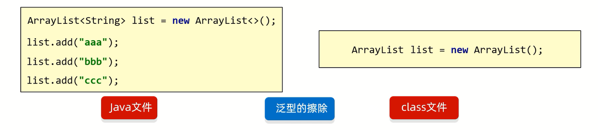
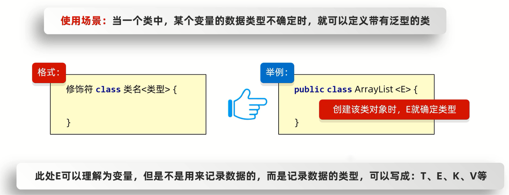
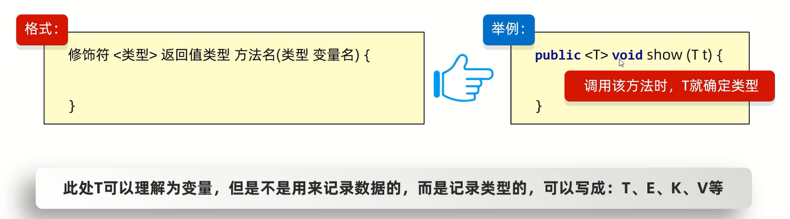
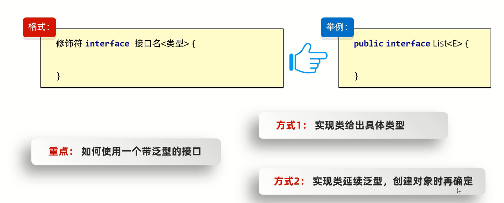

# 泛型

泛型是JDK5中引入的特性,可以在编译阶段约束操作的数据类型,并进行检查

## 格式

`<数据类型>`

## 注意事项

1. **泛型只能支持引用数据类型**
2. **如果没有给集合指定类型,默认认为所有的数据类型都是Object类型**                  
此时,可以往集合添加任意的数据类型             
带来一个坏处: 获取数据的时候,无法使用其特有行为          
因此,推出了泛型,在添加数据的时候就把数据进行统一,而且在获取数据的时候也省去强转     

## 好处  
1. 统一数据类型
2. 把运行时期的问题提前到了编译期间,避免强制类型转换可能出现的异常             
因为在编译阶段类型就能确定下来   

## 拓展

Java中的泛型是伪泛型



## 细节

1. 泛型中不能写基本数据类型
2. 指定泛型的基本类型后,传递数据的时,可以传入该类类型或者其子类类型
3. 如果不写泛型,类型默认是Object

## 多种定义

## 泛型类



范例: 

```java
import java.util.Arrays;

// 当编写一个类的时候,如果不确定类型,这个类就可以定义为泛型类
public class MyArrayList<E> {
    Object[] obj = new Object[10];

    // 定义长度,即存入了几个元素
    int size;

    // E: 表示不确定的类型,该类型已经在类名后面定义过了
    // e: 形参的名字,变量名
    public boolean add(E e) {
        obj[size] = e;
        size++;
        return true;
    }

    public E get(int index) {
        return (E) obj[index];
    }

    @Override
    public String toString() {
        return Arrays.toString(obj);
    }
}
```

```java
public class MyArrayListTest {
    public static void main(String[] args) {
        MyArrayList<String> myList1 = new MyArrayList<String>();
        myList1.add("自动");
        myList1.add("驾驶");
        // 打印结果:"[自动,驾驶,null,null,null,null,null,null,null,null]"
        System.out.println(myList1.toString());
        // 打印结果:"自动"
        System.out.println(myList1.get(0));

        MyArrayList<Integer> myList2 = new MyArrayList<Integer>();
        myList2.add(2024);
        myList2.add(4048);
        // 打印结果:"[2024,4048,null,null,null,null,null,null,null,null]"
        System.out.println(myList2.toString());
        // 打印结果:"2024"
        System.out.println(myList2.get(0));
    }
}
```

## 泛型方法

方法中的形参不确定时: 
1. 使用类名后面定义的泛型`<E>`: 所有的方法都能用                                   
2. 在方法申明上定义自己的泛型: 只有本方法能用  

弊端: 泛型方法可以接受任意的数据类型



练习 :

定义一个工具类: ListUtil                     
类中定义一个静态方法addAll,用来添加3个集合的元素              

```java
import java.util.ArrayList;

public class ListUtil {
    private ListUtil() {
    }

    public static <E> void addAll(ArrayList<E> list,E e1,E e2,E e3) {
        list.add(e1);
        list.add(e2);
        list.add(e3);
    }
}
```

```java
import java.util.ArrayList;

public class ListUtilTest {
    public static void main(String[] args) {
        ArrayList<String> list1 = new ArrayList<>();
        ListUtil.addAll(list1,"aaa","bbb","ccc");
        // 打印结果:"[aaa,bbb,ccc]"
        System.out.println(list1);

        ArrayList<Integer> list2 = new ArrayList<>();
        ListUtil.addAll(list2,12,23,34);
        // 打印结果:"[12,23,34]"
        System.out.println(list2);
    }
}
```

定义一个工具类: ListUtil                     
类中定义一个静态方法addAll,用来添加多个集合的元素                

```java
import java.util.ArrayList;

public class ListUtil {
    private ListUtil() {
    }

    // E...e: 表示可变参数
    public static <E> void addAll(ArrayList<E> list,E... e) {
        for (E element: e) {
            list.add(element);
        }
    }
}
```

```java
import java.util.ArrayList;

public class ListUtilTest {
    public static void main(String[] args) {
        ArrayList<String> list1 = new ArrayList<>();
        ListUtil.addAll(list1,"aaa","bbb","ccc","dddd");
        // 打印结果:"[aaa,bbb,ccc,dddd]"
        System.out.println(list1);

        ArrayList<Integer> list2 = new ArrayList<>();
        ListUtil.addAll(list2,12);
        // 打印结果:"[12]"
        System.out.println(list2);
    }
}
```

## 泛型接口



1. 实现类给出具体的类型          

范例: 

```java
import java.util.*;

// 实现类给出具体的类型
public class MyArrayList implements List<String> {

    @Override
    public int size() {
        return 0;
    }

    @Override
    public boolean isEmpty() {
        return false;
    }

    @Override
    public boolean contains(Object o) {
        return false;
    }

    @Override
    public Iterator<String> iterator() {
        return null;
    }

    @Override
    public Object[] toArray() {
        return new Object[0];
    }

    @Override
    public <T> T[] toArray(T[] a) {
        return null;
    }

    @Override
    public boolean add(String s) {
        return false;
    }

    @Override
    public boolean remove(Object o) {
        return false;
    }

    @Override
    public boolean containsAll(Collection<?> c) {
        return false;
    }

    @Override
    public boolean addAll(Collection<? extends String> c) {
        return false;
    }

    @Override
    public boolean addAll(int index,Collection<? extends String> c) {
        return false;
    }

    @Override
    public boolean removeAll(Collection<?> c) {
        return false;
    }

    @Override
    public boolean retainAll(Collection<?> c) {
        return false;
    }

    @Override
    public void clear() {

    }

    @Override
    public String get(int index) {
        return null;
    }

    @Override
    public String set(int index,String element) {
        return null;
    }

    @Override
    public void add(int index,String element) {

    }

    @Override
    public String remove(int index) {
        return null;
    }

    @Override
    public int indexOf(Object o) {
        return 0;
    }

    @Override
    public int lastIndexOf(Object o) {
        return 0;
    }

    @Override
    public ListIterator<String> listIterator() {
        return null;
    }

    @Override
    public ListIterator<String> listIterator(int index) {
        return null;
    }

    @Override
    public List<String> subList(int fromIndex,int toIndex) {
        return null;
    }
}
```

```java
public class MyArrayListTest {
    public static void main(String[] args) {
        MyArrayList list = new MyArrayList();
        list.add("aaa");
    }
}
```

2. 实现类延续泛型,创建对象的时候再确定

范例: 

```java
import java.util.*;

// 实现类延续泛型,创建对象的时候再确定
public class MyArrayList<E> implements List<E> {

    @Override
    public int size() {
        return 0;
    }

    @Override
    public boolean isEmpty() {
        return false;
    }

    @Override
    public boolean contains(Object o) {
        return false;
    }

    @Override
    public Iterator<E> iterator() {
        return null;
    }

    @Override
    public Object[] toArray() {
        return new Object[0];
    }

    @Override
    public <T> T[] toArray(T[] a) {
        return null;
    }

    @Override
    public boolean add(E e) {
        return false;
    }

    @Override
    public boolean remove(Object o) {
        return false;
    }

    @Override
    public boolean containsAll(Collection<?> c) {
        return false;
    }

    @Override
    public boolean addAll(Collection<? extends E> c) {
        return false;
    }

    @Override
    public boolean addAll(int index,Collection<? extends E> c) {
        return false;
    }

    @Override
    public boolean removeAll(Collection<?> c) {
        return false;
    }

    @Override
    public boolean retainAll(Collection<?> c) {
        return false;
    }

    @Override
    public void clear() {

    }

    @Override
    public E get(int index) {
        return null;
    }

    @Override
    public E set(int index,E element) {
        return null;
    }

    @Override
    public void add(int index,E element) {

    }

    @Override
    public E remove(int index) {
        return null;
    }

    @Override
    public int indexOf(Object o) {
        return 0;
    }

    @Override
    public int lastIndexOf(Object o) {
        return 0;
    }

    @Override
    public ListIterator<E> listIterator() {
        return null;
    }

    @Override
    public ListIterator<E> listIterator(int index) {
        return null;
    }

    @Override
    public List<E> subList(int fromIndex,int toIndex) {
        return null;
    }
}
```

```java
public class MyArrayListTest {
    public static void main(String[] args) {
        MyArrayList<String> list = new MyArrayList<String>();
        list.add("aaa");
    }
}
```

## 继承和通配符

## 继承

**泛型不具备继承性,但是数据具备继承性**

范例: 

```java
public class Ye {
}
```

```java
public class Fu extends Ye{
}
```

```java
public class Zi extends Fu{
}
```

```java
import java.util.ArrayList;

public class Test {
    public static void main(String[] args) {

        ArrayList<Ye> list1 = new ArrayList<>();
        ArrayList<Fu> list2 = new ArrayList<>();
        ArrayList<Zi> list3 = new ArrayList<>();

        // 泛型不具备继承性
        method(list1);
        // 报错
        // method(list2);
        // 报错
        // method(list3);

        // 但是数据具备继承性
        list1.add(new Ye());
        list1.add(new Fu());
        list1.add(new Zi());
    }

    public static void method(ArrayList<Ye> list) {

    }
}
```

练习: 

定义一个方法,形参是一个集合,但是集合中的数据类型不确定

```java
public class Ye {
}
```

```java
public class Fu extends Ye{
}
```

```java
public class Zi extends Fu{
}
```

```java
import java.util.ArrayList;

public class Test {
    public static void main(String[] args) {
        ArrayList<Ye> list1 = new ArrayList<>();
        ArrayList<Fu> list2 = new ArrayList<>();
        ArrayList<Zi> list3 = new ArrayList<>();

        method(list1);
        method(list2);
        method(list3);
    }

    // 弊端: 泛型方法可以接受任意的数据类型
    // 本方法虽然不确定类型,但是以后希望只传递Ye、Fu、Zi
    // 这时可以用泛型的通配符,见下方范例
    public static <E> void method(ArrayList<E> list) {

    }
}
```

## 通配符

`?`也表示不确定的类型,可以进行类型的限定:                                                                   
1. `? extends E`: 可以传递E或者E的所有子类类型                         
2. `? super E`:  可以传递E或者E的所有父类类型            

应用场景: 
1. 在定义类、方法、接口的时候,如果类型不确定,就可以定义泛型类、泛型方法、泛型接口 
2. 如果类型不确定,但是知道是哪个继承体系中的,就可以使用泛型的通配符

细节: **泛型的通配符可以限定类型的范围**

范例: 

```java
public class Ye {
}
```

```java
public class Fu extends Ye{
}
```

```java
public class Zi extends Fu{
}
```

```java
import java.util.ArrayList;

public class Test {
    public static void main(String[] args) {
        ArrayList<Ye> list1 = new ArrayList<>();
        ArrayList<Fu> list2 = new ArrayList<>();
        ArrayList<Zi> list3 = new ArrayList<>();

        // 报错
        // method1(list1);
        method1(list2);
        method1(list3);

        method2(list1);
        method2(list2);
        // 报错
        // method2(list3);
    }

    // method1方法可传递Fu类型及其所有子类类型
    public static void method1(ArrayList<? extends Fu> list) {

    }

    // method2方法可传递Fu类型及其所有父类类型
    public static void method2(ArrayList<? super Fu> list) {

    }
}
```

练习: 

定义一个继承结构: 动物(猫(波斯猫、狸花猫)、狗(泰迪、哈士奇))                                              

属性: 名字,年龄               
行为: 吃东西                

波斯猫方法体打印: 一只叫做XXX的X岁的波斯猫正在吃小饼干              
狸花猫方法体打印: 一只叫做XXX的X岁的狸花猫正在吃鱼                
泰迪方法体打印: 一只叫做XXX的X岁的泰迪正在吃骨头,边吃边蹭                   
哈士奇方法体打印: 一只叫做XXX的X岁的哈士奇正在吃骨头,边吃边拆家                        

测试类中定义一个方法用于饲养动物:              

```
public static void keepPet(ArrayList<???> list){
    // 遍历集合,调用动物的eat方法
}
```

1. 要求1: 该方法能养所有品种的猫,但是不能养狗              
2. 要求2: 该方法能养所有品种的狗,但是不能养猫                
3. 要求3: 该方法能养所有的动物,但是不能传递其他类型        

```java
public abstract class Animal {
    private String name;
    private int age;

    public Animal() {
    }

    public Animal(String name,int age) {
        this.name = name;
        this.age = age;
    }

    public String getName() {
        return name;
    }

    public void setName(String name) {
        this.name = name;
    }

    public int getAge() {
        return age;
    }

    public void setAge(int age) {
        this.age = age;
    }

    public abstract void eat();

    @Override
    public String toString() {
        return "Animal{" +
                "name='" + name + '\'' +
                ",age=" + age +
                '}';
    }
}
```

如果父类是抽象类,子类:                           
1. 继承抽象类,重写里面的所有抽象方法                 
2. 自身也是抽象类,让自己的子类再去重写抽象方法                

```java
public abstract class Cat extends Animal {
    public Cat() {
    }

    public Cat(String name,int age) {
        super(name,age);
    }
}
```

```java
public abstract class Dog extends Animal {
    public Dog() {
    }

    public Dog(String name,int age) {
        super(name,age);
    }
}
```

```java
public class BoSiCat extends Cat {
    public BoSiCat() {
    }

    public BoSiCat(String name,int age) {
        super(name,age);
    }

    @Override
    public void eat() {
        System.out.println("一只叫做" + getName() + "的" + getAge() + "岁的波斯猫正在吃小饼干");
    }
}
```

```java
public class LiHuaCat extends Cat {
    public LiHuaCat() {
    }

    public LiHuaCat(String name,int age) {
        super(name,age);
    }

    @Override
    public void eat() {
        System.out.println("一只叫做" + getName() + "的" + getAge() + "岁的狸花猫正在吃鱼");
    }
}
```

```java
public class HaShiQi extends Dog {
    public HaShiQi() {
    }

    public HaShiQi(String name,int age) {
        super(name,age);
    }

    @Override
    public void eat() {
        System.out.println("一只叫做" + getName() + "的" + getAge() + "岁的哈士奇正在吃骨头,边吃边拆家");
    }
}
```

```java
public class TaiDi extends Dog {
    public TaiDi() {
    }

    public TaiDi(String name,int age) {
        super(name,age);
    }

    @Override
    public void eat() {
        System.out.println("一只叫做" + getName() + "的" + getAge() + "岁的泰迪正在吃骨头,边吃边蹭");
    }
}
```

```java
import java.util.ArrayList;

public class Test {
    public static void main(String[] args) {
        BoSiCat boSiCat = new BoSiCat("喵喵",1);
        LiHuaCat liHuaCat = new LiHuaCat("可可",2);
        HaShiQi haShiQi = new HaShiQi("大大",1);
        TaiDi taiDi = new TaiDi("迪迪",3);

        ArrayList<BoSiCat> list1 = new ArrayList<>();
        list1.add(boSiCat);
        ArrayList<LiHuaCat> list2 = new ArrayList<>();
        list2.add(liHuaCat);
        ArrayList<HaShiQi> list3 = new ArrayList<>();
        list3.add(haShiQi);
        ArrayList<TaiDi> list4 = new ArrayList<>();
        list4.add(taiDi);

        keepPet1(list1);
        keepPet1(list2);
        // 报错
        // keepPet1(list3);
        // keepPet1(list4);

        // 报错
        // keepPet2(list1);
        // keepPet2(list2);
        keepPet2(list3);
        keepPet2(list4);

        keepPet3(list1);
        keepPet3(list2);
        keepPet3(list3);
        keepPet3(list4);
    }

    public static void keepPet1(ArrayList<? extends Cat> list) {
        for (Cat cat: list) {
            cat.eat();
        }
    }

    public static void keepPet2(ArrayList<? extends Dog> list) {
        for (Dog dog: list) {
            dog.eat();
        }
    }

    public static void keepPet3(ArrayList<? extends Animal> list) {
        for (Animal animal: list) {
            animal.eat();
        }
    }
}
```