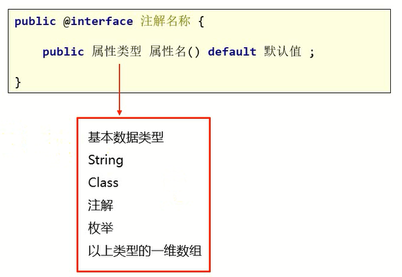
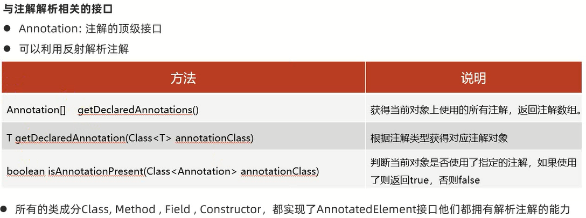
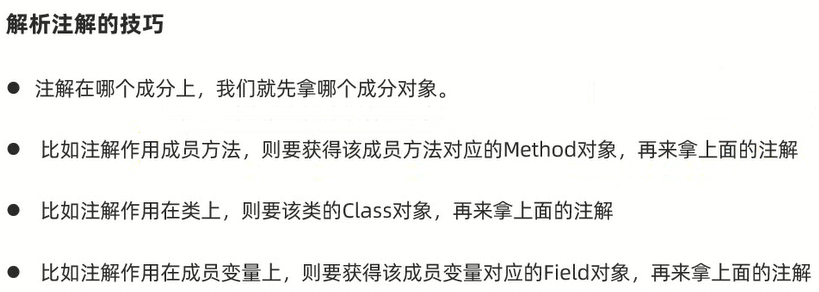

# 注解 

Annotation表示注解,是JDK1.5的新特性

主要作用:对程序进行标注,通过注解给类增加额外的信息

# 注释和注解的区别

共同点:都可以对程序进行解释说明            
不同点:              
1. 注释是给程序员看的,只在Java中有效,在class文件中不存在注释的,当编译之后,会进行注释的擦除
2. 注解是给虚拟机看的,当虚拟机看到注解之后,就知道要做什么事情

# 如何使用注解

`@Override`:当子类重写父类方法的时候,在重写的方法上面写`@Override`                         
当虚拟机看到`@Override`的时候,就知道下面的方法是重写的父类的,检查语法,如果语法正确编译正常,如果语法错误,就会报错

# Java中已经存在的注解

1. `@Override`:表示方法的重写
2. `@Deprecated`:表示修饰的方法已过时
3. `@SuppressWarnings("all")`:压制警告

# 自定义注解

自定义注解单独存在是没有什么意义的,一般会跟反射结合起来使用,会用发射去解析注解                   
针对于注解,只要掌握会使用别人已经写好的注解即可                     
关于注解的解析,一般是在框架的底层已经写好了               

## 格式



## 使用

`@注解名(属性值1=值1,属性值2=值2)`

细节:
1. 使用自定义注解时,要保证注解的每个属性都有值
2. 注解可以使用默认值

范例:

```java
public @interface MyAnno1 {
    public String name();

    public int age();

    public String value();
}
```

```java
@MyAnno1(name = "张三", age = 23, value = "aaa")
public class Test {
    String a;
    String b;

    @MyAnno1(name = "张三", age = 23, value = "aaa")
    public void method1() {
        System.out.println("方法一");
    }

    public void method2() {
        System.out.println("方法二");
    }
}
```

## 特殊属性

value:如果只有一个value属性的情况下,使用注解时,可以省略value属性名;如果有多个属性,且多个属性没有默认值,那么value属性名不可省略

范例:

```java
public @interface MyAnno1 {
    public String value();
}
```

```java
@MyAnno1("aaa")
public class Test {
    String a;
    String b;

    public void method1() {
        System.out.println("方法一");
    }

    public void method2() {
        System.out.println("方法二");
    }
}
```

# 元注解

元注解是可以写在注解上面的注解

`@Target`:指定注解能在哪里使用                     
`@Retention`:可以理解为保留时间(生命周期)                    

## @Target

​作用:用来标识注解使用的位置,如果没有使用该注解标识,则自定义的注解可以使用在任意位置

​可使用的值定义在`ElementType`枚举类中,常用值如下:
- `TYPE`:类,接口
- `FIELD`:成员变量
- `METHOD`:成员方法
- `PARAMETER`:方法参数
- `CONSTRUCTOR`:构造方法
- `LOCAL_VARIABLE`:局部变量

## @Retention

​作用:用来标识注解的生命周期(有效范围)

​可使用的值定义在`RetentionPolicy`枚举类中,常用值如下:
- `SOURCE`:注解只作用在源码阶段,生成的字节码文件中不存在
- `CLASS`:注解作用在源码阶段,字节码文件阶段,运行阶段不存在,默认值
- `RUNTIME`:注解作用在源码阶段,字节码文件阶段,运行阶段(**开发常用**)

范例:

```java
import java.lang.annotation.ElementType;
import java.lang.annotation.Retention;
import java.lang.annotation.RetentionPolicy;
import java.lang.annotation.Target;

@Target(ElementType.TYPE)
@Retention(RetentionPolicy.RUNTIME)
public @interface MyAnno1 {
    public String name();

    public int age();

    public String value();
}
```

```java
@MyAnno1(name = "张三", age = 23, value = "aaa")
public class Test {
    String a;
    String b;

    public void method1() {
        System.out.println("方法一");
    }

    public void method2() {
        System.out.println("方法二");
    }
}
```

# 注解的解析

注解的操作经常需要进行解析,注解的解析就是判断是否存在注解,存在注解就解析出内容





## 练习

模拟Junit框架:定义若干个方法,只要加了@MyTest注解,就可以在启动时被触发执行          

```java
import java.lang.annotation.ElementType;
import java.lang.annotation.Retention;
import java.lang.annotation.RetentionPolicy;
import java.lang.annotation.Target;

@Target(ElementType.METHOD)
@Retention(RetentionPolicy.RUNTIME)
public @interface MyTest {
}
```

```java
public class MyTestDemo {
    @MyTest
    public void method1() {
        System.out.println("method1");
    }

    public void method2() {
        System.out.println("method2");
    }

    @MyTest
    public void method3() {
        System.out.println("method3");
    }
}
```

```java
package com.jinzhao;

import java.lang.reflect.InvocationTargetException;
import java.lang.reflect.Method;

public class MyTestDemo {
    public static void main(String[] args) throws ClassNotFoundException, IllegalAccessException, InvocationTargetException {
        // 获取class对象
        Class<?> clazz = Class.forName("com.jinzhao.MyTestMethod");

        // 获取对象
        MyTestMethod mtd = new MyTestMethod();

        // 获取所有方法
        Method[] methods = clazz.getDeclaredMethods();
        for (Method method : methods) {
            method.setAccessible(true);
            // 判断当前方法有没有MyTest注解
            if (method.isAnnotationPresent(MyTest.class)) {
                method.invoke(mtd);
            }
        }
    }
}
```