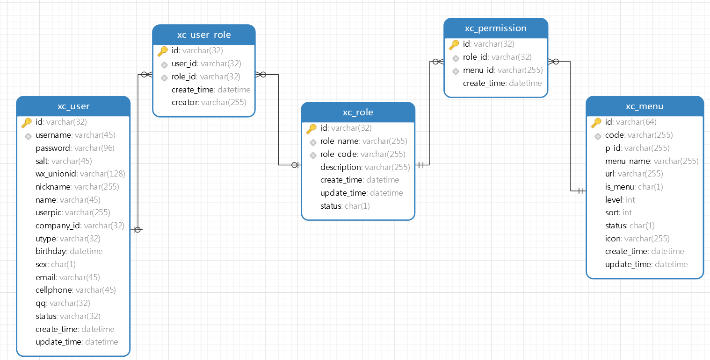
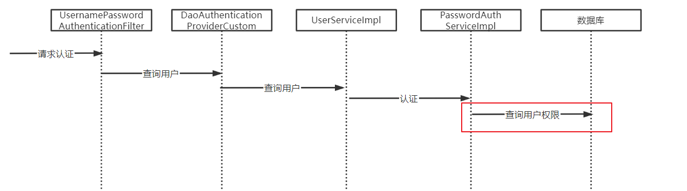

# RBAC

通常基于RBAC实现授权

RBAC分为两种方式:

- 基于角色的访问控制(Role-Based Access Control)
    角色的访问控制(Role-Based Access Control)是按角色进行授权,比如:主体的角色为总经理可以查询企业运营报表,查询员工工资信息等

- 基于资源的访问控制(Resource-Based Access Control)
    基于资源的访问控制(Resource-Based Access Control)是按资源(或权限)进行授权,比如:用户必须具有查询工资权限才可以查询员工工资信息等


## 基于资源的访问控制

通过`@PreAuthorize`注解,指定权限标识符,实现对资源的访问控制

以学成在线项目为例,授权相关的数据模型如下:



- xc_user:用户表,存储了系统用户信息,用户类型包括:学生、老师、管理员等
- xc_role:角色表,存储了系统的角色信息,学生、老师、教学管理员、系统管理员等
- xc_user_role:用户角色表,一个用户可拥有多个角色,一个角色可被多个用户所拥有
- xc_menu:模块表,记录了菜单及菜单下的权限
- xc_permission:角色权限表,一个角色可拥有多个权限,一个权限可被多个角色所拥有

### 范例

实现认证时从数据库查询用户的权限,并将权限信息封装到用户信息中



XcMenuMapper.java:

```java
package com.xuecheng.ucenter.mapper;

import com.baomidou.mybatisplus.core.mapper.BaseMapper;
import com.xuecheng.ucenter.model.po.XcMenu;
import org.apache.ibatis.annotations.Param;
import org.apache.ibatis.annotations.Select;

import java.util.List;

/**
 * <p>
 * Mapper 接口
 * </p>
 *
 * @author itcast
 */
public interface XcMenuMapper extends BaseMapper<XcMenu> {
    @Select("SELECT	* FROM xc_menu WHERE id IN (SELECT menu_id FROM xc_permission WHERE role_id IN ( SELECT role_id FROM xc_user_role WHERE user_id = #{userId} ))")
    List<XcMenu> selectPermissionByUserId(@Param("userId") String userId);
}
```

在认证用户时,将权限信息封装到用户信息中

UserServiceImpl.java:

```java
/**
 * 封装用户信息
 *
 * @param user 用户信息
 * @return 用户信息
 */
public UserDetails getUserPrincipal(XcUserExt user) {
    // 根据用户id查询用户的权限
    List<XcMenu> xcMenus = xcMenuMapper.selectPermissionByUserId(user.getId());
    List<String> permissions = new ArrayList<>();
    if (xcMenus.isEmpty()) {
        permissions.add("p1");
    } else {
        xcMenus.forEach(menu -> {
            permissions.add(menu.getCode());
        });
    }
    // 添加用户权限
    user.setPermissions(permissions);
    String[] authorities = permissions.toArray(new String[0]);

    // 用户密码
    String password = user.getPassword();

    // 为了安全,在令牌中不放密码
    user.setPassword(null);

    // 将用户信息转换为JSON
    String userJSON = JSON.toJSONString(user);

    return User.withUsername(userJSON).password(password).authorities(authorities).build();
}
```

添加全局异常处理器:

```java
/**
 * 全局异常处理
 *
 * @param e Exception异常
 * @return 异常信息
 */
@ResponseBody
@ExceptionHandler(Exception.class)
@ResponseStatus(HttpStatus.INTERNAL_SERVER_ERROR)
public RestErrorResponse customException(Exception e) {
    // 记录异常
    log.error("【系统异常】{}", e.getMessage(), e);
    if (e.getMessage().equals("不允许访问")) {
        return new RestErrorResponse("没有权限操作");
    }

    // 解析异常信息
    return new RestErrorResponse(CommonError.UNKOWN_ERROR.getErrMessage());
}
```

# 细粒度授权

细粒度授权也叫数据范围授权,即不同的用户所拥有的操作权限相同,但是能够操作的数据范围是不一样的

一个例子:用户A和用户B都是教学机构,他们都拥有"我的课程"权限,但是两个用户所查询到的数据是不一样的

## 范例

教学机构细粒度授权

教学机构在维护课程时只允许维护本机构的课程,教学机构细粒度授权过程如下:

- 获取当前登录的用户身份
- 得到用户所属教育机构的Id
- 查询该教学机构下的课程信息

最终实现了用户只允许查询自己机构的课程信息

根据公司Id查询课程,流程如下:

1. 教学机构用户登录系统,从用户身份中取出所属机构的id,在用户表中设计了company_id字段存储该用户所属的机构id
2. 接口层取出当前登录用户的身份,取出机构id
3. 将机构id传入service方法
4. service方法将机构id传入Dao方法,最终查询出本机构的课程信息

CourseBaseInfoController.java:

```java
/**
 * 课程分页查询接口
 *
 * @param pageParams           分页查询参数
 * @param queryCourseParamsDto 查询条件
 * @return 分页结果
 */
@ApiOperation("课程分页查询接口")
@PreAuthorize("hasAuthority('xc_teachmanager_course_list')")
@PostMapping("/course/list")
public PageResult<CourseBase> list(PageParams pageParams, @RequestBody(required = false) QueryCourseParamsDto queryCourseParamsDto) {
    // 机构id
    Long companyId = SecurityUtil.getCompanyId();
    return courseBaseInfoService.queryCourseBaseList(pageParams, queryCourseParamsDto, companyId);
}
```

CourseBaseInfoService.java:

```java
/**
 * 课程分页查询
 *
 * @param pageParams           分页参数
 * @param queryCourseParamsDto 查询条件
 * @param companyId            机构id
 * @return 分页结果
 */
PageResult<CourseBase> queryCourseBaseList(PageParams pageParams, QueryCourseParamsDto queryCourseParamsDto, Long companyId);
```

CourseBaseInfoServiceImpl.java:

```java
/**
 * 课程分页查询
 *
 * @param pageParams           分页查询参数
 * @param queryCourseParamsDto 查询条件
 * @param companyId            机构id
 * @return 查询结果
 */
@Override
public PageResult<CourseBase> queryCourseBaseList(PageParams pageParams, QueryCourseParamsDto queryCourseParamsDto, Long companyId) {
    // 拼装查询条件
    LambdaQueryWrapper<CourseBase> lambdaQueryWrapper = new LambdaQueryWrapper<>();

    // 根据名称模糊查询
    lambdaQueryWrapper.like(
            StringUtils.isNotEmpty(queryCourseParamsDto.getCourseName()),
            CourseBase::getName,
            queryCourseParamsDto.getCourseName());

    // 根据审核状态查询
    lambdaQueryWrapper.eq(
            StringUtils.isNotEmpty(queryCourseParamsDto.getAuditStatus()),
            CourseBase::getAuditStatus,
            queryCourseParamsDto.getAuditStatus());

    // 根据发布状态查询
    lambdaQueryWrapper.eq(
            StringUtils.isNotEmpty(queryCourseParamsDto.getPublishStatus()),
            CourseBase::getStatus,
            queryCourseParamsDto.getPublishStatus()
    );

    // 根据机构id查询
    lambdaQueryWrapper.eq(
            StringUtils.isNotEmpty(companyId.toString()),
            CourseBase::getCompanyId,
            companyId
    );

    // 创建page分页参数对象
    Page<CourseBase> page = new Page<>(pageParams.getPageNo(), pageParams.getPageSize());

    // 分页查询
    Page<CourseBase> pageResult = courseBaseMapper.selectPage(page, lambdaQueryWrapper);

    // 返回查询结果
    return new PageResult<>(
            pageResult.getRecords(),
            pageResult.getTotal(),
            pageResult.getCurrent(),
            pageResult.getSize()
    );
}
```