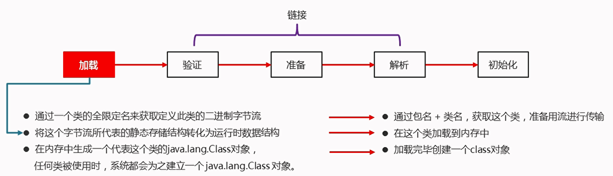
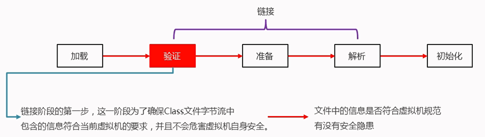
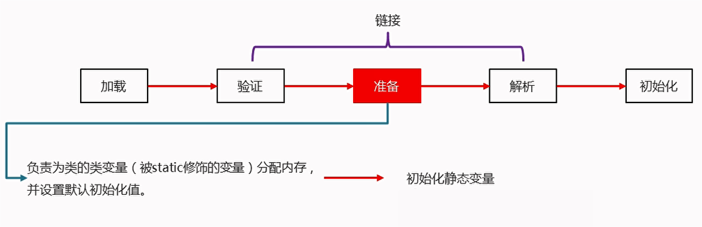
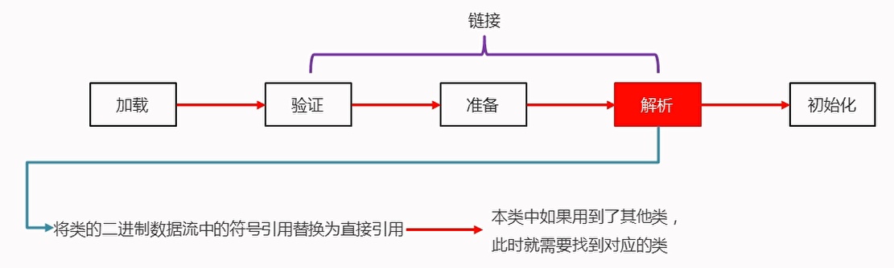
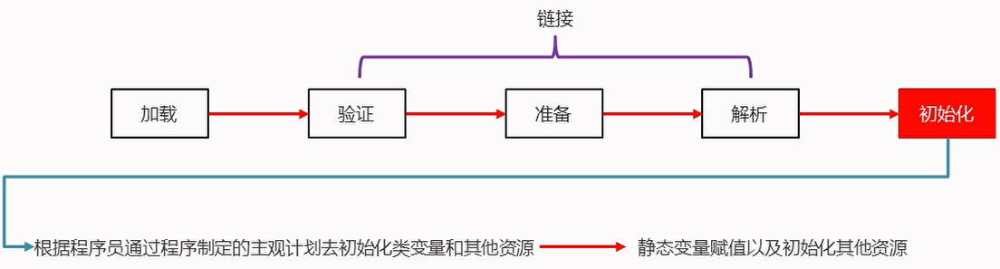
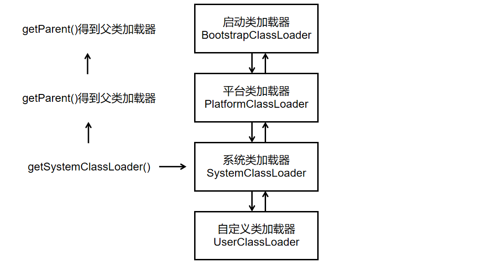
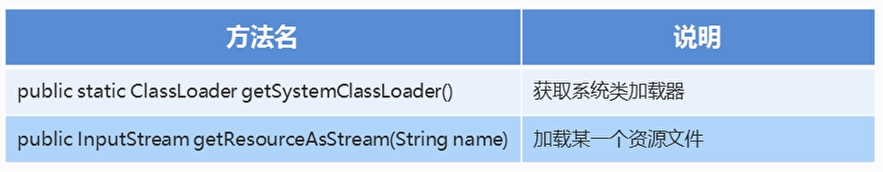

# 类加载器

类加载器负责把.class文件(存储的物理文件)加载到内存中

# 时机

1. 创建类的实例(对象)
2. 调用类的类方法
3. 访问类或者接口的类变量,或者为该类变量赋值
4. 使用反射方式来强制创建某个类或接口对应的java.lang.Class对象
5. 初始化某个类的子类
6. 直接使用java.exe命令来运行某个主类

简洁概括:**用到就加载,不用不加载**

# 过程

## 加载



## 链接:验证、准备、解析







## 初始化



# 分类

1. 启动类加载器(BootstrapClassLoader):虚拟机内置的类加载器
2. 平台类加载器(PlatformClassLoader):负责加载JDK中一些特殊的模块
3. 系统类加载器(SystemClassLoader):负责加载用户类路径上所指定的类库

# 双亲委派模型



范例:

```java
public class Test {
    public static void main(String[] args) {
        // 获取系统类加载器
        ClassLoader systemClassLoader = ClassLoader.getSystemClassLoader();

        // 获取系统类加载器的父加载器 -- 平台类加载器
        ClassLoader classLoader1 = systemClassLoader.getParent();

        // 获取平台类加载器的父加载器 -- 启动类加载器
        ClassLoader classLoader2 = classLoader1.getParent();

        // 打印结果:"系统类加载器:jdk.internal.loader.ClassLoaders$AppClassLoader@36baf30c"
        System.out.println("系统类加载器:" + systemClassLoader);
        // 打印结果:"平台类加载器:jdk.internal.loader.ClassLoaders$PlatformClassLoader@12edcd21"
        System.out.println("平台类加载器:" + classLoader1);
        // 打印结果:"启动类加载器:null"
        System.out.println("启动类加载器:" + classLoader2);
    }
}
```

# 常用方法



范例:

```properties
name=zhangsan
age=23
```

```java
import java.io.IOException;
import java.io.InputStream;
import java.util.Properties;

public class Test {
    public static void main(String[] args) throws IOException {
        // 获取系统类加载器
        ClassLoader systemClassLoader = ClassLoader.getSystemClassLoader();

        // 利用加载器去加载一个指定文件
        InputStream is = systemClassLoader.getResourceAsStream("prop.properties");
        if (is != null) {
            Properties prop = new Properties();
            prop.load(is);
            // 打印结果:"{name=zhangsan, age=23}"
            System.out.println(prop);
            is.close();
        }
    }
}
```