# 索引

索引(index)是**帮助MySQL高效获取数据的数据结构(有序)**           

在数据之外,数据库系统还维护着满足特定查找算法的数据结构,这些数据结构以某种方式引用(指向)数据,这样就可以在这些数据结构上实现高级查找算法,这种数据结构就是索引

优缺点:


# 结构

MySQL的索引是在存储引擎层实现的,不同的存储引擎有不同的索引结构,主要包含以下几种:

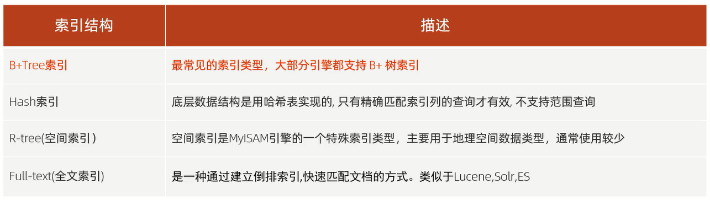

存储引擎支持情况:

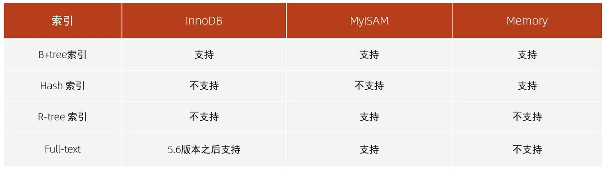

细节:**如果没有特别指明,都是指B+树结构组织的索引**

## B+树索引

MySQL索引数据结构对经典的B+Tree进行了优化            

在原B+Tree的基础上,增加一个指向相邻叶子节点的链表指针,就形成了带有顺序指针的B+Tree,提高区间访问的性能,利于排序

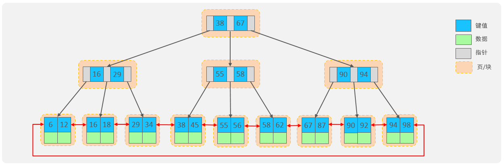

## Hash索引

哈希索引就是采用一定的hash算法,将键值换算成新的hash值,映射到对应的槽位上,然后存储在hash表中

如果两个(或多个)键值,映射到一个相同的槽位上,他们就产生了hash冲突(也称为hash碰撞),可以通过链表来解决

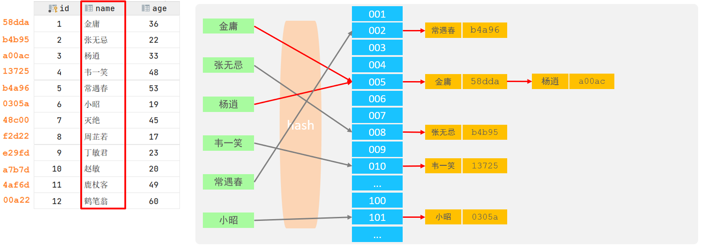

### 特点

1. Hash索引只能用于对等比较(`=`,`in`),不支持范围查询(`between`,`>`,`<`,...)
2. 无法利用索引完成排序操作
3. 查询效率高,通常(不存在hash冲突的情况)只需要一次检索就可以了,效率通常要高于B+tree索引

### 存储引擎支持

在MySQL中,支持hash索引的是Memory存储引擎                 
而InnoDB中具有自适应hash功能,hash索引是InnoDB存储引擎根据B+Tree索引在指定条件下自动构建的

思考:**为什么InnoDB存储引擎选择使用B+tree索引结构?**

1. 相对于二叉树,层级更少,搜索效率高
2. 相对于B-tree,无论是叶子节点还是非叶子节点,都会保存数据,这样导致一页中存储的键值减少,指针跟着减少,要同样保存大量数据,只能增加树的高度,导致性能降低
3. 相对于Hash索引,B+tree支持范围匹配及排序操作

# 分类

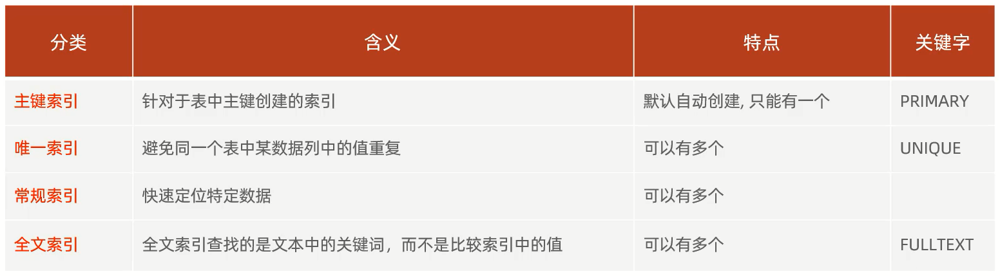

在InnoDB存储引擎中,根据索引的存储形式,又可以分为以下两种

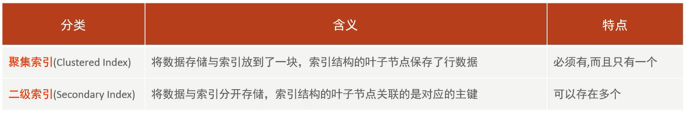

聚集索引选取规则:
1. 如果存在主键,主键索引就是聚集索引
2. 如果不存在主键,将使用第一个唯一(UNIQUE)索引作为聚集索引
3. 如果表没有主键,或没有合适的唯一索引,则InnoDB会自动生成一个rowid作为隐藏的聚集索引

聚集索引和二级索引的具体结构范例:

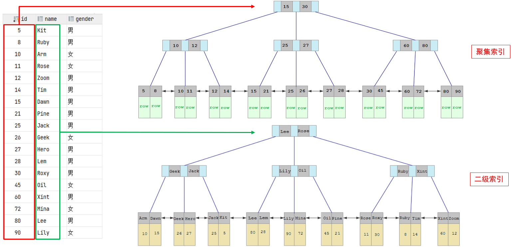

## 范例

回表查询:先到二级索引中查找数据,找到主键值,再到聚集索引中根据主键值,获取数据的方式

当执行如下的SQL语句时,具体的查找过程:

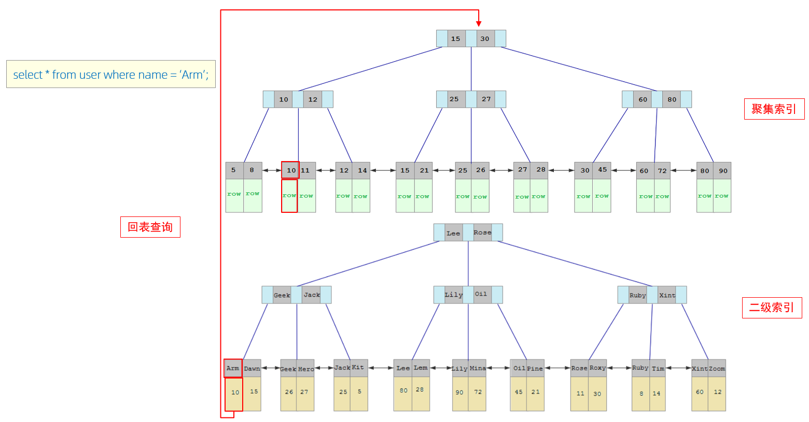

1. 由于是根据name字段进行查询,所以先根据name='Arm'到name字段的二级索引中进行匹配查找,但是在二级索引中只能查找到Arm对应的主键值10  
2. 由于查询返回的数据是*,所以此时,还需要根据主键值10,到聚集索引中查找10对应的记录,最终找到10对应的行row
3. 最终拿到这一行的数据,直接返回即可

## 思考

1. 以下两条SQL语句,那个执行效率高?为什么?

A.`select * from user where id = 10 ;`                
B.`select * from user where name = 'Arm' ;`               
备注: id为主键,name字段创建的有索引             

解答:A语句的执行性能要高于B语句,因为A语句直接走聚集索引,直接返回数据,而B语句需要先查询name字段的二级索引,然后再查询聚集索引,也就是需要进行回表查询

2. InnoDB主键索引的B+tree高度为多高呢?


假设:               
一行数据大小为1k,一页中可以存储16行这样的数据           
InnoDB的指针占用6个字节的空间,主键key即使为bigint,占用字节数为8            

如果高度为2:            
n * 8 + (n + 1) * 6 = 16 * 1024,算出n约为1170          
即根节点下的key最多有1170个,指针最多有1171个,即叶子节点最多有1171个               
1171 * 16 = 18736,也就是说,如果树的高度为2,则可以存储1.8万条左右的记录           

如果高度为3:                    
1171 * 1171 * 16 = 21939856                                        
也就是说,如果树的高度为3,则可以存储2200万条左右的记录

# 语法

## 创建索引

`create [unique | fulltext] index 索引名 on 表名(字段名,...);`

## 查看索引

`show index from 表名;`

## 删除索引

`drop index 索引名 on 表名;`

## 范例

准备工作:

```sql
# 创建系统用户表
create table tb_user
(
    id         int primary key auto_increment comment '主键',
    name       varchar(50) not null comment '用户名',
    phone      varchar(11) not null comment '手机号',
    email      varchar(100) comment '邮箱',
    profession varchar(11) comment '专业',
    age        tinyint unsigned comment '年龄',
    gender     char(1) comment '性别 , 1: 男, 2: 女',
    status     char(1) comment '状态',
    createTime datetime comment '创建时间'
) comment '系统用户表';

# 系统用户表导入数据
INSERT INTO tb_user (name, phone, email, profession, age, gender, status, createTime)
VALUES ('吕布', '17799990000', 'lvbu666@163.com', '软件工程', 23, '1', '6', '2001-02-02 00:00:00');
INSERT INTO tb_user (name, phone, email, profession, age, gender, status, createTime)
VALUES ('曹操', '17799990001', 'caocao666@qq.com', '通讯工程', 33, '1', '0', '2001-03-05 00:00:00');
INSERT INTO tb_user (name, phone, email, profession, age, gender, status, createTime)
VALUES ('赵云', '17799990002', '17799990@139.com', '英语', 34, '1', '2', '2002-03-02 00:00:00');
INSERT INTO tb_user (name, phone, email, profession, age, gender, status, createTime)
VALUES ('孙悟空', '17799990003', '17799990@sina.com', '工程造价', 54, '1', '0', '2001-07-02 00:00:00');
INSERT INTO tb_user (name, phone, email, profession, age, gender, status, createTime)
VALUES ('花木兰', '17799990004', '19980729@sina.com', '软件工程', 23, '2', '1', '2001-04-22 00:00:00');
INSERT INTO tb_user (name, phone, email, profession, age, gender, status, createTime)
VALUES ('大乔', '17799990005', 'daqiao666@sina.com', '舞蹈', 22, '2', '0', '2001-02-07 00:00:00');
INSERT INTO tb_user (name, phone, email, profession, age, gender, status, createTime)
VALUES ('露娜', '17799990006', 'luna_love@sina.com', '应用数学', 24, '2', '0', '2001-02-08 00:00:00');
INSERT INTO tb_user (name, phone, email, profession, age, gender, status, createTime)
VALUES ('程咬金', '17799990007', 'chengyaojin@163.com', '化工', 38, '1', '5', '2001-05-23 00:00:00');
INSERT INTO tb_user (name, phone, email, profession, age, gender, status, createTime)
VALUES ('项羽', '17799990008', 'xiaoyu666@qq.com', '金属材料', 43, '1', '0', '2001-09-18 00:00:00');
INSERT INTO tb_user (name, phone, email, profession, age, gender, status, createTime)
VALUES ('白起', '17799990009', 'baiqi666@sina.com', '机械工程及其自动化', 27, '1', '2', '2001-08-16 00:00:00');
INSERT INTO tb_user (name, phone, email, profession, age, gender, status, createTime)
VALUES ('韩信', '17799990010', 'hanxin520@163.com', '无机非金属材料工程', 27, '1', '0', '2001-06-12 00:00:00');
INSERT INTO tb_user (name, phone, email, profession, age, gender, status, createTime)
VALUES ('荆轲', '17799990011', 'jingke123@163.com', '会计', 29, '1', '0', '2001-05-11 00:00:00');
INSERT INTO tb_user (name, phone, email, profession, age, gender, status, createTime)
VALUES ('兰陵王', '17799990012', 'lanlinwang666@126.com', '工程造价', 44, '1', '1', '2001-04-09 00:00:00');
INSERT INTO tb_user (name, phone, email, profession, age, gender, status, createTime)
VALUES ('狂铁', '17799990013', 'kuangtie@sina.com', '应用数学', 43, '1', '2', '2001-04-10 00:00:00');
INSERT INTO tb_user (name, phone, email, profession, age, gender, status, createTime)
VALUES ('貂蝉', '17799990014', '84958948374@qq.com', '软件工程', 40, '2', '3', '2001-02-12 00:00:00');
INSERT INTO tb_user (name, phone, email, profession, age, gender, status, createTime)
VALUES ('妲己', '17799990015', '2783238293@qq.com', '软件工程', 31, '2', '0', '2001-01-30 00:00:00');
INSERT INTO tb_user (name, phone, email, profession, age, gender, status, createTime)
VALUES ('芈月', '17799990016', 'xiaomin2001@sina.com', '工业经济', 35, '2', '0', '2000-05-03 00:00:00');
INSERT INTO tb_user (name, phone, email, profession, age, gender, status, createTime)
VALUES ('嬴政', '17799990017', '8839434342@qq.com', '化工', 38, '1', '1', '2001-08-08 00:00:00');
INSERT INTO tb_user (name, phone, email, profession, age, gender, status, createTime)
VALUES ('狄仁杰', '17799990018', 'jujiamlm8166@163.com', '国际贸易', 30, '1', '0', '2007-03-12 00:00:00');
INSERT INTO tb_user (name, phone, email, profession, age, gender, status, createTime)
VALUES ('安琪拉', '17799990019', 'jdodm1h@126.com', '城市规划', 51, '2', '0', '2001-08-15 00:00:00');
INSERT INTO tb_user (name, phone, email, profession, age, gender, status, createTime)
VALUES ('典韦', '17799990020', 'ycaunanjian@163.com', '城市规划', 52, '1', '2', '2000-04-12 00:00:00');
INSERT INTO tb_user (name, phone, email, profession, age, gender, status, createTime)
VALUES ('廉颇', '17799990021', 'lianpo321@126.com', '土木工程', 19, '1', '3', '2002-07-18 00:00:00');
INSERT INTO tb_user (name, phone, email, profession, age, gender, status, createTime)
VALUES ('后羿', '17799990022', 'altycj2000@139.com', '城市园林', 20, '1', '0', '2002-03-10 00:00:00');
INSERT INTO tb_user (name, phone, email, profession, age, gender, status, createTime)
VALUES ('姜子牙', '17799990023', '37483844@qq.com', '工程造价', 29, '1', '4', '2003-05-26 00:00:00');
```

1. name字段为姓名字段,该字段的值可能会重复,为该字段创建索引

```sql
create index idx_user_name on tb_user (name);
```

2. phone手机号字段的值,是非空,且唯一的,为该字段创建唯一索引

```sql
create unique index idx_user_phone on tb_user (phone);
```

3. 为profession、age、status创建联合索引

```sql
create index idx_user_pro_age_sta on tb_user (profession, age, status);
```

4. 为email建立合适的索引来提升查询效率

```sql
create index idx_email on tb_user (email);
```

# SQL性能分析

## SQL执行频率

` show [session | global] status;`:查看服务器的状态信息         
其中`session`是查看当前会话,`global`是查询全局数据

`show global status like 'Com_______';`:查看当前数据库的访问频次        
`Com_______`如下,其中`_`共有7个   

- `Com_delete`:删除次数
- `Com_insert`:插入次数
- `Com_select`:查询次数
- `Com_update`:更新次数

可以查看到当前数据库到底是以查询为主,还是以增删改为主,从而为数据库优化提供参考依据        
如果是以增删改为主,可以考虑不对其进行索引的优化            
**如果是以查询为主,那么就要考虑对数据库的索引进行优化**  

## 慢查询日志

慢查询日志记录了所有执行时间超过指定参数(long_query_time,单位:秒,默认10秒)的所有SQL语句的日志

**MySQL的慢查询日志默认没有开启**         

`show variables like 'slow_query_log';`:查看慢查询日志开启状态            

### 开启慢查询日志

需要在MySQL的配置文件(位置:`/etc/my.cnf`)中配置如下信息:              

```sql
# 开启MySQL慢日志查询开关
slow_query_log=1
# 设置慢日志的时间为2秒,SQL语句执行时间超过2秒,就会视为慢查询,记录慢查询日志
long_query_time=2
```

配置完毕之后,通过以下指令

`systemctl restart mysqld;`:重新启动MySQL服务器

即可开启慢查询日志

慢日志文件中记录的信息的文件位置:`/var/lib/mysql/localhost-slow.log`

## profile详情

`show profiles;`能够在做SQL优化时,了解时间都耗费到哪里去了         

`select @@have_profiling;`:查看当前MySQL是否支持profile操作

`select @@profiling;`:查看profiling开启状态

默认profiling是关闭的,可以通过以下指令

`set [session | global] profiling = 1;`:设置(当前会话/全局数据)开启profiling       

即可开启profiling,通过如下指令查看指令的执行耗时:

- `show profiles;`:查看每一条SQL的耗时基本情况
- `show profile for query query_id;`:查看指定query_id的SQL语句各个阶段的耗时情况
- `show profile cpu for query query_id;`:查看指定query_id的SQL语句CPU的使用情况

## explain执行计划

explain或者desc命令获取MySQL如何执行select语句的信息,包括在select语句执行过程中表如何连接和连接的顺序               

语法:直接在select语句之前加上关键字explain/desc            
`explain select 字段列表 from 表名 where 条件;`               

explain执行计划中各个字段的含义:

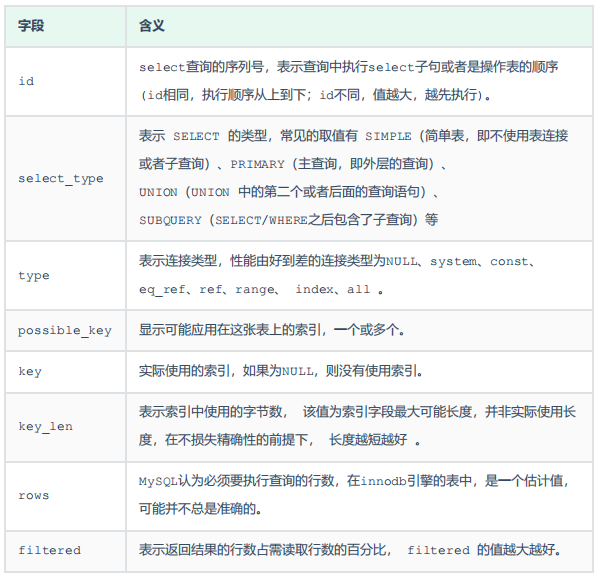

**主要需要关注的字段:type、possible_keys、key、key_len、extra**

范例:


explain范例:


### id字段

1. id相同,执行顺序从上到下

```sql
# 查询所有学生的选课情况,展示出学生名称,学号,课程名称
explain
select s.name stuName, s.no stuNo, c.name lessonName
from student s,
     course c,
     student_course sc
where s.id = sc.studentId && c.id = sc.courseId;
```

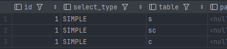

2. id不同,值越大,越先执行

```sql
# 查询选修了MySQL课程的学生
explain
select s.*
from student s
where s.id in
      (select sc.studentId
       from student_course sc
       where sc.courseId = (select c.id
                            from course c
                            where c.name = 'MySQL'));
```

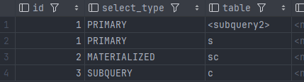

### type字段

1. 当查询的时候不访问任何表,一般会出现`null`的连接类型
2. 相当于访问一张系统表时,一般会出现`system`的连接类型
3. 根据主键、唯一索引进行访问时,一般会出现`const`的连接类型
4. 使用非唯一性的索引进行访问时,一般会出现`ref`的连接类型

**当优化SQL语句的时候,尽量把连接类型往前优化,尽量不要出现`all`的连接类型**
 
# 使用

## 最左前缀法则

**如果索引了多列(联合索引),要遵守最左前缀法则**

最左前缀法则指的是**查询从索引的最左列开始,并且不跳过索引中的列**             
如果跳跃某一列,**索引将会部分失效(后面的字段索引失效)**

细节:**最左前缀法则中的列都存在,即可遵守最左前缀法则**

范例:

对于最左前缀法则指的是:              
查询时,最左变的列,也就是profession必须存在,否则索引全部失效          
而且中间不能跳过某一列,否则该列后面的字段索引将失效               

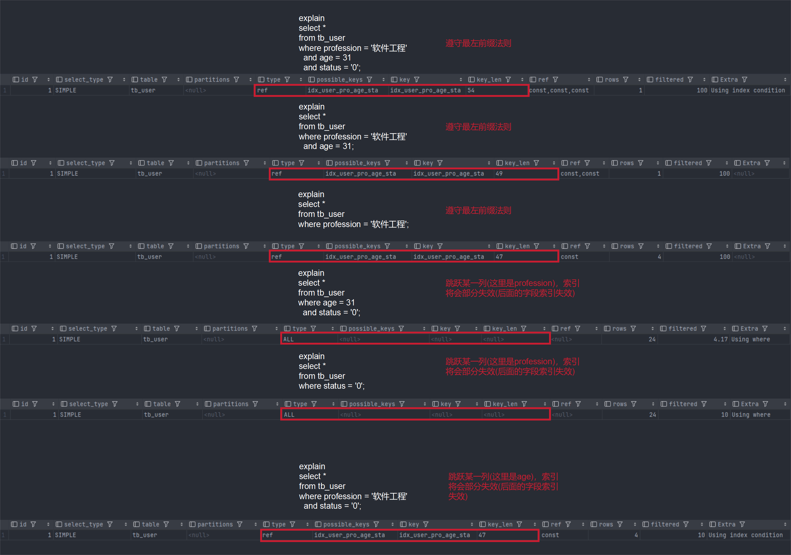

## 索引失效

### 范围查询

**联合索引中,出现范围查询(`>`,`<`),范围查询右侧的列索引失效**            

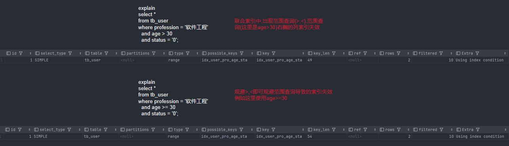

细节:**在业务允许的情况下,尽可能的使用类似于`>=`或`<=`这类的范围查询,而避免使用`>`或`<`**

### 索引列运算

**在索引列上进行运算操作,索引将失效**


### 字符串不加引号

**字符串类型字段使用时,不加引号,索引将失效**

### 模糊查询

**如果仅仅是尾部模糊匹配,索引不会失效;如果是头部模糊匹配,索引失效**  

### or连接条件

**用or分割开的条件,如果or前的条件中的列有索引,而后面的列中没有索引,那么涉及的索引都不会被用到**

### 数据分布影响

**如果MySQL评估使用索引比全表更慢,则不使用索引**

## SQL提示

## 覆盖索引

## 前缀索引

## 单列索引与联合索引

# 设计原则