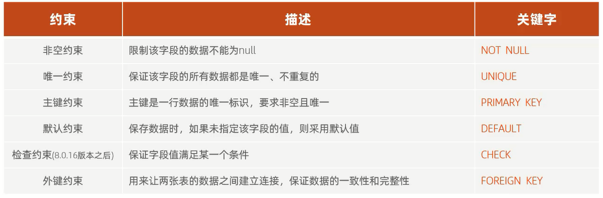
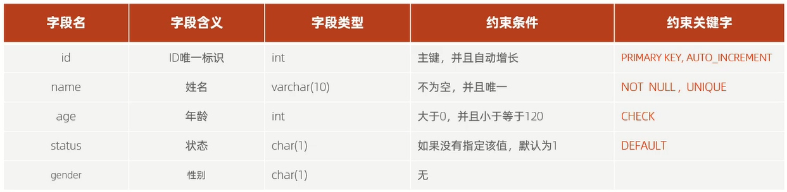
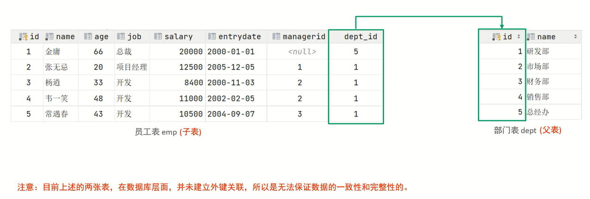
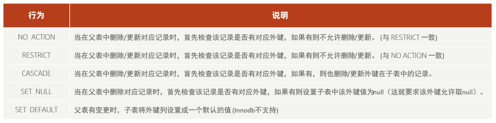

# 约束

概念:约束是作用于表中字段上的规则,用于限制存储在表中的数据

目的:保证数据库中数据的正确、有效性、完整性和一致性

分类:



细节:**约束是作用于表中字段上的,可以在创建/修改表的时候添加约束**

# 约束演示



```sql
# 建表
create table user
(
    id     int primary key auto_increment comment '唯一标识',
    name   varchar(10) not null unique comment '姓名',
    age    int check (age > 0 && age <= 120) comment '年龄',
    status char(1) default '1' comment '状态',
    gender char(1) comment '性别'
) comment '用户表';
```

```sql
# 测试
insert into user(name,age,status,gender) values ('Tom1',19,'1','男'),('Tom2',25,'0','男');
insert into user(name,age,status,gender) values ('Tom3',19,'1','男');
insert into user(name,age,status,gender) values (null,19,'1','男');
insert into user(name,age,status,gender) values ('Tom3',19,'1','男');
insert into user(name,age,status,gender) values ('Tom4',80,'1','男');
insert into user(name,age,status,gender) values ('Tom5',-1,'1','男');
insert into user(name,age,status,gender) values ('Tom5',121,'1','男');
insert into user(name,age,gender) values ('Tom5',120,'男');
```

# 外键约束

外键用来让两张表的数据之间建立连接,从而保证数据的一致性和完整性



范例:

```sql
# 创建部门表(主表/父表)
create table department
(
    id   int auto_increment comment 'ID' primary key,
    name varchar(50) not null comment '部门名称'
) comment '部门表';

# 部门表添加数据
INSERT INTO department (id, name)
VALUES (1, '研发部'),
       (2, '市场部'),
       (3, '财务部'),
       (4, '销售部'),
       (5, '总经办');
```

```sql
# 创建员工表(从表/子表)
create table employer
(
    id        int auto_increment comment 'ID' primary key,
    name      varchar(50) not null comment '姓名',
    age       int comment '年龄',
    job       varchar(20) comment '职位',
    salary    int comment '薪资',
    entryDate date comment '入职时间',
    managerId int comment '直属领导ID',
    dept_id   int comment '部门ID'
) comment '员工表';

# 员工表添加数据
INSERT INTO employer (id, name, age, job, salary, entryDate, managerId, dept_id)
VALUES (1, '金庸', 66, '总裁', 20000, '2000-01-01', null, 5),
       (2, '张无忌', 20, '项目经理', 12500, '2005-12-05', 1, 1),
       (3, '杨逍', 33, '开发', 8400, '2000-11-03', 2, 1),
       (4, '韦一笑', 48, '开发', 11000, '2002-02-05', 2, 1),
       (5, '常遇春', 43, '开发', 10500, '2004-09-07', 3, 1),
       (6, '小昭', 19, '程序员鼓励师', 6600, '2004-10-12', 2, 1);
```

## 语法

### 添加外键

1. 创建表的时候,直接添加外键

```sql
create table 表名(
字段名 数据类型,
...
[constraint] [外键名称] foreign key (外键字段名) references 主表 (主表列名)
);
```

2. 表创建好后,再添加外键

`alter table 表名 add constraint 外键名称 foreign key (外键字段名) references 主表 (主表列名);`

范例:

将employer表的dept_id设置为department表的id的外键,外键名称fk_emp_dept_id

```sql
alter table employer add constraint fk_emp_dept_id foreign key (dept_id) references department(id);
```

### 删除外键

`alter table 表名 drop foreign key 外键名称;`

范例:

删除employer表的外键fk_emp_dept_id

```sql
alter table employer drop foreign key fk_emp_dept_id;
```

## 删除/更新行为



`alter table 表名 add constraint 外键名称 foreign key (外键字段名) references 主表 (主表列名) on update 行为 on delete 行为;`

## 补充

1. 物理外键

概念:使用foreign key定义外键关联另外一张表

缺点:
1. 影响增、删、改的效率(需要检查外键关系)
2. 仅用于单结点数据库,不适用于分布式、集群场景
3. 容易引发数据库的死锁问题,消耗性能

2. 逻辑外键(推荐)

概念:在业务层逻辑中,解决外键关联

通过逻辑外键就能很方便的解决物理外键的问题