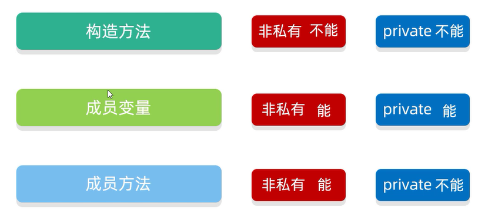
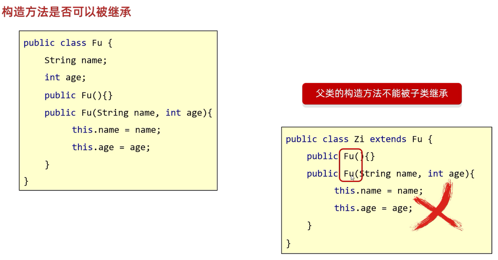
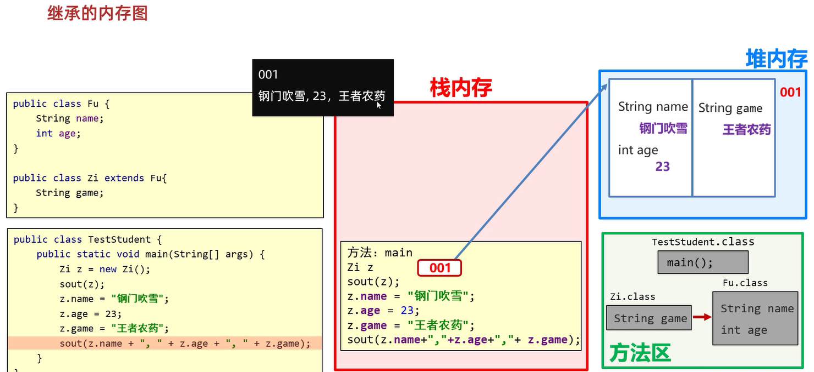
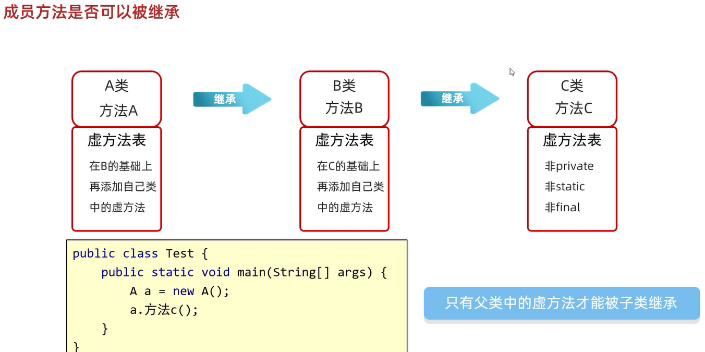
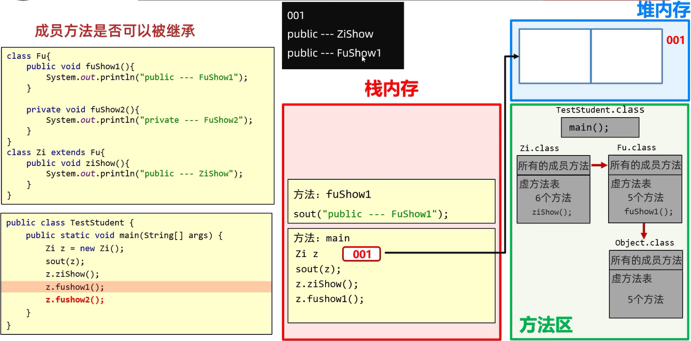
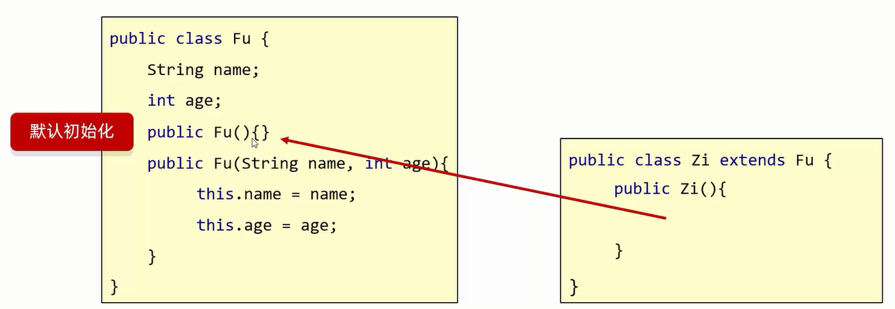
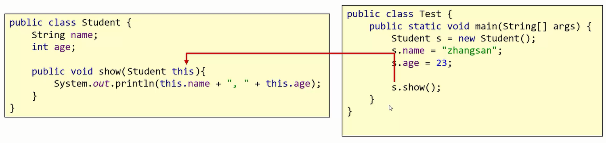
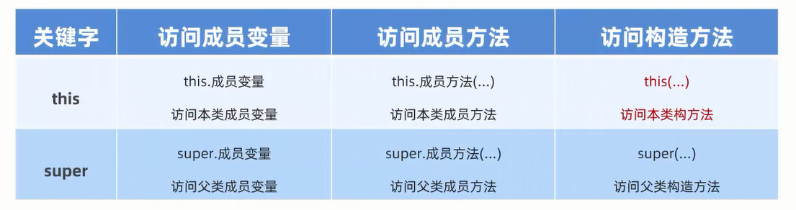

## 继承

Java中提供了一个关键字extends,用这个关键字,可以让一个类和另一个类建立起继承关系  

格式: `public class 子类 extends 父类 {}`  

范例: `public class Student extends Person {}`  
其中Student称为子类(派生类),Person称为父类(基类/超类)  
 
使用继承的好处:   
1. 可以把多个子类中重复的代码抽取到父类中,提高了代码的复用性  
2. 子类可以在父类的基础上,增加其他的功能,使子类更加强大  

什么时候使用继承:   
当类和类之间,存在相同(共性)的内容,并满足子类是父类中的一种,就可以考虑使用继承来优化代码  
  
### 继承的特点  
  
Java只支持**单继承**,不支持**多继承**,但支持**多层继承**  
1. 单继承: 一个子类只能继承一个父类  
2. 多继承: 子类不能同时继承多个父类  
3. 多层继承: 子类A继承父类B,父类B继承父类C  
其中,父类B是子类A的直接父类,父类C是子类A的间接父类  

#### 继承后子类的特点

1. 子类可以得到父类的属性和行为,子类可以使用
2. 子类可以在父类的基础上新增其他功能,子类更强大

#### 继承体系的设计

1. **每一个类都直接或者间接的继承于Object**  
2. **子类只能访问父类中非私有的成员**  

练习: 

现有4种动物: 布偶猫、狸花猫、哈士奇、泰迪(暂时不考虑属性,只考虑行为)   
请按照继承的思想特点进行继承体系的设计  

4种动物分别有以下的行为:   
布偶猫: 吃饭、喝水、抓老鼠  
狸花猫: 吃饭、喝水、抓老鼠  
哈士奇: 吃饭、喝水、看家、拆家  
泰迪: 吃饭、喝水、看家、蹭一蹭  

```java
public class Animals {
    public void eat() {
        System.out.println("吃饭");
    }

    public void drink() {
        System.out.println("喝水");
    }
}
```

```java
public class Cat extends Animals{
    public void catchMouse() {
        System.out.println("抓老鼠");
    }
}
```

```java
public class Dog extends Animals {
    public void protectHouse() {
        System.out.println("看家");
    }
}
```

```java
public class BuouCat extends Cat {
}
```

```java
public class LihuaCat extends Cat {
}
```

```java
public class HashiqiDog extends Dog {
    public void destroyHouse() {
        System.out.println("拆家");
    }
}
```

```java
public class TaidiDog extends Dog {
    public void touch() {
        System.out.println("蹭一蹭");
    }
}
```

```java
public class Test {
    public static void main(String[] args) {
        BuouCat buouCat = new BuouCat();
        System.out.println("布偶猫");
        buouCat.eat();
        buouCat.drink();
        buouCat.catchMouse();
        System.out.println("---------------");
        LihuaCat lihuaCat = new LihuaCat();
        System.out.println("狸花猫");
        lihuaCat.eat();
        lihuaCat.drink();
        lihuaCat.catchMouse();
        System.out.println("---------------");
        HashiqiDog hashiqiDog = new HashiqiDog();
        System.out.println("哈士奇");
        hashiqiDog.eat();
        hashiqiDog.drink();
        hashiqiDog.protectHouse();
        hashiqiDog.destroyHouse();
        System.out.println("---------------");
        TaidiDog taidiDog = new TaidiDog();
        System.out.println("泰迪");
        taidiDog.eat();
        taidiDog.drink();
        taidiDog.protectHouse();
        taidiDog.touch();
    }
}
```

### 子类到底能继承父类中的哪些内容



#### 内存图

1. **构造方法不能被继承**  



假设父类的构造方法能被子类继承,但是这就不满足构造方法的定义规则(构造方法的名字和类名保持一致)  

2. **成员变量能被继承**  
 
**非私有变量能被继承**  



创建与继承不一样的地方:   
1. 加载字节码文件的时候,会把父类也加载过来  
2. 创建对象的时候,会有一部分空间存储从父类继承下来的成员变量,还有一部分空间是存储子类里面的成员变量  

**私有变量能被继承,但是不能直接去使用**  


3. 成员方法是否可以被继承  
 


只有父类中的虚方法,才能被子类继承  
**虚方法**: 非private、非static、非final的方法  



解释: 其中fushow2.()不是虚方法,不会在Zi.class的虚方法表里找,先在其成员方法里找,找不到  
然后再去Fu.class的成员方法里找,发现这个方法是私有的,调用不了  

#### 内存分析工具

学习JVM的时候,再详解  

### 继承中: 成员变量的访问特点

1. **就近原则**: 谁离我近,我就用谁  
逐级往上: 局部位置找 -> 本类成员位置找 -> 父类成员位置找  

2. 如果出现重名的成员变量  
从局部位置开始找`System.out.println(name);`   
从本类成员位置开始找`System.out.println(this.name);`  
从父类成员位置开始找`System.out.println(super.name);`  

范例: 

```java
public class Fu {
    String name = "Fu";
}
```

```java
public class Zi extends Fu {
    String name = "Zi";

    public void ziShow() {
        String name = "ziShow";
        // 从局部位置开始找
        // 打印结果: "ziShow"
        System.out.println(name);
        // 从本类成员位置开始找
        // 打印结果: "Zi"
        System.out.println(this.name);
        // 从父类成员位置开始找
        // 打印结果: "Fu"
        System.out.println(super.name);
    }
}
```

```java
public class ziTest {
    public static void main(String[] args) {
        Zi zi = new Zi();
        zi.ziShow();
    }
}
```

范例: 

```java
public class Fu {
    String name = "Fu";
    String hobby = "喝茶";
}
```

```java
public class Zi extends Fu {
    String name = "Zi";
    String game = "打游戏";

    public void ziShow() {
        // 打印结果: "Zi"
        System.out.println(name);
        // 打印结果: "Zi"
        System.out.println(this.name);
        // 打印结果: "Fu"
        System.out.println(super.name);
        // 打印结果: "喝茶"
        System.out.println(hobby);
        // 打印结果: "喝茶"
        System.out.println(this.hobby);
        // 打印结果: "喝茶"
        System.out.println(super.hobby);
        // 打印结果: "打游戏"
        System.out.println(game);
        // 打印结果: "打游戏"
        System.out.println(this.game);
    }
}
```

```java
public class ziTest {
    public static void main(String[] args) {
        Zi zi = new Zi();
        zi.ziShow();
    }
}
```

### 继承中: 成员方法的访问特点

1. 直接调用(this调用): 满足**就近原则**: 谁离我近,我就用谁  
先在本类中查看有无方法,如果有就近调用子类的方法  
如果没有,就会调用从父类中继承下来的方法  
2. super调用: 直接访问父类方法  

范例: 

```java
public class Person {
    public void eat(){
        System.out.println("吃米饭,吃菜");
    }
    public void drink(){
        System.out.println("喝开水");
    }
}
```

```java
public class Student extends Person {
    public void lunch() {
        // 先在本类中查看有无eat和drink方法,如果有就近调用子类的
        // 如果没有,就会调用从父类中继承下来的eat和drink方法
        // 隐藏this,即this.eat()
        eat();
        // 隐藏this,即this.drink()
        drink();

        // 直接调用父类中的eat和drink方法
        super.eat();
        super.drink();
    }
}
```

```java
public class overseaStudent extends Person {
    // 方法重写
    @Override
    public void eat() {
        System.out.println("吃面包");
    }

    // 方法重写
    @Override
    public void drink() {
        System.out.println("喝酒");
    }

    public void lunch() {
        // 先在本类中查看有无eat和drink方法,如果有就近调用子类的
        // 如果没有,就会调用从父类中继承下来的eat和drink方法
        this.eat();
        this.drink();

        // 直接调用父类中的eat和drink方法
        super.eat();
        super.drink();
    }
}
```

```java
public class StudentTest {
    public static void main(String[] args) {
        Student student = new Student();
        // 打印结果: "吃米饭,吃菜"
        // 打印结果: "喝开水"
        // 打印结果: "吃米饭,吃菜"
        // 打印结果: "喝开水"
        student.lunch();

        System.out.println("-----------------");

        overseaStudent overseasStudent = new overseaStudent();
        // 打印结果: "吃面包"
        // 打印结果: 喝酒"
        // 打印结果: 吃米饭,吃菜"
        // 打印结果: 喝开水"
        overseasStudent.lunch();
    }
}
```

练习: 

有三种动物: 哈士奇、沙皮狗、中华田园犬  
暂时不考虑属性,只考虑行为  
按照继承的思想特点进行继承体系的设计  

三种动物分别有以下的行为:    
哈士奇: 吃饭(吃狗粮)、喝水、看家、拆家  
沙皮狗: 吃饭(吃狗粮、吃骨头)、喝水、看家  
中华田园犬: 吃饭(吃剩饭)、喝水、看家  

```java
public class Dog {
    public void eat() {
        System.out.println("吃狗粮");
    }

    public void drink() {
        System.out.println("喝水");
    }

    public void lookHouse() {
        System.out.println("看家");
    }
}
```

```java
public class Hashiqi extends Dog {
    public void print() {
        System.out.println("哈士奇");
    }

    public void destroyHouse() {
        System.out.println("拆家");
    }
}
```

```java
public class ShapiDog extends Dog {
    public void print() {
        System.out.println("沙皮狗");
    }

    @Override
    public void eat() {
        super.eat();
        System.out.println("吃骨头");
    }
}
```

```java
public class ZhohuatianyuanDog extends Dog {
    public void print() {
        System.out.println("中华田园犬");
    }

    @Override
    public void eat() {
        System.out.println("吃剩饭");
    }
}
```

```java
public class dogTest {
    public static void main(String[] args) {
        Hashiqi hashiqi = new Hashiqi();
        ShapiDog shapidog = new ShapiDog();
        ZhohuatianyuanDog zhohuatianyuanDog = new ZhohuatianyuanDog();
        hashiqi.print();
        hashiqi.eat();
        hashiqi.drink();
        hashiqi.lookHouse();
        hashiqi.destroyHouse();
        System.out.println("----------------");
        shapidog.print();
        shapidog.eat();
        shapidog.drink();
        shapidog.lookHouse();
        System.out.println("----------------");
        zhohuatianyuanDog.print();
        zhohuatianyuanDog.eat();
        zhohuatianyuanDog.drink();
        zhohuatianyuanDog.lookHouse();
    }
}
```

### 继承中: 构造方法的特点

1. **父类的构造方法不会被子类继承,但是可以通过super调用**  

解释: 假设父类的构造方法能被子类继承,但是这就不满足构造方法的定义规则(构造方法的名字和类名保持一致)  
 
2. 子类中所有的构造方法,**默认先访问父类中的无参构造,再执行自己**  



解释: 子类在初始化的时候,有可能会使用到父类中的数据   
如果父类没有完成初始化(即父类的无参构造),子类将无法使用父类的数据  
**子类初始化之前,一定要调用父类构造方法,先完成父类数据空间的初始化**  

#### super()调用父类的构造方法  

1. **子类构造方法的第一行语句,默认都是: super(),不写也存在,且必须在第一行**  
2. **如果想调用父类的有参构造,必须手动写super()进行调用**  

范例: 

```java
public class Person {
    String name;
    int age;

    public Person() {
        System.out.println("父类的无参构造");
    }

    public Person(String name,int age) {
        this.name = name;
        this.age = age;
    }
}
```

```java
public class Student extends Person {
    public Student() {
        // 子类构造方法中隐藏的super()去访问父类的无参构造
        super();
        System.out.println("子类的无参构造");
    }

    public Student(String name,int age) {
        // super()访问父类的带参构造
        super(name,age);
    }
}
```

```java
public class StudentTest {
    public static void main(String[] args) {
        // 打印结果: "父类的无参构造"
        // 打印结果: "子类的无参构造"
        Student student1 = new Student();
        Student student2 = new Student("张三",23);
        // 打印结果: "张三,23"
        System.out.println(student2.name + "," + student2.age);
    }
}
```

### this、super的使用总结

this: 理解为一个变量,表示当前方法调用者的地址值  


  
super: 表示父类存储空间  



#### this()调用本类构造方法  

**必须在第一行**  

应用场景: 设置默认值  

范例: 

```java
public class Student {
    String name;
    int age;
    String school;

    public Student() {
        // this()调用本类其他构造方法,这个也必须在第一行
        // 这之后虚拟机就不会添加super(),因为在其他构造方法中有隐藏默认的super()
        // 学校默认为清华大学
        this(null,0,"清华大学");
    }

    public Student(String name,int age,String school) {
        this.name = name;
        this.age = age;
        this.school = school;
    }
}
```

```java
public class StudentTest {
    public static void main(String[] args) {
        Student student = new Student();
        // 打印结果: "清华大学"
        System.out.println(student.school);
    }
}
```

练习: 

带有继承结构的标准JavaBean类   
1. 经理   
成员变量: 工号、姓名、工资、管理奖金  
成员方法: 工作(管理他人),吃饭(吃米饭)  
2. 厨师  
成员变量: 工号、姓名、工资  
成员方法: 工作(炒菜),吃饭(吃米饭)  

```java
public class Employee {
    private int id;
    private String name;
    private double salary;

    // 员工默认工资是5000
    public Employee() {
        this(0,"员工",5000.0);
    }

    public Employee(int id,String name,double salary) {
        this.id = id;
        this.name = name;
        this.salary = salary;
    }

    public int getId() {
        return id;
    }

    public void setId(int id) {
        this.id = id;
    }

    public String getName() {
        return name;
    }

    public void setName(String name) {
        this.name = name;
    }

    public double getSalary() {
        return salary;
    }

    public void setSalary(double salary) {
        this.salary = salary;
    }

    public void work() {
        System.out.println("工作");
    }

    public void eat() {
        System.out.println("吃饭(吃米饭)");
    }
}
```

```java
public class Cook extends Employee {

    // 厨师默认工资是6000
    public Cook() {
        this(0,"厨师",6000.0);
    }

    public Cook(int id,String name,double salary) {
        super(id,name,salary);
    }

    @Override
    public void work() {
        System.out.println("炒菜");
    }
}
```

```java
public class Manger extends Employee {
    private double bonus;

    // 经理默认工资是8000,管理奖金是2000
    public Manger() {
        this(0,"经理",8000.0,2000.0);
    }

    public Manger(int id,String name,double salary,double bonus) {
        super(id,name,salary);
        this.bonus = bonus;
    }

    public double getBonus() {
        return bonus;
    }

    public void setBonus(double bonus) {
        this.bonus = bonus;
    }

    @Override
    public void work() {
        System.out.println("管理其他人");
    }
}
```

```java
public class Test {
    public static void main(String[] args) {
        Employee e = new Employee();
        System.out.println(e.getId() + "," + e.getName() + "," + e.getSalary());
        e.work();
        e.eat();
        System.out.println("---------------");
        Cook c = new Cook(1,"王五",7000);
        System.out.println(c.getId() + "," + c.getName() + "," + c.getSalary());
        c.work();
        c.eat();
        System.out.println("---------------");
        Manger m = new Manger(3,"张三",8500,2500);
        System.out.println(m.getId() + "," + m.getName() + "," + m.getSalary() + "," + m.getBonus());
        m.work();
        m.eat();
    }
}
```

练习: 

公司员工(Employee)按照工作内容不同分教研部员工(Teacher)和行政部员工(AdminStaff)    
1. 教研部根据教学方式的不同,又分为讲师(Lecturer)和助教(Tutor)  
2. 行政部根据负责事项的不同,又分为维护专员(Maintainer)和采购专员(Buyer)  
3. 公司的每一个员工都有编号、姓名和其负责的工作  
4. 每个员工都有工作的功能,但是具体的工作内容又不一样  

```java
public class Employee {
    private int id;
    private String name;
    private String job;


    public Employee() {
    }

    public Employee(int id,String name,String job) {
        this.id = id;
        this.name = name;
        this.job = job;
    }

    public int getId() {
        return id;
    }

    public void setId(int id) {
        this.id = id;
    }

    public String getName() {
        return name;
    }

    public void setName(String name) {
        this.name = name;
    }

    public String getJob() {
        return job;
    }

    public void setJob(String job) {
        this.job = job;
    }

    public void work() {
        System.out.println("工作");
    }
}
```

```java
public class Teacher extends Employee {
    public Teacher() {
    }

    public Teacher(int id,String name,String job) {
        super(id,name,job);
    }
}
```

```java
public class AdminStaff extends Employee {
    public AdminStaff() {
    }

    public AdminStaff(int id,String name,String job) {
        super(id,name,job);
    }
}
```

```java
public class Lecturer extends Teacher {
    public Lecturer() {
    }

    public Lecturer(int id,String name,String job) {
        super(id,name,job);
    }
}
```

```java
public class Tutor extends Teacher {
    public Tutor() {
    }

    public Tutor(int id,String name,String job) {
        super(id,name,job);
    }
}
```

```java
public class Maintainer extends AdminStaff {
    public Maintainer() {
    }

    public Maintainer(int id,String name,String job) {
        super(id,name,job);
    }
}
```

```java
public class Buyer extends AdminStaff {
    public Buyer() {
    }

    public Buyer(int id,String name,String job) {
        super(id,name,job);
    }
}
```

```java
public class Test {
    public static void main(String[] args) {
        Lecturer lecturer = new Lecturer(1,"张三","讲师");
        Tutor tutor = new Tutor(2,"李四","助教");
        Maintainer maintainer = new Maintainer(3,"王五","维护专员");
        Buyer buyer = new Buyer(4,"赵六","采购专员");
        System.out.println(lecturer.getId() + "," + lecturer.getName() + "," + lecturer.getJob());
        lecturer.work();
        System.out.println(tutor.getId() + "," + tutor.getName() + "," + tutor.getJob());
        tutor.work();
        System.out.println(maintainer.getId() + "," + maintainer.getName() + "," + maintainer.getJob());
        maintainer.work();
        System.out.println(buyer.getId() + "," + buyer.getName() + "," + buyer.getJob());
        buyer.work();
    }
}
```

练习: 

教学资源管理系统中,存在学生、老师角色会进入系统。
1. 学生信息和行为(名称,年龄,所在班级,查看课表,填写听课反馈fillForm)
2. 老师信息和行为(名称,年龄,部门名称,查看课表,发布问题publishForm)
3. 定义角色类作为父类包含属性(名称,年龄),行为(查看课表)
4. 定义子类: 学生类包含属性(所在班级),行为(填写听课反馈)
5. 定义子类: 老师类包含属性(部门名称),行为(发布问题)

```java
public class Actor {
    private String name;
    private int age;

    public Actor() {
    }

    public Actor(String name,int age) {
        this.name = name;
        this.age = age;
    }

    public String getName() {
        return name;
    }

    public void setName(String name) {
        this.name = name;
    }

    public int getAge() {
        return age;
    }

    public void setAge(int age) {
        this.age = age;
    }

    public void checkSchedule() {
        System.out.println("查看课表");
    }
}
```

```java
public class Teacher extends Actor {
    private String departmentName;

    public Teacher() {

    }

    public Teacher(String name,int age,String departmentName) {
        super(name,age);
        this.departmentName = departmentName;
    }

    public void publishForm() {
        System.out.println("发布问题");
    }

    public String getDepartmentName() {
        return departmentName;
    }

    public void setDepartmentName(String departmentName) {
        this.departmentName = departmentName;
    }
}
```

```java
public class Student extends Actor {
    private String className;

    public Student() {
    }

    public Student(String name,int age,String className) {
        super(name,age);
        this.className = className;
    }

    public void fillForm() {
        System.out.println("填写听课反馈");
    }

    public String getClassName() {
        return className;
    }

    public void setClassName(String className) {
        this.className = className;
    }
}
```

```java
public class Test {
    public static void main(String[] args) {
        Teacher teacher = new Teacher("张三",25,"高三");
        Student student = new Student("李四",18,"高三5班");
        System.out.println(teacher.getName() + "," + teacher.getAge() + "," + teacher.getDepartmentName());
        teacher.checkSchedule();
        teacher.publishForm();
        System.out.println(student.getName() + "," + student.getAge() + "," + student.getClassName());
        student.checkSchedule();
        student.fillForm();
    }
}
```

练习: 

完成代码(按照标准格式写),然后在测试类中测试  
1. 手机类Phone  
​属性: 品牌brand,价格price  
​无参构造,有参构造  
​行为: 打电话call,发短信sendMessage,玩游戏playGame  
2. 测试类  
​创建Phone类对象,调用Phone类中的方法  

```java
public class Phone {
    private String brand;
    private double price;

    public Phone() {
    }

    public String getBrand() {
        return brand;
    }

    public void setBrand(String brand) {
        this.brand = brand;
    }

    public double getPrice() {
        return price;
    }

    public void setPrice(double price) {
        this.price = price;
    }

    public Phone(String brand,double price) {
        this.brand = brand;
        this.price = price;
    }

    public void call() {
        System.out.println("打电话");
    }

    public void sendMessage() {
        System.out.println("发短信");
    }

    public void playGame() {
        System.out.println("玩游戏");
    }
}
```

```java
public class PhoneTest {
    public static void main(String[] args) {
        Phone phone = new Phone("华为",8800);
        System.out.println(phone.getBrand() + "," + phone.getPrice());
        phone.call();
        phone.sendMessage();
        phone.playGame();
    }
}
```

练习: 

1. 定义Person类  
属性: ​姓名name、性别gender、年龄age、国籍nationality  
方法: ​吃饭eat、睡觉sleep,工作work  
2. 根据人类,创建一个学生类Student  
增加属性: ​学校school、学号stuNumber  
重写工作方法(学生的工作是学习)	  
3. 根据人类,创建一个工人类Worker  
增加属性: ​单位unit、工龄workAge  
重写工作方法(工人的工作是盖房子)   
4. 根据学生类,创建一个学生干部类StudentLeader   
增加属性: ​职务job  
增加方法: 开会meeting  
5. 编写测试类分别对上述3类具体人物进行测试  
6. 要求运行结果  

```java
public class Person {
    private String name;
    private String gender;
    private int age;
    private String nationality;

    public Person() {
    }

    public Person(String name,String gender,int age,String nationality) {
        this.name = name;
        this.gender = gender;
        this.age = age;
        this.nationality = nationality;
    }

    public String getName() {
        return name;
    }

    public void setName(String name) {
        this.name = name;
    }

    public String getGender() {
        return gender;
    }

    public void setGender(String gender) {
        this.gender = gender;
    }

    public int getAge() {
        return age;
    }

    public void setAge(int age) {
        this.age = age;
    }

    public String getNationality() {
        return nationality;
    }

    public void setNationality(String nationality) {
        this.nationality = nationality;
    }

    public void eat() {
        System.out.println("吃饭");
    }

    public void sleep() {
        System.out.println("睡觉");
    }

    public void work() {
        System.out.println("工作");
    }
}
```

```java
public class Student extends Person {
    private String school;
    private int StuNumber;

    public String getSchool() {
        return school;
    }

    public void setSchool(String school) {
        this.school = school;
    }

    public int getStuNumber() {
        return StuNumber;
    }

    public void setStuNumber(int stuNumber) {
        StuNumber = stuNumber;
    }

    public Student() {
    }

    public Student(String name,String gender,int age,String nationality,String school,int stuNumber) {
        super(name,gender,age,nationality);
        this.school = school;
        StuNumber = stuNumber;
    }

    @Override
    public void work() {
        System.out.println("学习");
    }
}
```

```java
public class Worker extends Person {
    private String unit;
    private int workAge;

    public Worker() {
    }

    public Worker(String name,String gender,int age,String nationality,String unit,int workAge) {
        super(name,gender,age,nationality);
        this.unit = unit;
        this.workAge = workAge;
    }

    public String getUnit() {
        return unit;
    }

    public void setUnit(String unit) {
        this.unit = unit;
    }

    public int getWorkAge() {
        return workAge;
    }

    public void setWorkAge(int workAge) {
        this.workAge = workAge;
    }

    @Override
    public void work() {
        System.out.println("盖房子");
    }
}
```

```java
public class StudentLeader extends Student {
    private String job;

    public StudentLeader() {
    }

    public StudentLeader(String name,String gender,int age,String nationality,String school,int stuNumber,String job) {
        super(name,gender,age,nationality,school,stuNumber);
        this.job = job;
    }

    public String getJob() {
        return job;
    }

    public void setJob(String job) {
        this.job = job;
    }

    public void meeting() {
        System.out.println("开会");
    }
}
```

```java
public class Test {
    public static void main(String[] args) {
        Student student = new Student("张三","男",23,"中国","清华大学",202401);
        Worker worker = new Worker("李四","男",35,"美国","NASA",10);
        StudentLeader studentLeader = new StudentLeader("王五","女",21,"中国","北京大学附属中学",202202,"班长");
        System.out.println(student.getName() + "," + student.getGender() + "," + student.getAge() + "," + student.getNationality() + "," + student.getSchool() + "," + student.getStuNumber());
        student.work();
        System.out.println(worker.getName() + "," + worker.getGender() + "," + worker.getAge() + "," + worker.getNationality() + "," + worker.getUnit() + "," + worker.getWorkAge());
        worker.work();
        System.out.println(studentLeader.getName() + "," + studentLeader.getGender() + "," + studentLeader.getAge() + "," + studentLeader.getNationality() + "," + studentLeader.getSchool() + "," + studentLeader.getStuNumber() + "," + studentLeader.getJob());
        studentLeader.work();
    }
}
```