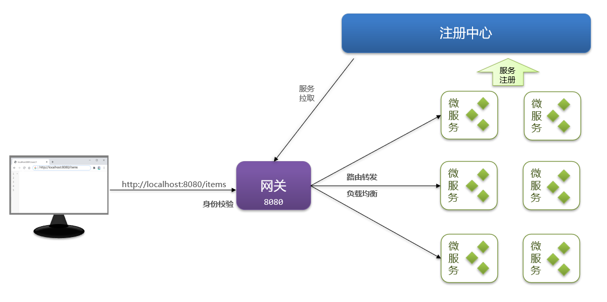

# 网关

网关就是网络的关口,负责请求的**路由、转发、身份校验**



SpringCloud中网关的实现包括两种:

1. **Spring Cloud Gateway**
- Spring官方出品
- 基于WebFlux响应式编程
- 无需调优即可获得优异性能

2. **Netfilx Zuul**
- Netflix出品
- 基于Servlet的阻塞式编程
- 需要调优才能获得与SpringCloudGateway类似的性能

# 网关路由

## 快速入门


1. 创建网关模块hm-gateway并引入网关相关的依赖

```xml
<!--common-->
<dependency>
    <groupId>com.heima</groupId>
    <artifactId>hm-common</artifactId>
    <version>1.0.0</version>
</dependency>
<!--网关-->
<dependency>
    <groupId>org.springframework.cloud</groupId>
    <artifactId>spring-cloud-starter-gateway</artifactId>
</dependency>
<!--nacos discovery-->
<dependency>
    <groupId>com.alibaba.cloud</groupId>
    <artifactId>spring-cloud-starter-alibaba-nacos-discovery</artifactId>
</dependency>
<!--负载均衡-->
<dependency>
    <groupId>org.springframework.cloud</groupId>
    <artifactId>spring-cloud-starter-loadbalancer</artifactId>
</dependency>
```

2. 编写启动类

```java
package com.hmall.gateway;

import org.springframework.boot.SpringApplication;
import org.springframework.boot.autoconfigure.SpringBootApplication;

@SpringBootApplication
public class GatewayApplication {
    public static void main(String[] args) {
        SpringApplication.run(GatewayApplication.class, args);
    }
}
```

3. 配置路由规则

```yaml
server:
  port: 8080
spring:
  application:
    name: gateway
  cloud:
    nacos:
      server-addr: 192.168.149.127:8848
    gateway:
      routes:
        - id: item-service # 商品管理
          uri: lb://item-service
          predicates:
            - Path=/items/**,/search/**
        - id: cart-service # 购物车管理
          uri: lb://cart-service
          predicates:
            - Path=/carts/**
        - id: user-service # 用户管理
          uri: lb://user-service
          predicates:
            - Path=/users/**,/addresses/**
        - id: trade-service # 交易管理
          uri: lb://trade-service
          predicates:
            - Path=/orders/**
        - id: pay-service # 支付管理
          uri: lb://pay-service
          predicates:
            - Path=/pay-orders/**
```

## 路由属性

**网关路由**对应的Java类型是RouteDefinition,其中常见的属性有:

- id:路由唯一标示
- uri:路由目标地址
- predicates:路由断言,判断请求是否符合当前路由
- filters:路由过滤器,对请求或响应做特殊处理。

### 路由断言


### 路由过滤器


# 网关登录校验

## 网关请求处理流程


## 思路分析

问题:


思路:


## 自定义过滤器

网关过滤器链中的过滤器有两种:
- **GlobalFilter**:全局过滤器,作用范围是所有路由,不可配置
- **GatewayFilter**:路由过滤器,作用范围比较灵活,可以是任意指定的路由Route

注意:
1. GatewayFilter和GlobalFilter这两种过滤器的**方法签名完全一致**                    
2. 过滤器链之外还有一种过滤器,**HttpHeadersFilter**,用来处理传递到下游微服务的请求头                             
例如org.springframework.cloud.gateway.filter.headers.XForwardedHeadersFilter可以传递代理请求原本的host头到下游微服务                     

### GlobalFilter


自定义GlobalFilter比较简单,直接实现GlobalFilter接口即可:

```java
package com.hmall.gateway.filters;

import org.springframework.cloud.gateway.filter.GatewayFilterChain;
import org.springframework.cloud.gateway.filter.GlobalFilter;
import org.springframework.core.Ordered;
import org.springframework.http.HttpHeaders;
import org.springframework.http.server.reactive.ServerHttpRequest;
import org.springframework.stereotype.Component;
import org.springframework.web.server.ServerWebExchange;
import reactor.core.publisher.Mono;

@Component
public class MyGlobalFilter implements GlobalFilter, Ordered {
    @Override
    public Mono<Void> filter(ServerWebExchange exchange, GatewayFilterChain chain) {
        // 获取请求
        ServerHttpRequest request = exchange.getRequest();
        // 过滤器业务处理
        HttpHeaders headers = request.getHeaders();
        System.out.println("headers:" + headers);
        System.out.println("GlobalFilter running...");
        // 放行
        return chain.filter(exchange);
    }

    @Override
    public int getOrder() {
        // 过滤器执行顺序,值越小,优先级越高
        return 0;
    }
}
```

### GatewayFilter

自定义GatewayFilter不是直接实现GatewayFilter,而是实现AbstractGatewayFilterFactory

#### 无参

```java
package com.hmall.gateway.filters;

import org.springframework.cloud.gateway.filter.GatewayFilter;
import org.springframework.cloud.gateway.filter.GatewayFilterChain;
import org.springframework.cloud.gateway.filter.OrderedGatewayFilter;
import org.springframework.cloud.gateway.filter.factory.AbstractGatewayFilterFactory;
import org.springframework.http.HttpHeaders;
import org.springframework.http.server.reactive.ServerHttpRequest;
import org.springframework.web.server.ServerWebExchange;
import reactor.core.publisher.Mono;

public class PrintAnyGatewayFilterFactory extends AbstractGatewayFilterFactory<Object> {
    @Override
    public GatewayFilter apply(Object config) {
        return new OrderedGatewayFilter(new GatewayFilter() {
            @Override
            public Mono<Void> filter(ServerWebExchange exchange, GatewayFilterChain chain) {
                // 获取请求
                ServerHttpRequest request = exchange.getRequest();
                // 过滤器业务处理
                HttpHeaders headers = request.getHeaders();
                System.out.println("headers:" + headers);
                System.out.println("GatewayFilter running...");
                // 放行
                return chain.filter(exchange);
            }
        }, 1);
    }
}
```

```yaml
spring:
  cloud:
    gateway:
      default-filters:
        - PrintAny
```

#### 带参

```java
package com.hmall.gateway.filters;

import lombok.Data;
import org.springframework.cloud.gateway.filter.GatewayFilter;
import org.springframework.cloud.gateway.filter.GatewayFilterChain;
import org.springframework.cloud.gateway.filter.OrderedGatewayFilter;
import org.springframework.cloud.gateway.filter.factory.AbstractGatewayFilterFactory;
import org.springframework.http.HttpHeaders;
import org.springframework.http.server.reactive.ServerHttpRequest;
import org.springframework.stereotype.Component;
import org.springframework.web.server.ServerWebExchange;
import reactor.core.publisher.Mono;

import java.util.Arrays;
import java.util.List;

@Component
public class PrintAnyGatewayFilterFactory extends AbstractGatewayFilterFactory<PrintAnyGatewayFilterFactory.Config> {
    @Override
    public GatewayFilter apply(Config config) {
        return new OrderedGatewayFilter(new GatewayFilter() {
            @Override
            public Mono<Void> filter(ServerWebExchange exchange, GatewayFilterChain chain) {
                // 获取请求
                ServerHttpRequest request = exchange.getRequest();
                // 过滤器业务处理
                HttpHeaders headers = request.getHeaders();
                System.out.println("headers:" + headers);
                System.out.println("GatewayFilter running...");
                // 放行
                return chain.filter(exchange);
            }
        }, 1);
    }

    // 自定义配置属性,成员变量名称很重要,下面会用到
    @Data
    public static class Config {
        private String a;
        private String b;
        private String c;
    }

    // 将变量名称依次返回,顺序很重要,将来读取参数时需要按照顺序获取
    @Override
    public List<String> shortcutFieldOrder() {
        return Arrays.asList("a", "b", "c");
    }

    // 将Config字节码传递给父类,父类负责读取yaml配置
    public PrintAnyGatewayFilterFactory() {
        super(Config.class);
    }
}
```

```yaml
spring:
  cloud:
    gateway:
      default-filters:
        - PrintAny=1,2,3
```

## 实现登录校验

黑马商城是基于JWT实现的登录校验,现在基于GlobalFilter来实现登录校验

application.yaml:

```yaml
hm:
  jwt:
    location: classpath:hmall.jks
    alias: hmall
    password: hmall123
    tokenTTL: 30m
  auth:
    excludePaths:
      - /search/**
      - /users/login
      - /items/**
```

AuthProperties.java:

```java
package com.hmall.gateway.config;

import lombok.Data;
import org.springframework.boot.context.properties.ConfigurationProperties;
import org.springframework.stereotype.Component;

import java.util.List;

@Data
@Component
@ConfigurationProperties(prefix = "hm.auth")
public class AuthProperties {
    private List<String> includePaths;
    private List<String> excludePaths;
}
```

JwtProperties.java:

```java
package com.hmall.gateway.config;

import lombok.Data;
import org.springframework.boot.context.properties.ConfigurationProperties;
import org.springframework.core.io.Resource;

import java.time.Duration;

@Data
@ConfigurationProperties(prefix = "hm.jwt")
public class JwtProperties {
    private Resource location;
    private String password;
    private String alias;
    private Duration tokenTTL = Duration.ofMinutes(10);
}
```

SecurityConfig.java:

```java
package com.hmall.gateway.config;

import org.springframework.boot.context.properties.EnableConfigurationProperties;
import org.springframework.context.annotation.Bean;
import org.springframework.context.annotation.Configuration;
import org.springframework.security.crypto.bcrypt.BCryptPasswordEncoder;
import org.springframework.security.crypto.password.PasswordEncoder;
import org.springframework.security.rsa.crypto.KeyStoreKeyFactory;

import java.security.KeyPair;

@Configuration
@EnableConfigurationProperties(JwtProperties.class)
public class SecurityConfig {

    @Bean
    public PasswordEncoder passwordEncoder(){
        return new BCryptPasswordEncoder();
    }

    @Bean
    public KeyPair keyPair(JwtProperties properties){
        // 获取秘钥工厂
        KeyStoreKeyFactory keyStoreKeyFactory =
                new KeyStoreKeyFactory(
                        properties.getLocation(),
                        properties.getPassword().toCharArray());
        // 读取钥匙对
        return keyStoreKeyFactory.getKeyPair(
                properties.getAlias(),
                properties.getPassword().toCharArray());
    }
}
```

AuthGlobalFilter.java:

```java
package com.hmall.gateway.filters;

import cn.hutool.core.text.AntPathMatcher;
import com.hmall.common.exception.UnauthorizedException;
import com.hmall.gateway.config.AuthProperties;
import com.hmall.gateway.utils.JwtTool;
import lombok.RequiredArgsConstructor;
import org.springframework.cloud.gateway.filter.GatewayFilterChain;
import org.springframework.cloud.gateway.filter.GlobalFilter;
import org.springframework.core.Ordered;
import org.springframework.http.HttpStatus;
import org.springframework.http.server.reactive.ServerHttpRequest;
import org.springframework.http.server.reactive.ServerHttpResponse;
import org.springframework.stereotype.Component;
import org.springframework.web.server.ServerWebExchange;
import reactor.core.publisher.Mono;

import java.util.List;

@Component
@RequiredArgsConstructor
public class AuthGlobalFilter implements GlobalFilter, Ordered {

    private final AuthProperties authProperties;

    private final JwtTool jwtTool;

    private final AntPathMatcher antPathMatcher = new AntPathMatcher();

    @Override
    public Mono<Void> filter(ServerWebExchange exchange, GatewayFilterChain chain) {
        // 获取request
        ServerHttpRequest request = exchange.getRequest();
        // 判断是否需要做登录拦截
        if (isExclude(request.getPath().toString())) {
            return chain.filter(exchange);
        }
        // 获取token
        String token = null;
        List<String> headers = request.getHeaders().get("authorization");
        if (headers != null && !headers.isEmpty()) {
            token = headers.get(0);
        }
        // 校验并解析token
        Long userId = null;
        try {
            userId = jwtTool.parseToken(token);
        } catch (UnauthorizedException e) {
            // 拦截,设置响应状态码为401
            ServerHttpResponse response = exchange.getResponse();
            response.setStatusCode(HttpStatus.UNAUTHORIZED);
            return response.setComplete();
        }
        // TODO 传递用户信息
        System.out.println("userId = " + userId);
        // 放行
        return chain.filter(exchange);
    }

    /**
     * 判断是否需要做登录拦截
     *
     * @param path
     * @return
     */
    private boolean isExclude(String path) {
        for (String pathPattern : authProperties.getExcludePaths()) {
            if (antPathMatcher.match(pathPattern, path)) {
                return true;
            }
        }
        return false;
    }

    /**
     * 过滤器优先级
     *
     * @return
     */
    @Override
    public int getOrder() {
        // 过滤器执行顺序,值越小,优先级越高
        return 0;
    }
}
```

# 网关传递用户信息到微服务

1. 在网关的登录校验过滤器中,把获取到的用户写入请求头

需求:修改gateway模块中的登录校验拦截器,在校验成功后保存用户到下游请求的请求头中                          
提示:要修改转发到微服务的请求,需要用到ServerWebExchange类提供的API,示例如下:

```java
exchange.mutate() // mutate就是对下游请求做更改
        .request(builder -> builder.header("user-info", userInfo))
        .build();
```

AuthGlobalFilter中传递用户信息:

```java
@Override
public Mono<Void> filter(ServerWebExchange exchange, GatewayFilterChain chain) {
    // 获取request
    ServerHttpRequest request = exchange.getRequest();
    // 判断是否需要做登录拦截
    if (isExclude(request.getPath().toString())) {
        return chain.filter(exchange);
    }
    // 获取token
    String token = null;
    List<String> headers = request.getHeaders().get("authorization");
    if (headers != null && !headers.isEmpty()) {
        token = headers.get(0);
    }
    // 校验并解析token
    Long userId = null;
    try {
        userId = jwtTool.parseToken(token);
    } catch (UnauthorizedException e) {
        // 拦截,设置响应状态码为401
        ServerHttpResponse response = exchange.getResponse();
        response.setStatusCode(HttpStatus.UNAUTHORIZED);
        return response.setComplete();
    }
    // 传递用户信息
    String userInfo = userId.toString();
    ServerWebExchange swe = exchange.mutate()
            .request(builder -> builder.header("user-info", userInfo))
            .build();
    // 放行
    return chain.filter(swe);
}
```

2. 在hm-common中编写SpringMVC拦截器,获取登录用户

需求:由于每个微服务都可能有获取登录用户的需求,因此在hm-common模块定义拦截器,这样微服务只需要引入依赖即可生效,无需重复编写

UserInfoInterceptor.java:

```java
package com.hmall.common.interceptors;

import cn.hutool.core.util.StrUtil;
import com.hmall.common.utils.UserContext;
import org.springframework.web.servlet.HandlerInterceptor;

import javax.servlet.http.HttpServletRequest;
import javax.servlet.http.HttpServletResponse;

public class UserInfoInterceptor implements HandlerInterceptor {
    @Override
    public boolean preHandle(HttpServletRequest request, HttpServletResponse response, Object handler) throws Exception {
        // 获取登录用户信息
        String userInfo = request.getHeader("user-info");
        // 判断是否获取了用户,如果有,存入ThreadLocal
        if (StrUtil.isNotBlank(userInfo)) {
            UserContext.setUser(Long.valueOf(userInfo));
        }
        // 放行
        return true;
    }

    @Override
    public void afterCompletion(HttpServletRequest request, HttpServletResponse response, Object handler, Exception ex) throws Exception {
        // 清理用户
        UserContext.removeUser();
    }
}
```

MvcConfig.java:

```java
package com.hmall.common.config;

import com.hmall.common.interceptors.UserInfoInterceptor;
import org.springframework.boot.autoconfigure.condition.ConditionalOnClass;
import org.springframework.context.annotation.Configuration;
import org.springframework.web.servlet.DispatcherServlet;
import org.springframework.web.servlet.config.annotation.InterceptorRegistry;
import org.springframework.web.servlet.config.annotation.WebMvcConfigurer;

@Configuration
@ConditionalOnClass(DispatcherServlet.class)
public class MvcConfig implements WebMvcConfigurer {
    @Override
    public void addInterceptors(InterceptorRegistry registry) {
        registry.addInterceptor(new UserInfoInterceptor());
    }
}
```

需要注意的是,**这个配置类默认是不会生效的**,因为它所在的包是com.hmall.common.config,与其它微服务的扫描包不一致,无法被扫描到,因此无法生效,基于SpringBoot的自动装配原理,要将其添加到resources目录下的META-INF/spring.factories文件中:

```properties
org.springframework.boot.autoconfigure.EnableAutoConfiguration=\
  com.hmall.common.config.MyBatisConfig,\
  com.hmall.common.config.MvcConfig,\
  com.hmall.common.config.JsonConfig
```

# OpenFeign传递用户信息

由于微服务获取用户信息是通过拦截器在请求头中读取,因此要想实现微服务之间的用户信息传递,就必须在微服务发起调用时把用户信息存入请求头

借助Feign中提供的一个拦截器接口:feign.RequestInterceptor:

```java
public interface RequestInterceptor {

  /**
   * Called for every request. 
   * Add data using methods on the supplied {@link RequestTemplate}.
   */
  void apply(RequestTemplate template);
}
```

hm-api引入hm-common依赖,以使用UserContext:

```xml
<!--hm-common-->
<dependency>
    <groupId>com.heima</groupId>
    <artifactId>hm-common</artifactId>
    <version>1.0.0</version>
</dependency>
```

DefaultFeignConfig.java:

```java
package com.hmall.api.config;

import com.hmall.common.utils.UserContext;
import feign.Logger;
import feign.RequestInterceptor;
import feign.RequestTemplate;
import org.springframework.context.annotation.Bean;

/**
 * OpenFeign日志
 */
public class DefaultFeignConfig {
    @Bean
    public Logger.Level feignLoggerLevel() {
        return Logger.Level.FULL;
    }

    @Bean
    public RequestInterceptor userInfoRequestInterceptor() {
        return new RequestInterceptor() {
            @Override
            public void apply(RequestTemplate template) {
                // 获取登录用户
                Long userId = UserContext.getUser();
                if (userId == null) {
                    // 如果为空则直接跳过
                    return;
                }
                // 如果不为空则放入请求头中,传递给下游微服务
                template.header("user-info", userId.toString());
            }
        };
    }
}
```

# 配置管理


## 配置共享

### 添加配置到Nacos

添加一些共享配置到Nacos中,包括：Jdbc、MybatisPlus、日志、Swagger、OpenFeign等配置

shared-jdbc.yaml:

```yaml
spring:
  datasource:
    url: jdbc:mysql://${hm.db.host:192.168.149.127}:${hm.db.port:3306}/${hm.db.database}?useUnicode=true&characterEncoding=UTF-8&autoReconnect=true&serverTimezone=Asia/Shanghai
    driver-class-name: com.mysql.cj.jdbc.Driver
    username: ${hm.db.un:root}
    password: ${hm.db.pw:123456}
mybatis-plus:
  configuration:
    default-enum-type-handler: com.baomidou.mybatisplus.core.handlers.MybatisEnumTypeHandler
  global-config:
    db-config:
      update-strategy: not_null
      id-type: auto
```

shared-log.yaml:

```yaml
logging:
  level:
    com.hmall: debug
  pattern:
    dateformat: HH:mm:ss:SSS
  file:
    path: "logs/${spring.application.name}"
```

shared-swagger.yaml:

```yaml
knife4j:
  enable: true
  openapi:
    title: ${hm.swagger.title:黑马商城接口文档}
    description: ${hm.swagger.desc:黑马商城接口文档}
    version: v1.0.0
    group:
      default:
        group-name: default
        api-rule: package
        api-rule-resources:
          - ${hm.swagger.package}
```

### 拉取共享配置

基于NacosConfig拉取共享配置代替微服务的本地配置


#### 引入依赖

```xml
<!--nacos配置管理-->
<dependency>
    <groupId>com.alibaba.cloud</groupId>
    <artifactId>spring-cloud-starter-alibaba-nacos-config</artifactId>
</dependency>
<!--读取bootstrap文件-->
<dependency>
    <groupId>org.springframework.cloud</groupId>
    <artifactId>spring-cloud-starter-bootstrap</artifactId>
</dependency>
```

#### 新建bootstrap.yaml

以cart-service模块为例:

bootstrap.yaml:

```yaml
spring:
  application:
    name: cart-service # 服务名称
  profiles:
    active: dev
  cloud:
    nacos:
      server-addr: 192.168.149.127 # nacos地址
      config:
        file-extension: yaml # 文件后缀名
        shared-configs: # 共享配置
          - dataId: shared-jdbc.yaml # 共享mybatis配置
          - dataId: shared-log.yaml # 共享日志配置
          - dataId: shared-swagger.yaml # 共享swagger配置
```

优化application.yaml:

```java
server:
  port: 8082
feign:
  okhttp:
    enabled: true # 开启OKHttp连接池支持
hm:
  db:
    database: hm-cart
  log:
    spring:
      application:
        name: hm-cart
  swagger:
    title: "黑马商城购物车管理相关接口文档"
    desc: "黑马商城购物车管理相关接口文档"
    package: com.hmall.cart.controller
```

## 配置热更新

**配置热更新**:当修改配置文件中的配置时,微服务**无需重启**即可使配置生效


### 范例

需求:购物车的限定数量目前是写死在业务中的,将其改为读取配置文件属性,并将配置交给Nacos管理,实现热更新

nacos中的cart-service.yaml:

```yaml
hm:
  cart:
    maxItems: 10
```

CartProperties.java:

```java
package com.hmall.cart.config;

import lombok.Data;
import org.springframework.boot.context.properties.ConfigurationProperties;
import org.springframework.stereotype.Component;

@Data
@Component
@ConfigurationProperties(prefix = "hm.cart")
public class CartProperties {
    private Integer maxItems;
}
```

CartServiceImpl.java:

```java
private void checkCartsFull(Long userId) {
        int count = lambdaQuery().eq(Cart::getUserId, userId).count();
        if (count >= cartProperties.getMaxItems()) {
            throw new BizIllegalException(
                    StrUtil.format("用户购物车课程不能超过{}", cartProperties.getMaxItems()));
        }
    }
```

## 动态路由

[Nacos的Java SDK](https://nacos.io/zh-cn/docs/sdk.html)

要实现**动态路由**,首先要将路由配置保存到Nacos,当Nacos中的路由配置变更时,推送最新配置到网关,实时更新网关中的路由信息

### 监听Nacos配置变更

如果希望Nacos推送配置变更,可以使用Nacos动态监听配置接口来实现,示例如下:

```java
String serverAddr = "{serverAddr}";
String dataId = "{dataId}";
String group = "{group}";
// 1.创建ConfigService,连接Nacos
Properties properties = new Properties();
properties.put("serverAddr", serverAddr);
ConfigService configService = NacosFactory.createConfigService(properties);
// 2.读取配置
String content = configService.getConfig(dataId, group, 5000);
// 3.添加配置监听器
configService.addListener(dataId, group, new Listener() {
        @Override
        public void receiveConfigInfo(String configInfo) {
        // 配置变更的通知处理
                System.out.println("recieve1:" + configInfo);
        }
        @Override
        public Executor getExecutor() {
                return null;
        }
});
```

这里核心的步骤有2步:
- 创建ConfigService,目的是连接到Nacos
- 添加配置监听器,编写配置变更的通知处理逻辑

### 更新路由

监听到路由信息后,可以利用RouteDefinitionWriter来更新路由表

RouteDefinitionWriter.java:

```java
package org.springframework.cloud.gateway.route;

import reactor.core.publisher.Mono;

/**
 * @author Spencer Gibb
 */
public interface RouteDefinitionWriter {
        /**
     * 更新路由到路由表,如果路由id重复,则会覆盖旧的路由
     */
        Mono<Void> save(Mono<RouteDefinition> route);
        /**
     * 根据路由id删除某个路由
     */
        Mono<Void> delete(Mono<String> routeId);

}
```

RouteDefinition包含下列常见字段:
- id:路由id
- predicates:路由匹配规则
- filters:路由过滤器
- uri:路由目的地


### 范例

网关gateway引入依赖:

```xml
<!--统一配置管理-->
<dependency>
    <groupId>com.alibaba.cloud</groupId>
    <artifactId>spring-cloud-starter-alibaba-nacos-config</artifactId>
</dependency>
<!--加载bootstrap-->
<dependency>
    <groupId>org.springframework.cloud</groupId>
    <artifactId>spring-cloud-starter-bootstrap</artifactId>
</dependency>
```

bootstrap.yaml:

```yaml
spring:
  application:
    name: gateway # 服务名称
  profiles:
    active: dev
  cloud:
    nacos:
      server-addr: 192.168.149.127 # nacos地址
      config:
        file-extension: yaml # 文件后缀名
        shared-configs: # 共享配置
          - dataId: shared-log.yaml # 共享日志配置
```

优化application.yaml:

```yaml
server:
  port: 8080
hm:
  jwt:
    location: classpath:hmall.jks
    alias: hmall
    password: hmall123
    tokenTTL: 30m
  auth:
    excludePaths:
      - /search/**
      - /users/login
      - /items/**
```

Nacos中的gateway-routes.json:

```json
[
    {
        "id": "item",
        "predicates": [{
            "name": "Path",
            "args": {"_genkey_0":"/items/**", "_genkey_1":"/search/**"}
        }],
        "filters": [],
        "uri": "lb://item-service"
    },
    {
        "id": "cart",
        "predicates": [{
            "name": "Path",
            "args": {"_genkey_0":"/carts/**"}
        }],
        "filters": [],
        "uri": "lb://cart-service"
    },
    {
        "id": "user",
        "predicates": [{
            "name": "Path",
            "args": {"_genkey_0":"/users/**", "_genkey_1":"/addresses/**"}
        }],
        "filters": [],
        "uri": "lb://user-service"
    },
    {
        "id": "trade",
        "predicates": [{
            "name": "Path",
            "args": {"_genkey_0":"/orders/**"}
        }],
        "filters": [],
        "uri": "lb://trade-service"
    },
    {
        "id": "pay",
        "predicates": [{
            "name": "Path",
            "args": {"_genkey_0":"/pay-orders/**"}
        }],
        "filters": [],
        "uri": "lb://pay-service"
    }
]
```

DynamicRouteLoader.java:

```java
package com.hmall.gateway.routers;

import cn.hutool.json.JSONUtil;
import com.alibaba.cloud.nacos.NacosConfigManager;
import com.alibaba.nacos.api.config.listener.Listener;
import com.alibaba.nacos.api.exception.NacosException;
import com.hmall.common.utils.CollUtils;
import lombok.RequiredArgsConstructor;
import lombok.extern.slf4j.Slf4j;
import org.springframework.cloud.gateway.route.RouteDefinition;
import org.springframework.cloud.gateway.route.RouteDefinitionWriter;
import org.springframework.stereotype.Component;
import reactor.core.publisher.Mono;

import javax.annotation.PostConstruct;
import java.util.HashSet;
import java.util.List;
import java.util.Set;
import java.util.concurrent.Executor;

@Component
@Slf4j
@RequiredArgsConstructor
public class DynamicRouteLoader {

    private final NacosConfigManager nacosConfigManager;
    private final RouteDefinitionWriter writer;

    // 路由配置文件的id和分组
    private final String dataId = "gateway-routes.json";
    private final String group = "DEFAULT_GROUP";
    // 保存更新过的路由id
    private final Set<String> routeIds = new HashSet<>();

    @PostConstruct
    public void initRouteConfigList() throws NacosException {
        // 项目启动,先拉取一次配置,并且添加配置监听器
        String configInfo = nacosConfigManager.getConfigService().
                getConfigAndSignListener(dataId, group, 5000, new Listener() {
                    @Override
                    public Executor getExecutor() {
                        return null;
                    }

                    @Override
                    public void receiveConfigInfo(String configInfo) {
                        // 舰艇到配置变更,更新到路由表
                        updateConfigInfo(configInfo);
                    }
                });
        // 第一次读取到配置,也更新到路由表
        updateConfigInfo(configInfo);
    }

    // 更新路由表
    private void updateConfigInfo(String configInfo) {
        log.debug("监听到路由配置变更:{}", configInfo);
        // 解析配置信息,转为RouteDefinition
        List<RouteDefinition> routeDefinitions = JSONUtil.toList(configInfo, RouteDefinition.class);
        // 更新前先清空旧路由
        // 清除旧路由
        for (String routeId : routeIds) {
            writer.delete(Mono.just(routeId)).subscribe();
        }
        routeIds.clear();
        // 判断是否有新的路由要更新
        if (CollUtils.isEmpty(routeDefinitions)) {
            // 无新路由配置,直接结束
            return;
        }
        // 更新路由
        routeDefinitions.forEach(routeDefinition -> {
            // 更新路由
            writer.save(Mono.just(routeDefinition)).subscribe();
            // 记录路由id,方便将来删除
            routeIds.add(routeDefinition.getId());
        });
    }
}
```