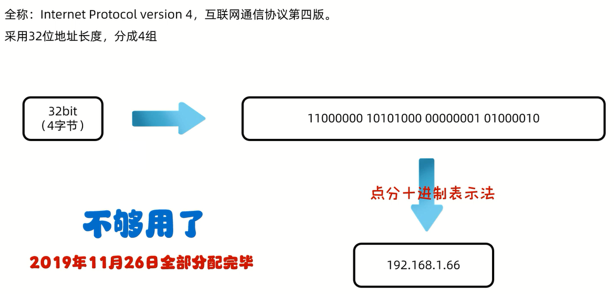
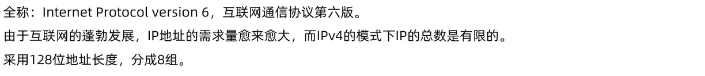
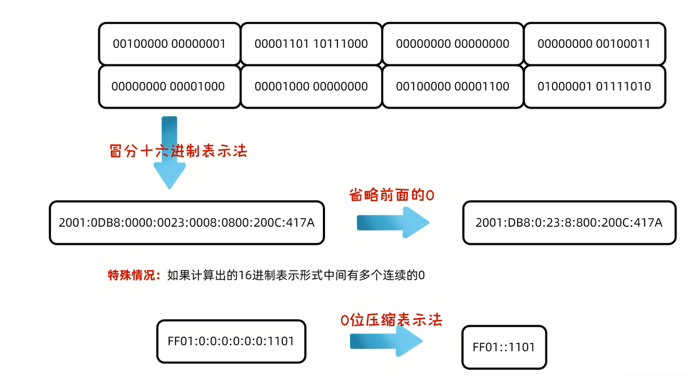
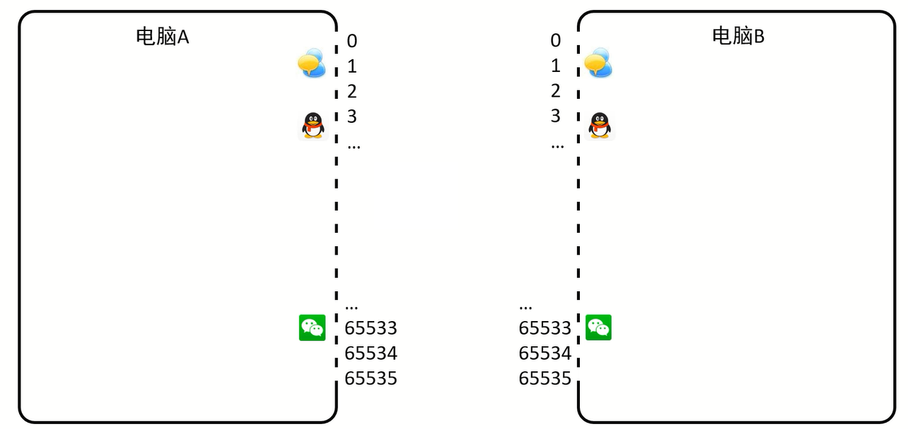
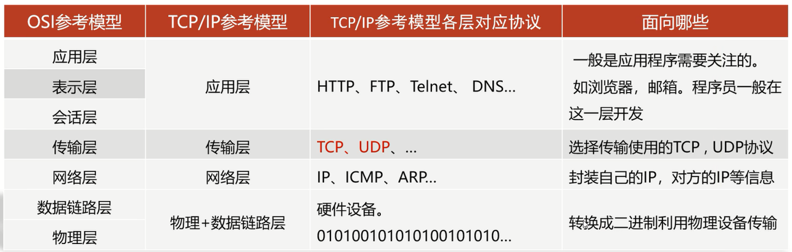
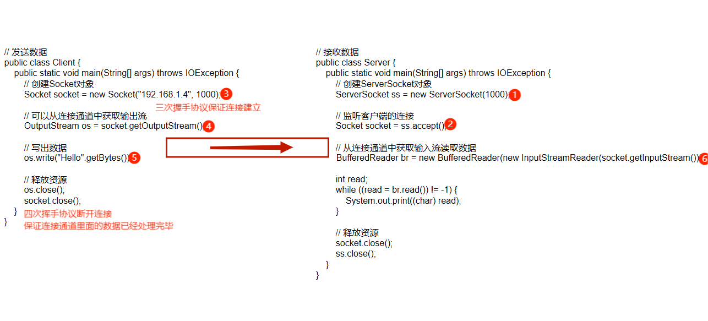
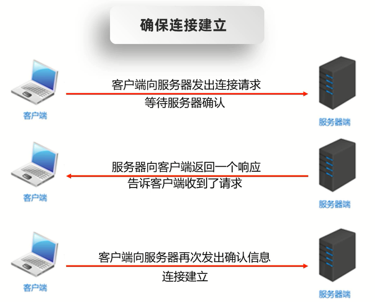
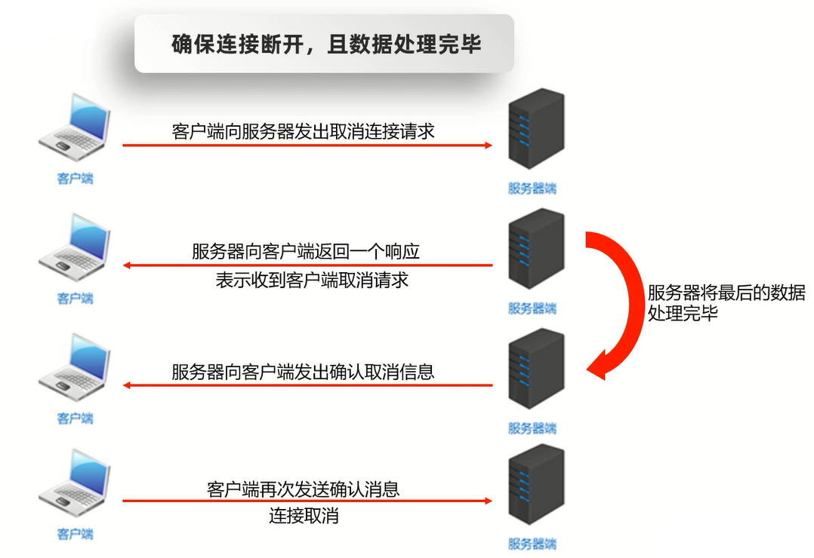

# 网络编程

在网络通信协议下,不同计算机上运行的程序,进行的数据传输

应用场景:即时通信、网游对战、金融证券、国际贸易、邮件等

不管是什么场景,都是**计算机和计算机之间通过网络进行数据传输**

Java中可以使用java.net包下的技术轻松开发出常见的网络应用程序

三要素:
1. IP:设备在网络中的地址,是唯一的标识                   
确定对方电脑在互联网上的地址
2. 端口号:应用程序在设备中唯一的标识                    
确定接收数据的软件
3. 协议:数据在网络中传输的规则                             
确定网络传输的规则                     
常见的协议有UDP、TCP、HTTP、HTTPS、FTP

# 软件架构

1. C/S:客户端/服务器
2. B/S:浏览器/服务器

## BS架构

只需要一个浏览器,用户通过不同的网址,客户访问不同的服务器

优缺点:
1. 不需要开发客户端,只需要页面+服务端
2. 用户不需要下载客户端,打开浏览器就能使用
3. 如果应用过大,用户体验受到影响

## CS架构

在用户本地需要下载并安装客户端程序,在远程有一个服务器程序

优缺点:
1. 可以做的非常精美,用户体验好
2. 需要开发客户端,也需要开发服务端
3. 用户需要下载和更新的时候太麻烦

# IP

全称:Internet Protocol,是互联网协议地址,也称IP地址,是分配给上网设备的数字标签                     

简单理解:**上网设备在网络中的地址,是唯一的**

IP分类:
1. IPv4
2. IPv6

## IPv4



IPv4的地址分类形式:
1. 公网地址(万维网使用)
2. 私有地址(局域网使用)                    
`192.168.`开头的就是私有地址,范围即为`192.168.0.0`-`192.168.255.255`,专门为组织机构内部使用,以此节省IP

特殊IP地址:`127.0.0.1`,也可以是`localhost:`                
这是回送地址,也称本地回环地址,也称本机IP,**永远只会寻找当前所在本机**

## IPv6





## 常用的CMD命令

- `ipconfig`:查看本地IP地址
- `ping`:检查网络是否连通

## InetAddress的使用

范例:

```java
import java.net.InetAddress;
import java.net.UnknownHostException;

public class Test {
    public static void main(String[] args) throws UnknownHostException {
        // 获取InetAddress的对象,即IP的对象
        // InetAddress address = InetAddress.getByName("192.168.1.4");
        InetAddress address = InetAddress.getByName("MateBookD");
        System.out.println(address);

        // 获取主机名,如果获取不到主机名,则返回IP
        String name = address.getHostName();
        System.out.println(name);

        // 获取主机IP
        String ip = address.getHostAddress();
        System.out.println(ip);
    }
}
```

# 端口号

应用程序在设备中的唯一标识

端口号:由两个字节表示的整数,取值范围:0-65535             
其中0-1023之间的端口号用于一些知名的网络服务或者应用               
自己使用1024以上的端口号             

细节:**一个端口号只能被一个应用程序使用**



# 协议

计算机网络中,连接和通信的规则被称为网络通信协议

- OSI参考模型:世界互联协议标准,全球通信规范,单模型过于理想化,未能在因特网上进行广泛推广
- TCP/IP参考模型(TCP/IP协议):事实上的国际标准



## UDP协议

用户数据报协议(User Datagram Protocol)             

UDP协议是**面向无连接**的通信协议

特点:速度快,由大小限制(一次最多发送64K),数据不安全,易丢失数据

### 发送数据

步骤:
1. 创建发送端DatagramSocket对象                  
细节:**绑定端口**
2. 数据打包(DatagramPacket)
3. 发送数据
4. 释放资源

范例:

```java
import java.io.IOException;
import java.net.*;

public class Test {
    public static void main(String[] args) throws IOException {
        // 创建发送端DatagramSocket对象
        // 绑定端口
        // 空参:所有可用的端口中随机一个进行使用
        // 有参:指定端口号进行绑定
        DatagramSocket ds = new DatagramSocket(10085);

        // 打包数据
        String str = "你好!";
        byte[] bytes = str.getBytes();
        InetAddress address = InetAddress.getByName("MateBookD");
        int port = 10086;
        DatagramPacket dp = new DatagramPacket(bytes, bytes.length, address, port);

        // 发送数据
        ds.send(dp);

        // 释放资源
        ds.close();
    }
}
```

### 接收数据

步骤:
1. 创建接收端DatagramSocket对象            
细节:**绑定端口,且该端口需与发送的端口保持一致**
2. 接收打包好的数据                   
3. 解析数据包
4. 释放资源

范例:

```java
import java.io.IOException;
import java.net.DatagramPacket;
import java.net.DatagramSocket;
import java.net.InetAddress;

public class Test {
    public static void main(String[] args) throws IOException {
        // 创建接收端DatagramSocket对象
        // 绑定端口,且该端口需与发送的端口保持一致
        DatagramSocket ds = new DatagramSocket(10086);

        // 接收数据包
        byte[] bytes = new byte[1024];
        DatagramPacket dp = new DatagramPacket(bytes, bytes.length);
        // receive方法是阻塞的,程序执行到这一步的时候,会在这里死等,等发送端发送消息
        ds.receive(dp);

        // 解析数据包
        byte[] data = dp.getData();
        int length = dp.getLength();
        InetAddress address = dp.getAddress();
        int port = dp.getPort();
        System.out.println("接收到的数据:" + new String(data, 0, length));
        System.out.println("该数据是从" + address + "这台电脑中的" + port + "端口发出的");

        // 释放资源
        ds.close();
    }
}
```

### 练习

聊天室

UDP发送数据:数据来自于键盘录入,直到输入的数据是886,发送数据结束
UDP接收数据:因为接收端不知道发送端什么时候停止发送,故采用死循环接收

```java
import java.io.IOException;
import java.net.DatagramPacket;
import java.net.DatagramSocket;
import java.net.InetAddress;
import java.util.Scanner;

public class sendInfo {
    public static void main(String[] args) throws IOException {
        // 发送数据
        DatagramSocket ds = new DatagramSocket(10085);
        while (true) {
            System.out.print("请输入要发送的数据:");
            Scanner sc = new Scanner(System.in);
            String str = sc.nextLine();
            byte[] bytes = str.getBytes();
            InetAddress address = InetAddress.getByName("MateBookD");
            int port = 10086;
            DatagramPacket dp = new DatagramPacket(bytes, 0, bytes.length, address, port);
            ds.send(dp);
            if (str.equals("886")) {
                break;
            }
        }
        ds.close();
    }
}
```

```java
import java.io.IOException;
import java.net.DatagramPacket;
import java.net.DatagramSocket;
import java.net.InetAddress;

public class receiveInfo {
    public static void main(String[] args) throws IOException {
        // 接收数据
        DatagramSocket ds = new DatagramSocket(10086);
        while (true) {
            byte[] bytes = new byte[1024];
            DatagramPacket dp = new DatagramPacket(bytes, bytes.length);
            ds.receive(dp);
            InetAddress address = dp.getAddress();
            byte[] data = dp.getData();
            int length = dp.getLength();
            String str = new String(data, 0, length);
            System.out.print(address + ":");
            System.out.println(str);
            if (str.equals("886")) {
                break;
            }
        }
        ds.close();
    }
}
```

### 通信方式

1. 单播
2. 组播             
组播地址:`224.0.0.0`-`239.255.255.255`           
其中`224.0.0.0`-`224.0.0.255`为预留的组播地址                     

范例:

```java
import java.io.IOException;
import java.net.DatagramPacket;
import java.net.InetAddress;
import java.net.MulticastSocket;

public class SendMessageDemo {
    public static void main(String[] args) throws IOException {
        // 创建MulticastSocket对象
        MulticastSocket ms = new MulticastSocket();
        // 创建DatagramPacket对象
        String s = "你好,你好!";
        byte[] bytes = s.getBytes();
        InetAddress address = InetAddress.getByName("224.0.0.1");
        int port = 10000;
        DatagramPacket datagramPacket = new DatagramPacket(bytes, bytes.length, address, port);
        // 调用MulticastSocket发送数据方法发送数据
        ms.send(datagramPacket);
        // 释放资源
        ms.close();
    }
}
```

```java
import java.io.IOException;
import java.net.DatagramPacket;
import java.net.InetAddress;
import java.net.MulticastSocket;

public class ReceiveMessageDemo1 {
    public static void main(String[] args) throws IOException {
        // 创建MulticastSocket对象
        MulticastSocket ms = new MulticastSocket(10000);
        // 将当前本机,添加到224.0.0.1的这一组当中
        InetAddress address = InetAddress.getByName("224.0.0.1");
        ms.joinGroup(address);
        // 创建DatagramPacket数据包对象
        byte[] bytes = new byte[1024];
        DatagramPacket dp = new DatagramPacket(bytes, bytes.length);
        // 接收数据
        ms.receive(dp);
        // 解析数据
        byte[] data = dp.getData();
        int len = dp.getLength();
        String ip = dp.getAddress().getHostAddress();
        String name = dp.getAddress().getHostName();
        System.out.println("ip为:" + ip + ",主机名为:" + name + "的人,发送了数据:" + new String(data, 0, len));
        // 释放资源
        ms.close();
    }
}
```

3. 广播                  
广播地址:`255.255.255.255`

## TCP协议

传输控制协议(Transmission Control Protocol)

TCP协议是**面向连接**的通信协议

特点:速度慢,没有大小限制,数据安全

TCP协议在通信的两端各建立一个Socket对象,**通信之前要保证连接已经建立**,通过Socket产生IO流来进行网络通信

### 发送数据

步骤:
1. 创建客户端Socket对象(Socket)与指定服务端连接               
`Socket(String host,int port)`             
细节:**在创建对象的同时会连接服务器,如果连接不上,代码会报错**
2. 获取输出流,写数据            
`OutputStream getOutputStream()`
3. 释放资源            
`void close()`

范例:

```java
import java.io.IOException;
import java.io.OutputStream;
import java.net.Socket;

// 发送数据
public class Client {
    public static void main(String[] args) throws IOException {
        // 创建Socket对象
        Socket socket = new Socket("192.168.1.4", 1000);

        // 可以从连接通道中获取输出流
        OutputStream os = socket.getOutputStream();

        // 写出数据
        os.write("Hello".getBytes());

        // 释放资源
        // 通道关了,里面的流自然会消失
        // os.close();
        socket.close();
    }
}
```

### 接收数据

步骤:
1. 创建服务器Socket对象(ServerSocket)                 
`ServerSocket(int port)`
2. 监听客户端连接,返回一个Socket对象                
`Socket accept()`
3. 获取输入流,读数据,并把数据显示在控制台               
`InputStream getInputStream()`
4. 释放资源               
`void close()`

范例:

```java
import java.io.BufferedReader;
import java.io.IOException;
import java.io.InputStream;
import java.io.InputStreamReader;
import java.net.ServerSocket;
import java.net.Socket;

// 接收数据
public class Server {
    public static void main(String[] args) throws IOException {
        // 创建ServerSocket对象
        ServerSocket ss = new ServerSocket(1000);

        // 监听客户端的连接
        Socket socket = ss.accept();

        // 从连接通道中获取输入流读取数据
        // InputStream is = socket.getInputStream();
        // InputStreamReader isr = new InputStreamReader(is);
        // BufferedReader br = new BufferedReader(isr);
        BufferedReader br = new BufferedReader(new InputStreamReader(socket.getInputStream()));
        
        int read;
        while ((read = br.read()) != -1) {
            System.out.print((char) read);
        }

        // 释放资源
        socket.close();
        ss.close();
    }
}
```

### TCP协议代码细节



### 三次握手



### 四次挥手

