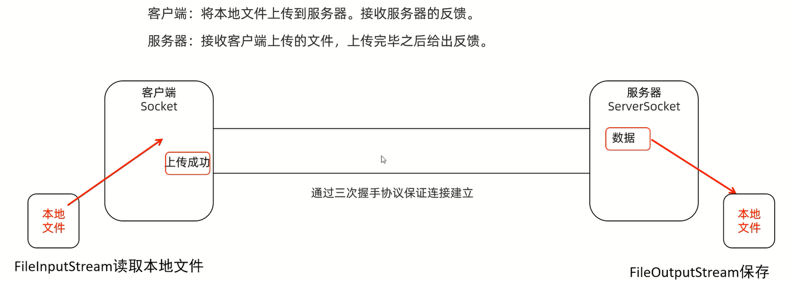

# TCP通信

## 多发多收

客户端:多次发送数据            
服务器:多次接收数据并打印

```java

```

```java

```

## 接收和反馈

客户端:发送一条数据,接收服务端反馈的消息并打印                      
服务器:接收数据并打印,再给客户端反馈消息

```java

```

```java

```

## 上传文件



```java

```

```java

```

## 上传文件(文件名重复问题)

解决上传的文件的文件名重复的问题

```java

```

```java

```

## 上传文件(多线程)

实现服务器不停止,能接收很多用户上传的图片

```java

```

```java

```

## 上传文件(线程池优化)

```java

```

```java

```

## BS(接收浏览器的消息并打印)

客户端:不需要写           
服务器:接收数据并打印

```java

```

```java

```