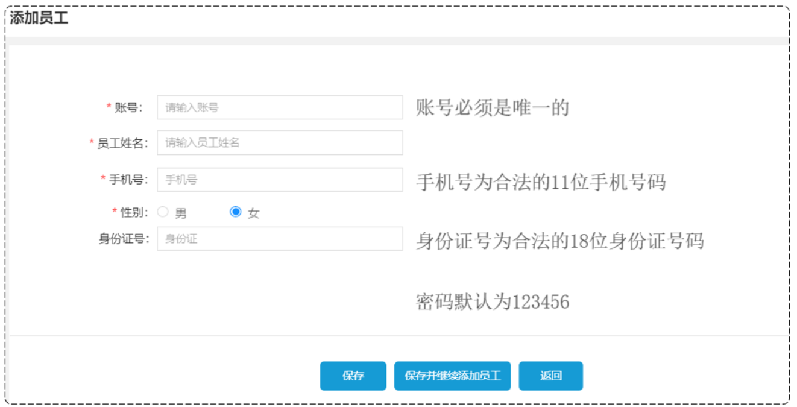
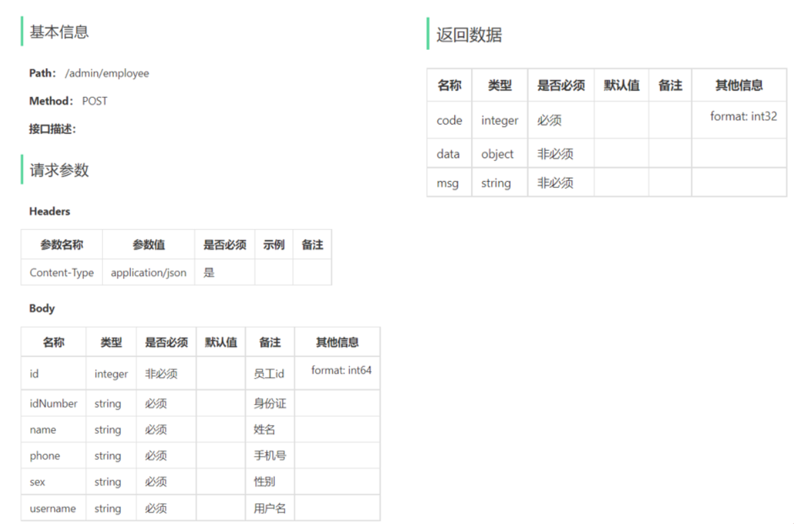
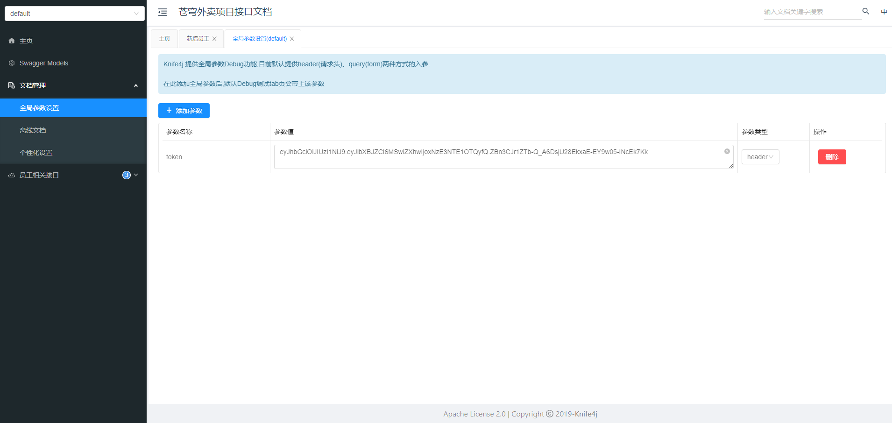

# 员工管理

项目约定:
1. 管理端发出的请求,统一使用`/admin`作为前缀
2. 用户端发出的请求,统一使用`/user`作为前缀

## 新增员工

### 需求分析



### 接口设计



### 代码开发

细节:**当前端提交的数据和实体类中对应的属性差别比较大的时候,建议使用DTO来封装数据**

EmployeeController:

```java
/**
 * 新增员工
 *
 * @param employeeDTO
 * @return
 */
@PostMapping
@ApiOperation("新增员工")
public Result save(@RequestBody EmployeeDTO employeeDTO) {
    log.info("新增员工:{}", employeeDTO);
    employeeService.save(employeeDTO);
    return Result.success();
}
```

EmployeeService:

```java
/**
 * 新增员工
 *
 * @param employeeDTO
 */
void save(EmployeeDTO employeeDTO);
```

EmployeeServiceImpl:

```java
/**
 * 新增员工
 *
 * @param employeeDTO
 */
@Override
public void save(EmployeeDTO employeeDTO) {
    Employee employee = new Employee();
    // 对象属性拷贝
    BeanUtils.copyProperties(employeeDTO, employee);
    // 设置账号状态,默认正常状态,1表示正常,0表示锁定
    employee.setStatus(StatusConstant.ENABLE);
    // 设置密码,默认密码123456
    employee.setPassword(DigestUtils.md5DigestAsHex(PasswordConstant.DEFAULT_PASSWORD.getBytes()));
    // 设置当前记录的创建时间和更新时间
    employee.setCreateTime(LocalDateTime.now());
    employee.setUpdateTime(LocalDateTime.now());
    // 设置当前记录的创建人id和修改人id
    // TODO 后期需要改为当前登录用户的id
    employee.setCreateUser(10L);
    employee.setUpdateUser(10L);
    employeeMapper.insert(employee);
}
```

EmployeeMapper:

```java
/**
 * 新增员工
 * 
 * @param employee
 */
@Insert("insert into employee(name, username, password, phone, sex, id_number, status, create_time, update_time, create_user, update_user) " +
        "VALUES " +
        "(#{name},#{username},#{password},#{phone},#{sex},#{idNumber},#{status},#{createTime},#{updateTime},#{createUser},#{updateUser})")
void insert(Employee employee);
```

### 功能测试

将合法的JWT令牌添加到全局参数中



### 代码完善

问题:
1. 录入的用户名已存在,抛出异常后没有处理
2. 新增员工时,创建人id和修改人id设置为了固定值

#### 解决问题1

通过全局异常处理器处理

GlobalExceptionHandler:

```java
/**
 * 处理SQL异常
 *
 * @param ex
 * @return
 */
@ExceptionHandler
public Result exceptionHandler(SQLIntegrityConstraintViolationException ex) {
    // 获取异常信息
    String message = ex.getMessage();
    // 用户名重复异常
    if (message.contains("Duplicate entry")) {
        String[] split = message.split(" ");
        String username = split[2];
        String msg = username + MessageConstant.ALREADY_EXISTS;
        return Result.error(msg);
    } else {
        return Result.error(MessageConstant.UNKNOWN_ERROR);
    }
}
```

#### 解决问题2


员工登录成功后会生成JWT令牌并响应给前端

后续请求中,前端会携带JWT令牌,通过JWT令牌可以解析出当前登录员工id

解析出登录员工id后,可以通过ThreadLocal,将当前登录员工id传递给Service的save方法

#### ThreadLocal

ThreadLocal并不是一个Thread,而是Thread的局部变量            

ThreadLocal为每个线程提供单独一份存储空间,具有线程隔离的效果,只有在线程内才能获取到对应的值,线程外则不能访问

ThreadLocal常用方法:
- `public void set(T value)`:设置当前线程的线程局部变量的值
- `public T get()`:返回当前线程所对应的线程局部变量的值  
- `public void remove()`:移除当前线程的线程局部变量

细节:**客户端发送的每次请求,后端的Tomcat服务器都会分配一个单独的线程来处理请求**

初始工程中封装了ThreadLocal操作的工具类：

```java
package com.sky.context;

public class BaseContext {

    public static ThreadLocal<Long> threadLocal = new ThreadLocal<>();

    public static void setCurrentId(Long id) {
        threadLocal.set(id);
    }

    public static Long getCurrentId() {
        return threadLocal.get();
    }

    public static void removeCurrentId() {
        threadLocal.remove();
    }
}
```

JwtTokenAdminInterceptor:

```java
package com.sky.interceptor;

import com.sky.constant.JwtClaimsConstant;
import com.sky.context.BaseContext;
import com.sky.properties.JwtProperties;
import com.sky.utils.JwtUtil;
import io.jsonwebtoken.Claims;
import lombok.extern.slf4j.Slf4j;
import org.springframework.beans.factory.annotation.Autowired;
import org.springframework.stereotype.Component;
import org.springframework.web.method.HandlerMethod;
import org.springframework.web.servlet.HandlerInterceptor;
import javax.servlet.http.HttpServletRequest;
import javax.servlet.http.HttpServletResponse;

/**
 * jwt令牌校验的拦截器
 */
@Component
@Slf4j
public class JwtTokenAdminInterceptor implements HandlerInterceptor {

    @Autowired
    private JwtProperties jwtProperties;

    /**
     * 校验jwt
     *
     * @param request
     * @param response
     * @param handler
     * @return
     * @throws Exception
     */
    public boolean preHandle(HttpServletRequest request, HttpServletResponse response, Object handler) throws Exception {
        //判断当前拦截到的是Controller的方法还是其他资源
        if (!(handler instanceof HandlerMethod)) {
            //当前拦截到的不是动态方法，直接放行
            return true;
        }

        //1、从请求头中获取令牌
        String token = request.getHeader(jwtProperties.getAdminTokenName());

        //2、校验令牌
        try {
            log.info("jwt校验:{}", token);
            Claims claims = JwtUtil.parseJWT(jwtProperties.getAdminSecretKey(), token);
            Long empId = Long.valueOf(claims.get(JwtClaimsConstant.EMP_ID).toString());
            log.info("当前员工id：", empId);
            // 将当前员工id存入ThreadLocal中
            BaseContext.setCurrentId(empId);
            //3、通过，放行
            return true;
        } catch (Exception ex) {
            //4、不通过，响应401状态码
            response.setStatus(401);
            return false;
        }
    }
}
```

EmployeeServiceImpl:

```java
/**
 * 新增员工
 *
 * @param employeeDTO
 */
@Override
public void save(EmployeeDTO employeeDTO) {
    Employee employee = new Employee();
    // 对象属性拷贝
    BeanUtils.copyProperties(employeeDTO, employee);
    // 设置账号状态,默认正常状态,1表示正常,0表示锁定
    employee.setStatus(StatusConstant.ENABLE);
    // 设置密码,默认密码123456
    employee.setPassword(DigestUtils.md5DigestAsHex(PasswordConstant.DEFAULT_PASSWORD.getBytes()));
    // 设置当前记录的创建时间和更新时间
    employee.setCreateTime(LocalDateTime.now());
    employee.setUpdateTime(LocalDateTime.now());
    // 设置当前记录的创建人id和修改人id
    employee.setCreateUser(BaseContext.getCurrentId());
    employee.setUpdateUser(BaseContext.getCurrentId());
    employeeMapper.insert(employee);
}
```

## 员工分页查询

## 启用禁用员工账号

## 编辑员工

# 分类管理

