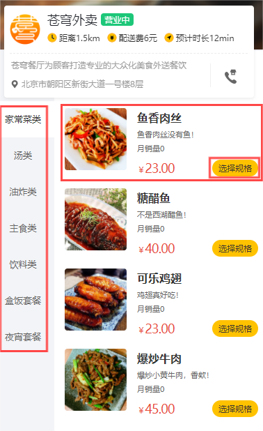

- [sky-take-out-Gitee仓库](https://gitee.com/gjt_1538048299/sky-take-out)

# 需求分析



# 分类浏览

## 接口设计


## 代码开发

CategoryController.java:

```java
/**
 * 查询分类
 *
 * @param type
 * @return
 */
@GetMapping("/list")
@ApiOperation("查询分类")
public Result<List<Category>> list(Integer type) {
    log.info("查询分类:{}", type);
    List<Category> list = categoryService.list(type);
    return Result.success(list);
}
```

# 菜品浏览


## 接口设计


## 代码开发

DishController.java:

```java
/**
 * 根据分类id查询菜品
 *
 * @param categoryId
 * @return
 */
@GetMapping("/list")
@ApiOperation("根据分类id查询菜品")
public Result<List<DishVO>> list(Long categoryId) {
    log.info("菜品浏览接口");
    Dish dish = new Dish();
    dish.setCategoryId(categoryId);
    // 查询起售中的菜品
    dish.setStatus(StatusConstant.ENABLE);

    List<DishVO> list = dishService.listWithFlavor(dish);

    return Result.success(list);
}
```

DishService.java:

```java
/**
 * 条件查询菜品和口味
 * @param dish
 * @return
 */
List<DishVO> listWithFlavor(Dish dish);
```

DishServiceImpl.java:

```java
/**
 * 条件查询菜品和口味
 *
 * @param dish
 * @return
 */
@Override
public List<DishVO> listWithFlavor(Dish dish) {
    List<Dish> dishList = dishMapper.list(dish);

    List<DishVO> dishVOList = new ArrayList<>();

    for (Dish d : dishList) {
        DishVO dishVO = new DishVO();
        BeanUtils.copyProperties(d, dishVO);

        // 根据菜品id查询对应的口味
        List<DishFlavor> flavors = dishFlavorMapper.getByDishId(d.getId());

        dishVO.setFlavors(flavors);
        dishVOList.add(dishVO);
    }

    return dishVOList;
}
```

# 套餐浏览


## 接口设计


## 代码开发

SetmealController.java:

```java
/**
 * 条件查询
 *
 * @param categoryId
 * @return
 */
@GetMapping("/list")
@ApiOperation("根据分类id查询套餐")
public Result<List<Setmeal>> list(Long categoryId) {
    Setmeal setmeal = new Setmeal();
    setmeal.setCategoryId(categoryId);
    setmeal.setStatus(StatusConstant.ENABLE);

    List<Setmeal> list = setmealService.list(setmeal);
    return Result.success(list);
}

/**
 * 根据套餐id查询包含的菜品列表
 *
 * @param id
 * @return
 */
@GetMapping("/dish/{id}")
@ApiOperation("根据套餐id查询包含的菜品列表")
public Result<List<DishItemVO>> dishList(@PathVariable("id") Long id) {
    List<DishItemVO> list = setmealService.getDishItemById(id);
    return Result.success(list);
}
```

SetmealService.java:

```java
/**
 * 条件查询
 * @param setmeal
 * @return
 */
List<Setmeal> list(Setmeal setmeal);

/**
 * 根据id查询菜品选项
 * @param id
 * @return
 */
List<DishItemVO> getDishItemById(Long id);
```

SetmealServiceImpl.java:

```java
/**
 * 条件查询
 * @param setmeal
 * @return
 */
public List<Setmeal> list(Setmeal setmeal) {
    return setmealMapper.list(setmeal);
}

/**
 * 根据id查询菜品选项
 * @param id
 * @return
 */
public List<DishItemVO> getDishItemById(Long id) {
    return setmealMapper.getDishItemBySetmealId(id);
}
```

SetmealMapper.java:

```java
/**
 * 动态条件查询套餐
 * @param setmeal
 * @return
 */
List<Setmeal> list(Setmeal setmeal);

/**
 * 根据套餐id查询菜品选项
 * @param setmealId
 * @return
 */
@Select("select sd.name, sd.copies, d.image, d.description " +
        "from setmeal_dish sd left join dish d on sd.dish_id = d.id " +
        "where sd.setmeal_id = #{setmealId}")
List<DishItemVO> getDishItemBySetmealId(Long setmealId);
```

SetmealMapper.xml:

```xml
<!--条件查询套餐-->
<select id="list" parameterType="Setmeal" resultType="Setmeal">
    select * from setmeal
    <where>
        <if test="name != null">
            and name like concat('%',#{name},'%')
        </if>
        <if test="categoryId != null">
            and category_id = #{categoryId}
        </if>
        <if test="status != null">
            and status = #{status}
        </if>
    </where>
    order by create_time desc
</select>
```