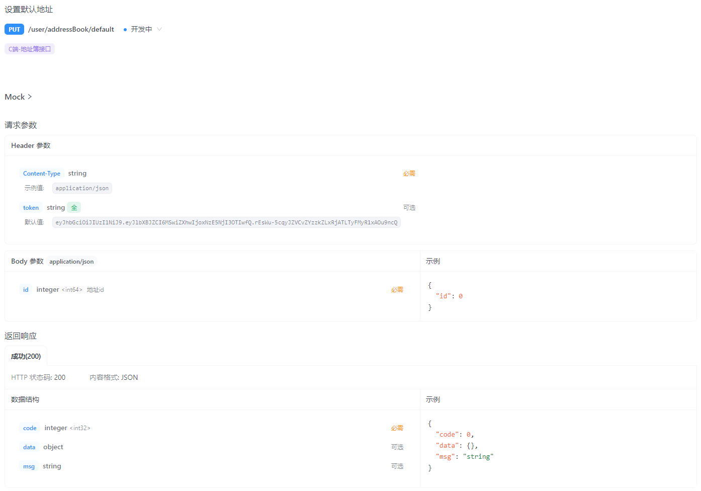

- [sky-take-out-Gitee仓库](https://gitee.com/gjt_1538048299/sky-take-out)

# 地址簿

# 需求分析


# 数据库设计


# 查询地址列表

## 接口设计


## 代码开发

AddressBookController.java:

```java
/**
 * 查询地址列表
 * 
 * @return
 */
@GetMapping("/list")
@ApiOperation("查询地址列表")
public Result<List<AddressBook>> list() {
    log.info("查询地址列表");
    AddressBook addressBook = new AddressBook();
    addressBook.setUserId(BaseContext.getCurrentId());
    List<AddressBook> list = addressBookService.list(addressBook);
    return Result.success(list);
}
```

AddressBookService.java:

```java
/**
 * 查询地址列表
 *
 * @param addressBook
 * @return
 */
List<AddressBook> list(AddressBook addressBook);
```

AddressBookServiceImpl.java:

```java
/**
 * 查询地址列表
 *
 * @param addressBook
 * @return
 */
@Override
public List<AddressBook> list(AddressBook addressBook) {
    return addressBookMapper.list(addressBook);
}
```

AddressBookMapper.java:

```java
/**
 * 条件查询
 *
 * @param addressBook
 * @return
 */
List<AddressBook> list(AddressBook addressBook);
```

AddressBookMapper.xml:

```xml
<!--条件查询-->
<select id="list" parameterType="AddressBook" resultType="AddressBook">
    select * from address_book
    <where>
        <if test="userId != null">
            and user_id = #{userId}
        </if>
        <if test="phone != null">
            and phone = #{phone}
        </if>
        <if test="isDefault != null">
            and is_default = #{isDefault}
        </if>
    </where>
</select>
```

# 新增地址

## 接口设计


## 代码开发

AddressBook.java:

```java
package com.sky.entity;

import lombok.AllArgsConstructor;
import lombok.Builder;
import lombok.Data;
import lombok.NoArgsConstructor;

import java.io.Serializable;

/**
 * 地址簿
 */
@Data
@Builder
@NoArgsConstructor
@AllArgsConstructor
public class AddressBook implements Serializable {

    private static final long serialVersionUID = 1L;

    private Long id;

    //用户id
    private Long userId;

    //收货人
    private String consignee;

    //手机号
    private String phone;

    //性别 0 女 1 男
    private String sex;

    //省级区划编号
    private String provinceCode;

    //省级名称
    private String provinceName;

    //市级区划编号
    private String cityCode;

    //市级名称
    private String cityName;

    //区级区划编号
    private String districtCode;

    //区级名称
    private String districtName;

    //详细地址
    private String detail;

    //标签
    private String label;

    //是否默认 0否 1是
    private Integer isDefault;
}
```

AddressBookController.java:

```java
/**
 * 新增地址
 *
 * @param addressBook
 * @return
 */
@PostMapping
@ApiOperation("新增地址")
public Result save(@RequestBody AddressBook addressBook) {
    log.info("新增地址:{}", addressBook);
    addressBookService.save(addressBook);
    return Result.success();
}
```

AddressBookService.java:

```java
/**
 * 新增地址
 *
 * @param addressBook
 */
void save(AddressBook addressBook);
```

AddressBookServiceImpl.java:

```java
/**
 * 新增地址
 *
 * @param addressBook
 */
@Override
public void save(AddressBook addressBook) {
    addressBook.setUserId(BaseContext.getCurrentId());
    addressBook.setIsDefault(0);
    addressBookMapper.insert(addressBook);
}
```

AddressBookMapper.java:

```java
/**
 * 新增地址
 *
 * @param addressBook
 */
@Insert("insert into address_book( user_id, consignee, sex, phone, province_code, province_name, city_code, " +
        "city_name, district_code, district_name, detail, label, is_default) VALUES " +
        "(#{userId}, #{consignee}, #{sex}, #{phone}, #{provinceCode}, #{provinceName}, #{cityCode}, #{cityName}," +
        "#{districtCode}, #{districtName}, #{detail}, #{label}, #{isDefault})")
void insert(AddressBook addressBook);
```

# 修改地址

## 接口设计


## 代码开发

## 根据id查询地址

AddressBookController.java:

```java
/**
 * 查询地址
 *
 * @param id
 * @return
 */
@GetMapping("/{id}")
@ApiOperation("查询地址")
public Result<AddressBook> getById(@PathVariable Long id) {
    log.info("查询地址:{}", id);
    AddressBook addressBook = addressBookService.getById(id);
    return Result.success(addressBook);
}
```

AddressBookService.java:

```java
/**
 * 查询地址
 *
 * @param id
 * @return
 */
AddressBook getById(Long id);
```

AddressBookServiceImpl.java:

```java
/**
 * 根据id查询地址,回显地址数据到修改地址
 *
 * @param id
 * @return
 */
@Override
public AddressBook getById(Long id) {
    return addressBookMapper.getById(id);
}
```

AddressBookMapper.java:

```java
/**
 * 根据id查询地址,回显地址数据到修改地址
 *
 * @param id
 * @return
 */
@Select("select * from address_book where id = #{id}")
AddressBook getById(Long id);
```

## 修改地址

AddressBookController.java:

```java
/**
 * 修改地址
 *
 * @param addressBook
 * @return
 */
@PutMapping
@ApiOperation("修改地址")
public Result update(@RequestBody AddressBook addressBook) {
    log.info("修改地址:{}", addressBook);
    addressBookService.update(addressBook);
    return Result.success();
}
```

AddressBookService.java:

```java
/**
 * 修改地址
 *
 * @param addressBook
 */
void update(AddressBook addressBook);
```

AddressBookServiceImpl.java:

```java
/**
 * 根据id修改地址
 *
 * @param addressBook
 */
@Override
public void update(AddressBook addressBook) {
    addressBookMapper.update(addressBook);
}
```

AddressBookMapper.java:

```java
/**
 * 根据id修改地址
 *
 * @param addressBook
 */
void update(AddressBook addressBook);
```

AddressBookMapper.xml:

```xml
<!--根据id修改地址-->
<update id="update" parameterType="addressBook">
    update address_book
    <set>
        <if test="consignee != null">
            consignee = #{consignee},
        </if>
        <if test="sex != null">
            sex = #{sex},
        </if>
        <if test="phone != null">
            phone = #{phone},
        </if>
        <if test="detail != null">
            detail = #{detail},
        </if>
        <if test="label != null">
            label = #{label},
        </if>
        <if test="isDefault != null">
            is_default = #{isDefault},
        </if>
    </set>
    where id = #{id}
</update>
```

# 删除地址

## 接口设计


## 代码开发

AddressBookController.java:

```java
/**
 * 删除地址
 *
 * @param id
 * @return
 */
@DeleteMapping
@ApiOperation("删除地址")
public Result deleteById(Long id) {
    log.info("删除地址:{}", id);
    addressBookService.deleteById(id);
    return Result.success();
}
```

AddressBookService.java:

```java
/**
 * 删除地址
 *
 * @param id
 */
void deleteById(Long id);
```

AddressBookServiceImpl.java:

```java
/**
 * 根据id删除地址
 *
 * @param id
 */
@Override
public void deleteById(Long id) {
    addressBookMapper.deleteById(id);
}
```

AddressBookMapper.java:

```java
/**
 * 根据id删除地址
 *
 * @param id
 */
@Delete("delete from address_book where id = #{id}")
void deleteById(Long id);
```

# 设置默认地址

## 接口设计



## 代码开发

AddressBookController.java:

```java
/**
 * 设置默认地址
 *
 * @param addressBook
 * @return
 */
@PutMapping("/default")
@ApiOperation("设置默认地址")
public Result setDefault(@RequestBody AddressBook addressBook) {
    log.info("默认地址:{}", addressBook);
    addressBookService.setDefault(addressBook);
    return Result.success();
}
```

AddressBookService.java:

```java
/**
 * 设置默认地址
 *
 * @param addressBook
 */
void setDefault(AddressBook addressBook);
```

AddressBookServiceImpl.java:

```java
/**
 * 设置默认地址
 *
 * @param addressBook
 */
@Override
public void setDefault(AddressBook addressBook) {
    // 将当前用户的所有地址修改为非默认地址
    addressBook.setIsDefault(0);
    addressBook.setUserId(BaseContext.getCurrentId());
    addressBookMapper.updateIsDefaultByUserId(addressBook);

    // 将当前地址改为默认地址
    addressBook.setIsDefault(1);
    addressBookMapper.update(addressBook);
}
```

AddressBookMapper.java:

```java
/**
 * 根据用户id修改默认地址
 *
 * @param addressBook
 */
@Update("update address_book set is_default = #{isDefault} where user_id = #{userId}")
void updateIsDefaultByUserId(AddressBook addressBook);
```

# 查询默认地址

## 接口设计


## 代码开发

AddressBookController.java:

```java
/**
 * 查询默认地址,回显到订单页面
 *
 * @return
 */
@GetMapping("/default")
@ApiOperation("查询默认地址")
public Result<AddressBook> getDefault() {
    log.info("查询默认地址");
    AddressBook addressBook = new AddressBook();
    addressBook.setIsDefault(1);
    addressBook.setUserId(BaseContext.getCurrentId());
    List<AddressBook> list = addressBookService.list(addressBook);

    if (list != null && list.size() == 1) {
        return Result.success(list.get(0));
    }
    return Result.error("没有查询到默认地址");
}
```