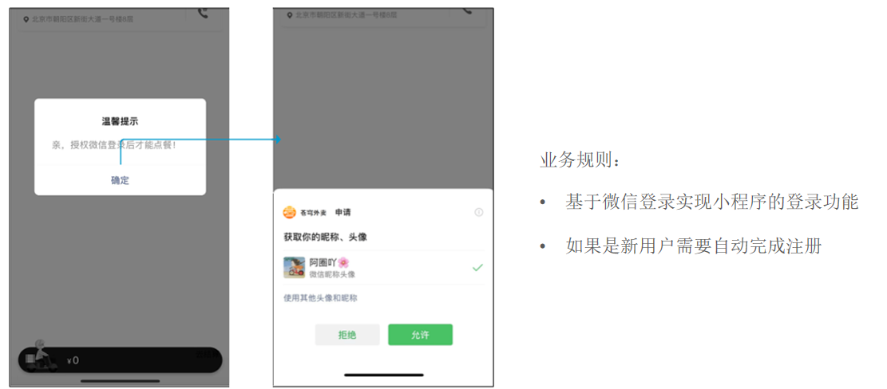
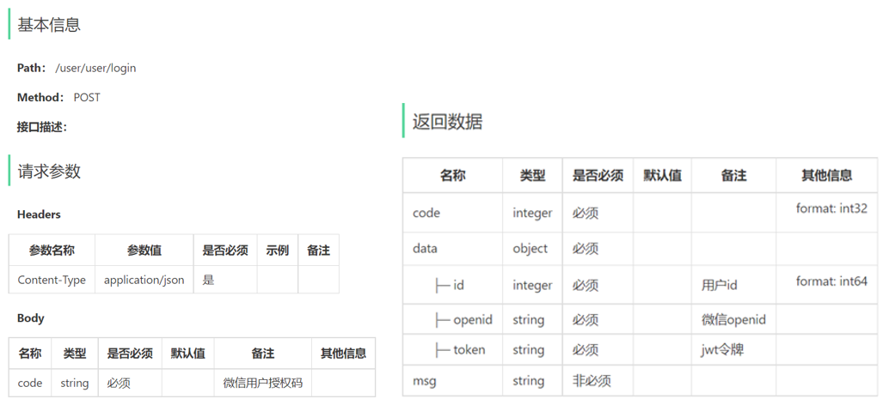
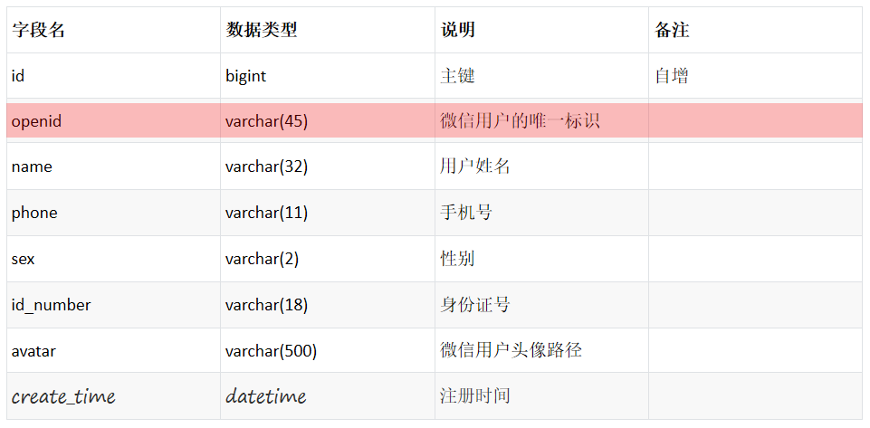

- [sky-take-out-Gitee仓库](https://gitee.com/gjt_1538048299/sky-take-out)

# 微信登录流程


# 需求分析



# 接口设计



数据库设计(user表):



# 代码开发

配置微信登录所需配置项:

application.yml:

```yml
# JWT令牌
jwt:
    # 设置jwt签名加密时使用的秘钥
    user-secret-key: sky_take_out
    # 设置jwt过期时间
    user-ttl: 7200000
    # 设置前端传递过来的令牌名称
    user-token-name: authentication
# 微信小程序
wechat:
    appid: ${sky.wechat.appid}
    secret: ${sky.wechat.secret}
```

application-dev.yml:

```yml
# 微信小程序
wechat:
    appid: 
    secret: 
```

UserController.java:

```java
package com.sky.controller.user;

import com.sky.constant.JwtClaimsConstant;
import com.sky.dto.UserLoginDTO;
import com.sky.entity.User;
import com.sky.properties.JwtProperties;
import com.sky.result.Result;
import com.sky.service.UserService;
import com.sky.utils.JwtUtil;
import com.sky.vo.UserLoginVO;
import io.swagger.annotations.Api;
import io.swagger.annotations.ApiOperation;
import lombok.extern.slf4j.Slf4j;
import org.springframework.beans.factory.annotation.Autowired;
import org.springframework.web.bind.annotation.PostMapping;
import org.springframework.web.bind.annotation.RequestBody;
import org.springframework.web.bind.annotation.RequestMapping;
import org.springframework.web.bind.annotation.RestController;

import java.util.HashMap;
import java.util.Map;

/**
 * 用户相关接口
 */
@RestController("userUserController")
@RequestMapping("/user/user")
@Api(tags = "用户相关接口")
@Slf4j
public class UserController {

    @Autowired
    private UserService userService;

    @Autowired
    private JwtProperties jwtProperties;

    /**
     * 微信用户登录
     *
     * @param loginDTO
     * @return
     */
    @PostMapping("/login")
    @ApiOperation("微信用户登录")
    public Result<UserLoginVO> login(@RequestBody UserLoginDTO userLoginDTO) {
        log.info("微信用户登录:{}", userLoginDTO.getCode());
        // 微信用户登录
        User user = userService.wxLogin(userLoginDTO);
        // 为微信用户生成jwt令牌
        Map<String, Object> claims = new HashMap<>();
        claims.put(JwtClaimsConstant.USER_ID, user.getId());
        String token = JwtUtil.createJWT(jwtProperties.getUserSecretKey(), jwtProperties.getUserTtl(), claims);
        UserLoginVO userLoginVO = UserLoginVO.builder()
                .id(user.getId())
                .openid(user.getOpenid())
                .token(token)
                .build();
        return Result.success(userLoginVO);
    }

}
```

UserService.java:

```java
package com.sky.service;

import com.sky.dto.UserLoginDTO;
import com.sky.entity.User;

public interface UserService {

    /**
     * 微信登录
     *
     * @param userLoginDTO
     * @return
     */
    User wxLogin(UserLoginDTO userLoginDTO);
}
```

UserServiceImpl.java:

```java
package com.sky.service.impl;

import com.alibaba.fastjson.JSON;
import com.alibaba.fastjson.JSONObject;
import com.sky.constant.MessageConstant;
import com.sky.dto.UserLoginDTO;
import com.sky.exception.LoginFailedException;
import com.sky.mapper.UserMapper;
import com.sky.properties.WeChatProperties;
import com.sky.service.UserService;
import com.sky.utils.HttpClientUtil;
import lombok.extern.slf4j.Slf4j;
import com.sky.entity.User;
import org.springframework.beans.factory.annotation.Autowired;
import org.springframework.stereotype.Service;

import java.time.LocalDateTime;
import java.util.HashMap;
import java.util.Map;

@Service
@Slf4j
public class UserServiceImpl implements UserService {

    // 微信服务接口地址
    public static final String WX_LOGIN = "https://api.weixin.qq.com/sns/jscode2session";

    @Autowired
    private WeChatProperties weChatProperties;

    @Autowired
    private UserMapper userMapper;

    /**
     * 微信登录
     *
     * @param userLoginDTO
     * @return
     */
    @Override
    public User wxLogin(UserLoginDTO userLoginDTO) {
        // 调用微信接口服务,获得当前微信用户的openid
        String openid = getOpenid(userLoginDTO.getCode());

        // 判断openid是否为空,如果为空表示登录失败,抛出业务异常
        if (openid == null) {
            throw new LoginFailedException(MessageConstant.LOGIN_FAILED);
        }

        // 判断当前用户是否为新用户
        User user = userMapper.getByOpenid(openid);

        // 如果是新用户,自动完成注册
        if (user == null) {
            user = User.builder()
                    .openid(openid)
                    .createTime(LocalDateTime.now())
                    .build();
            userMapper.insert(user);
        }

        // 返回用户对象
        return user;
    }

    /**
     * 调用微信接口服务,获得当前微信用户的openid
     *
     * @param code
     * @return
     */
    private String getOpenid(String code) {
        Map<String, String> map = new HashMap<>();
        map.put("appid", weChatProperties.getAppid());
        map.put("secret", weChatProperties.getSecret());
        map.put("js_code", code);
        map.put("grant_type", "authorization_code");
        String json = HttpClientUtil.doGet(WX_LOGIN, map);

        JSONObject jsonObject = JSON.parseObject(json);
        return jsonObject.getString("openid");
    }
}
```

UserMapper.java:

```java
package com.sky.mapper;

import com.sky.entity.User;
import org.apache.ibatis.annotations.Mapper;
import org.apache.ibatis.annotations.Select;

@Mapper
public interface UserMapper {

    /**
     * 根据openid来查询用户
     *
     * @param openid
     * @return
     */
    @Select("select id, openid, name, phone, sex, id_number, avatar, create_time from user where openid = #{openid}")
    User getByOpenid(String openid);

    /**
     * 插入数据
     *
     * @param user
     */
    void insert(User user);
}
```

UserMapper.xml:

```xml
<?xml version="1.0" encoding="UTF-8" ?>
<!DOCTYPE mapper PUBLIC "-//mybatis.org//DTD Mapper 3.0//EN"
        "http://mybatis.org/dtd/mybatis-3-mapper.dtd" >
<mapper namespace="com.sky.mapper.UserMapper">
    <!--插入数据-->
    <insert id="insert" useGeneratedKeys="true" keyProperty="id">
        insert into user(openid, name, phone, sex, id_number, avatar, create_time)
        VALUES (#{openid}, #{name}, #{phone}, #{sex}, #{idNumber}, #{avatar}, #{createTime})
    </insert>
</mapper>
```

增加用户jwt令牌校验的拦截器:

JwtTokenUserInterceptor.java:

```java
package com.sky.interceptor;

import com.sky.constant.JwtClaimsConstant;
import com.sky.context.BaseContext;
import com.sky.properties.JwtProperties;
import com.sky.utils.JwtUtil;
import io.jsonwebtoken.Claims;
import lombok.extern.slf4j.Slf4j;
import org.springframework.beans.factory.annotation.Autowired;
import org.springframework.stereotype.Component;
import org.springframework.web.method.HandlerMethod;
import org.springframework.web.servlet.HandlerInterceptor;

import javax.servlet.http.HttpServletRequest;
import javax.servlet.http.HttpServletResponse;

/**
 * jwt令牌校验的拦截器
 */
@Component
@Slf4j
public class JwtTokenUserInterceptor implements HandlerInterceptor {

    @Autowired
    private JwtProperties jwtProperties;

    /**
     * 校验jwt
     *
     * @param request
     * @param response
     * @param handler
     * @return
     * @throws Exception
     */
    public boolean preHandle(HttpServletRequest request, HttpServletResponse response, Object handler) throws Exception {
        //判断当前拦截到的是Controller的方法还是其他资源
        if (!(handler instanceof HandlerMethod)) {
            //当前拦截到的不是动态方法,直接放行
            return true;
        }

        //1、从请求头中获取令牌
        String token = request.getHeader(jwtProperties.getUserTokenName());

        //2、校验令牌
        try {
            log.info("jwt校验:{}", token);
            Claims claims = JwtUtil.parseJWT(jwtProperties.getUserSecretKey(), token);
            Long userId = Long.valueOf(claims.get(JwtClaimsConstant.EMP_ID).toString());
            log.info("当前用户id:{}", userId);
            // 将当前用户id存入ThreadLocal中
            BaseContext.setCurrentId(userId);
            //3、通过,放行
            return true;
        } catch (Exception ex) {
            //4、不通过,响应401状态码
            response.setStatus(401);
            return false;
        }
    }
}
```

WebMvcConfiguration.java:

```java
/**
 * 配置类,注册web层相关组件
 */
@Configuration
@Slf4j
public class WebMvcConfiguration extends WebMvcConfigurationSupport {

    @Autowired
    private JwtTokenAdminInterceptor jwtTokenAdminInterceptor;

    @Autowired
    private JwtTokenUserInterceptor jwtTokenUserInterceptor;

    /**
     * 注册自定义拦截器
     *
     * @param registry
     */
    protected void addInterceptors(InterceptorRegistry registry) {
        log.info("开始注册自定义拦截器...");
        registry.addInterceptor(jwtTokenAdminInterceptor)
                .addPathPatterns("/admin/**")
                .excludePathPatterns("/admin/employee/login");

        registry.addInterceptor(jwtTokenUserInterceptor)
                .addPathPatterns("/user/**")
                .excludePathPatterns("/user/user/login")
                .excludePathPatterns("/user/shop/status");
    }
}
```