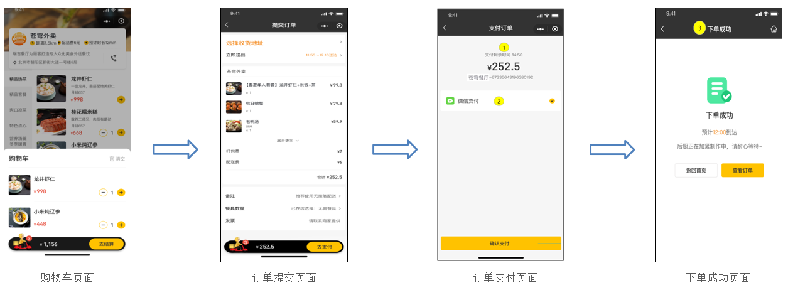
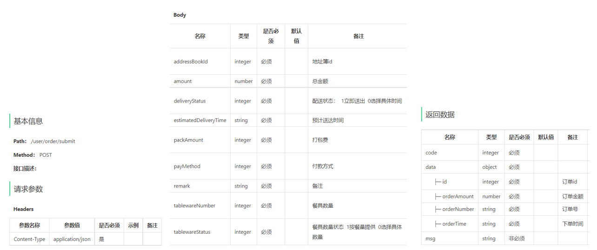
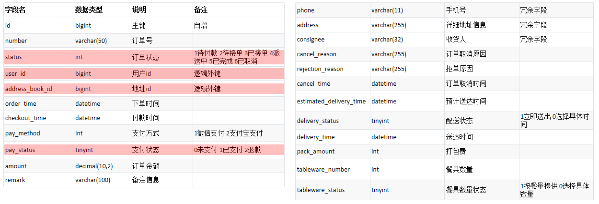
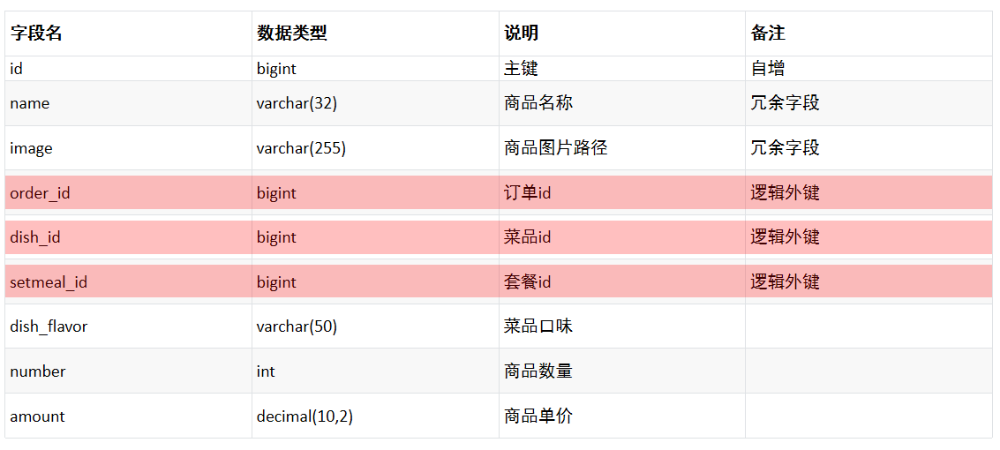
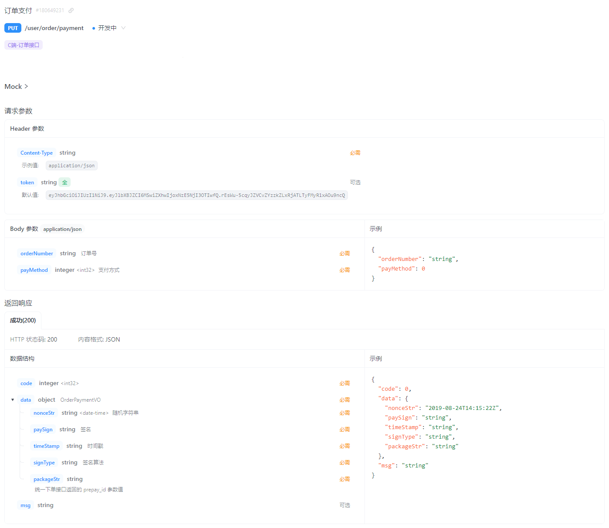
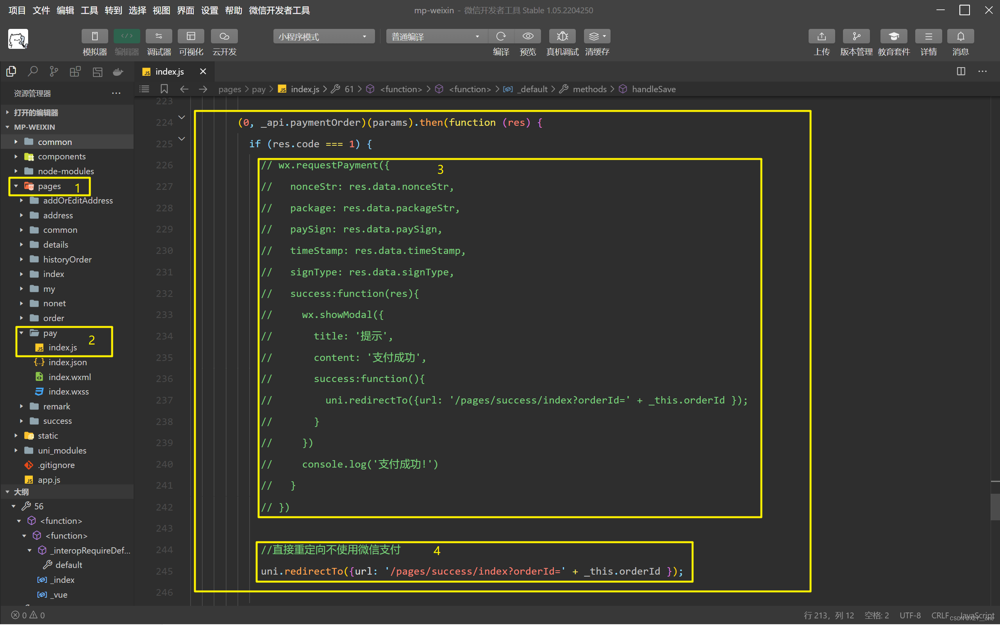
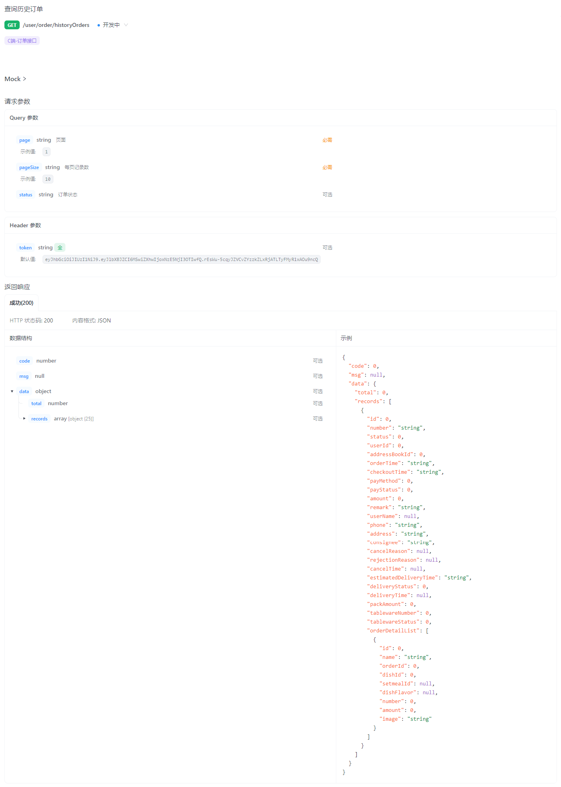
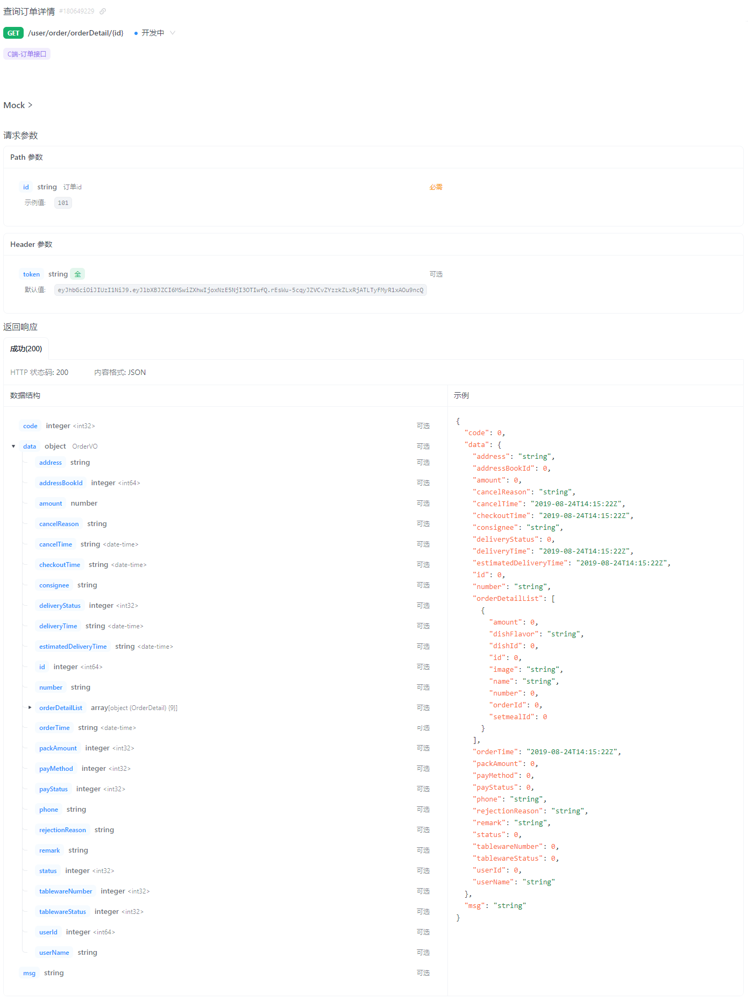
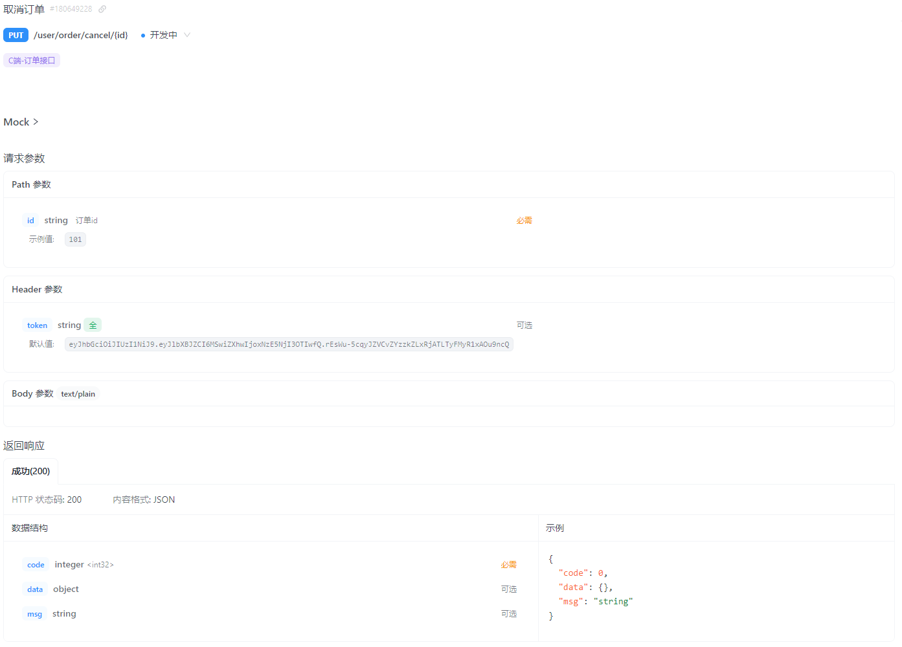
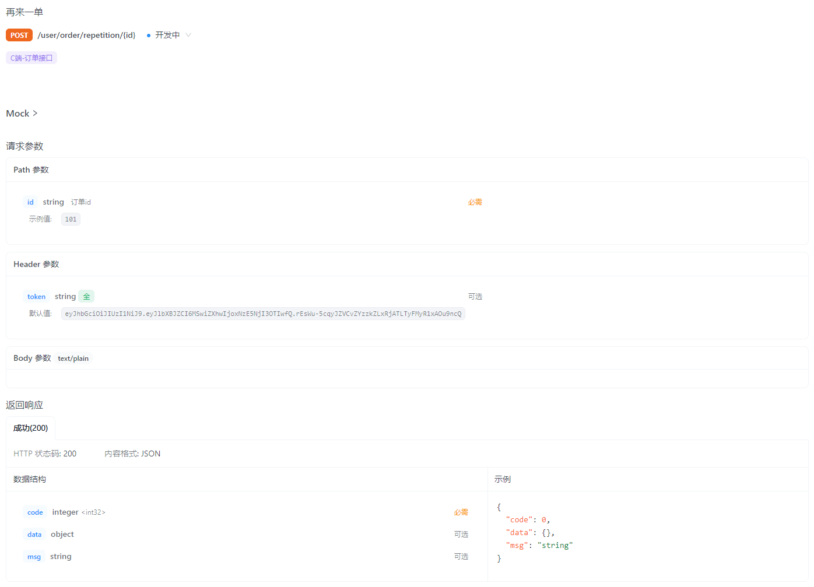

- [sky-take-out-Gitee仓库](https://gitee.com/gjt_1538048299/sky-take-out)

# 用户点餐

# 需求分析



# 用户下单

## 接口设计



## 数据库设计

1. 订单表 orders



2. 订单明细表 order_detail



## 代码开发

OrdersSubmitDTO.java:

```java
package com.sky.dto;

import com.fasterxml.jackson.annotation.JsonFormat;
import lombok.Data;

import java.io.Serializable;
import java.math.BigDecimal;
import java.time.LocalDateTime;

@Data
public class OrdersSubmitDTO implements Serializable {
    //地址簿id
    private Long addressBookId;
    //付款方式
    private int payMethod;
    //备注
    private String remark;
    //预计送达时间
    @JsonFormat(shape = JsonFormat.Shape.STRING, pattern = "yyyy-MM-dd HH:mm:ss")
    private LocalDateTime estimatedDeliveryTime;
    //配送状态  1立即送出  0选择具体时间
    private Integer deliveryStatus;
    //餐具数量
    private Integer tablewareNumber;
    //餐具数量状态  1按餐量提供  0选择具体数量
    private Integer tablewareStatus;
    //打包费
    private Integer packAmount;
    //总金额
    private BigDecimal amount;
}
```

OrderSubmitVO.java:

```java
package com.sky.vo;

import lombok.AllArgsConstructor;
import lombok.Builder;
import lombok.Data;
import lombok.NoArgsConstructor;

import java.io.Serializable;
import java.math.BigDecimal;
import java.time.LocalDateTime;

@Data
@Builder
@NoArgsConstructor
@AllArgsConstructor
public class OrderSubmitVO implements Serializable {
    //订单id
    private Long id;
    //订单号
    private String orderNumber;
    //订单金额
    private BigDecimal orderAmount;
    //下单时间
    private LocalDateTime orderTime;
}
```

Orders.java:

```java
package com.sky.entity;

import lombok.AllArgsConstructor;
import lombok.Builder;
import lombok.Data;
import lombok.NoArgsConstructor;

import java.io.Serializable;
import java.math.BigDecimal;
import java.time.LocalDateTime;

/**
 * 订单
 */
@Data
@Builder
@NoArgsConstructor
@AllArgsConstructor
public class Orders implements Serializable {

    /**
     * 订单状态 1待付款 2待接单 3已接单 4派送中 5已完成 6已取消
     */
    public static final Integer PENDING_PAYMENT = 1;
    public static final Integer TO_BE_CONFIRMED = 2;
    public static final Integer CONFIRMED = 3;
    public static final Integer DELIVERY_IN_PROGRESS = 4;
    public static final Integer COMPLETED = 5;
    public static final Integer CANCELLED = 6;

    /**
     * 支付状态 0未支付 1已支付 2退款
     */
    public static final Integer UN_PAID = 0;
    public static final Integer PAID = 1;
    public static final Integer REFUND = 2;

    private static final long serialVersionUID = 1L;

    private Long id;

    //订单号
    private String number;

    //订单状态 1待付款 2待接单 3已接单 4派送中 5已完成 6已取消 7退款
    private Integer status;

    //下单用户id
    private Long userId;

    //地址id
    private Long addressBookId;

    //下单时间
    private LocalDateTime orderTime;

    //结账时间
    private LocalDateTime checkoutTime;

    //支付方式 1微信,2支付宝
    private Integer payMethod;

    //支付状态 0未支付 1已支付 2退款
    private Integer payStatus;

    //实收金额
    private BigDecimal amount;

    //备注
    private String remark;

    //用户名
    private String userName;

    //手机号
    private String phone;

    //地址
    private String address;

    //收货人
    private String consignee;

    //订单取消原因
    private String cancelReason;

    //订单拒绝原因
    private String rejectionReason;

    //订单取消时间
    private LocalDateTime cancelTime;

    //预计送达时间
    private LocalDateTime estimatedDeliveryTime;

    //配送状态  1立即送出  0选择具体时间
    private Integer deliveryStatus;

    //送达时间
    private LocalDateTime deliveryTime;

    //打包费
    private int packAmount;

    //餐具数量
    private int tablewareNumber;

    //餐具数量状态  1按餐量提供  0选择具体数量
    private Integer tablewareStatus;
}
```

OrderDetail.java:

```java
package com.sky.entity;

import lombok.AllArgsConstructor;
import lombok.Builder;
import lombok.Data;
import lombok.NoArgsConstructor;

import java.io.Serializable;
import java.math.BigDecimal;

/**
 * 订单明细
 */
@Data
@Builder
@NoArgsConstructor
@AllArgsConstructor
public class OrderDetail implements Serializable {

    private static final long serialVersionUID = 1L;

    private Long id;

    //名称
    private String name;

    //订单id
    private Long orderId;

    //菜品id
    private Long dishId;

    //套餐id
    private Long setmealId;

    //口味
    private String dishFlavor;

    //数量
    private Integer number;

    //金额
    private BigDecimal amount;

    //图片
    private String image;
}
```

OrderController.java:

```java
/**
 * 用户下单
 *
 * @param ordersSubmitDTO
 * @return
 */
@PostMapping("/submit")
@ApiOperation("用户下单")
public Result<OrderSubmitVO> submit(@RequestBody OrdersSubmitDTO ordersSubmitDTO) {
    log.info("用户下单:{}", ordersSubmitDTO);
    OrderSubmitVO orderSubmitVO = orderService.submitOrder(ordersSubmitDTO);
    return Result.success(orderSubmitVO);
}
```

OrderService.java:

```java
/**
 * 用户下单
 *
 * @param ordersSubmitDTO
 * @return
 */
OrderSubmitVO submitOrder(OrdersSubmitDTO ordersSubmitDTO);
```

OrderServiceImpl.java:

```java
/**
 * 用户下单
 *
 * @param ordersSubmitDTO
 * @return
 */
@Override
@Transactional
public OrderSubmitVO submitOrder(OrdersSubmitDTO ordersSubmitDTO) {
    // 处理各种业务异常(地址簿数据为空、购物车数据为空)
    // 地址簿数据为空
    AddressBook addressBook = addressBookMapper.getById(ordersSubmitDTO.getAddressBookId());
    if (addressBook == null) {
        throw new AddressBookBusinessException(MessageConstant.ADDRESS_BOOK_IS_NULL);
    }
    // 购物车数据为空
    // 查询当前用户的购物车数据
    ShoppingCart shoppingCart = new ShoppingCart();
    Long userId = BaseContext.getCurrentId();
    shoppingCart.setUserId(userId);
    List<ShoppingCart> shoppingCartList = shoppingCartMapper.list(shoppingCart);
    if (shoppingCartList == null || shoppingCartList.size() == 0) {
        throw new ShoppingCartBusinessException(MessageConstant.SHOPPING_CART_IS_NULL);
    }

    // 向订单表插入1条数据
    Orders orders = new Orders();
    BeanUtils.copyProperties(ordersSubmitDTO, orders);
    // 设置下单用户id
    orders.setUserId(userId);
    // 设置下单时间
    orders.setOrderTime(LocalDateTime.now());
    // 设置订单号
    orders.setNumber(String.valueOf(System.currentTimeMillis()));
    // 设置手机号
    orders.setPhone(addressBook.getPhone());
    // 设置收货人
    orders.setConsignee(addressBook.getConsignee());
    // 设置订单状态:待付款
    orders.setStatus(Orders.PENDING_PAYMENT);
    // 设置支付状态:未支付
    orders.setPayStatus(Orders.UN_PAID);
    orderMapper.insert(orders);

    // 向订单明细表插入n条数据
    List<OrderDetail> orderDetailList = new ArrayList<>();
    for (ShoppingCart cart : shoppingCartList) {
        OrderDetail orderDetail = new OrderDetail();
        BeanUtils.copyProperties(cart, orderDetail);
        // 设置订单id
        orderDetail.setOrderId(orders.getId());
        orderDetailList.add(orderDetail);
    }
    orderDetailMapper.insertBatch(orderDetailList);

    // 清空当前用户的购物车数据
    shoppingCartMapper.delete(userId);

    // 封装VO返回结果
    return OrderSubmitVO.builder()
            .id(orders.getId())
            .orderTime(orders.getOrderTime())
            .orderNumber(orders.getNumber())
            .orderAmount(orders.getAmount())
            .build();
}
```

OrderMapper.java:

```java
/**
 * 插入订单表数据
 *
 * @param orders
 */
void insert(Orders orders);
```

OrderMapper.xml:

```xml
<!--插入订单数据-->
<insert id="insert" useGeneratedKeys="true" keyProperty="id">
    insert into orders (number, status, user_id, address_book_id, order_time, checkout_time, pay_method,
                        pay_status, amount, remark, phone, address, user_name, consignee, cancel_reason,
                        rejection_reason, cancel_time, estimated_delivery_time, delivery_status, delivery_time,
                        pack_amount, tableware_number, tableware_status)
    VALUES (#{number}, #{status}, #{userId}, #{addressBookId}, #{orderTime}, #{checkoutTime}, #{payMethod},
            #{payStatus}, #{amount}, #{remark}, #{phone}, #{address}, #{userName}, #{consignee}, #{cancelReason},
            #{rejectionReason}, #{cancelTime}, #{estimatedDeliveryTime}, #{deliveryStatus}, #{deliveryTime},
            #{packAmount}, #{tablewareNumber}, #{tablewareStatus})
</insert>
```

OrderDetailMapper.java:

```java
/**
 * 批量插入订单明细表数据
 *
 * @param orderDetailList
 */
void insertBatch(List<OrderDetail> orderDetailList);
```

OrderDetailMapper.xml:

```xml
<!--批量插入订单明细表数据-->
<insert id="insertBatch">
    insert into order_detail (name, image, order_id, dish_id, setmeal_id, dish_flavor, number, amount)
    VALUES
    <foreach collection="orderDetailList" item="od" separator=",">
        (#{od.name},#{od.image},#{od.orderId},#{od.dishId},#{od.setmealId},#{od.dishFlavor},#{od.number},#{od.amount})
    </foreach>
</insert>
```

## 功能优化

优化用户下单功能,加入校验逻辑,如果用户的收货地址距离商家门店超出配送范围(配送范围为5公里内),则下单失败

application.yml:

```yml
shop:
    address: ${sky.shop.address}
baidu:
    ak: ${sky.baidu.ak}
```

application-dev.java:

```yml
shop:
    address: 
baidu:
    ak: 
```

OrderServiceImpl.java:

```java
/**
 * 检查用户的收货地址是否超出配送范围
 *
 * @param address
 */
private void checkOutOfRange(String address) {
    Map map = new HashMap();
    map.put("address", shopAddress);
    map.put("output", "json");
    map.put("ak", ak);

    //获取店铺的经纬度坐标
    String shopCoordinate = HttpClientUtil.doGet("https://api.map.baidu.com/geocoding/v3", map);

    JSONObject jsonObject = JSON.parseObject(shopCoordinate);
    if (!jsonObject.getString("status").equals("0")) {
        throw new OrderBusinessException("店铺地址解析失败");
    }

    //数据解析
    JSONObject location = jsonObject.getJSONObject("result").getJSONObject("location");
    String lat = location.getString("lat");
    String lng = location.getString("lng");
    //店铺经纬度坐标
    String shopLngLat = lat + "," + lng;

    map.put("address", address);
    //获取用户收货地址的经纬度坐标
    String userCoordinate = HttpClientUtil.doGet("https://api.map.baidu.com/geocoding/v3", map);

    jsonObject = JSON.parseObject(userCoordinate);
    if (!jsonObject.getString("status").equals("0")) {
        throw new OrderBusinessException("收货地址解析失败");
    }

    //数据解析
    location = jsonObject.getJSONObject("result").getJSONObject("location");
    lat = location.getString("lat");
    lng = location.getString("lng");
    //用户收货地址经纬度坐标
    String userLngLat = lat + "," + lng;

    map.put("origin", shopLngLat);
    map.put("destination", userLngLat);
    map.put("steps_info", "0");

    //路线规划
    String json = HttpClientUtil.doGet("https://api.map.baidu.com/directionlite/v1/driving", map);

    jsonObject = JSON.parseObject(json);
    if (!jsonObject.getString("status").equals("0")) {
        throw new OrderBusinessException("配送路线规划失败");
    }

    //数据解析
    JSONObject result = jsonObject.getJSONObject("result");
    JSONArray jsonArray = (JSONArray) result.get("routes");
    Integer distance = (Integer) ((JSONObject) jsonArray.get(0)).get("distance");

    if (distance > 5000) {
        //配送距离超过5000米
        throw new OrderBusinessException("超出配送范围");
    }
}
```

# 订单支付

## 接口设计



## 代码开发

application.yml:

```yml
# 微信小程序
wechat:
    appid: ${sky.wechat.appid}
    secret: ${sky.wechat.secret}
    mchid: ${sky.wechat.mchid}
    mch-serial-no: ${sky.wechat.mchSerialNo}
    private-key-file-path: ${sky.wechat.privateKeyFilePath}
    api-v3-key: ${sky.wechat.apiV3Key}
    we-chat-pay-cert-file-path: ${sky.wechat.weChatPayCertFilePath}
    notify-url: ${sky.wechat.notifyUrl}
    refund-notify-url: ${sky.wechat.refundNotifyUrl}
```

application-dev.yml

```yml
wechat:
    appid: wxceea282d4651abba
    secret: e47d66e62848033a789a3065e52333d3
    mchid:
    mchSerialNo:
    privateKeyFilePath:
    apiV3Key:
    weChatPayCertFilePath:
    notifyUrl: https://175170ee.r23.cpolar.top/notify/paySuccess
    refundNotifyUrl: https://175170ee.r23.cpolar.top/notify/refundSuccess
```

WeChatPayUtil.java:

```java
package com.sky.utils;

import com.alibaba.fastjson.JSON;
import com.alibaba.fastjson.JSONObject;
import com.sky.properties.WeChatProperties;
import com.wechat.pay.contrib.apache.httpclient.WechatPayHttpClientBuilder;
import com.wechat.pay.contrib.apache.httpclient.util.PemUtil;
import org.apache.commons.lang.RandomStringUtils;
import org.apache.http.HttpHeaders;
import org.apache.http.client.methods.CloseableHttpResponse;
import org.apache.http.client.methods.HttpGet;
import org.apache.http.client.methods.HttpPost;
import org.apache.http.entity.ContentType;
import org.apache.http.entity.StringEntity;
import org.apache.http.impl.client.CloseableHttpClient;
import org.apache.http.util.EntityUtils;
import org.springframework.beans.factory.annotation.Autowired;
import org.springframework.stereotype.Component;

import java.io.File;
import java.io.FileInputStream;
import java.io.FileNotFoundException;
import java.math.BigDecimal;
import java.security.PrivateKey;
import java.security.Signature;
import java.security.cert.X509Certificate;
import java.util.ArrayList;
import java.util.Arrays;
import java.util.Base64;
import java.util.List;

/**
 * 微信支付工具类
 */
@Component
public class WeChatPayUtil {

    //微信支付下单接口地址
    public static final String JSAPI = "https://api.mch.weixin.qq.com/v3/pay/transactions/jsapi";

    //申请退款接口地址
    public static final String REFUNDS = "https://api.mch.weixin.qq.com/v3/refund/domestic/refunds";

    @Autowired
    private WeChatProperties weChatProperties;

    /**
     * 获取调用微信接口的客户端工具对象
     *
     * @return
     */
    private CloseableHttpClient getClient() {
        PrivateKey merchantPrivateKey = null;
        try {
            //merchantPrivateKey商户API私钥,如何加载商户API私钥请看常见问题
            merchantPrivateKey = PemUtil.loadPrivateKey(new FileInputStream(new File(weChatProperties.getPrivateKeyFilePath())));
            //加载平台证书文件
            X509Certificate x509Certificate = PemUtil.loadCertificate(new FileInputStream(new File(weChatProperties.getWeChatPayCertFilePath())));
            //wechatPayCertificates微信支付平台证书列表,你也可以使用后面章节提到的"定时更新平台证书功能",而不需要关心平台证书的来龙去脉
            List<X509Certificate> wechatPayCertificates = Arrays.asList(x509Certificate);

            WechatPayHttpClientBuilder builder = WechatPayHttpClientBuilder.create()
                    .withMerchant(weChatProperties.getMchid(), weChatProperties.getMchSerialNo(), merchantPrivateKey)
                    .withWechatPay(wechatPayCertificates);

            // 通过WechatPayHttpClientBuilder构造的HttpClient,会自动的处理签名和验签
            CloseableHttpClient httpClient = builder.build();
            return httpClient;
        } catch (FileNotFoundException e) {
            e.printStackTrace();
            return null;
        }
    }

    /**
     * 发送post方式请求
     *
     * @param url
     * @param body
     * @return
     */
    private String post(String url, String body) throws Exception {
        CloseableHttpClient httpClient = getClient();

        HttpPost httpPost = new HttpPost(url);
        httpPost.addHeader(HttpHeaders.ACCEPT, ContentType.APPLICATION_JSON.toString());
        httpPost.addHeader(HttpHeaders.CONTENT_TYPE, ContentType.APPLICATION_JSON.toString());
        httpPost.addHeader("Wechatpay-Serial", weChatProperties.getMchSerialNo());
        httpPost.setEntity(new StringEntity(body, "UTF-8"));

        CloseableHttpResponse response = httpClient.execute(httpPost);
        try {
            String bodyAsString = EntityUtils.toString(response.getEntity());
            return bodyAsString;
        } finally {
            httpClient.close();
            response.close();
        }
    }

    /**
     * 发送get方式请求
     *
     * @param url
     * @return
     */
    private String get(String url) throws Exception {
        CloseableHttpClient httpClient = getClient();

        HttpGet httpGet = new HttpGet(url);
        httpGet.addHeader(HttpHeaders.ACCEPT, ContentType.APPLICATION_JSON.toString());
        httpGet.addHeader(HttpHeaders.CONTENT_TYPE, ContentType.APPLICATION_JSON.toString());
        httpGet.addHeader("Wechatpay-Serial", weChatProperties.getMchSerialNo());

        CloseableHttpResponse response = httpClient.execute(httpGet);
        try {
            String bodyAsString = EntityUtils.toString(response.getEntity());
            return bodyAsString;
        } finally {
            httpClient.close();
            response.close();
        }
    }

    /**
     * jsapi下单
     *
     * @param orderNum    商户订单号
     * @param total       总金额
     * @param description 商品描述
     * @param openid      微信用户的openid
     * @return
     */
    private String jsapi(String orderNum, BigDecimal total, String description, String openid) throws Exception {
        JSONObject jsonObject = new JSONObject();
        jsonObject.put("appid", weChatProperties.getAppid());
        jsonObject.put("mchid", weChatProperties.getMchid());
        jsonObject.put("description", description);
        jsonObject.put("out_trade_no", orderNum);
        jsonObject.put("notify_url", weChatProperties.getNotifyUrl());

        JSONObject amount = new JSONObject();
        amount.put("total", total.multiply(new BigDecimal(100)).setScale(2, BigDecimal.ROUND_HALF_UP).intValue());
        amount.put("currency", "CNY");

        jsonObject.put("amount", amount);

        JSONObject payer = new JSONObject();
        payer.put("openid", openid);

        jsonObject.put("payer", payer);

        String body = jsonObject.toJSONString();
        return post(JSAPI, body);
    }

    /**
     * 小程序支付
     *
     * @param orderNum    商户订单号
     * @param total       金额,单位 元
     * @param description 商品描述
     * @param openid      微信用户的openid
     * @return
     */
    public JSONObject pay(String orderNum, BigDecimal total, String description, String openid) throws Exception {
        //统一下单,生成预支付交易单
        String bodyAsString = jsapi(orderNum, total, description, openid);
        //解析返回结果
        JSONObject jsonObject = JSON.parseObject(bodyAsString);
        System.out.println(jsonObject);

        String prepayId = jsonObject.getString("prepay_id");
        if (prepayId != null) {
            String timeStamp = String.valueOf(System.currentTimeMillis() / 1000);
            String nonceStr = RandomStringUtils.randomNumeric(32);
            ArrayList<Object> list = new ArrayList<>();
            list.add(weChatProperties.getAppid());
            list.add(timeStamp);
            list.add(nonceStr);
            list.add("prepay_id=" + prepayId);
            //二次签名,调起支付需要重新签名
            StringBuilder stringBuilder = new StringBuilder();
            for (Object o : list) {
                stringBuilder.append(o).append("\n");
            }
            String signMessage = stringBuilder.toString();
            byte[] message = signMessage.getBytes();

            Signature signature = Signature.getInstance("SHA256withRSA");
            signature.initSign(PemUtil.loadPrivateKey(new FileInputStream(new File(weChatProperties.getPrivateKeyFilePath()))));
            signature.update(message);
            String packageSign = Base64.getEncoder().encodeToString(signature.sign());

            //构造数据给微信小程序,用于调起微信支付
            JSONObject jo = new JSONObject();
            jo.put("timeStamp", timeStamp);
            jo.put("nonceStr", nonceStr);
            jo.put("package", "prepay_id=" + prepayId);
            jo.put("signType", "RSA");
            jo.put("paySign", packageSign);

            return jo;
        }
        return jsonObject;
    }

    /**
     * 申请退款
     *
     * @param outTradeNo    商户订单号
     * @param outRefundNo   商户退款单号
     * @param refund        退款金额
     * @param total         原订单金额
     * @return
     */
    public String refund(String outTradeNo, String outRefundNo, BigDecimal refund, BigDecimal total) throws Exception {
        JSONObject jsonObject = new JSONObject();
        jsonObject.put("out_trade_no", outTradeNo);
        jsonObject.put("out_refund_no", outRefundNo);

        JSONObject amount = new JSONObject();
        amount.put("refund", refund.multiply(new BigDecimal(100)).setScale(2, BigDecimal.ROUND_HALF_UP).intValue());
        amount.put("total", total.multiply(new BigDecimal(100)).setScale(2, BigDecimal.ROUND_HALF_UP).intValue());
        amount.put("currency", "CNY");

        jsonObject.put("amount", amount);
        jsonObject.put("notify_url", weChatProperties.getRefundNotifyUrl());

        String body = jsonObject.toJSONString();

        //调用申请退款接口
        return post(REFUNDS, body);
    }
}
```

OrderController.java:

```java
/**
 * 订单支付
 *
 * @param ordersPaymentDTO
 * @return
 */
@PutMapping("/payment")
@ApiOperation("订单支付")
public Result<OrderPaymentVO> payment(@RequestBody OrdersPaymentDTO ordersPaymentDTO) throws Exception {
    log.info("订单支付:{}", ordersPaymentDTO);
    OrderPaymentVO orderPaymentVO = orderService.payment(ordersPaymentDTO);
    log.info("生成预支付交易单:{}", orderPaymentVO);
    return Result.success(orderPaymentVO);
}
```

OrderService.java:

```java
/**
 * 订单支付
 *
 * @param ordersPaymentDTO
 * @return
 */
OrderPaymentVO payment(OrdersPaymentDTO ordersPaymentDTO) throws Exception;

/**
 * 支付成功,修改订单状态
 *
 * @param outTradeNo
 */
void paySuccess(String outTradeNo);
```

OrderServiceImpl.java:

```java
/**
 * 订单支付
 *
 * @param ordersPaymentDTO
 * @return
 */
@Override
public OrderPaymentVO payment(OrdersPaymentDTO ordersPaymentDTO) throws Exception {
    // 当前登录用户id
    Long userId = BaseContext.getCurrentId();
    User user = userMapper.getById(userId);

    //调用微信支付接口,生成预支付交易单
    JSONObject jsonObject = weChatPayUtil.pay(
            ordersPaymentDTO.getOrderNumber(), //商户订单号
            new BigDecimal(0.01), //支付金额,单位 元
            "苍穹外卖订单", //商品描述
            user.getOpenid() //微信用户的openid
    );

    if (jsonObject.getString("code") != null && jsonObject.getString("code").equals("ORDERPAID")) {
        throw new OrderBusinessException("该订单已支付");
    }

    OrderPaymentVO vo = jsonObject.toJavaObject(OrderPaymentVO.class);
    vo.setPackageStr(jsonObject.getString("package"));

    return vo;
}

/**
 * 支付成功,修改订单状态
 *
 * @param outTradeNo
 */
@Override
public void paySuccess(String outTradeNo) {

    // 根据订单号查询订单
    Orders ordersDB = orderMapper.getByNumber(outTradeNo);

    // 根据订单id更新订单的状态、支付方式、支付状态、结账时间
    Orders orders = Orders.builder()
            .id(ordersDB.getId())
            .status(Orders.TO_BE_CONFIRMED)
            .payStatus(Orders.PAID)
            .checkoutTime(LocalDateTime.now())
            .build();

    orderMapper.update(orders);
}
```

OrderMapper.java:

```java
/**
 * 根据订单号查询订单
 *
 * @param orderNumber
 * @return
 */
@Select("select * from orders where number = #{orderNumber}")
Orders getByNumber(String orderNumber);

/**
 * 修改订单信息
 * @param orders
 */
void update(Orders orders);
```

OrderMapper.xml:

```xml
<!--修改订单信息-->
<update id="update" parameterType="com.sky.entity.Orders">
    update orders
    <set>
        <if test="cancelReason != null and cancelReason!='' ">
            cancel_reason=#{cancelReason},
        </if>
        <if test="rejectionReason != null and rejectionReason!='' ">
            rejection_reason=#{rejectionReason},
        </if>
        <if test="cancelTime != null">
            cancel_time=#{cancelTime},
        </if>
        <if test="payStatus != null">
            pay_status=#{payStatus},
        </if>
        <if test="payMethod != null">
            pay_method=#{payMethod},
        </if>
        <if test="checkoutTime != null">
            checkout_time=#{checkoutTime},
        </if>
        <if test="status != null">
            status = #{status},
        </if>
        <if test="deliveryTime != null">
            delivery_time = #{deliveryTime}
        </if>
    </set>
    where id = #{id}
</update>
```

userMapper.java:

```java
/**
 * 根据用户id来查询用户
 *
 * @param userId
 * @return
 */
@Select("select id, openid, name, phone, sex, id_number, avatar, create_time from user where id = #{userId}")
User getById(Long userId);
```

PayNotifyController.java:

```java
package com.sky.controller.notify;

import com.alibaba.druid.support.json.JSONUtils;
import com.alibaba.fastjson.JSON;
import com.alibaba.fastjson.JSONObject;
import com.sky.properties.WeChatProperties;
import com.sky.service.OrderService;
import com.wechat.pay.contrib.apache.httpclient.util.AesUtil;
import lombok.extern.slf4j.Slf4j;
import org.apache.http.entity.ContentType;
import org.springframework.beans.factory.annotation.Autowired;
import org.springframework.web.bind.annotation.RequestMapping;
import org.springframework.web.bind.annotation.RestController;

import javax.servlet.http.HttpServletRequest;
import javax.servlet.http.HttpServletResponse;
import java.io.BufferedReader;
import java.nio.charset.StandardCharsets;
import java.util.HashMap;

/**
 * 支付回调相关接口
 */
@RestController
@RequestMapping("/notify")
@Slf4j
public class PayNotifyController {
    @Autowired
    private OrderService orderService;
    @Autowired
    private WeChatProperties weChatProperties;

    /**
     * 支付成功回调
     *
     * @param request
     */
    @RequestMapping("/paySuccess")
    public void paySuccessNotify(HttpServletRequest request, HttpServletResponse response) throws Exception {
        //读取数据
        String body = readData(request);
        log.info("支付成功回调:{}", body);

        //数据解密
        String plainText = decryptData(body);
        log.info("解密后的文本:{}", plainText);

        JSONObject jsonObject = JSON.parseObject(plainText);
        String outTradeNo = jsonObject.getString("out_trade_no");//商户平台订单号
        String transactionId = jsonObject.getString("transaction_id");//微信支付交易号

        log.info("商户平台订单号:{}", outTradeNo);
        log.info("微信支付交易号:{}", transactionId);

        //业务处理,修改订单状态、来单提醒
        orderService.paySuccess(outTradeNo);

        //给微信响应
        responseToWeixin(response);
    }

    /**
     * 读取数据
     *
     * @param request
     * @return
     * @throws Exception
     */
    private String readData(HttpServletRequest request) throws Exception {
        BufferedReader reader = request.getReader();
        StringBuilder result = new StringBuilder();
        String line = null;
        while ((line = reader.readLine()) != null) {
            if (result.length() > 0) {
                result.append("\n");
            }
            result.append(line);
        }
        return result.toString();
    }

    /**
     * 数据解密
     *
     * @param body
     * @return
     * @throws Exception
     */
    private String decryptData(String body) throws Exception {
        JSONObject resultObject = JSON.parseObject(body);
        JSONObject resource = resultObject.getJSONObject("resource");
        String ciphertext = resource.getString("ciphertext");
        String nonce = resource.getString("nonce");
        String associatedData = resource.getString("associated_data");

        AesUtil aesUtil = new AesUtil(weChatProperties.getApiV3Key().getBytes(StandardCharsets.UTF_8));
        //密文解密
        String plainText = aesUtil.decryptToString(associatedData.getBytes(StandardCharsets.UTF_8),
                nonce.getBytes(StandardCharsets.UTF_8),
                ciphertext);

        return plainText;
    }

    /**
     * 给微信响应
     *
     * @param response
     */
    private void responseToWeixin(HttpServletResponse response) throws Exception {
        response.setStatus(200);
        HashMap<Object, Object> map = new HashMap<>();
        map.put("code", "SUCCESS");
        map.put("message", "SUCCESS");
        response.setHeader("Content-type", ContentType.APPLICATION_JSON.toString());
        response.getOutputStream().write(JSONUtils.toJSONString(map).getBytes(StandardCharsets.UTF_8));
        response.flushBuffer();
    }
}
```

## 跳过订单支付

由于微信支付需要商家认证才能开通,所以跳过订单支付

### 修改前端代码



### 修改后端代码

1. 修改OrderServiceImpl中的订单支付payment的业务代码

```java
/**
 * 订单支付
 *
 * @param ordersPaymentDTO
 * @return
 */
@Override
public OrderPaymentVO payment(OrdersPaymentDTO ordersPaymentDTO) throws Exception {
    // 当前登录用户id
    Long userId = BaseContext.getCurrentId();
    User user = userMapper.getById(userId);

    //调用微信支付接口,生成预支付交易单
//        JSONObject jsonObject = weChatPayUtil.pay(
//                ordersPaymentDTO.getOrderNumber(), //商户订单号
//                new BigDecimal(0.01), //支付金额,单位 元
//                "苍穹外卖订单", //商品描述
//                user.getOpenid() //微信用户的openid
//        );
//
//        if (jsonObject.getString("code") != null && jsonObject.getString("code").equals("ORDERPAID")) {
//            throw new OrderBusinessException("该订单已支付");
//        }

    JSONObject jsonObject = new JSONObject();
    jsonObject.put("code", "ORDERPAID");
    OrderPaymentVO vo = jsonObject.toJavaObject(OrderPaymentVO.class);
    vo.setPackageStr(jsonObject.getString("package"));

    //为替代微信支付成功后的数据库订单状态更新,多定义一个方法进行修改
    Integer OrderPaidStatus = Orders.PAID; //支付状态,已支付
    Integer OrderStatus = Orders.TO_BE_CONFIRMED;  //订单状态,待接单

    //发现没有将支付时间 check_out属性赋值,所以在这里更新
    LocalDateTime check_out_time = LocalDateTime.now();

    //获取订单号码
    String orderNumber = ordersPaymentDTO.getOrderNumber();

    orderMapper.updateStatus(OrderStatus, OrderPaidStatus, check_out_time, orderNumber);

    return vo;
}
```

2. 完善orderMapper下的updateStatus方法

```java
/**
 * 用于替换微信支付更新数据库状态的问题
 * @param orderStatus
 * @param orderPaidStatus
 */
@Update("update orders set status = #{orderStatus},pay_status = #{orderPaidStatus} ,checkout_time = #{check_out_time} " +
        "where number = #{orderNumber}")
void updateStatus(Integer orderStatus, Integer orderPaidStatus, LocalDateTime check_out_time, String orderNumber);
```

# 查询历史订单

## 接口设计

业务规则:
1. 分页查询历史订单
2. 可以根据订单状态查询
3. 展示订单数据时,需要展示的数据包括:下单时间、订单状态、订单金额、订单明细(商品名称、图片)



## 代码开发

OrderController.java:

```java
/**
 * 查询历史订单
 *
 * @param page
 * @param pageSize
 * @param status
 * @return
 */
@GetMapping("/historyOrders")
@ApiOperation("查询历史订单")
public Result<PageResult> page(int page, int pageSize, Integer status) {
    log.info("查询历史订单,总页数:{},第{}页,订单状态:{}", pageSize, page, status);
    PageResult pageResult = orderService.pageQuery4User(page, pageSize, status);
    return Result.success(pageResult);
}
```

OrderService.java:

```java
/**
 * 查询历史订单
 *
 * @param page
 * @param pageSize
 * @param status
 * @return
 */
PageResult pageQuery4User(int page, int pageSize, Integer status);
```

OrderServiceImpl.java:

```java
/**
 * 历史订单查询
 *
 * @param page
 * @param pageSize
 * @param status
 * @return
 */
@Override
public PageResult pageQuery4User(int pageNum, int pageSize, Integer status) {
    // 设置分页
    PageHelper.startPage(pageNum, pageSize);

    OrdersPageQueryDTO ordersPageQueryDTO = new OrdersPageQueryDTO();
    ordersPageQueryDTO.setUserId(BaseContext.getCurrentId());
    ordersPageQueryDTO.setStatus(status);

    // 分页条件查询
    Page<Orders> page = orderMapper.pageQuery(ordersPageQueryDTO);

    List<OrderVO> list = new ArrayList();

    // 查询出订单明细,并封装入OrderVO进行响应
    if (page != null && page.getTotal() > 0) {
        for (Orders orders : page) {
            Long orderId = orders.getId();// 订单id

            // 查询订单明细
            List<OrderDetail> orderDetails = orderDetailMapper.getByOrderId(orderId);

            OrderVO orderVO = new OrderVO();
            BeanUtils.copyProperties(orders, orderVO);
            orderVO.setOrderDetailList(orderDetails);

            list.add(orderVO);
        }
    }
    assert page != null;
    return new PageResult(page.getTotal(), list);
}
```

OrderMapper.java:

```java
/**
 * 分页条件查询并按下单时间排序
 *
 * @param ordersPageQueryDTO
 * @return
 */
Page<Orders> pageQuery(OrdersPageQueryDTO ordersPageQueryDTO);
```

OrderMapper.xml:

```xml
<!--分页条件查询并按下单时间排序-->
<select id="pageQuery" resultType="com.sky.entity.Orders">
    select id, number, status, user_id, address_book_id, order_time, checkout_time, pay_method, pay_status, amount,
    remark, phone, address, user_name, consignee, cancel_reason, rejection_reason, cancel_time,
    estimated_delivery_time, delivery_status, delivery_time, pack_amount, tableware_number, tableware_status from
    orders
    <where>
        <if test="number != null and number!=''">
            and number like concat('%',#{number},'%')
        </if>
        <if test="phone != null and phone!=''">
            and phone like concat('%',#{phone},'%')
        </if>
        <if test="userId != null">
            and user_id = #{userId}
        </if>
        <if test="status != null">
            and status = #{status}
        </if>
        <if test="beginTime != null">
            and order_time &gt;= #{beginTime}
        </if>
        <if test="endTime != null">
            and order_time &lt;= #{endTime}
        </if>
    </where>
    order by order_time desc
</select>
```

OrderDetailMapper.java:

```java
/**
 * 根据订单id查询订单明细表数据
 *
 * @param orderId
 * @return
 */
@Select("select id, name, image, order_id, dish_id, setmeal_id, dish_flavor, number, amount from order_detail where order_id = #{orderId}")
List<OrderDetail> getByOrderId(Long orderId);
```

# 查询订单详情

## 接口设计



## 代码开发

OrderController.java:

```java
/**
 * 查询订单详情
 *
 * @param id
 * @return
 */
@GetMapping("/orderDetail/{id}")
public Result<OrderVO> details(@PathVariable Long id) {
    log.info("查询订单详情:{}", id);
    OrderVO orderVO = orderService.details(id);
    return Result.success(orderVO);
}
```

OrderService.java:

```java
/**
 * 查询订单详情
 *
 * @param id
 * @return
 */
OrderVO details(Long id);
```

OrderServiceImpl.java:

```java
/**
 * 查询订单详情
 *
 * @param id
 * @return
 */
@Override
public OrderVO details(Long id) {
    // 根据订单id查询订单
    Orders orders = orderMapper.getById(id);
    // 根据订单id查询对应的订单明细
    List<OrderDetail> orderDetailList = orderDetailMapper.getByOrderId(id);
    // 根据地址id查询对应订单的详细地址
    String address = addressBookMapper.getById(orders.getAddressBookId()).getDetail();
    // 将订单、订单明细、地址封装到OrderVO中并返回
    OrderVO orderVO = new OrderVO();
    BeanUtils.copyProperties(orders, orderVO);
    orderVO.setAddress(address);
    orderVO.setOrderDetailList(orderDetailList);
    return orderVO;
}
```

OrderMapper.java:

```java
/**
 * 根据订单id查询订单
 *
 * @param id
 * @return
 */
@Select("select id, number, status, user_id, address_book_id, order_time, checkout_time, pay_method, pay_status, " +
        "amount, remark, phone, address, user_name, consignee, cancel_reason, rejection_reason, cancel_time, " +
        "estimated_delivery_time, delivery_status, delivery_time, pack_amount, tableware_number, tableware_status " +
        "from orders where id = #{id}")
Orders getById(Long id);
```

# 取消订单

## 接口设计



## 代码开发

OrderController.java:

```java
/**
 * 取消订单
 *
 * @param id
 * @return
 * @throws Exception
 */
@PutMapping("/cancel/{id}")
@ApiOperation("取消订单")
public Result cancel(@PathVariable Long id) throws Exception {
    log.info("取消订单:{}", id);
    orderService.userCancelById(id);
    return Result.success();
}
```

OrderService.java:

```java
/**
 *  取消订单
 *
 * @param id
 */
void userCancelById(Long id) throws Exception;
```

OrderServiceImpl.java:

```java
/**
 * 取消订单
 *
 * @param id
 * @throws Exception
 */
@Override
public void userCancelById(Long id) throws Exception {
    // 根据id查询订单
    Orders ordersDB = orderMapper.getById(id);

    // 校验订单是否存在
    if (ordersDB == null) {
        throw new OrderBusinessException(MessageConstant.ORDER_NOT_FOUND);
    }

    // 订单状态 1待付款 2待接单 3已接单 4派送中 5已完成 6已取消
    if (ordersDB.getStatus() > 2) {
        throw new OrderBusinessException(MessageConstant.ORDER_STATUS_ERROR);
    }

    Orders orders = new Orders();
    orders.setId(ordersDB.getId());

    // 订单处于待接单状态下取消,需要进行退款
    if (ordersDB.getStatus().equals(Orders.TO_BE_CONFIRMED)) {
        // 调用微信支付退款接口
//            weChatPayUtil.refund(
//                    ordersDB.getNumber(), //商户订单号
//                    ordersDB.getNumber(), //商户退款单号
//                    new BigDecimal("0.01"),//退款金额,单位 元
//                    new BigDecimal("0.01"));//原订单金额

        // 支付状态修改为退款
        orders.setPayStatus(Orders.REFUND);
    }

    // 更新订单状态、取消原因、取消时间
    orders.setStatus(Orders.CANCELLED);
    orders.setCancelReason("用户取消");
    orders.setCancelTime(LocalDateTime.now());
    orderMapper.update(orders);
}
```

# 再来一单

## 接口设计



## 代码开发

OrderController.java:

```java
/**
 * 再来一单
 *
 * @param id
 * @return
 */
@PostMapping("/repetition/{id}")
@ApiOperation("再来一单")
public Result repetition(@PathVariable Long id) {
    log.info("再来一单:{}", id);
    orderService.repetition(id);
    return Result.success();
}
```

OrderService.java:

```java
/**
 * 再来一单
 *
 * @param id
 */
void repetition(Long id);
```

OrderServiceImpl.java:

```java
/**
 * 再来一单
 *
 * @param id
 */
@Override
public void repetition(Long id) {
    // 查询当前用户id
    Long userId = BaseContext.getCurrentId();

    // 根据订单id查询当前订单详情
    List<OrderDetail> orderDetailList = orderDetailMapper.getByOrderId(id);

    // 将订单详情对象转换为购物车对象
    List<ShoppingCart> shoppingCartList = new ArrayList<>();
    orderDetailList.stream().map(orderDetail -> {
        ShoppingCart shoppingCart = new ShoppingCart();

        // 将订单详情里面的菜品信息重新复制到购物车对象中
        BeanUtils.copyProperties(orderDetail, shoppingCart, "id");
        shoppingCart.setUserId(userId);
        shoppingCart.setCreateTime(LocalDateTime.now());

        return shoppingCart;
    }).forEach(shoppingCartList::add);
    
    // 将购物车对象批量添加到数据库
    shoppingCartMapper.insertBatch(shoppingCartList);
}
```

OrderMapper.java:

```java
/**
 * 批量插入购物车数据
 *
 * @param shoppingCartList
 */
void insertBatch(List<ShoppingCart> shoppingCartList);
```

OrderMapper.xml:

```xml
<!--批量插入购物车数据-->
<insert id="insertBatch" parameterType="list">
    insert into shopping_cart
    (name, image, user_id, dish_id, setmeal_id, dish_flavor, number, amount, create_time)
    values
    <foreach collection="shoppingCartList" item="sc" separator=",">
        (#{sc.name},#{sc.image},#{sc.userId},#{sc.dishId},#{sc.setmealId},#{sc.dishFlavor},#{sc.number},#{sc.amount},#{sc.createTime})
    </foreach>
</insert>
```