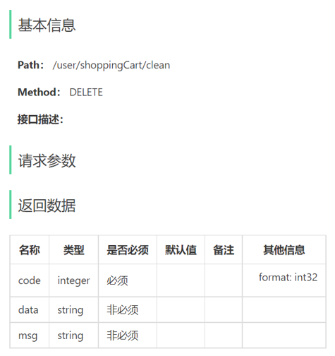

- [sky-take-out-Gitee仓库](https://gitee.com/gjt_1538048299/sky-take-out)

# 缓存商品

## 缓存菜品

### 实现思路

通过Redis来缓存菜品数据,减少数据库查询操作


缓存逻辑分析:
1. 每个分类下的菜品**保存缓存数据**
2. 数据库中菜品数据有变更时**清理缓存数据**

### 代码开发

#### 保存缓存数据

(user)DishController.java:

```java
package com.sky.controller.user;

import com.sky.constant.StatusConstant;
import com.sky.entity.Dish;
import com.sky.result.Result;
import com.sky.service.DishService;
import com.sky.vo.DishVO;
import io.swagger.annotations.Api;
import io.swagger.annotations.ApiOperation;
import lombok.extern.slf4j.Slf4j;
import org.springframework.beans.factory.annotation.Autowired;
import org.springframework.data.redis.core.RedisTemplate;
import org.springframework.web.bind.annotation.GetMapping;
import org.springframework.web.bind.annotation.RequestMapping;
import org.springframework.web.bind.annotation.RestController;

import java.util.List;

@RestController("userDishController")
@RequestMapping("/user/dish")
@Api(tags = "菜品浏览接口")
@Slf4j
public class DishController {
    @Autowired
    private DishService dishService;

    @Autowired
    private RedisTemplate redisTemplate;

    /**
     * 根据分类id查询菜品
     *
     * @param categoryId
     * @return
     */
    @GetMapping("/list")
    @ApiOperation("根据分类id查询菜品")
    public Result<List<DishVO>> list(Long categoryId) {
        log.info("根据分类id查询菜品:{}", categoryId);

        // 构造redis中的key,规则:dish_分类id
        String key = "dish_" + categoryId;

        // 查询redis中是否存在菜品数据
        List<DishVO> list = (List<DishVO>) redisTemplate.opsForValue().get(key);
        if (list != null && list.size() > 0) {
            // 如果存在,直接返回,无须查询数据库
            return Result.success(list);
        }

        // 如果不存在,查询数据库,并将查询到的数据放入redis中
        Dish dish = new Dish();
        dish.setCategoryId(categoryId);
        // 查询启售中的菜品
        dish.setStatus(StatusConstant.ENABLE);
        list = dishService.listWithFlavor(dish);
        redisTemplate.opsForValue().set(key, list);

        return Result.success(list);
    }
}
```

#### 清理缓存数据

加入清理缓存的逻辑,需要改造的方法:
- 新增菜品
- 修改菜品
- 批量删除菜品
- 启售、停售菜品

(admin)DishController.java:

```java
package com.sky.controller.admin;

import com.sky.dto.DishDTO;
import com.sky.dto.DishPageQueryDTO;
import com.sky.entity.Dish;
import com.sky.result.PageResult;
import com.sky.result.Result;
import com.sky.service.DishService;
import com.sky.vo.DishVO;
import io.swagger.annotations.Api;
import io.swagger.annotations.ApiOperation;
import lombok.extern.slf4j.Slf4j;
import org.springframework.beans.BeanUtils;
import org.springframework.beans.factory.annotation.Autowired;
import org.springframework.data.redis.core.RedisTemplate;
import org.springframework.web.bind.annotation.*;

import java.util.List;
import java.util.Set;

/**
 * 菜品相关接口
 */
@RestController("adminDishController")
@RequestMapping("/admin/dish")
@Api(tags = "菜品相关接口")
@Slf4j
public class DishController {
    @Autowired
    private DishService dishService;

    @Autowired
    private RedisTemplate redisTemplate;

    /**
     * 新增菜品
     *
     * @param dishDTO
     * @return
     */
    @PostMapping
    @ApiOperation("新增菜品")
    public Result save(@RequestBody DishDTO dishDTO) {
        log.info("新增菜品:{}", dishDTO);
        dishService.saveWithFlavor(dishDTO);
        // 清理缓存数据
        cleanCache("dish_" + dishDTO.getCategoryId());
        return Result.success();
    }

    /**
     * 菜品分页查询
     *
     * @param dishPageQueryDTO
     * @return
     */
    @GetMapping("/page")
    @ApiOperation("菜品分页查询")
    public Result<PageResult> page(DishPageQueryDTO dishPageQueryDTO) {
        log.info("菜品分页查询:{}", dishPageQueryDTO);
        PageResult pageResult = dishService.pageQuery(dishPageQueryDTO);
        return Result.success(pageResult);
    }

    /**
     * 菜品批量删除
     *
     * @param ids
     * @return
     */
    @DeleteMapping
    @ApiOperation("菜品批量删除")
    public Result delete(@RequestParam List<Long> ids) {
        log.info("菜品批量删除:{}", ids);
        dishService.deleteBatch(ids);
        // 清理缓存数据
        cleanCache("dish_*");
        return Result.success();
    }

    /**
     * 根据id查询菜品
     *
     * @param id
     * @return
     */
    @GetMapping("/{id}")
    @ApiOperation("根据id查询菜品")
    public Result<DishVO> getById(@PathVariable Long id) {
        log.info("根据id查询菜品:{}", id);
        DishVO dishVO = dishService.getByIdWithFlavor(id);
        return Result.success(dishVO);
    }

    /**
     * 修改菜品
     *
     * @param dishDTO
     * @return
     */
    @PutMapping
    @ApiOperation("修改菜品")
    public Result update(@RequestBody DishDTO dishDTO) {
        log.info("修改菜品:{}", dishDTO);
        dishService.updateWithFlavor(dishDTO);
        // 清理缓存数据
        cleanCache("dish_*");
        return Result.success();
    }

    /**
     * 菜品启售停售
     *
     * @param status
     * @return
     */
    @PostMapping("/status/{status}")
    @ApiOperation("菜品启售停售")
    public Result status(@PathVariable Integer status, Long id) {
        log.info("菜品:{} 启售停售状态:{}", id, status);
        DishVO dishVO = dishService.getByIdWithFlavor(id);
        dishVO.setStatus(status);
        DishDTO dishDTO = new DishDTO();
        BeanUtils.copyProperties(dishVO, dishDTO);
        dishService.updateWithFlavor(dishDTO);
        // 清理缓存数据
        cleanCache("dish_*");
        return Result.success();
    }

    /**
     * 根据分类id查询菜品
     *
     * @param categoryId
     * @return
     */
    @GetMapping("list")
    @ApiOperation("根据分类id查询菜品")
    public Result<List<Dish>> list(Long categoryId) {
        log.info("根据分类id查询菜品:{}", categoryId);
        List<Dish> list = dishService.list(categoryId);
        return Result.success(list);
    }

    /**
     * 清理缓存数据
     *
     * @param pattern
     */
    private void cleanCache(String pattern) {
        Set keys = redisTemplate.keys(pattern);
        redisTemplate.delete(keys);
    }
}
```

### 代码优化

通过SpringCache优化

(user)DishController.java:

```java
package com.sky.controller.user;

import com.sky.constant.StatusConstant;
import com.sky.entity.Dish;
import com.sky.result.Result;
import com.sky.service.DishService;
import com.sky.vo.DishVO;
import io.swagger.annotations.Api;
import io.swagger.annotations.ApiOperation;
import lombok.extern.slf4j.Slf4j;
import org.springframework.beans.factory.annotation.Autowired;
import org.springframework.cache.annotation.Cacheable;
import org.springframework.web.bind.annotation.GetMapping;
import org.springframework.web.bind.annotation.RequestMapping;
import org.springframework.web.bind.annotation.RestController;

import java.util.List;

@RestController("userDishController")
@RequestMapping("/user/dish")
@Api(tags = "菜品浏览接口")
@Slf4j
public class DishController {
    @Autowired
    private DishService dishService;

    /**
     * 根据分类id查询菜品
     *
     * @param categoryId
     * @return
     */
    @GetMapping("/list")
    @ApiOperation("根据分类id查询菜品")
    @Cacheable(cacheNames = "dishCache", key = "#categoryId")
    public Result<List<DishVO>> list(Long categoryId) {
        log.info("根据分类id查询菜品:{}", categoryId);
        Dish dish = new Dish();
        dish.setCategoryId(categoryId);
        // 查询启售中的菜品
        dish.setStatus(StatusConstant.ENABLE);
        List<DishVO> list = dishService.listWithFlavor(dish);
        return Result.success(list);
    }
}
```

(admin)DishController.java:

```java
package com.sky.controller.admin;

import com.sky.dto.DishDTO;
import com.sky.dto.DishPageQueryDTO;
import com.sky.entity.Dish;
import com.sky.result.PageResult;
import com.sky.result.Result;
import com.sky.service.DishService;
import com.sky.vo.DishVO;
import io.swagger.annotations.Api;
import io.swagger.annotations.ApiOperation;
import lombok.extern.slf4j.Slf4j;
import org.springframework.beans.factory.annotation.Autowired;
import org.springframework.cache.annotation.CacheEvict;
import org.springframework.web.bind.annotation.*;

import java.util.List;

/**
 * 菜品相关接口
 */
@RestController("adminDishController")
@RequestMapping("/admin/dish")
@Api(tags = "菜品相关接口")
@Slf4j
public class DishController {
    @Autowired
    private DishService dishService;

    /**
     * 新增菜品
     *
     * @param dishDTO
     * @return
     */
    @PostMapping
    @ApiOperation("新增菜品")
    @CacheEvict(cacheNames = "dishCache", key = "#dishDTO.categoryId")
    public Result save(@RequestBody DishDTO dishDTO) {
        log.info("新增菜品:{}", dishDTO);
        dishService.saveWithFlavor(dishDTO);
        return Result.success();
    }

    /**
     * 菜品分页查询
     *
     * @param dishPageQueryDTO
     * @return
     */
    @GetMapping("/page")
    @ApiOperation("菜品分页查询")
    public Result<PageResult> page(DishPageQueryDTO dishPageQueryDTO) {
        log.info("菜品分页查询:{}", dishPageQueryDTO);
        PageResult pageResult = dishService.pageQuery(dishPageQueryDTO);
        return Result.success(pageResult);
    }

    /**
     * 菜品批量删除
     *
     * @param ids
     * @return
     */
    @DeleteMapping
    @ApiOperation("菜品批量删除")
    @CacheEvict(cacheNames = "dishCache", allEntries = true)
    public Result delete(@RequestParam List<Long> ids) {
        log.info("菜品批量删除:{}", ids);
        dishService.deleteBatch(ids);
        return Result.success();
    }

    /**
     * 根据id查询菜品
     *
     * @param id
     * @return
     */
    @GetMapping("/{id}")
    @ApiOperation("根据id查询菜品")
    public Result<DishVO> getById(@PathVariable Long id) {
        log.info("根据id查询菜品:{}", id);
        DishVO dishVO = dishService.getByIdWithFlavor(id);
        return Result.success(dishVO);
    }

    /**
     * 修改菜品
     *
     * @param dishDTO
     * @return
     */
    @PutMapping
    @ApiOperation("修改菜品")
    @CacheEvict(cacheNames = "dishCache", allEntries = true)
    public Result update(@RequestBody DishDTO dishDTO) {
        log.info("修改菜品:{}", dishDTO);
        dishService.updateWithFlavor(dishDTO);
        return Result.success();
    }

    /**
     * 菜品启售停售
     *
     * @param status
     * @return
     */
    @PostMapping("/status/{status}")
    @ApiOperation("菜品启售停售")
    @CacheEvict(cacheNames = "dishCache", allEntries = true)
    public Result status(@PathVariable Integer status, Long id) {
        log.info("菜品:{} 启售停售状态:{}", id, status);
        dishService.startOrStop(status, id);
        return Result.success();
    }

    /**
     * 根据分类id查询菜品
     *
     * @param categoryId
     * @return
     */
    @GetMapping("list")
    @ApiOperation("根据分类id查询菜品")
    public Result<List<Dish>> list(Long categoryId) {
        log.info("根据分类id查询菜品:{}", categoryId);
        List<Dish> list = dishService.list(categoryId);
        return Result.success(list);
    }
}
```

## 缓存套餐

### 实现思路

1. 导入SpringCache和Redis相关maven坐标
2. 在启动类上加入`@EnableCaching`注解,开启缓存注解功能
3. 在用户端接口SetmealController的list方法上加入`@Cacheable`注解
4. 在管理端接口SetmealController的save、delete、update、startOrStop等方法上加入`@CacheEvict`注解

### 代码开发

(user)SetmealController.java:

```java
package com.sky.controller.user;

import com.sky.constant.StatusConstant;
import com.sky.entity.Setmeal;
import com.sky.result.Result;
import com.sky.service.SetmealService;
import com.sky.vo.DishItemVO;
import io.swagger.annotations.Api;
import io.swagger.annotations.ApiOperation;
import lombok.extern.slf4j.Slf4j;
import org.springframework.beans.factory.annotation.Autowired;
import org.springframework.cache.annotation.Cacheable;
import org.springframework.web.bind.annotation.GetMapping;
import org.springframework.web.bind.annotation.PathVariable;
import org.springframework.web.bind.annotation.RequestMapping;
import org.springframework.web.bind.annotation.RestController;

import java.util.List;

@RestController("userSetmealController")
@RequestMapping("/user/setmeal")
@Api(tags = "套餐浏览接口")
@Slf4j
public class SetmealController {
    @Autowired
    private SetmealService setmealService;

    /**
     * 动态条件查询套餐
     *
     * @param categoryId
     * @return
     */
    @GetMapping("/list")
    @ApiOperation("根据分类id查询套餐")
    @Cacheable(cacheNames = "setmealCache",key = "#categoryId")
    public Result<List<Setmeal>> list(Long categoryId) {
        Setmeal setmeal = new Setmeal();
        setmeal.setCategoryId(categoryId);
        setmeal.setStatus(StatusConstant.ENABLE);
        List<Setmeal> list = setmealService.list(setmeal);
        return Result.success(list);
    }

    /**
     * 根据套餐id查询包含的菜品列表
     *
     * @param id
     * @return
     */
    @GetMapping("/dish/{id}")
    @ApiOperation("根据套餐id查询包含的菜品列表")
    public Result<List<DishItemVO>> dishList(@PathVariable("id") Long id) {
        List<DishItemVO> list = setmealService.getDishItemById(id);
        return Result.success(list);
    }
}
```

(admin)SetmealController.java:

```java
package com.sky.controller.admin;

import com.sky.dto.SetmealDTO;
import com.sky.dto.SetmealPageQueryDTO;
import com.sky.result.PageResult;
import com.sky.result.Result;
import com.sky.service.SetmealService;
import com.sky.vo.SetmealVO;
import io.swagger.annotations.Api;
import io.swagger.annotations.ApiOperation;
import lombok.extern.slf4j.Slf4j;
import org.springframework.beans.factory.annotation.Autowired;
import org.springframework.cache.annotation.CacheEvict;
import org.springframework.web.bind.annotation.*;

import java.util.List;

@RestController("adminSetmealController")
@RequestMapping("/admin/setmeal")
@Api(tags = "套餐相关接口")
@Slf4j
public class SetmealController {

    @Autowired
    private SetmealService setmealService;

    /**
     * 套餐分页查询
     *
     * @param setmealPageQueryDTO
     * @return
     */
    @GetMapping("/page")
    @ApiOperation("套餐分页查询")
    public Result<PageResult> page(SetmealPageQueryDTO setmealPageQueryDTO) {
        log.info("套餐分页查询:{}", setmealPageQueryDTO);
        PageResult pageResult = setmealService.pageQuery(setmealPageQueryDTO);
        return Result.success(pageResult);
    }

    /**
     * 新增套餐
     *
     * @param setmealDTO
     * @return
     */
    @PostMapping
    @ApiOperation("新增套餐")
    @CacheEvict(cacheNames = "setmealCache",key = "#setmealDTO.categoryId")
    public Result save(@RequestBody SetmealDTO setmealDTO) {
        log.info("新增套餐:{}", setmealDTO);
        setmealService.saveWithDish(setmealDTO);
        return Result.success();
    }

    /**
     * 批量删除套餐
     *
     * @param ids
     * @return
     */
    @DeleteMapping
    @ApiOperation("批量删除套餐")
    @CacheEvict(cacheNames = "setmealCache",allEntries = true)
    public Result delete(@RequestParam List<Long> ids) {
        log.info("批量删除套餐：{}", ids);
        setmealService.deleteBatch(ids);
        return Result.success();
    }

    /**
     * 根据id查询套餐
     *
     * @param id
     * @return
     */
    @GetMapping("/{id}")
    @ApiOperation("根据id查询套餐")
    public Result<SetmealVO> getById(@PathVariable Long id) {
        log.info("根据id查询套餐:{}", id);
        SetmealVO setmealVO = setmealService.getByIdWithDish(id);
        return Result.success(setmealVO);
    }

    /**
     * 修改套餐
     *
     * @param setmealDTO
     * @return
     */
    @PutMapping
    @ApiOperation("修改套餐")
    @CacheEvict(cacheNames = "setmealCache",allEntries = true)
    public Result update(@RequestBody SetmealDTO setmealDTO) {
        log.info("修改套餐:{}", setmealDTO);
        setmealService.update(setmealDTO);
        return Result.success();
    }

    /**
     * 套餐启售停售
     *
     * @param status
     * @param id
     * @return
     */
    @PostMapping("/status/{status}")
    @ApiOperation("套餐启售停售")
    @CacheEvict(cacheNames = "setmealCache",allEntries = true)
    public Result startOrStop(@PathVariable Integer status, Long id) {
        log.info("套餐:{} 启售停售状态:{}", id, status);
        setmealService.startOrStop(status, id);
        return Result.success();
    }
}
```

# 购物车

## 需求分析


## 添加购物车

### 接口设计


### 数据库设计


### 代码开发

ShoppingCartDTO.java:

```java
package com.sky.dto;

import lombok.Data;
import java.io.Serializable;

@Data
public class ShoppingCartDTO implements Serializable {

    private Long dishId;
    private Long setmealId;
    private String dishFlavor;

}
```

ShoppingCartController.java:

```java
/**
 * 添加购物车
 *
 * @param shoppingCartDTO
 * @return
 */
@PostMapping("/add")
@ApiOperation("添加购物车")
public Result add(@RequestBody ShoppingCartDTO shoppingCartDTO) {
    log.info("添加购物车,商品信息为:{}", shoppingCartDTO);
    shoppingCartService.addShoppingCart(shoppingCartDTO);
    return Result.success();
}
```

ShoppingCartService.java:

```java
/**
 * 添加购物车
 *
 * @param shoppingCartDTO
 */
void addShoppingCart(ShoppingCartDTO shoppingCartDTO);
```

ShoppingCartServiceImpl.java:

```java
/**
 * 添加购物车
 *
 * @param shoppingCartDTO
 */
@Override
public void addShoppingCart(ShoppingCartDTO shoppingCartDTO) {
    // 判断当前加入购物车中的商品是否已经存在
    ShoppingCart shoppingCart = new ShoppingCart();
    BeanUtils.copyProperties(shoppingCartDTO, shoppingCart);
    shoppingCart.setUserId(BaseContext.getCurrentId());
    List<ShoppingCart> list = shoppingCartMapper.list(shoppingCart);

    // 如果已经存在,数量加一
    if (list != null && list.size() > 0) {
        ShoppingCart cart = list.get(0);
        cart.setNumber(cart.getNumber() + 1);
        shoppingCartMapper.updateByNumberId(cart);
    } else {
        // 如果不存在,插入一条购物车数据
        Long dishId = shoppingCart.getDishId();

        // 判断本次添加到购物车的是菜品还是套餐
        if (dishId != null) {
            // 本次添加到购物车的是菜品
            Dish dish = dishMapper.getById(dishId);
            shoppingCart.setName(dish.getName());
            shoppingCart.setImage(dish.getImage());
            shoppingCart.setAmount(dish.getPrice());
        } else {
            // 本次添加到购物车的是套餐
            Long setmealId = shoppingCart.getSetmealId();
            Setmeal setmeal = setmealMapper.getById(setmealId);
            shoppingCart.setName(setmeal.getName());
            shoppingCart.setImage(setmeal.getImage());
            shoppingCart.setAmount(setmeal.getPrice());
        }
        shoppingCart.setNumber(1);
        shoppingCart.setCreateTime(LocalDateTime.now());
        shoppingCartMapper.insert(shoppingCart);
    }
}
```

ShoppingCartMapper.java:

```java
/**
 * 动态条件查询
 *
 * @param shoppingCart
 * @return
 */
List<ShoppingCart> list(ShoppingCart shoppingCart);

/**
 * 根据id修改商品数量
 *
 * @param shoppingCart
 */
@Update("update shopping_cart set number = #{number} where id = #{id}")
void updateByNumberId(ShoppingCart shoppingCart);

/**
 * 插入购物车数据
 *
 * @param shoppingCart
 */
@Insert("insert into shopping_cart (name, image, user_id, dish_id, setmeal_id, dish_flavor, number, amount, create_time) VALUES " +
        "(#{name},#{image},#{userId},#{dishId},#{setmealId},#{dishFlavor},#{number},#{amount},#{createTime})")
void insert(ShoppingCart shoppingCart);
```

ShoppingCartMapper.xml:

```xml
<!--动态条件查询-->
<select id="list" resultType="com.sky.entity.ShoppingCart">
    select * from shopping_cart
    <where>
        <if test="userId != null">
            and user_id = #{userId}
        </if>
        <if test="dishId != null">
            and dish_id = #{dishId}
        </if>
        <if test="setmealId != null">
            and setmeal_id = #{setmealId}
        </if>
        <if test="dishFlavor != null">
            and dish_flavor = #{dishFlavor}
        </if>
    </where>
    order by create_time desc
</select>
```

## 查看购物车

### 接口设计


### 代码开发

ShoppingCartController.java:

```java
/**
 * 查看购物车
 *
 * @return
 */
@GetMapping("/list")
@ApiOperation("查看购物车")
public Result<List<ShoppingCart>> list() {
    log.info("查看购物车");
    List<ShoppingCart> list = shoppingCartService.showShoppingCart();
    return Result.success(list);
}
```

ShoppingCartService.java:

```java
/**
 * 查看购物车
 *
 * @return
 */
List<ShoppingCart> showShoppingCart();
```

ShoppingCartServiceImpl.java:

```java
/**
 * 查看购物车
 *
 * @return
 */
@Override
public List<ShoppingCart> showShoppingCart() {
    ShoppingCart shoppingCart = ShoppingCart.builder()
            .userId(BaseContext.getCurrentId())
            .build();
    return shoppingCartMapper.list(shoppingCart);
}
```

## 删除购物车

### 接口设计


### 代码开发

ShoppingCartController.java:

```java
/**
 * 删除购物车中一个商品
 *
 * @return
 */
@PostMapping("/sub")
@ApiOperation("删除购物车")
public Result delete(@RequestBody ShoppingCartDTO shoppingCartDTO) {
    log.info("删除购物车中一个商品:{}", shoppingCartDTO);
    shoppingCartService.deleteByShoppingCart(shoppingCartDTO);
    return Result.success();
}
```

ShoppingCartService.java:

```java
/**
 * 删除购物车中一个商品
 *
 * @param shoppingCartDTO
 */
void deleteByShoppingCart(ShoppingCartDTO shoppingCartDTO);
```

ShoppingCartServiceImpl.java:

```java
/**
 * 删除购物车中一个商品
 *
 * @param shoppingCartDTO
 */
@Override
public void deleteByShoppingCart(ShoppingCartDTO shoppingCartDTO) {
    // 查询当前购物车要删除的商品
    ShoppingCart shoppingCart = new ShoppingCart();
    BeanUtils.copyProperties(shoppingCartDTO, shoppingCart);
    shoppingCart.setUserId(BaseContext.getCurrentId());
    List<ShoppingCart> list = shoppingCartMapper.list(shoppingCart);
    if (list != null && list.size() > 0) {
        shoppingCart = list.get(0);
        // 商品份数
        Integer number = shoppingCart.getNumber();
        if (number == 1) {
            // 当前商品在购物车中的份数为1,直接删除当前记录
            shoppingCartMapper.deleteById(shoppingCart.getId());
        } else {
            // 当前商品在购物车中的份数不为1,修改份数
            shoppingCart.setNumber(shoppingCart.getNumber() - 1);
            shoppingCartMapper.updateByNumberId(shoppingCart);
        }
    }
}
```

ShoppingCartMapper.java:

```java
/**
 * 根据id删除购物车数据
 *
 * @param id
 */
@Delete("delete from shopping_cart where id = #{id}")
void deleteById(Long id);
```

## 清空购物车

### 接口设计



### 代码开发

ShoppingCartController.java:

```java
/**
 * 清空购物车
 *
 * @return
 */
@DeleteMapping("/clean")
@ApiOperation("清空购物车")
public Result clean() {
    log.info("清空购物车");
    shoppingCartService.cleanShoppingCart();
    return Result.success();
}
```

ShoppingCartService.java:

```java
/**
 * 清空购物车
 */
void cleanShoppingCart();
```

ShoppingCartServiceImpl.java:

```java
/**
 * 清空购物车
 */
@Override
public void cleanShoppingCart() {
    shoppingCartMapper.delete(BaseContext.getCurrentId());
}
```

ShoppingCartMapper.java:

```java
/**
 * 清空购物车
 *
 * @param userId
 */
@Delete("delete from shopping_cart where user_id = #{userId}")
void delete(Long userId);
```