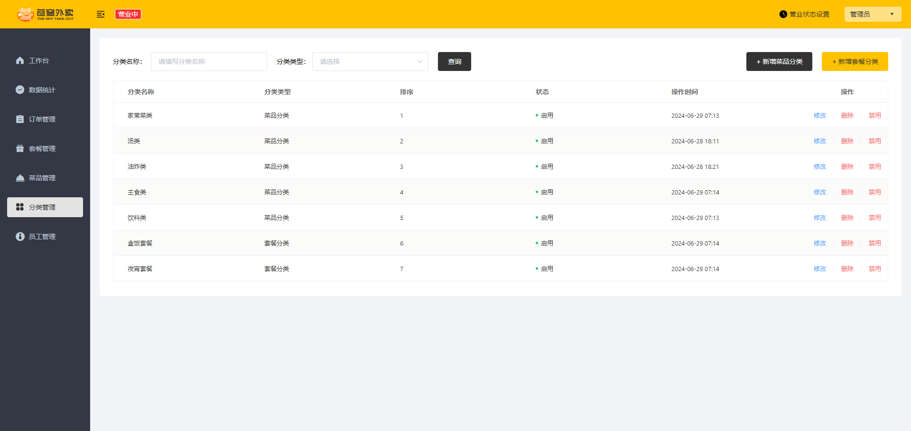

- [sky-take-out-Gitee仓库](https://gitee.com/gjt_1538048299/sky-take-out)

# 员工管理


项目约定:
1. 管理端发出的请求,统一使用`/admin`作为前缀
2. 用户端发出的请求,统一使用`/user`作为前缀

功能:
- 新增员工
- 员工分页查询
- 启用禁用员工账号
- 编辑员工

## 新增员工

### 需求分析


### 接口设计


### 代码开发

细节:**当前端提交的数据和实体类中对应的属性差别比较大的时候,建议使用DTO来封装数据**

EmployeeController:

```java
/**
 * 新增员工
 *
 * @param employeeDTO
 * @return
 */
@PostMapping
@ApiOperation("新增员工")
public Result save(@RequestBody EmployeeDTO employeeDTO) {
    log.info("新增员工:{}", employeeDTO);
    employeeService.save(employeeDTO);
    return Result.success();
}
```

EmployeeService:

```java
/**
 * 新增员工
 *
 * @param employeeDTO
 */
void save(EmployeeDTO employeeDTO);
```

EmployeeServiceImpl:

```java
/**
 * 新增员工
 *
 * @param employeeDTO
 */
@Override
public void save(EmployeeDTO employeeDTO) {
    Employee employee = new Employee();
    // 对象属性拷贝
    BeanUtils.copyProperties(employeeDTO, employee);
    // 设置账号状态,默认正常状态,1表示正常,0表示锁定
    employee.setStatus(StatusConstant.ENABLE);
    // 设置密码,默认密码123456
    employee.setPassword(DigestUtils.md5DigestAsHex(PasswordConstant.DEFAULT_PASSWORD.getBytes()));
    // 设置当前记录的创建时间和更新时间
    employee.setCreateTime(LocalDateTime.now());
    employee.setUpdateTime(LocalDateTime.now());
    // 设置当前记录的创建人id和修改人id
    // TODO 后期需要改为当前登录用户的id
    employee.setCreateUser(10L);
    employee.setUpdateUser(10L);
    employeeMapper.insert(employee);
}
```

EmployeeMapper:

```java
/**
 * 新增员工
 * 
 * @param employee
 */
@Insert("insert into employee(name, username, password, phone, sex, id_number, status, create_time, update_time, create_user, update_user) " +
        "VALUES " +
        "(#{name},#{username},#{password},#{phone},#{sex},#{idNumber},#{status},#{createTime},#{updateTime},#{createUser},#{updateUser})")
void insert(Employee employee);
```

### 功能测试

将合法的JWT令牌添加到全局参数中


### 代码完善

问题:
1. 录入的用户名已存在,抛出异常后没有处理
2. 新增员工时,创建人id和修改人id设置为了固定值

#### 解决问题1

通过全局异常处理器处理

GlobalExceptionHandler:

```java
/**
 * 处理SQL异常
 *
 * @param ex
 * @return
 */
@ExceptionHandler
public Result exceptionHandler(SQLIntegrityConstraintViolationException ex) {
    // 获取异常信息
    String message = ex.getMessage();
    // 用户名重复异常
    if (message.contains("Duplicate entry")) {
        String[] split = message.split(" ");
        String username = split[2];
        String msg = username + MessageConstant.ALREADY_EXISTS;
        return Result.error(msg);
    } else {
        return Result.error(MessageConstant.UNKNOWN_ERROR);
    }
}
```

#### 解决问题2


员工登录成功后会生成JWT令牌并响应给前端

后续请求中,前端会携带JWT令牌,通过JWT令牌可以解析出当前登录员工id

解析出登录员工id后,可以通过ThreadLocal,将当前登录员工id传递给Service的save方法

#### ThreadLocal

ThreadLocal并不是一个Thread,而是Thread的局部变量            

ThreadLocal为每个线程提供单独一份存储空间,具有线程隔离的效果,只有在线程内才能获取到对应的值,线程外则不能访问

ThreadLocal常用方法:
- `public void set(T value)`:设置当前线程的线程局部变量的值
- `public T get()`:返回当前线程所对应的线程局部变量的值  
- `public void remove()`:移除当前线程的线程局部变量

细节:**客户端发送的每次请求,后端的Tomcat服务器都会分配一个单独的线程来处理请求**

初始工程中封装了ThreadLocal操作的工具类：

```java
package com.sky.context;

public class BaseContext {

    public static ThreadLocal<Long> threadLocal = new ThreadLocal<>();

    public static void setCurrentId(Long id) {
        threadLocal.set(id);
    }

    public static Long getCurrentId() {
        return threadLocal.get();
    }

    public static void removeCurrentId() {
        threadLocal.remove();
    }
}
```

JwtTokenAdminInterceptor:

```java
package com.sky.interceptor;

import com.sky.constant.JwtClaimsConstant;
import com.sky.context.BaseContext;
import com.sky.properties.JwtProperties;
import com.sky.utils.JwtUtil;
import io.jsonwebtoken.Claims;
import lombok.extern.slf4j.Slf4j;
import org.springframework.beans.factory.annotation.Autowired;
import org.springframework.stereotype.Component;
import org.springframework.web.method.HandlerMethod;
import org.springframework.web.servlet.HandlerInterceptor;
import javax.servlet.http.HttpServletRequest;
import javax.servlet.http.HttpServletResponse;

/**
 * jwt令牌校验的拦截器
 */
@Component
@Slf4j
public class JwtTokenAdminInterceptor implements HandlerInterceptor {

    @Autowired
    private JwtProperties jwtProperties;

    /**
     * 校验jwt
     *
     * @param request
     * @param response
     * @param handler
     * @return
     * @throws Exception
     */
    public boolean preHandle(HttpServletRequest request, HttpServletResponse response, Object handler) throws Exception {
        //判断当前拦截到的是Controller的方法还是其他资源
        if (!(handler instanceof HandlerMethod)) {
            //当前拦截到的不是动态方法,直接放行
            return true;
        }

        //1、从请求头中获取令牌
        String token = request.getHeader(jwtProperties.getAdminTokenName());

        //2、校验令牌
        try {
            log.info("jwt校验:{}", token);
            Claims claims = JwtUtil.parseJWT(jwtProperties.getAdminSecretKey(), token);
            Long empId = Long.valueOf(claims.get(JwtClaimsConstant.EMP_ID).toString());
            log.info("当前员工id：", empId);
            // 将当前员工id存入ThreadLocal中
            BaseContext.setCurrentId(empId);
            //3、通过,放行
            return true;
        } catch (Exception ex) {
            //4、不通过,响应401状态码
            response.setStatus(401);
            return false;
        }
    }
}
```

EmployeeServiceImpl:

```java
/**
 * 新增员工
 *
 * @param employeeDTO
 */
@Override
public void save(EmployeeDTO employeeDTO) {
    Employee employee = new Employee();
    // 对象属性拷贝
    BeanUtils.copyProperties(employeeDTO, employee);
    // 设置账号状态,默认正常状态,1表示正常,0表示锁定
    employee.setStatus(StatusConstant.ENABLE);
    // 设置密码,默认密码123456
    employee.setPassword(DigestUtils.md5DigestAsHex(PasswordConstant.DEFAULT_PASSWORD.getBytes()));
    // 设置当前记录的创建时间和更新时间
    employee.setCreateTime(LocalDateTime.now());
    employee.setUpdateTime(LocalDateTime.now());
    // 设置当前记录的创建人id和修改人id
    employee.setCreateUser(BaseContext.getCurrentId());
    employee.setUpdateUser(BaseContext.getCurrentId());
    employeeMapper.insert(employee);
}
```

## 员工分页查询

### 需求分析


### 接口设计 


### 代码开发

Maven依赖引入:

```xml
<dependency>
    <groupId>com.github.pagehelper</groupId>
    <artifactId>pagehelper-spring-boot-starter</artifactId>
</dependency>
```

PageResult:

```java
package com.sky.result;

import lombok.AllArgsConstructor;
import lombok.Data;
import lombok.NoArgsConstructor;

import java.io.Serializable;
import java.util.List;

/**
 * 封装分页查询结果
 */
@Data
@AllArgsConstructor
@NoArgsConstructor
public class PageResult implements Serializable {

    private long total; //总记录数

    private List records; //当前页数据集合

}
```

EmployeeController:

```java
/**
 * 员工分页查询
 *
 * @param employeePageQueryDTO
 * @return
 */
@GetMapping("/page")
@ApiOperation("员工分页查询")
public Result<PageResult> page(EmployeePageQueryDTO employeePageQueryDTO) {
    log.info("员工分页查询,参数为:{}", employeePageQueryDTO);
    PageResult pageResult = employeeService.pageQuery(employeePageQueryDTO);
    return Result.success(pageResult);
}
```

EmployeeService:

```java
/**
 * 员工分页查询
 *
 * @param employeePageQueryDTO
 * @return
 */
PageResult pageQuery(EmployeePageQueryDTO employeePageQueryDTO);
```

EmployeeServiceImpl:

```java
/**
 * 员工分页查询
 *
 * @param employeePageQueryDTO
 * @return
 */
@Override
public PageResult pageQuery(EmployeePageQueryDTO employeePageQueryDTO) {
    // 开始分页查询
    PageHelper.startPage(employeePageQueryDTO.getPage(), employeePageQueryDTO.getPageSize());
    Page<Employee> page = employeeMapper.pageQuery(employeePageQueryDTO);
    // 获取总记录数和当前页数数据集合
    long total = page.getTotal();
    List<Employee> records = page.getResult();
    return new PageResult(total, records);
}
```

EmployeeMapper.java:

```java
/**
 * 员工分页查询
 *
 * @param employeePageQueryDTO
 * @return
 */
Page<Employee> pageQuery(EmployeePageQueryDTO employeePageQueryDTO);
```

EmployeeMapper.xml:

```xml
<!--员工分页查询-->
<select id="pageQuery" resultType="com.sky.entity.Employee">
    select id,
    name,
    username,
    password,
    phone,
    sex,
    id_number,
    status,
    create_time,
    update_time,
    create_user,
    update_user
    from employee
    <where>
        <if test="name != null and name != ''">
            and name like concat('%',#{name},'%')
        </if>
    </where>
    order by create_time desc
</select>
```

### 功能测试

Swagger全局参数里的token需要更新,jwt令牌的生效时间设置的是2个小时

### 代码完善

问题:操作时间格式显示有误


解决方式:
1. 在属性上加入注解,对日期进行格式化
2. 在WebMvcConfiguration中扩展Spring MVC的消息转换器,统一对日期类型进行格式化处理

#### 解决方式1

在属性上加入注解,对日期进行格式化

Employee:

```java
package com.sky.entity;

import com.fasterxml.jackson.annotation.JsonFormat;
import lombok.AllArgsConstructor;
import lombok.Builder;
import lombok.Data;
import lombok.NoArgsConstructor;

import java.io.Serializable;
import java.time.LocalDateTime;

@Data
@Builder
@NoArgsConstructor
@AllArgsConstructor
public class Employee implements Serializable {

    private static final long serialVersionUID = 1L;

    private Long id;

    private String username;

    private String name;

    private String password;

    private String phone;

    private String sex;

    private String idNumber;

    private Integer status;

    @JsonFormat(pattern = "yyyy-MM-dd HH:mm:ss")
    private LocalDateTime createTime;

    @JsonFormat(pattern = "yyyy-MM-dd HH:mm:ss")
    private LocalDateTime updateTime;

    private Long createUser;

    private Long updateUser;
}
```

#### 解决方式2

在WebMvcConfiguration中扩展Spring MVC的消息转换器,统一对日期类型进行格式化处理

JacksonObjectMapper:

```java
package com.sky.json;

import com.fasterxml.jackson.databind.DeserializationFeature;
import com.fasterxml.jackson.databind.ObjectMapper;
import com.fasterxml.jackson.databind.module.SimpleModule;
import com.fasterxml.jackson.datatype.jsr310.deser.LocalDateDeserializer;
import com.fasterxml.jackson.datatype.jsr310.deser.LocalDateTimeDeserializer;
import com.fasterxml.jackson.datatype.jsr310.deser.LocalTimeDeserializer;
import com.fasterxml.jackson.datatype.jsr310.ser.LocalDateSerializer;
import com.fasterxml.jackson.datatype.jsr310.ser.LocalDateTimeSerializer;
import com.fasterxml.jackson.datatype.jsr310.ser.LocalTimeSerializer;

import java.time.LocalDate;
import java.time.LocalDateTime;
import java.time.LocalTime;
import java.time.format.DateTimeFormatter;

import static com.fasterxml.jackson.databind.DeserializationFeature.FAIL_ON_UNKNOWN_PROPERTIES;

/**
 * 对象映射器:基于jackson将Java对象转为json，或者将json转为Java对象
 * 将JSON解析为Java对象的过程称为 [从JSON反序列化Java对象]
 * 从Java对象生成JSON的过程称为 [序列化Java对象到JSON]
 */
public class JacksonObjectMapper extends ObjectMapper {

    public static final String DEFAULT_DATE_FORMAT = "yyyy-MM-dd";
    //public static final String DEFAULT_DATE_TIME_FORMAT = "yyyy-MM-dd HH:mm:ss";
    public static final String DEFAULT_DATE_TIME_FORMAT = "yyyy-MM-dd HH:mm";
    public static final String DEFAULT_TIME_FORMAT = "HH:mm:ss";

    public JacksonObjectMapper() {
        super();
        //收到未知属性时不报异常
        this.configure(FAIL_ON_UNKNOWN_PROPERTIES, false);

        //反序列化时，属性不存在的兼容处理
        this.getDeserializationConfig().withoutFeatures(DeserializationFeature.FAIL_ON_UNKNOWN_PROPERTIES);

        SimpleModule simpleModule = new SimpleModule()
                .addDeserializer(LocalDateTime.class, new LocalDateTimeDeserializer(DateTimeFormatter.ofPattern(DEFAULT_DATE_TIME_FORMAT)))
                .addDeserializer(LocalDate.class, new LocalDateDeserializer(DateTimeFormatter.ofPattern(DEFAULT_DATE_FORMAT)))
                .addDeserializer(LocalTime.class, new LocalTimeDeserializer(DateTimeFormatter.ofPattern(DEFAULT_TIME_FORMAT)))
                .addSerializer(LocalDateTime.class, new LocalDateTimeSerializer(DateTimeFormatter.ofPattern(DEFAULT_DATE_TIME_FORMAT)))
                .addSerializer(LocalDate.class, new LocalDateSerializer(DateTimeFormatter.ofPattern(DEFAULT_DATE_FORMAT)))
                .addSerializer(LocalTime.class, new LocalTimeSerializer(DateTimeFormatter.ofPattern(DEFAULT_TIME_FORMAT)));

        //注册功能模块 例如，可以添加自定义序列化器和反序列化器
        this.registerModule(simpleModule);
    }
}
```

WebMvcConfiguration:

```java
/**
 * 扩展Spring MVC框架的消息转换器
 *
 * @param converters
 */
@Override
protected void extendMessageConverters(List<HttpMessageConverter<?>> converters) {
    log.info("开始扩展消息转换器...");
    // 创建一个消息转化器对象
    MappingJackson2HttpMessageConverter converter = new MappingJackson2HttpMessageConverter();
    // 设置对象转换器,将Java对象序列化为json字符串
    converter.setObjectMapper(new JacksonObjectMapper());
    // 将转换器放入Spring MVC框架的容器中
    converters.add(0, converter);
}
```

## 启用禁用员工账号

### 需求分析


### 接口设计 


### 代码开发

EmployeeController:

```java
/**
 * 启用禁用员工账号
 *
 * @param status
 * @return
 */
@PostMapping("/status/{status}")
@ApiOperation("启用禁用员工账号")
public Result startOrStop(@PathVariable Integer status, Long id) {
    log.info("启用禁用员工账号:{},{}", status, id);
    employeeService.startOrStop(status,id);
    return Result.success();
}
```

EmployeeService:

```java
/**
 * 启用禁用员工账号
 *
 * @param status
 * @param id
 */
void startOrStop(Integer status, Long id);
```

EmployeeServiceImpl:

```java
/**
 * 启用禁用员工账号
 *
 * @param status
 * @param id
 */
@Override
public void startOrStop(Integer status, Long id) {
    // 创建employee实体对象
    
    // 方式1
    // Employee employee = new Employee();
    // employee.setStatus(status);
    // employee.setId(id);

    // 方式2
    Employee employee = Employee.builder()
            .id(id)
            .status(status)
            .build();
    employeeMapper.update(employee);
}
```

EmployeeMapper.java:

```java
/**
 * 根据员工id更新员工数据
 *
 * @param employee
 */
void update(Employee employee);
```

EmployeeMapper.xml:

```xml
<!--根据员工id更新员工数据-->
<update id="update" parameterType="Employee">
    update employee
    <set>
        <if test="name != null">name = #{name},</if>
        <if test="username != null">username = #{username},</if>
        <if test="password != null">password = #{password},</if>
        <if test="phone != null">phone = #{phone},</if>
        <if test="sex != null">sex = #{sex},</if>
        <if test="idNumber != null">id_Number = #{idNumber},</if>
        <if test="status != null">status = #{status},</if>
        <if test="updateTime != null">update_Time = #{updateTime},</if>
        <if test="updateUser != null">update_User = #{updateUser},</if>
    </set>
    where id = #{id}
</update>
```

## 编辑员工

### 需求分析


### 接口设计 

接口1:根据员工id查询员工信息


接口2:编辑员工信息


### 代码开发

#### 根据员工id查询员工信息

EmployeeController:

```java
/**
 * 根据员工id查询员工信息
 *
 * @return
 */
@GetMapping("/{id}")
@ApiOperation("根据id查询员工")
public Result<Employee> getById(@PathVariable Long id) {
    log.info("根据id查询员工:{}", id);
    Employee employee = employeeService.getById(id);
    return Result.success(employee);
}
```

EmployeeService:

```java
/**
 * 根据员工id查询员工信息
 *
 * @param id
 * @return
 */
Employee getById(Long id);
```

EmployeeServiceImpl:

```java
/**
 * 根据员工id查询员工信息
 *
 * @param id
 * @return
 */
@Override
public Employee getById(Long id) {
    Employee employee = employeeMapper.getById(id);
    employee.setPassword("******");
    return employee;
}
```

EmployeeMapper.java:

```java
/**
 * 根据员工id查询员工信息
 *
 * @param id
 * @return
 */
@Select("select id, name, username, password, phone, sex, id_number, status, create_time, update_time, create_user, update_user " +
        "from employee where id = #{id}")
Employee getById(Long id);
```

#### 编辑员工信息

EmployeeController:

```java
/**
 * 编辑员工信息
 *
 * @param employeeDTO
 * @return
 */
@PutMapping
@ApiOperation("编辑员工信息")
public Result update(@RequestBody EmployeeDTO employeeDTO) {
    log.info("编辑员工信息:{}", employeeDTO);
    employeeService.update(employeeDTO);
    return Result.success();
}
```

EmployeeService:

```java
/**
 * 编辑员工信息
 *
 * @param employeeDTO
 */
void update(EmployeeDTO employeeDTO);
```

EmployeeServiceImpl:

```java
/**
 * 编辑员工信息
 *
 * @param employeeDTO
 */
@Override
public void update(EmployeeDTO employeeDTO) {
    Employee employee = new Employee();
    // 对象属性拷贝
    BeanUtils.copyProperties(employeeDTO, employee);
    // 设置当前记录的修改人id
    employee.setUpdateUser(BaseContext.getCurrentId());
    // 设置当前记录的更新时间
    employee.setUpdateTime(LocalDateTime.now());
    employeeMapper.update(employee);
}
```

EmployeeMapper.java:

```java
/**
 * 根据员工id更新员工数据
 *
 * @param employee
 */
void update(Employee employee);
```

EmployeeMapper.xml:

```xml
<!--根据员工id更新员工数据-->
<update id="update" parameterType="Employee">
    update employee
    <set>
        <if test="name != null">name = #{name},</if>
        <if test="username != null">username = #{username},</if>
        <if test="password != null">password = #{password},</if>
        <if test="phone != null">phone = #{phone},</if>
        <if test="sex != null">sex = #{sex},</if>
        <if test="idNumber != null">id_Number = #{idNumber},</if>
        <if test="status != null">status = #{status},</if>
        <if test="updateTime != null">update_Time = #{updateTime},</if>
        <if test="updateUser != null">update_User = #{updateUser},</if>
    </set>
    where id = #{id}
</update>
```

## 修改密码

### 需求分析


### 接口设计


### 代码开发

EmployeeController.java:

```java
/**
 * 修改密码
 *
 * @param passwordEditDTO
 * @return
 */
@PutMapping("/editPassword")
@ApiOperation("修改密码")
public Result editPassword(@RequestBody PasswordEditDTO passwordEditDTO) {
    log.info("修改密码:{}", passwordEditDTO);
    employeeService.editPassword(passwordEditDTO);
    return Result.success();
}
```

EmployeeService.java:

```java
/**
 * 修改密码
 *
 * @param passwordEditDTO
 */
void editPassword(PasswordEditDTO passwordEditDTO);
```

EmployeeServiceImpl.java:

```java
/**
 * 修改密码
 *
 * @param passwordEditDTO
 */
@Override
public void editPassword(PasswordEditDTO passwordEditDTO) {
    // 获取输入的旧密码,并进行MD5加密
    String putInOldPassword = DigestUtils.md5DigestAsHex(passwordEditDTO.getOldPassword().getBytes());
    // 查询到当前id的员工信息
    Employee employee = employeeMapper.getById(BaseContext.getCurrentId());
    // 旧密码
    String oldPassword = employee.getPassword();
    // 比对旧密码是否一致
    if (!oldPassword.equals(putInOldPassword)) {
        throw new PasswordErrorException("原密码错误！");
    }
    // 获取输入的新密码,并进行MD5加密
    String newPassword = DigestUtils.md5DigestAsHex(passwordEditDTO.getNewPassword().getBytes());
    // 保存新密码
    employee.setPassword(newPassword);
    employeeMapper.update(employee);
}
```

# 分类管理



功能:
- 新增分类
- 分类分页查询
- 根据id删除分类
- 修改分类
- 启用禁用分类
- 根据类型查询分类

## 需求分析


## 新增分类

### 接口设计


### 代码开发

CategoryController:

```java
/**
 * 新增分类
 * 
 * @param categoryDTO
 * @return
 */
@PostMapping
@ApiOperation("新增分类")
public Result save(@RequestBody CategoryDTO categoryDTO) {
    log.info("新增分类:{}", categoryDTO);
    categoryService.save(categoryDTO);
    return Result.success();
}
```

CategoryService:

```java
/**
 * 新增分类
 *
 * @param categoryDTO
 */
void save(CategoryDTO categoryDTO);
```

CategoryServiceImpl:

```java
/**
 * 新增分类
 *
 * @param categoryDTO
 */
@Override
public void save(CategoryDTO categoryDTO) {
    Category category = new Category();
    // 属性拷贝
    BeanUtils.copyProperties(categoryDTO, category);
    // 分类状态默认为禁用状态0
    category.setStatus(StatusConstant.DISABLE);
    // 设置创建时间、修改时间、创建人、修改人
    category.setCreateTime(LocalDateTime.now());
    category.setUpdateTime(LocalDateTime.now());
    category.setCreateUser(BaseContext.getCurrentId());
    category.setUpdateUser(BaseContext.getCurrentId());
    categoryMapper.insert(category);
}
```

CategoryMapper.java:

```java
/**
 * 插入数据
 *
 * @param category
 */
@Insert("insert into category(type, name, sort, status, create_time, update_time, create_user, update_user) " +
        "VALUES " +
        "(#{type},#{name}, #{sort}, #{status}, #{createTime}, #{updateTime}, #{createUser}, #{updateUser})")
void insert(Category category);
```

## 分类分页查询

### 接口设计 


### 代码开发

CategoryController:

```java
/**
 * 分类分页查询
 *
 * @param categoryPageQueryDTO
 * @return
 */
@GetMapping("/page")
@ApiOperation("分类分页查询")
public Result<PageResult> page(CategoryPageQueryDTO categoryPageQueryDTO) {
    log.info("分页查询:{}", categoryPageQueryDTO);
    PageResult pageResult = categoryService.pageQuery(categoryPageQueryDTO);
    return Result.success(pageResult);
}
```

CategoryService:

```java
/**
 * 分类分页查询
 *
 * @param categoryPageQueryDTO
 * @return
 */
PageResult pageQuery(CategoryPageQueryDTO categoryPageQueryDTO);
```

CategoryServiceImpl:

```java
/**
 * 分类分页查询
 *
 * @param categoryPageQueryDTO
 * @return
 */
@Override
public PageResult pageQuery(CategoryPageQueryDTO categoryPageQueryDTO) {
    PageHelper.startPage(categoryPageQueryDTO.getPage(), categoryPageQueryDTO.getPageSize());
    Page<Category> page = categoryMapper.pageQuery(categoryPageQueryDTO);
    return new PageResult(page.getTotal(), page.getResult());
}
```

CategoryMapper.java:

```java
/**
 * 分类分页查询
 *
 * @param categoryPageQueryDTO
 * @return
 */
Page<Category> pageQuery(CategoryPageQueryDTO categoryPageQueryDTO);
```

CategoryMapper.xml:

```xml
<!--分类分页查询-->
<select id="pageQuery" resultType="com.sky.entity.Category">
    select * from category
    <where>
        <if test="name != null and name != ''">
            and name like concat('%',#{name},'%')
        </if>
        <if test="type != null">
            and type = #{type}
        </if>
    </where>
    order by sort, create_time desc
</select>
```

## 根据id删除分类

### 接口设计 


### 代码开发

CategoryController:

```java
/**
 * 删除分类
 *
 * @param id
 * @return
 */
@DeleteMapping
@ApiOperation("根据id删除分类")
public Result deleteById(Long id) {
    log.info("删除分类:{}", id);
    categoryService.deleteById(id);
    return Result.success();
}
```

CategoryService:

```java
/**
 * 根据id删除分类
 *
 * @param id
 */
void deleteById(Long id);
```

CategoryServiceImpl:

```java
/**
 * 根据id删除分类
 *
 * @param id
 */
@Override
public void deleteById(Long id) {
    categoryMapper.deleteById(id);
}
```

CategoryMapper.java:

```java
/**
 * 根据id删除分类
 *
 * @param id
 */
@Delete("delete from category where id = #{id}")
void deleteById(Long id);
```

### 功能测试

问题:删除分类时,应该查看当前分类是否关联了菜品、套餐

### 代码完善

解决方式:如果当前分类关联了菜品、套餐,就需要抛出业务异常

DishMapper:

```java
/**
 * 根据分类id查询菜品数量
 * 
 * @param categoryId
 * @return
 */
@Select("select count(id) from dish where category_id = #{categoryId}")
Integer countByCategoryId(Long categoryId);
```

SetmealMapper:

```java
/**
 * 根据分类id查询套餐的数量
 *
 * @param id
 * @return
 */
@Select("select count(id) from setmeal where category_id = #{categoryId}")
Integer countByCategoryId(Long id);
```

CategoryServiceImpl:

```java
/**
 * 根据id删除分类
 *
 * @param id
 */
@Override
public void deleteById(Long id) {
    // 查询当前分类是否关联了菜品,如果关联了就抛出业务异常
    Integer count = dishMapper.countByCategoryId(id);
    if (count > 0) {
        // 当前分类下有菜品,不能删除
        throw new DeletionNotAllowedException(MessageConstant.CATEGORY_BE_RELATED_BY_DISH);
    }

    // 查询当前分类是否关联了套餐,如果关联了就抛出业务异常
    count = setmealMapper.countByCategoryId(id);
    if (count > 0) {
        // 当前分类下有菜品,不能删除
        throw new DeletionNotAllowedException(MessageConstant.CATEGORY_BE_RELATED_BY_SETMEAL);
    }
    categoryMapper.deleteById(id);
}
```

## 修改分类

### 接口设计 


### 代码开发

CategoryController:

```java
/**
 * 修改分类
 *
 * @param categoryDTO
 * @return
 */
@PutMapping
@ApiOperation("修改分类")
public Result update(@RequestBody CategoryDTO categoryDTO) {
    categoryService.update(categoryDTO);
    return Result.success();
}
```

CategoryService:

```java
/**
 * 修改分类
 *
 * @param categoryDTO
 */
void update(CategoryDTO categoryDTO);
```

CategoryServiceImpl:

```java
/**
 * 修改分类
 *
 * @param categoryDTO
 */
@Override
public void update(CategoryDTO categoryDTO) {
    Category category = new Category();
    // 属性拷贝
    BeanUtils.copyProperties(categoryDTO, category);
    // 设置修改时间、修改人
    category.setUpdateTime(LocalDateTime.now());
    category.setUpdateUser(BaseContext.getCurrentId());
    categoryMapper.update(category);
}
```

CategoryMapper.java:

```java
/**
 * 修改分类
 *
 * @param category
 */
void update(Category category);
```

CategoryMapper.xml:

```xml
<!--修改分类-->
<update id="update" parameterType="Category">
    update category
    <set>
        <if test="type != null">
            type = #{type},
        </if>
        <if test="name != null">
            name = #{name},
        </if>
        <if test="sort != null">
            sort = #{sort},
        </if>
        <if test="status != null">
            status = #{status},
        </if>
        <if test="updateTime != null">
            update_time = #{updateTime},
        </if>
        <if test="updateUser != null">
            update_user = #{updateUser}
        </if>
    </set>
    where id = #{id}
</update>
```

## 启用禁用分类

### 接口设计 


### 代码开发

CategoryController:

```java
/**
 * 启用禁用分类
 *
 * @param status
 * @param id
 * @return
 */
@PostMapping("/status/{status}")
@ApiOperation("启用禁用分类")
public Result startOrStop(@PathVariable Integer status, Long id) {
    categoryService.startOrStop(status, id);
    return Result.success();
}
```

CategoryService:

```java
/**
 * 启用禁用分类
 *
 * @param status
 * @param id
 */
void startOrStop(Integer status, Long id);
```

CategoryServiceImpl:

```java
/**
 * 启用禁用分类
 *
 * @param status
 * @param id
 */
@Override
public void startOrStop(Integer status, Long id) {
    Category category = Category.builder()
            .id(id)
            .status(status)
            .updateTime(LocalDateTime.now())
            .updateUser(BaseContext.getCurrentId())
            .build();
    categoryMapper.update(category);
}
```

CategoryMapper.java:

```java
/**
 * 修改分类
 *
 * @param category
 */
void update(Category category);
```

CategoryMapper.xml:

```xml
<!--修改分类-->
<update id="update" parameterType="Category">
    update category
    <set>
        <if test="type != null">
            type = #{type},
        </if>
        <if test="name != null">
            name = #{name},
        </if>
        <if test="sort != null">
            sort = #{sort},
        </if>
        <if test="status != null">
            status = #{status},
        </if>
        <if test="updateTime != null">
            update_time = #{updateTime},
        </if>
        <if test="updateUser != null">
            update_user = #{updateUser}
        </if>
    </set>
    where id = #{id}
</update>
```

## 根据类型查询分类

### 接口设计 


### 代码开发

CategoryController:

```java
/**
 * 根据类型查询分类
 *
 * @param type
 * @return
 */
@GetMapping("/list")
@ApiOperation("根据类型查询分类")
public Result list(Integer type) {
    List<Category> list = categoryService.list(type);
    return Result.success(list);
}
```

CategoryService:

```java
/**
 * 根据类型查询分类
 *
 * @param type
 * @return
 */
List<Category> list(Integer type);
```

CategoryServiceImpl:

```java
/**
 * 根据类型查询分类
 * @param type
 * @return
 */
public List<Category> list(Integer type) {
    return categoryMapper.list(type);
}
```

CategoryMapper.java:

```java
/**
 * 根据类型查询分类
 * @param type
 * @return
 */
List<Category> list(Integer type);
```

CategoryMapper.xml:

```xml
<!--根据类型查询分类-->
<select id="list" resultType="Category">
    select * from category
    where status = 1
    <if test="type != null">
        and type = #{type}
    </if>
    order by sort,create_time desc
</select>
```