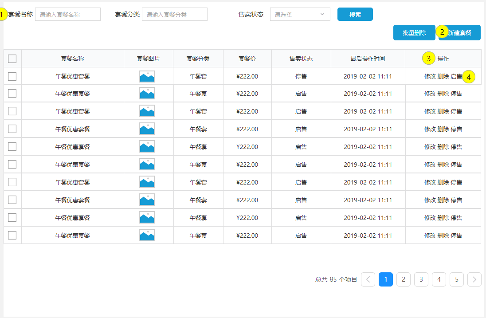
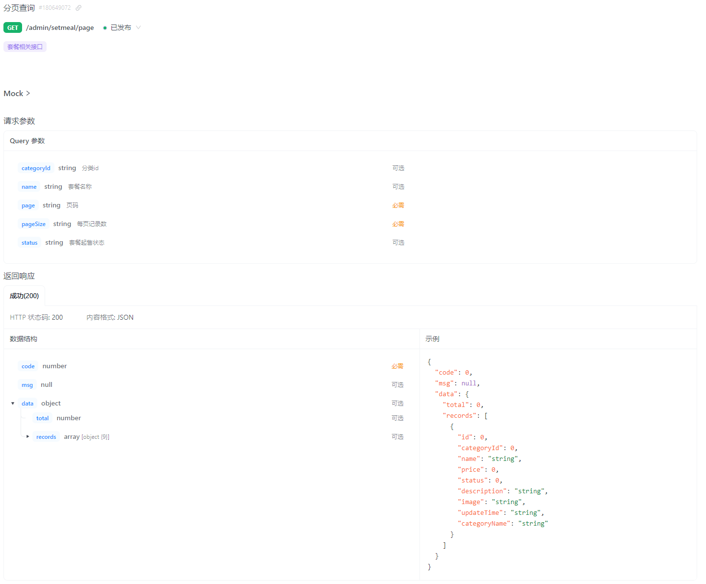
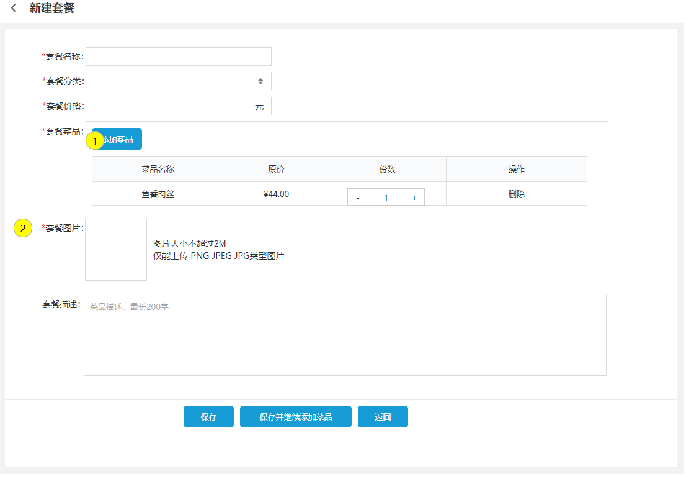
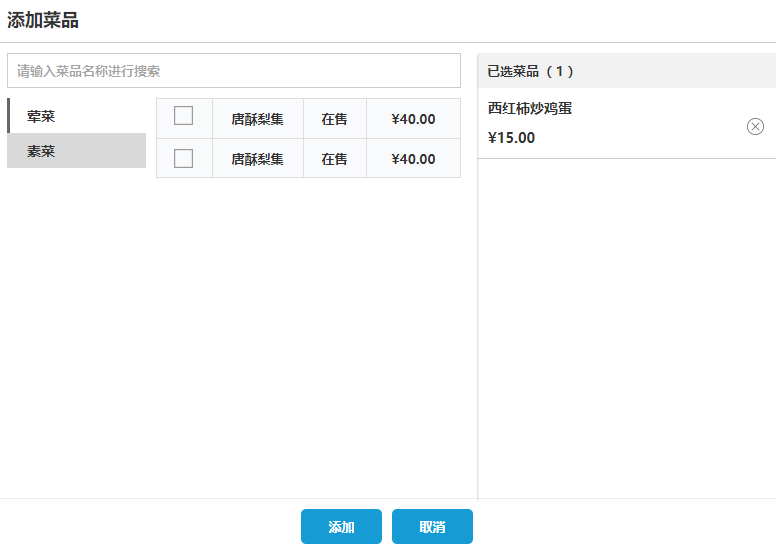
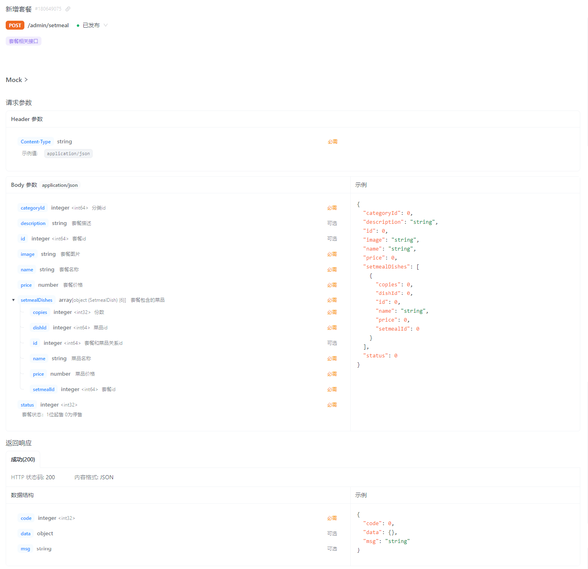
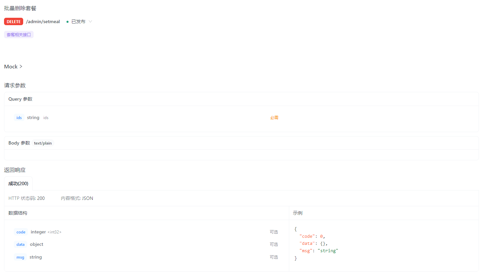
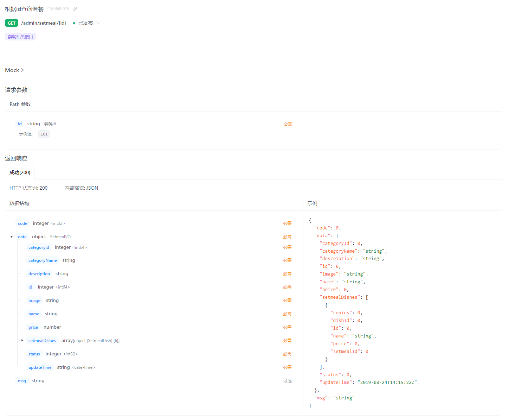
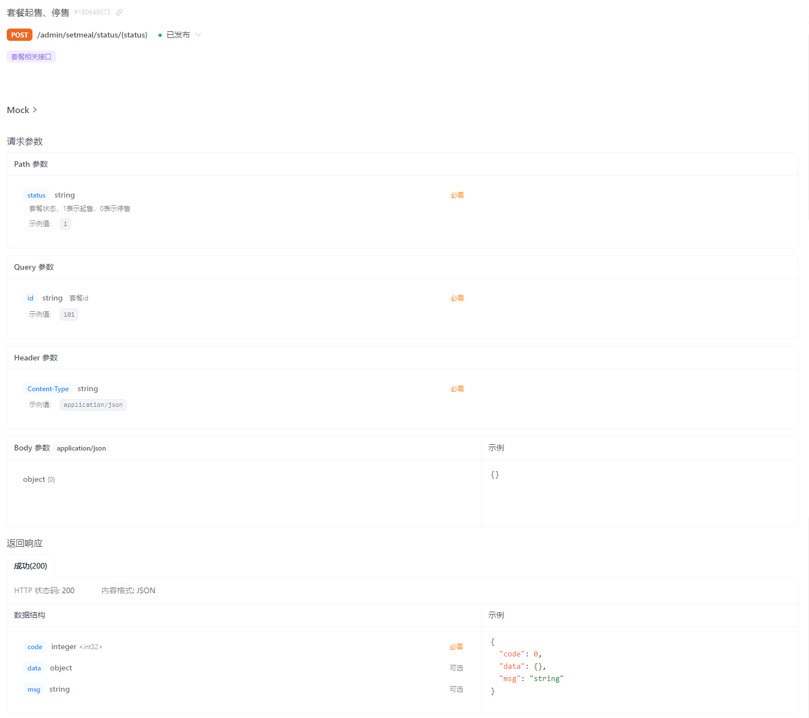

- [sky-take-out-Gitee仓库](https://gitee.com/gjt_1538048299/sky-take-out)

# 需求分析



# 分页查询

## 接口设计

业务规则:
1. 根据页码进行分页展示
2. 每页展示10条数据
3. 可以根据需要,按照套餐名称、分类、售卖状态进行查询



## 代码开发

SetmealPageQueryDTO.java:

```java
package com.sky.dto;

import lombok.Data;

import java.io.Serializable;

@Data
public class SetmealPageQueryDTO implements Serializable {
    private int page;
    private int pageSize;
    private String name;
    //分类id
    private Integer categoryId;
    //状态 0表示禁用 1表示启用
    private Integer status;
}
```

SetmealController.java:

```java
/**
 * 套餐分页查询
 *
 * @param setmealPageQueryDTO
 * @return
 */
@GetMapping("/page")
@ApiOperation("套餐分页查询")
public Result<PageResult> page(SetmealPageQueryDTO setmealPageQueryDTO) {
    log.info("套餐分页查询:{}", setmealPageQueryDTO);
    PageResult pageResult = setmealService.pageQuery(setmealPageQueryDTO);
    return Result.success(pageResult);
}
```

SetmealService.java:

```java
/**
 * 套餐分页查询
 *
 * @param setmealPageQueryDTO
 * @return
 */
PageResult pageQuery(SetmealPageQueryDTO setmealPageQueryDTO);
```

SetmealServiceImpl.java:

```java
/**
 * 套餐分页查询
 *
 * @param setmealPageQueryDTO
 * @return
 */
@Override
public PageResult pageQuery(SetmealPageQueryDTO setmealPageQueryDTO) {
    PageHelper.startPage(setmealPageQueryDTO.getPage(), setmealPageQueryDTO.getPageSize());
    Page<SetmealVO> page = setmealMapper.pageQuery(setmealPageQueryDTO);
    return new PageResult(page.getTotal(), page.getResult());
}
```

SetmealMapper.java:

```java
/**
 * 套餐分页查询
 *
 * @param setmealPageQueryDTO
 * @return
 */
Page<SetmealVO> pageQuery(SetmealPageQueryDTO setmealPageQueryDTO);
```

SetmealMapper.xml:

```xml
<!--套餐分页查询-->
<select id="pageQuery" resultType="com.sky.vo.SetmealVO">
    select s.*, c.name as categoryName
    from setmeal s
    left outer join category c on s.category_id = c.id
    <where>
        <if test="name != null">
            and s.name like concat('%',#{name},'%')
        </if>
        <if test="categoryId != null">
            and s.category_id = #{categoryId}
        </if>
        <if test="status != null">
            and s.status = #{status}
        </if>
    </where>
    order by s.create_time desc
</select>
```

# 新增套餐

## 需求分析





业务规则:

1. 套餐名称唯一
2. 套餐必须属于某个分类
3. 套餐必须包含菜品
4. 名称、分类、价格、图片为必填项
5. 添加菜品窗口需要根据分类类型来展示菜品
6. 新增的套餐默认为停售状态

## 接口设计

1. 根据类型查询分类(已完成)
2. 根据分类id查询菜品
3. 文件上传(已完成)
4. 新增套餐



## 代码开发

1. 根据分类id查询菜品,往套餐中添加菜品时选择
2. 新增套餐

### 根据分类id查询菜品

DishController.java:

```java
/**
 * 根据分类id查询菜品,回显到新增菜品中
 *
 * @param categoryId
 * @return
 */
@GetMapping("/list")
@ApiOperation("根据分类id查询菜品")
public Result<List<Dish>> list(Long categoryId) {
    log.info("根据分类id查询菜品:{}", categoryId);
    List<Dish> list = dishService.list(categoryId);
    return Result.success(list);
}
```

DishService.java:

```java
/**
 * 根据分类id查询菜品,回显到新增菜品中
 *
 * @param categoryId
 * @return
 */
List<Dish> list(Long categoryId);
```

DishServiceImpl.java:

```java
/**
 * 根据分类id查询菜品
 *
 * @param categoryId
 * @return
 */
@Override
public List<Dish> list(Long categoryId) {
    Dish dish=Dish.builder()
            .categoryId(categoryId)
            .status(StatusConstant.ENABLE)
            .build();
    return dishMapper.list(dish);
}
```

DishMapper.java:

```java
/**
 * 动态条件查询菜品
 *
 * @param dish
 * @return
 */
List<Dish> list(Dish dish);
```

DishMapper.xml:

```xml
<!--动态条件查询菜品-->
<select id="list" resultType="com.sky.entity.Dish">
    select * from dish
    <where>
        <if test="name != null">
            and name like concat('%',#{name},'%')
        </if>
        <if test="categoryId != null">
            and category_id = #{categoryId}
        </if>
        <if test="status != null">
            and status = #{status}
        </if>
    </where>
    order by create_time desc
</select>
```

### 新增套餐

SetmealController.java:

```java
/**
 * 新增套餐
 *
 * @param setmealDTO
 * @return
 */
@PostMapping
@ApiOperation("新增套餐")
public Result save(@RequestBody SetmealDTO setmealDTO) {
    log.info("新增套餐:{}", setmealDTO);
    setmealService.saveWithDish(setmealDTO);
    return Result.success();
}
```

SetmealService.java:

```java
/**
 * 新增套餐
 *
 * @param setmealDTO
 */
void saveWithDish(SetmealDTO setmealDTO);
```

SetmealServiceImpl.java:

```java
/**
 * 新增套餐,同时添加套餐和菜品的关系
 *
 * @param setmealDTO
 */
@Override
@Transactional
public void saveWithDish(SetmealDTO setmealDTO) {
    Setmeal setmeal = new Setmeal();
    BeanUtils.copyProperties(setmealDTO, setmeal);
    // 向套餐表插入数据
    setmealMapper.insert(setmeal);
    // 获取生成的套餐id
    Long id = setmeal.getId();
    List<SetmealDish> setmealDishes = setmealDTO.getSetmealDishes();
    setmealDishes.forEach(setmealDish -> {
        setmealDish.setSetmealId(id);
    });
    // 保存套餐和菜品的关系
    setmealDishMapper.insertBatch(setmealDishes);
}
```

SetmealMapper.java:

```java
/**
 * 新增套餐
 *
 * @param setmeal
 */
@AutoFill(OperationType.INSERT)
void insert(Setmeal setmeal);
```

SetmealDishMapper.java:

```java
/**
 * 批量保存套餐和菜品的关系
 *
 * @param setmealDishes
 */
void insertBatch(List<SetmealDish> setmealDishes);
```

SetmealMapper.xml:

```xml
<!--新增套餐-->
<insert id="insert" useGeneratedKeys="true" keyProperty="id">
    insert into setmeal
    (category_id, name, price, status, description, image, create_time, update_time, create_user, update_user)
    values (#{categoryId}, #{name}, #{price}, #{status}, #{description}, #{image}, #{createTime}, #{updateTime},
            #{createUser}, #{updateUser})
</insert>
```

SetmealDishMapper.xml:

```xml
<!--批量保存套餐和菜品的关系-->
<insert id="insertBatch">
    insert into setmeal_dish
    (setmeal_id,dish_id,name,price,copies)
    values
    <foreach collection="setmealDishes" item="sd" separator=",">
        (#{sd.setmealId},#{sd.dishId},#{sd.name},#{sd.price},#{sd.copies})
    </foreach>
</insert>
```

# 批量删除套餐

## 接口设计

业务规则:
1. 可以一次删除一个套餐,也可以批量删除套餐
2. 启售中的套餐不能删除



## 代码开发

SetmealController.java:

```java
/**
 * 批量删除套餐
 *
 * @param ids
 * @return
 */
@DeleteMapping
@ApiOperation("批量删除套餐")
public Result delete(@RequestParam List<Long> ids) {
    log.info("批量删除套餐：{}", ids);
    setmealService.deleteBatch(ids);
    return Result.success();
}
```

SetmealService.java:

```java
/**
 * 批量删除套餐
 *
 * @param ids
 */
void deleteBatch(List<Long> ids);
```

SetmealServiceImpl.java:

```java
/**
 * 批量删除套餐
 *
 * @param ids
 */
@Transactional
@Override
public void deleteBatch(List<Long> ids) {
    ids.forEach(id -> {
        Setmeal setmeal = setmealMapper.getById(id);
        if (StatusConstant.ENABLE.equals(setmeal.getStatus())) {
            // 启售中的套餐不能删除
            throw new DeletionNotAllowedException(MessageConstant.SETMEAL_ON_SALE);
        }
    });

    ids.forEach(setmealId -> {
        // 删除套餐表中的数据
        setmealMapper.deleteById(setmealId);
        // 删除套餐菜品关系表中的数据
        setmealDishMapper.deleteBySetmealId(setmealId);
    });
}
```

SetmealMapper.java:

```java
/**
 * 根据id查询套餐
 *
 * @param id
 * @return
 */
@Select("select * from setmeal where id = #{id}")
Setmeal getById(Long id);

/**
 * 根据id删除套餐
 *
 * @param setmealId
 */
@Delete("delete from setmeal where id = #{setmealId}")
void deleteById(Long setmealId);
```

SetmealDishMapper.java:

```java
/**
 * 根据套餐id删除套餐和菜品的关系
 *
 * @param setmealId
 */
@Delete("delete from setmeal_dish where setmeal_id = #{setmealId}")
void deleteBySetmealId(Long setmealId);
```

# 修改套餐

## 接口设计

1. 根据id查询套餐



2. 根据类型查询分类(已完成)
3. 根据分类id查询菜品(已完成)
4. 文件上传(已完成)
5. 修改套餐

## 代码开发

### 根据id查询套餐

用于修改页面回显数据

SetmealVO.java:

```java
package com.sky.vo;

import com.sky.entity.SetmealDish;
import lombok.AllArgsConstructor;
import lombok.Builder;
import lombok.Data;
import lombok.NoArgsConstructor;
import java.io.Serializable;
import java.math.BigDecimal;
import java.time.LocalDateTime;
import java.util.ArrayList;
import java.util.List;

@Data
@Builder
@NoArgsConstructor
@AllArgsConstructor
public class SetmealVO implements Serializable {

    private Long id;

    //分类id
    private Long categoryId;

    //套餐名称
    private String name;

    //套餐价格
    private BigDecimal price;

    //状态 0:停用 1:启用
    private Integer status;

    //描述信息
    private String description;

    //图片
    private String image;

    //更新时间
    private LocalDateTime updateTime;

    //分类名称
    private String categoryName;

    //套餐和菜品的关联关系
    private List<SetmealDish> setmealDishes = new ArrayList<>();
}
```

SetmealController.java:

```java
/**
 * 根据id查询套餐
 *
 * @param id
 * @return
 */
@GetMapping("/{id}")
@ApiOperation("根据id查询套餐")
public Result<SetmealVO> getById(@PathVariable Long id) {
    log.info("根据id查询套餐:{}", id);
    SetmealVO setmealVO = setmealService.getByIdWithDish(id);
    return Result.success(setmealVO);
}
```

SetmealService.java:

```java
/**
 * 根据id查询套餐和套餐的菜品关系
 *
 * @param id
 * @return
 */
SetmealVO getByIdWithDish(Long id);
```

SetmealServiceImpl.java:

```java
/**
 * 根据id查询套餐和套餐菜品关系
 *
 * @param id
 * @return
 */
public SetmealVO getByIdWithDish(Long id) {
    // 查询套餐
    Setmeal setmeal = setmealMapper.getById(id);
    SetmealVO setmealVO = new SetmealVO();
    BeanUtils.copyProperties(setmeal, setmealVO);
    // 查询套餐和菜品的关系
    List<SetmealDish> setmealDishes = setmealDishMapper.getBySetmealId(id);
    // 将套餐和套餐菜品的关系封装到一起返回
    setmealVO.setSetmealDishes(setmealDishes);
    return setmealVO;
}
```

SetmealMapper.java:

```java
/**
 * 根据id查询套餐
 *
 * @param id
 * @return
 */
@Select("select * from setmeal where id = #{id}")
Setmeal getById(Long id);
```

SetmealDishMapper.java:

```java
/**
 * 根据id查询套餐和套餐菜品关系
 *
 * @param setmealId
 * @return
 */
@Select("select * from setmeal_dish where setmeal_id = #{setmealId}")
List<SetmealDish> getBySetmealId(Long setmealId);
```

### 修改套餐

SetmealController.java:

```java
/**
 * 修改套餐
 *
 * @param setmealDTO
 * @return
 */
@PutMapping
@ApiOperation("修改套餐")
public Result update(@RequestBody SetmealDTO setmealDTO) {
    log.info("修改套餐:{}", setmealDTO);
    setmealService.update(setmealDTO);
    return Result.success();
}
```

SetmealService.java:

```java
/**
 * 修改套餐
 *
 * @param setmealDTO
 */
void update(SetmealDTO setmealDTO);
```

SetmealServiceImpl.java:

```java
/**
 * 修改套餐
 *
 * @param setmealDTO
 */
@Transactional
@Override
public void update(SetmealDTO setmealDTO) {
    Setmeal setmeal = new Setmeal();
    BeanUtils.copyProperties(setmealDTO, setmeal);
    // 修改套餐表
    setmealMapper.update(setmeal);
    // 获取套餐id
    Long setmealId = setmealDTO.getId();
    // 删除套餐和菜品的关联关系
    setmealDishMapper.deleteBySetmealId(setmealId);
    // 重新插入套餐和菜品的关联关系
    List<SetmealDish> setmealDishes = setmealDTO.getSetmealDishes();
    setmealDishes.forEach(setmealDish -> {
        setmealDish.setSetmealId(setmealId);
    });
    setmealDishMapper.insertBatch(setmealDishes);
}
```

SetmealMapper.java:

```java
/**
 * 更新套餐表
 * @param setmeal
 */
@AutoFill(value=OperationType.UPDATE)
void update(Setmeal setmeal);
```

SetmealMapper.xml:

```xml
<!--更新套餐-->
<update id="update">
    update setmeal
    <set>
        <if test="name != null">
            name = #{name},
        </if>
        <if test="categoryId != null">
            category_id = #{categoryId},
        </if>
        <if test="price != null">
            price = #{price},
        </if>
        <if test="image != null">
            image = #{image},
        </if>
        <if test="description != null">
            description = #{description},
        </if>
        <if test="status != null">
            status = #{status},
        </if>
        <if test="updateTime != null">
            update_time = #{updateTime},
        </if>
        <if test="updateUser != null">
            update_user = #{updateUser},
        </if>
    </set>
    where id= #{id}
</update>
```

# 套餐启售停售

## 接口设计

业务规则

1. 可以对状态为启售的套餐进行停售操作,可以对状态为停售的套餐进行启售操作
2. 启售的套餐可以展示在客户端,停售的套餐不能展示在客户端
3. 启售套餐时,如果套餐内包含停售的菜品,则不能启售



## 代码开发

SetmealController.java:

```java
/**
 * 套餐启售停售
 *
 * @param status
 * @param id
 * @return
 */
@PostMapping("/status/{status}")
@ApiOperation("套餐启售停售")
public Result startOrStop(@PathVariable Integer status, Long id) {
    log.info("套餐:{} 启售停售状态:{}", id, status);
    setmealService.startOrStop(status, id);
    return Result.success();
}
```

SetmealService.java:

```java
/**
 * 套餐启售停售
 *
 * @param status
 * @param id
 */
void startOrStop(Integer status, Long id);
```

SetmealServiceImpl.java:

```java
/**
 * 套餐启售停售
 *
 * @param status
 * @param id
 */
public void startOrStop(Integer status, Long id) {
    // 启售套餐时,判断套餐内是否有停售菜品
    if (status == StatusConstant.ENABLE) {
        // 根据套餐id获取其下的菜品列表
        List<Dish> dishList = dishMapper.getBySetmealId(id);
        if (dishList != null && dishList.size() > 0) {
            dishList.forEach(dish -> {
                if (StatusConstant.DISABLE.equals(dish.getStatus())) {
                    throw new SetmealEnableFailedException(MessageConstant.SETMEAL_ENABLE_FAILED);
                }
            });
        }
    }

    Setmeal setmeal = Setmeal.builder()
            .id(id)
            .status(status)
            .build();
    setmealMapper.update(setmeal);
}
```

SetmealMapper.java:

```java
 /**
 * 根据套餐id查询菜品
 *
 * @param setmealId
 * @return
 */
@Select("select d.* from dish d left join setmeal_dish sd on d.id = sd.dish_id where sd.setmeal_id = #{setmealId}")
List<Dish> getBySetmealId(Long setmealId);
```