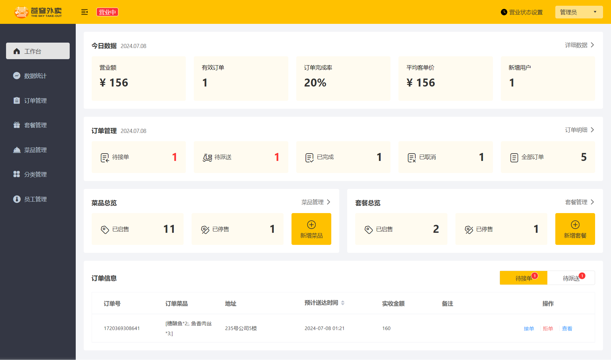
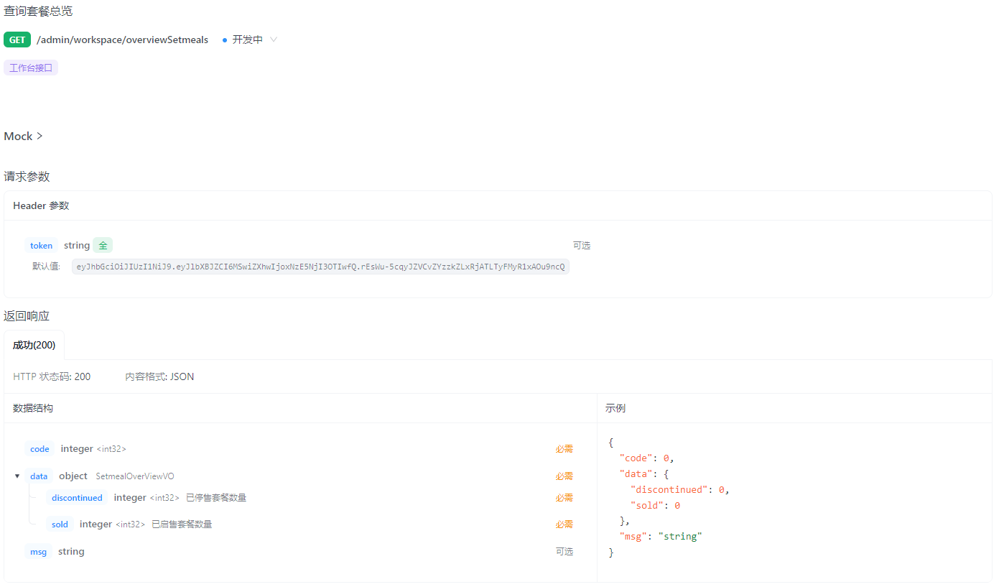
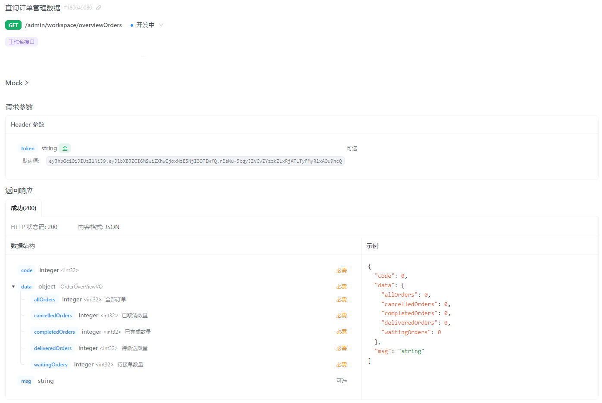

# 工作台

工作台是系统运营的数据看板,并提供快捷操作入口,可以有效提高商家的工作效率

工作台展示的数据:
- 今日数据
- 订单管理
- 菜品总览
- 套餐总览
- 订单信息

# 需求分析



- **营业额**:已完成订单的总金额
- **有效订单**:已完成订单的数量
- **订单完成率**:有效订单数/总订单数*100%
- **平均客单价**:营业额/有效订单数
- **新增用户**:新增用户的数量

# 接口设计

1. 今日数据接口
2. 订单管理接口
3. 菜品总览接口
4. 套餐总览接口
5. 订单搜索(已完成)
6. 各个状态的订单数量统计(已完成)

# 查询今日运营数据

## 接口设计


## 代码开发

BusinessDataVO.java:

```java
package com.sky.vo;

import lombok.AllArgsConstructor;
import lombok.Builder;
import lombok.Data;
import lombok.NoArgsConstructor;

import java.io.Serializable;

/**
 * 数据概览
 */
@Data
@Builder
@NoArgsConstructor
@AllArgsConstructor
public class BusinessDataVO implements Serializable {

    private Double turnover;//营业额

    private Integer validOrderCount;//有效订单数

    private Double orderCompletionRate;//订单完成率

    private Double unitPrice;//平均客单价

    private Integer newUsers;//新增用户数

}
```

WorkspaceController.java:

```java
/**
 * 查询今日运营数据
 *
 * @return
 */
@GetMapping("/businessData")
@ApiOperation("查询今日运营数据")
public Result<BusinessDataVO> getBusinessData() {
    log.info("查询今日运营数据");
    // 获得当天的开始时间
    LocalDateTime begin = LocalDateTime.now().with(LocalTime.MIN);
    // 获得当天的结束时间
    LocalDateTime end = LocalDateTime.now().with(LocalTime.MAX);
    BusinessDataVO businessDataVO = workspaceService.getBusinessData(begin, end);
    return Result.success(businessDataVO);
}
```

WorkspaceService.java:

```java
/**
 * 查询今日运营数据
 *
 * @return
 */
BusinessDataVO getBusinessData(LocalDateTime begin, LocalDateTime end);
```

WorkspaceServiceImpl.java:

```java
/**
 * 查询今日运营数据
 *
 * @return
 */
@Override
public BusinessDataVO getBusinessData(LocalDateTime begin, LocalDateTime end) {
    Map map = new HashMap();
    map.put("begin", begin);
    map.put("end", end);

    // 查询总订单数
    Integer totalOrderCount = orderMapper.countByMap(map);

    // 营业额
    map.put("status", Orders.COMPLETED);
    Double turnover = orderMapper.sumByMap(map);
    turnover = turnover == null ? 0.0 : turnover;

    // 有效订单数
    Integer validOrderCount = orderMapper.countByMap(map);

    Double unitPrice = 0.0;
    Double orderCompletionRate = 0.0;
    if (totalOrderCount != 0 && validOrderCount != 0) {
        // 订单完成率
        orderCompletionRate = validOrderCount.doubleValue() / totalOrderCount;
        // 平均客单价
        unitPrice = turnover / validOrderCount;
    }

    // 新增用户数
    Integer newUsers = userMapper.countByMap(map);

    return BusinessDataVO.builder()
            .turnover(turnover)
            .validOrderCount(validOrderCount)
            .orderCompletionRate(orderCompletionRate)
            .unitPrice(unitPrice)
            .newUsers(newUsers)
            .build();
}
```

# 查询菜品总览

## 接口设计


## 代码开发

DishOverviewVO.java:

```java
package com.sky.vo;

import lombok.AllArgsConstructor;
import lombok.Builder;
import lombok.Data;
import lombok.NoArgsConstructor;

import java.io.Serializable;

/**
 * 菜品总览
 */
@Data
@Builder
@NoArgsConstructor
@AllArgsConstructor
public class DishOverviewVO implements Serializable {
    // 已启售数量
    private Integer sold;

    // 已停售数量
    private Integer discontinued;
}
```

WorkspaceController.java:

```java
/**
 * 查询菜品总览
 *
 * @return
 */
@GetMapping("/overviewDishes")
@ApiOperation("查询菜品总览")
public Result<DishOverviewVO> dishOverview() {
    log.info("查询菜品总览");
    DishOverviewVO dishOverviewVO = workspaceService.getDishOverview();
    return Result.success(dishOverviewVO);
}
```

WorkspaceService.java:

```java
/**
 * 查询菜品总览
 *
 * @return
 */
DishOverviewVO getDishOverview();
```

WorkspaceServiceImpl.java:

```java
/**
 * 查询菜品总览
 *
 * @return
 */
@Override
public DishOverviewVO getDishOverview() {
    Map map = new HashMap();
    
    // 已启售数量
    map.put("status", StatusConstant.ENABLE);
    Integer sold = dishMapper.countByMap(map);

    // 已停售数量
    map.put("status", StatusConstant.DISABLE);
    Integer discontinued = dishMapper.countByMap(map);

    return DishOverviewVO.builder()
            .sold(sold)
            .discontinued(discontinued)
            .build();
}
```

DishMapper.java:

```java
/**
 * 根据动态条件统计菜品数量
 *
 * @param map
 * @return
 */
Integer countByMap(Map map);
```

DishMapper.xml

```xml
<!--根据动态条件统计菜品数量-->
<select id="countByMap" resultType="java.lang.Integer">
    select count(id) from dish
    <where>
        <if test="status != null">
            and status = #{status}
        </if>
        <if test="categoryId != null">
            and category_id = #{categoryId}
        </if>
    </where>
</select>
```

# 查询套餐总览

## 接口设计



## 代码开发

SetmealOverviewVO.java:

```java
package com.sky.vo;

import lombok.AllArgsConstructor;
import lombok.Builder;
import lombok.Data;
import lombok.NoArgsConstructor;

import java.io.Serializable;

/**
 * 套餐总览
 */
@Data
@Builder
@NoArgsConstructor
@AllArgsConstructor
public class SetmealOverviewVO implements Serializable {
    // 已启售数量
    private Integer sold;

    // 已停售数量
    private Integer discontinued;
}
```

WorkspaceController.java:

```java
/**
 * 查询套餐总览
 *
 * @return
 */
@GetMapping("/overviewSetmeals")
@ApiOperation("查询套餐总览")
public Result<SetmealOverviewVO> setmealOverview() {
    log.info("查询套餐总览");
    SetmealOverviewVO setmealOverviewVO = workspaceService.getSetmealOverview();
    return Result.success(setmealOverviewVO);
}
```

WorkspaceService.java:

```java
/**
 * 查询套餐总览
 *
 * @return
 */
SetmealOverviewVO getSetmealOverview();
```

WorkspaceServiceImpl.java:

```java
/**
 * 查询套餐总览
 *
 * @return
 */
@Override
public SetmealOverviewVO getSetmealOverview() {
    Map map = new HashMap();

    // 已启售数量
    map.put("status", StatusConstant.ENABLE);
    Integer sold = setmealMapper.countByMap(map);

    // 已停售数量
    map.put("status", StatusConstant.DISABLE);
    Integer discontinued = setmealMapper.countByMap(map);

    return SetmealOverviewVO.builder()
            .sold(sold)
            .discontinued(discontinued)
            .build();
}
```

SetmealMapper.java:

```java
/**
 * 根据动态条件统计套餐数量
 *
 * @param map
 * @return
 */
Integer countByMap(Map map);
```

SetmealMapper.xml:

```xml
<!--根据动态条件统计套餐数量-->
<select id="countByMap" resultType="java.lang.Integer">
    select count(id) from setmeal
    <where>
        <if test="status != null">
            and status = #{status}
        </if>
        <if test="categoryId != null">
            and category_id = #{categoryId}
        </if>
    </where>
</select>
```

# 查询订单管理数据

## 接口设计



## 代码开发

OrderOverviewVO.java:

```java
package com.sky.vo;

import lombok.AllArgsConstructor;
import lombok.Builder;
import lombok.Data;
import lombok.NoArgsConstructor;

import java.io.Serializable;

/**
 * 订单概览数据
 */
@Data
@Builder
@NoArgsConstructor
@AllArgsConstructor
public class OrderOverviewVO implements Serializable {
    //待接单数量
    private Integer waitingOrders;

    //待派送数量
    private Integer deliveredOrders;

    //已完成数量
    private Integer completedOrders;

    //已取消数量
    private Integer cancelledOrders;

    //全部订单数量
    private Integer allOrders;
}
```

WorkspaceController.java:

```java
/**
 * 查询订单管理数据
 *
 * @return
 */
@GetMapping("/overviewOrders")
@ApiOperation("查询订单管理数据")
public Result<OrderOverviewVO> getOrderOverviewOrders() {
    log.info("查询订单管理数据");
    OrderOverviewVO orderOverviewVO = workspaceService.getOrderOverviewOrders();
    return Result.success(orderOverviewVO);
}
```

WorkspaceService.java:

```java
/**
 * 查询订单管理数据
 *
 * @return
 */
OrderOverviewVO getOrderOverviewOrders();
```

WorkspaceServiceImpl.java:

```java
/**
 * 查询订单管理数据
 *
 * @return
 */
@Override
public OrderOverviewVO getOrderOverviewOrders() {
    Map map = new HashMap();
    map.put("begin", LocalDateTime.now().with(LocalTime.MIN));

    // 待接单数量
    map.put("status", Orders.TO_BE_CONFIRMED);
    Integer waitingOrders = orderMapper.countByMap(map);

    // 待派送(已接单)数量
    map.put("status", Orders.CONFIRMED);
    Integer deliveredOrders = orderMapper.countByMap(map);

    // 已完成数量
    map.put("status", Orders.COMPLETED);
    Integer completedOrders = orderMapper.countByMap(map);

    // 已取消数量
    map.put("status", Orders.CANCELLED);
    Integer cancelledOrders = orderMapper.countByMap(map);

    map.put("status", null);
    Integer allOrders = orderMapper.countByMap(map);

    return OrderOverviewVO.builder()
            .waitingOrders(waitingOrders)
            .deliveredOrders(deliveredOrders)
            .completedOrders(completedOrders)
            .cancelledOrders(cancelledOrders)
            .allOrders(allOrders)
            .build();
}
```