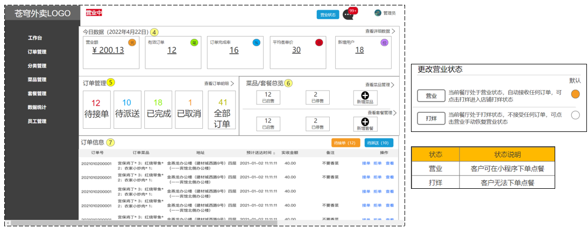
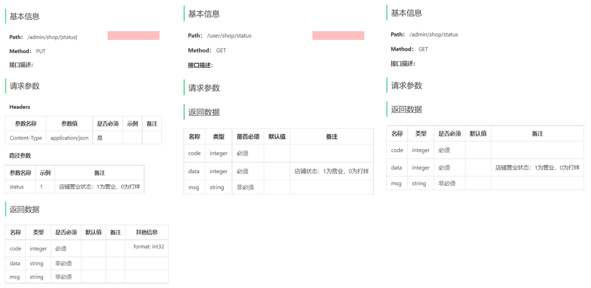

- [sky-take-out-Gitee仓库](https://gitee.com/gjt_1538048299/sky-take-out)

# Spring Data Redis准备工作

## 导入maven坐标

```xml
<dependency>
    <groupId>org.springframework.boot</groupId>
    <artifactId>spring-boot-starter-data-redis</artifactId>
</dependency>
```

## 配置Redis数据源

application.yml:

```yml
redis:
    host: ${sky.redis.host}
    port: ${sky.redis.port}
    password: ${sky.redis.password}
    database: ${sky.redis.database}
```

application-dev.yml:

```yml
spring:
    redis:
        host: localhost
        port: 6379
        password: 123456
        database: 0
```

## 编写配置类并创建RedisTemplate对象

RedisConfiguration.java:

```java
package com.sky.config;

import lombok.extern.slf4j.Slf4j;
import org.springframework.context.annotation.Bean;
import org.springframework.context.annotation.Configuration;
import org.springframework.data.redis.connection.RedisConnectionFactory;
import org.springframework.data.redis.core.RedisTemplate;
import org.springframework.data.redis.serializer.StringRedisSerializer;

@Configuration
@Slf4j
public class RedisConfiguration {
    @Bean
    public RedisTemplate redisTemplate(RedisConnectionFactory redisConnectionFactory) {
        log.info("开始创建redis模板对象...");
        RedisTemplate redisTemplate = new RedisTemplate();
        // 设置redis的连接工厂对象
        redisTemplate.setConnectionFactory(redisConnectionFactory);
        // 设置redis key的序列化器
        redisTemplate.setKeySerializer(new StringRedisSerializer());
        return redisTemplate;
    }
}
```

# 需求分析



# 接口设计

1. 设置营业状态
2. 管理端查询营业状态
3. 用户端查询营业状态

本项目约定:
- 管理端发出的请求,统一使用`/admin`作为前缀
- 用户端发出的请求,统一使用`/user`作为前缀



营业状态数据存储方式:基于Redis的字符串进行存储

# 代码开发

(admin)ShopController.java:

```java
/**
 * 设置店铺的营业状态
 *
 * @param status
 * @return
 */
@PutMapping("/{status}")
@ApiOperation("设置店铺的营业状态")
public Result setStatus(@PathVariable Integer status) {
    log.info("设置店铺的营业状态为:{}", status == 1 ? "营业中" : "打烊中");
    redisTemplate.opsForValue().set(KEY, status);
    return Result.success();
}

/**
 * 获取店铺的营业状态
 *
 * @return
 */
@GetMapping("/status")
@ApiOperation("获取店铺的营业状态")
public Result<Integer> getStatus() {
    Integer status = (Integer) redisTemplate.opsForValue().get(KEY);
    log.info("获取店铺的营业状态为:{}", status == 1 ? "营业中" : "打烊中");
    return Result.success(status);
}
```

(user)ShopController.java:

```java
/**
 * 获取店铺的营业状态
 *
 * @return
 */
@GetMapping("/status")
@ApiOperation("获取店铺的营业状态")
public Result<Integer> getStatus() {
    Integer status = (Integer) redisTemplate.opsForValue().get(KEY);
    log.info("获取店铺的营业状态为:{}", status == 1 ? "营业中" : "打烊中");
    return Result.success(status);
}
```