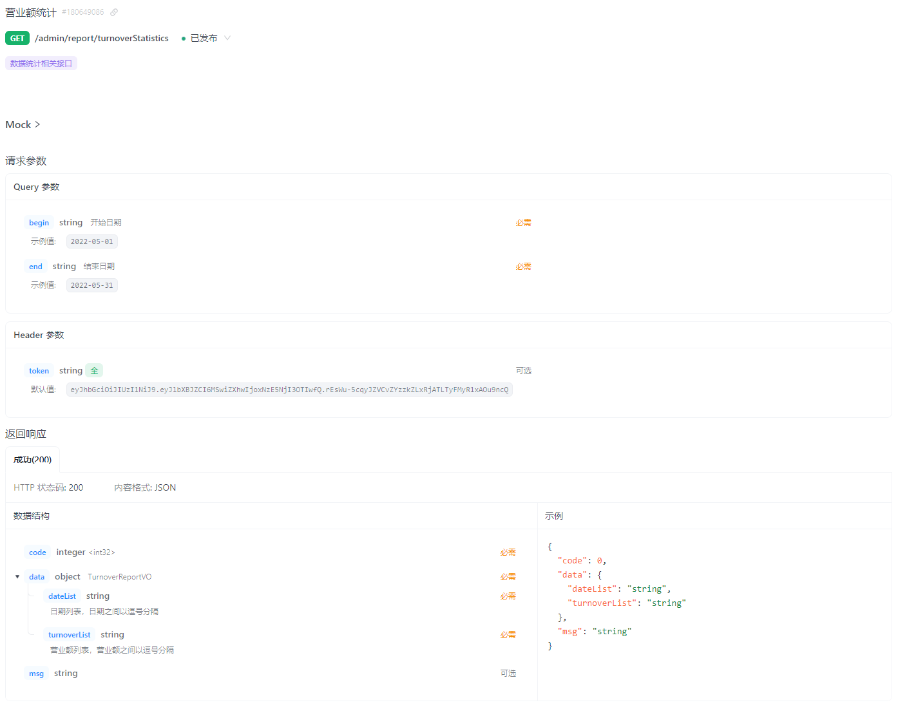

- [sky-take-out-Gitee仓库](https://gitee.com/gjt_1538048299/sky-take-out)

# 营业额统计

## 需求分析


## 接口设计

业务规则:
1. 营业额指订单状态为"已完成"的订单金额合计
2. 基于可视化报表的折线图展示营业额数据,X轴为日期,Y轴为营业额
3. 根据时间选择区间,展示每天的营业额数据



## 代码开发

ReportController.java:

```java
/**
 * 营业额统计
 *
 * @param begin
 * @param end
 * @return
 */
@GetMapping("/turnoverStatistics")
@ApiOperation("营业额统计")
public Result<TurnoverReportVO> turnoverStatistics(@DateTimeFormat(pattern = "yyyy-MM-dd") LocalDate begin,
                                                    @DateTimeFormat(pattern = "yyyy-MM-dd") LocalDate end) {
    log.info("营业额统计:{}至{}", begin, end);
    TurnoverReportVO turnoverStatistics = reportService.getTurnoverStatistics(begin, end);
    return Result.success(turnoverStatistics);
}
```

ReportService.java:

```java
/**
 * 统计指定时间区间内的营业额数据
 *
 * @param begin
 * @param end
 * @return
 */
TurnoverReportVO getTurnoverStatistics(LocalDate begin, LocalDate end);
```

ReportServiceImpl.java:

```java
/**
 * 统计指定时间区间内的营业额数据
 *
 * @param begin
 * @param end
 * @return
 */
@Override
public TurnoverReportVO getTurnoverStatistics(LocalDate begin, LocalDate end) {
    // 存放从begin至end时间区间内的每天的日期
    List<LocalDate> dateList = new ArrayList<>();
    dateList.add(begin);
    while (!begin.equals(end)) {
        // 日期计算:计算指定日期的后一天对应的日期
        begin = begin.plusDays(1);
        // 将日期添加到dateList中
        dateList.add(begin);
    }
    // 把日期拼接成字符串
    String dateListStr = StringUtils.join(dateList, ",");

    // 存放从begin至end时间区间内的每天的营业额数据
    List<Double> turnoverList = new ArrayList<>();
    for (LocalDate date : dateList) {
        // 查询date日期对应的营业额数据,营业额:状态为"已完成"的订单金额合计
        LocalDateTime beginTime = LocalDateTime.of(date, LocalTime.MIN);
        LocalDateTime endTime = LocalDateTime.of(date, LocalTime.MAX);
        Map map = new HashMap();
        map.put("begin", beginTime);
        map.put("end", endTime);
        map.put("status", Orders.COMPLETED);
        Double turnover = orderMapper.sumByMap(map);
        // 如果营业额为空,则赋值为0
        turnover = turnover == null ? 0.0 : turnover;
        turnoverList.add(turnover);
    }
    // 把营业额拼接成字符串
    String turnoverListStr = StringUtils.join(turnoverList, ",");

    // 封装对象返回
    return new TurnoverReportVO(dateListStr, turnoverListStr);
}
```

OrderMapper.java:

```java
/**
 * 根据动态条件统计营业额数据
 *
 * @param map
 * @return
 */
Double sumByMap(Map map);
```

OrderMapper.xml

```xml
<!--根据动态条件统计营业额数据-->
<select id="sumByMap" resultType="java.lang.Double">
    select sum(amount) from orders
    <where>
        <if test="begin != null">
            and order_time &gt; #{begin}
        </if>
        <if test="end != null">
            and order_time &lt; #{end}
        </if>
        <if test="status != null">
            and status = #{status}
        </if>
    </where>
</select>
```

# 用户统计

## 需求分析


## 接口设计


业务规则:
1. 基于可视化报表的折线图展示用户数据,X轴为日期,Y轴为用户数
2. 根据时间选择区间,展示每天的用户总量和新增用户量数据

## 代码开发

ReportController.java:

```java
/**
 * 用户统计
 *
 * @param begin
 * @param end
 * @return
 */
@GetMapping("/userStatistics")
@ApiOperation("用户统计")
public Result<UserReportVO> userStatistics(@DateTimeFormat(pattern = "yyyy-MM-dd") LocalDate begin,
                                            @DateTimeFormat(pattern = "yyyy-MM-dd") LocalDate end) {
    log.info("用户统计:{}至{}", begin, end);
    UserReportVO userReportVO = reportService.getUserStatistics(begin, end);
    return Result.success(userReportVO);
}
```

ReportService.java:

```java
/**
 * 统计指定时间区间内的用户数据
 *
 * @param begin
 * @param end
 * @return
 */
UserReportVO getUserStatistics(LocalDate begin, LocalDate end);
```

ReportServiceImpl.java:

```java
/**
 * 统计指定时间区间内的用户数据
 *
 * @param begin
 * @param end
 * @return
 */
@Override
public UserReportVO getUserStatistics(LocalDate begin, LocalDate end) {
    // 存放从begin至end时间区间内的每天的日期
    List<LocalDate> dateList = new ArrayList<>();
    dateList.add(begin);
    while (!begin.equals(end)) {
        // 日期计算:计算指定日期的后一天对应的日期
        begin = begin.plusDays(1);
        // 将日期添加到dateList中
        dateList.add(begin);
    }
    // 把日期拼接成字符串
    String dateListStr = StringUtils.join(dateList, ",");

    // 存放从begin至end时间区间内的每天的用户增量
    List<Integer> newUserList = new ArrayList<>();
    // 存放从begin至end时间区间内的每天的用户总量
    List<Integer> totalUserList = new ArrayList<>();
    for (LocalDate date : dateList) {
        LocalDateTime beginTime = LocalDateTime.of(date, LocalTime.MIN);
        LocalDateTime endTime = LocalDateTime.of(date, LocalTime.MAX);
        Map map = new HashMap();
        map.put("end", endTime);

        // 查询每天的用户总量
        Integer totalUserCount = userMapper.countByMap(map);
        // 如果用户总量为空,则赋值为0
        totalUserCount = totalUserCount == null ? 0 : totalUserCount;
        totalUserList.add(totalUserCount);

        map.put("begin", beginTime);

        // 查询每天的用户增量
        Integer newUserCount = userMapper.countByMap(map);
        // 如果用户增量为空,则赋值为0
        newUserCount = newUserCount == null ? 0 : newUserCount;
        newUserList.add(newUserCount);
    }
    // 把用户总量拼接成字符串
    String totalUserListStr = StringUtils.join(totalUserList, ",");
    // 把用户增量拼接成字符串
    String newUserListStr = StringUtils.join(newUserList, ",");

    // 封装对象返回
    return new UserReportVO(dateListStr, totalUserListStr, newUserListStr);
}
```

UserMapper.java:

```java
/**
 * 根据动态条件统计用户数量
 *
 * @param map
 * @return
 */
Integer countByMap(Map map);
```

UserMapper.xml:

```xml
<!--根据动态条件统计用户数量-->
<select id="countByMap" resultType="java.lang.Integer">
    select count(id) from user
    <where>
    <if test="begin != null">
        and create_time &gt; #{begin}
    </if>
    <if test="end != null">
        and create_time &lt; #{end}
    </if>
    </where>
</select>
```

# 订单统计

## 需求分析


## 接口设计

业务规则:
1. 有效订单指状态为"已完成"的订单
2. 基于可视化报表的折线图展示订单数据,X轴为日期,Y轴为订单数量
3. 根据时间选择区间,展示每天的订单总数和有效订单数
4. 展示所选时间区间内的有效订单数、总订单数、订单完成率,订单完成率=有效订单数/总订单数*100%


## 代码开发

ReportController.java:

```java
/**
 * 订单统计
 *
 * @param begin
 * @param end
 * @return
 */
@GetMapping("/ordersStatistics")
@ApiOperation("订单统计")
public Result<OrderReportVO> orderStatistics(@DateTimeFormat(pattern = "yyyy-MM-dd") LocalDate begin,
                                                @DateTimeFormat(pattern = "yyyy-MM-dd") LocalDate end) {
    log.info("订单统计:{}至{}", begin, end);
    OrderReportVO orderReportVO = reportService.getOrderStatistics(begin, end);
    return Result.success(orderReportVO);
}
```

ReportService.java:

```java
/**
 * 统计指定时间区间内的订单数据
 *
 * @param begin
 * @param end
 * @return
 */
OrderReportVO getOrderStatistics(LocalDate begin, LocalDate end);
```

ReportServiceImpl.java:

```java
/**
 * 统计指定时间区间内的订单数据
 *
 * @param begin
 * @param end
 * @return
 */
@Override
public OrderReportVO getOrderStatistics(LocalDate begin, LocalDate end) {
    // 存放从begin至end时间区间内的每天的日期
    List<LocalDate> dateList = new ArrayList<>();
    dateList.add(begin);
    while (!begin.equals(end)) {
        // 日期计算:计算指定日期的后一天对应的日期
        begin = begin.plusDays(1);
        // 将日期添加到dateList中
        dateList.add(begin);
    }
    // 把日期拼接成字符串
    String dateListStr = StringUtils.join(dateList, ",");

    // 存放从begin至end时间区间内的每天的订单数
    List<Integer> orderCountList = new ArrayList<>();
    // 存放从begin至end时间区间内的每天的有效订单数
    List<Integer> validOrderCountList = new ArrayList<>();
    for (LocalDate date : dateList) {
        LocalDateTime beginTime = LocalDateTime.of(date, LocalTime.MIN);
        LocalDateTime endTime = LocalDateTime.of(date, LocalTime.MAX);
        Map map = new HashMap();
        map.put("end", endTime);
        map.put("begin", beginTime);

        // 查询每天的订单总数
        Integer orderCount = orderMapper.countByMap(map);
        orderCount = orderCount == null ? 0 : orderCount;
        orderCountList.add(orderCount);

        map.put("status", Orders.COMPLETED);
        // 查询每天的有效订单数
        Integer validOrderCount = orderMapper.countByMap(map);
        validOrderCount = validOrderCount == null ? 0 : validOrderCount;
        validOrderCountList.add(validOrderCount);
    }

    // 把每天的订单总数拼接成字符串
    String orderCountListStr = StringUtils.join(orderCountList, ",");

    // 把每天的有效订单总数拼接成字符串
    String validOrderCountListStr = StringUtils.join(validOrderCountList, ",");

    // 计算时间区间内的订单总数
    Integer totalOrderCount = orderCountList.stream().reduce(Integer::sum).get();

    // 计算时间区间内的有效订单数
    Integer validOrderCount = validOrderCountList.stream().reduce(Integer::sum).get();

    // 计算订单完成率:有效订单数/总订单数*100%
    Double orderCompletionRate = 0.0;
    if (totalOrderCount != 0) {
        orderCompletionRate = validOrderCount.doubleValue() / totalOrderCount;
    }
    return OrderReportVO.builder()
            .dateList(dateListStr)
            .orderCountList(orderCountListStr)
            .validOrderCountList(validOrderCountListStr)
            .totalOrderCount(totalOrderCount)
            .validOrderCount(validOrderCount)
            .orderCompletionRate(orderCompletionRate)
            .build();
}
```

OrderMapper.java:

```java
/**
 * 根据动态条件统计订单数据
 *
 * @param map
 * @return
 */
Integer countByMap(Map map);
```

OrderMapper.xml:

```xml
<!--根据动态条件统计订单数据-->
<select id="countByMap" resultType="java.lang.Integer">
    select count(id) from orders
    <where>
        <if test="begin != null">
            and order_time &gt; #{begin}
        </if>
        <if test="end != null">
            and order_time &lt; #{end}
        </if>
        <if test="status != null">
            and status = #{status}
        </if>
    </where>
</select>
```

# 销量排名统计

## 需求分析

## 接口设计


## 代码开发

ReportController.java:

```java

```

ReportService.java:

```java

```

ReportServiceImpl.java:

```java

```