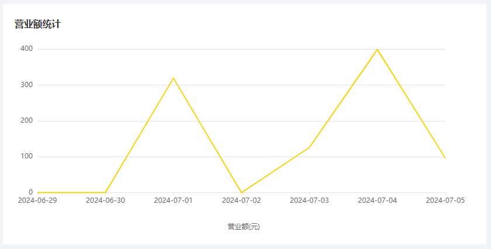
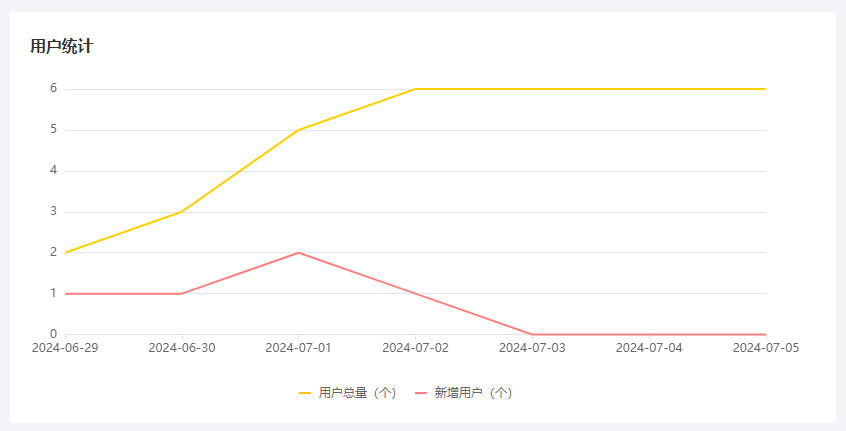
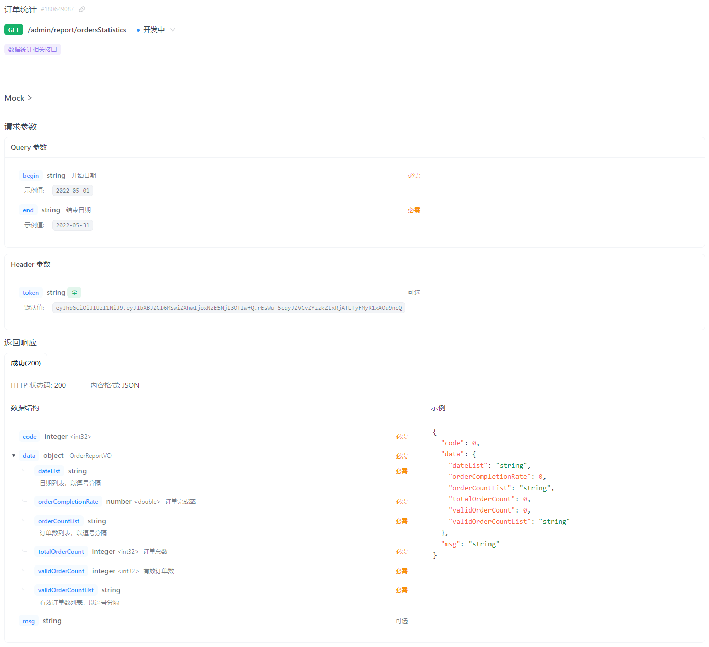
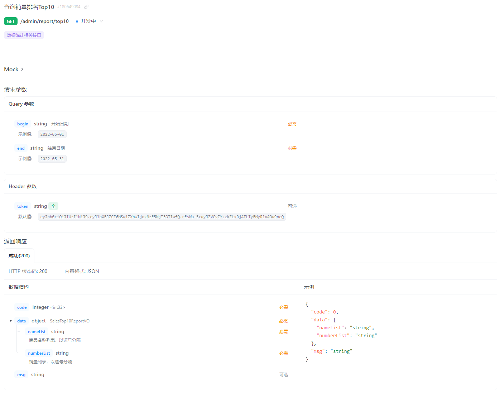

- [sky-take-out-Gitee仓库](https://gitee.com/gjt_1538048299/sky-take-out)

# 营业额统计

## 需求分析



## 接口设计

业务规则:
1. 营业额指订单状态为"已完成"的订单金额合计
2. 基于可视化报表的折线图展示营业额数据,X轴为日期,Y轴为营业额
3. 根据时间选择区间,展示每天的营业额数据


## 代码开发

TurnoverReportVO.java:

```java
package com.sky.vo;

import lombok.AllArgsConstructor;
import lombok.Builder;
import lombok.Data;
import lombok.NoArgsConstructor;

import java.io.Serializable;

@Data
@Builder
@NoArgsConstructor
@AllArgsConstructor
public class TurnoverReportVO implements Serializable {

    //日期，以逗号分隔，例如：2022-10-01,2022-10-02,2022-10-03
    private String dateList;

    //营业额，以逗号分隔，例如：406.0,1520.0,75.0
    private String turnoverList;

}
```

ReportController.java:

```java
/**
 * 营业额统计
 *
 * @param begin
 * @param end
 * @return
 */
@GetMapping("/turnoverStatistics")
@ApiOperation("营业额统计")
public Result<TurnoverReportVO> turnoverStatistics(@DateTimeFormat(pattern = "yyyy-MM-dd") LocalDate begin,
                                                    @DateTimeFormat(pattern = "yyyy-MM-dd") LocalDate end) {
    log.info("营业额统计:{}至{}", begin, end);
    TurnoverReportVO turnoverStatistics = reportService.getTurnoverStatistics(begin, end);
    return Result.success(turnoverStatistics);
}
```

ReportService.java:

```java
/**
 * 统计指定时间区间内的营业额数据
 *
 * @param begin
 * @param end
 * @return
 */
TurnoverReportVO getTurnoverStatistics(LocalDate begin, LocalDate end);
```

ReportServiceImpl.java:

```java
/**
 * 统计指定时间区间内的营业额数据
 *
 * @param begin
 * @param end
 * @return
 */
@Override
public TurnoverReportVO getTurnoverStatistics(LocalDate begin, LocalDate end) {
    // 存放从begin至end时间区间内的每天的日期
    List<LocalDate> dateList = new ArrayList<>();
    dateList.add(begin);
    while (!begin.equals(end)) {
        // 日期计算:计算指定日期的后一天对应的日期
        begin = begin.plusDays(1);
        // 将日期添加到dateList中
        dateList.add(begin);
    }
    // 把日期拼接成字符串
    String dateListStr = StringUtils.join(dateList, ",");

    // 存放从begin至end时间区间内的每天的营业额数据
    List<Double> turnoverList = new ArrayList<>();
    for (LocalDate date : dateList) {
        // 查询date日期对应的营业额数据,营业额:状态为"已完成"的订单金额合计
        LocalDateTime beginTime = LocalDateTime.of(date, LocalTime.MIN);
        LocalDateTime endTime = LocalDateTime.of(date, LocalTime.MAX);
        Map map = new HashMap();
        map.put("begin", beginTime);
        map.put("end", endTime);
        map.put("status", Orders.COMPLETED);
        Double turnover = orderMapper.sumByMap(map);
        // 如果营业额为空,则赋值为0
        turnover = turnover == null ? 0.0 : turnover;
        turnoverList.add(turnover);
    }
    // 把营业额拼接成字符串
    String turnoverListStr = StringUtils.join(turnoverList, ",");

    // 封装对象返回
    return new TurnoverReportVO(dateListStr, turnoverListStr);
}
```

OrderMapper.java:

```java
/**
 * 根据动态条件统计营业额数据
 *
 * @param map
 * @return
 */
Double sumByMap(Map map);
```

OrderMapper.xml

```xml
<!--根据动态条件统计营业额数据-->
<select id="sumByMap" resultType="java.lang.Double">
    select sum(amount) from orders
    <where>
        <if test="begin != null">
            and order_time &gt; #{begin}
        </if>
        <if test="end != null">
            and order_time &lt; #{end}
        </if>
        <if test="status != null">
            and status = #{status}
        </if>
    </where>
</select>
```

# 用户统计

## 需求分析



## 接口设计


业务规则:
1. 基于可视化报表的折线图展示用户数据,X轴为日期,Y轴为用户数
2. 根据时间选择区间,展示每天的用户总量和新增用户量数据

## 代码开发

UserReportVO.java:

```java
package com.sky.vo;

import lombok.AllArgsConstructor;
import lombok.Builder;
import lombok.Data;
import lombok.NoArgsConstructor;

import java.io.Serializable;

@Data
@Builder
@NoArgsConstructor
@AllArgsConstructor
public class UserReportVO implements Serializable {

    //日期，以逗号分隔，例如：2022-10-01,2022-10-02,2022-10-03
    private String dateList;

    //用户总量，以逗号分隔，例如：200,210,220
    private String totalUserList;

    //新增用户，以逗号分隔，例如：20,21,10
    private String newUserList;

}
```

ReportController.java:

```java
/**
 * 用户统计
 *
 * @param begin
 * @param end
 * @return
 */
@GetMapping("/userStatistics")
@ApiOperation("用户统计")
public Result<UserReportVO> userStatistics(@DateTimeFormat(pattern = "yyyy-MM-dd") LocalDate begin,
                                            @DateTimeFormat(pattern = "yyyy-MM-dd") LocalDate end) {
    log.info("用户统计:{}至{}", begin, end);
    UserReportVO userReportVO = reportService.getUserStatistics(begin, end);
    return Result.success(userReportVO);
}
```

ReportService.java:

```java
/**
 * 统计指定时间区间内的用户数据
 *
 * @param begin
 * @param end
 * @return
 */
UserReportVO getUserStatistics(LocalDate begin, LocalDate end);
```

ReportServiceImpl.java:

```java
/**
 * 统计指定时间区间内的用户数据
 *
 * @param begin
 * @param end
 * @return
 */
@Override
public UserReportVO getUserStatistics(LocalDate begin, LocalDate end) {
    // 存放从begin至end时间区间内的每天的日期
    List<LocalDate> dateList = new ArrayList<>();
    dateList.add(begin);
    while (!begin.equals(end)) {
        // 日期计算:计算指定日期的后一天对应的日期
        begin = begin.plusDays(1);
        // 将日期添加到dateList中
        dateList.add(begin);
    }
    // 把日期拼接成字符串
    String dateListStr = StringUtils.join(dateList, ",");

    // 存放从begin至end时间区间内的每天的用户增量
    List<Integer> newUserList = new ArrayList<>();
    // 存放从begin至end时间区间内的每天的用户总量
    List<Integer> totalUserList = new ArrayList<>();
    for (LocalDate date : dateList) {
        LocalDateTime beginTime = LocalDateTime.of(date, LocalTime.MIN);
        LocalDateTime endTime = LocalDateTime.of(date, LocalTime.MAX);
        Map map = new HashMap();
        map.put("end", endTime);

        // 查询每天的用户总量
        Integer totalUserCount = userMapper.countByMap(map);
        // 如果用户总量为空,则赋值为0
        totalUserCount = totalUserCount == null ? 0 : totalUserCount;
        totalUserList.add(totalUserCount);

        map.put("begin", beginTime);

        // 查询每天的用户增量
        Integer newUserCount = userMapper.countByMap(map);
        // 如果用户增量为空,则赋值为0
        newUserCount = newUserCount == null ? 0 : newUserCount;
        newUserList.add(newUserCount);
    }
    // 把用户总量拼接成字符串
    String totalUserListStr = StringUtils.join(totalUserList, ",");
    // 把用户增量拼接成字符串
    String newUserListStr = StringUtils.join(newUserList, ",");

    // 封装对象返回
    return new UserReportVO(dateListStr, totalUserListStr, newUserListStr);
}
```

UserMapper.java:

```java
/**
 * 根据动态条件统计用户数量
 *
 * @param map
 * @return
 */
Integer countByMap(Map map);
```

UserMapper.xml:

```xml
<!--根据动态条件统计用户数量-->
<select id="countByMap" resultType="java.lang.Integer">
    select count(id) from user
    <where>
    <if test="begin != null">
        and create_time &gt; #{begin}
    </if>
    <if test="end != null">
        and create_time &lt; #{end}
    </if>
    </where>
</select>
```

# 订单统计

## 需求分析


## 接口设计

业务规则:
1. 有效订单指状态为"已完成"的订单
2. 基于可视化报表的折线图展示订单数据,X轴为日期,Y轴为订单数量
3. 根据时间选择区间,展示每天的订单总数和有效订单数
4. 展示所选时间区间内的有效订单数、总订单数、订单完成率,订单完成率=有效订单数/总订单数*100%




## 代码开发

OrderReportVO.java:

```java
package com.sky.vo;

import lombok.AllArgsConstructor;
import lombok.Builder;
import lombok.Data;
import lombok.NoArgsConstructor;

import java.io.Serializable;

@Data
@Builder
@NoArgsConstructor
@AllArgsConstructor
public class OrderReportVO implements Serializable {

    //日期，以逗号分隔，例如：2022-10-01,2022-10-02,2022-10-03
    private String dateList;

    //每日订单数，以逗号分隔，例如：260,210,215
    private String orderCountList;

    //每日有效订单数，以逗号分隔，例如：20,21,10
    private String validOrderCountList;

    //订单总数
    private Integer totalOrderCount;

    //有效订单数
    private Integer validOrderCount;

    //订单完成率
    private Double orderCompletionRate;

}
```

ReportController.java:

```java
/**
 * 订单统计
 *
 * @param begin
 * @param end
 * @return
 */
@GetMapping("/ordersStatistics")
@ApiOperation("订单统计")
public Result<OrderReportVO> orderStatistics(@DateTimeFormat(pattern = "yyyy-MM-dd") LocalDate begin,
                                                @DateTimeFormat(pattern = "yyyy-MM-dd") LocalDate end) {
    log.info("订单统计:{}至{}", begin, end);
    OrderReportVO orderReportVO = reportService.getOrderStatistics(begin, end);
    return Result.success(orderReportVO);
}
```

ReportService.java:

```java
/**
 * 统计指定时间区间内的订单数据
 *
 * @param begin
 * @param end
 * @return
 */
OrderReportVO getOrderStatistics(LocalDate begin, LocalDate end);
```

ReportServiceImpl.java:

```java
/**
 * 统计指定时间区间内的订单数据
 *
 * @param begin
 * @param end
 * @return
 */
@Override
public OrderReportVO getOrderStatistics(LocalDate begin, LocalDate end) {
    // 存放从begin至end时间区间内的每天的日期
    List<LocalDate> dateList = new ArrayList<>();
    dateList.add(begin);
    while (!begin.equals(end)) {
        // 日期计算:计算指定日期的后一天对应的日期
        begin = begin.plusDays(1);
        // 将日期添加到dateList中
        dateList.add(begin);
    }
    // 把日期拼接成字符串
    String dateListStr = StringUtils.join(dateList, ",");

    // 存放从begin至end时间区间内的每天的订单数
    List<Integer> orderCountList = new ArrayList<>();
    // 存放从begin至end时间区间内的每天的有效订单数
    List<Integer> validOrderCountList = new ArrayList<>();
    for (LocalDate date : dateList) {
        LocalDateTime beginTime = LocalDateTime.of(date, LocalTime.MIN);
        LocalDateTime endTime = LocalDateTime.of(date, LocalTime.MAX);
        Map map = new HashMap();
        map.put("end", endTime);
        map.put("begin", beginTime);

        // 查询每天的订单总数
        Integer orderCount = orderMapper.countByMap(map);
        orderCount = orderCount == null ? 0 : orderCount;
        orderCountList.add(orderCount);

        map.put("status", Orders.COMPLETED);
        // 查询每天的有效订单数
        Integer validOrderCount = orderMapper.countByMap(map);
        validOrderCount = validOrderCount == null ? 0 : validOrderCount;
        validOrderCountList.add(validOrderCount);
    }

    // 把每天的订单总数拼接成字符串
    String orderCountListStr = StringUtils.join(orderCountList, ",");

    // 把每天的有效订单总数拼接成字符串
    String validOrderCountListStr = StringUtils.join(validOrderCountList, ",");

    // 计算时间区间内的订单总数
    Integer totalOrderCount = orderCountList.stream().reduce(Integer::sum).get();

    // 计算时间区间内的有效订单数
    Integer validOrderCount = validOrderCountList.stream().reduce(Integer::sum).get();

    // 计算订单完成率:有效订单数/总订单数*100%
    Double orderCompletionRate = 0.0;
    if (totalOrderCount != 0) {
        orderCompletionRate = validOrderCount.doubleValue() / totalOrderCount;
    }
    return OrderReportVO.builder()
            .dateList(dateListStr)
            .orderCountList(orderCountListStr)
            .validOrderCountList(validOrderCountListStr)
            .totalOrderCount(totalOrderCount)
            .validOrderCount(validOrderCount)
            .orderCompletionRate(orderCompletionRate)
            .build();
}
```

OrderMapper.java:

```java
/**
 * 根据动态条件统计订单数据
 *
 * @param map
 * @return
 */
Integer countByMap(Map map);
```

OrderMapper.xml:

```xml
<!--根据动态条件统计订单数据-->
<select id="countByMap" resultType="java.lang.Integer">
    select count(id) from orders
    <where>
        <if test="begin != null">
            and order_time &gt; #{begin}
        </if>
        <if test="end != null">
            and order_time &lt; #{end}
        </if>
        <if test="status != null">
            and status = #{status}
        </if>
    </where>
</select>
```

# 销量排名统计

## 需求分析


## 接口设计

业务规则:
1. 根据时间选择区间,展示销量前10的商品(包括菜品和套餐)
2. 基于可视化报表的柱状图降序展示商品销量
3. 商品是状态为"已完成"的订单里的商品,销量为商品销售的份数



## 代码开发

SalesTop10ReportVO.java:

```java
package com.sky.vo;

import lombok.AllArgsConstructor;
import lombok.Builder;
import lombok.Data;
import lombok.NoArgsConstructor;

import java.io.Serializable;

@Data
@Builder
@NoArgsConstructor
@AllArgsConstructor
public class SalesTop10ReportVO implements Serializable {

    //商品名称列表，以逗号分隔，例如：鱼香肉丝,宫保鸡丁,水煮鱼
    private String nameList;

    //销量列表，以逗号分隔，例如：260,215,200
    private String numberList;

}
```

ReportController.java:

```java
/**
 * 销量排名统计
 *
 * @param begin
 * @param end
 * @return
 */
@GetMapping("/top10")
@ApiOperation("销量排名统计")
public Result<SalesTop10ReportVO> salesTop10Statistics(@DateTimeFormat(pattern = "yyyy-MM-dd") LocalDate begin,
                                                        @DateTimeFormat(pattern = "yyyy-MM-dd") LocalDate end) {
    log.info("销量排名统计:{}至{}", begin, end);
    SalesTop10ReportVO salesTop10 = reportService.getSalesTop10Statistics(begin, end);
    return Result.success(salesTop10);
}
```

ReportService.java:

```java
/**
 * 查询指定时间区间内的销量排名top10的商品数据
 *
 * @param begin
 * @param end
 * @return
 */
SalesTop10ReportVO getSalesTop10Statistics(LocalDate begin, LocalDate end);
```

ReportServiceImpl.java:

```java
/**
 * 查询指定时间区间内的销量排名top10的商品数据
 *
 * @param begin
 * @param end
 * @return
 */
@Override
public SalesTop10ReportVO getSalesTop10Statistics(LocalDate begin, LocalDate end) {
    LocalDateTime beginTime = LocalDateTime.of(begin, LocalTime.MIN);
    LocalDateTime endTime = LocalDateTime.of(end, LocalTime.MAX);
    List<GoodsSalesDTO> goodsSalesDTOList = orderMapper.getSalesTop10(beginTime, endTime);

    // 存放从begin至end时间区间内的销量排名Top10的商品名称
    List<String> nameList = new ArrayList<>();
    // 存放从begin至end时间区间内的销量排名Top10的商品销量
    List<Integer> numberList = new ArrayList<>();
    for (GoodsSalesDTO goodsSalesDTO : goodsSalesDTOList) {
        String name = goodsSalesDTO.getName();
        Integer number = goodsSalesDTO.getNumber();
        if (name != null && number != null) {
            nameList.add(name);
            numberList.add(number);
        }
    }

    // 把商品名称拼接成字符串
    String nameListStr = StringUtils.join(nameList, ",");
    // 把商品销量拼接成字符串
    String numberListStr = StringUtils.join(numberList, ",");

    return SalesTop10ReportVO.builder()
            .nameList(nameListStr)
            .numberList(numberListStr)
            .build();
}
```

OrderMapper.java:

```java
/**
 * 根据动态条件统计销量排名Top10的商品数据
 *
 * @param beginTime
 * @param endTime
 * @return
 */
List<GoodsSalesDTO> getSalesTop10(LocalDateTime begin, LocalDateTime end);
```

OrderMapper.xml:

```xml
<!--根据动态条件统计销量排名Top10的商品数据-->
<select id="getSalesTop10" resultType="com.sky.dto.GoodsSalesDTO">
    select od.name name,sum(od.number) number from orders o,order_detail od
    where o.id = od.order_id and o.status = 5
    <if test="begin != null">
        and o.order_time &gt; #{begin}
    </if>
    <if test="end != null">
        and o.order_time &lt; #{end}
    </if>
    group by name
    order by number desc
    limit 10
</select>
```

# 导出运营数据

## 需求分析


## 接口设计

业务规则:
- 导出Excel形式的报表文件
- 导出最近30天的运营数据


当前接口没有返回数据,因为报表导出的功能本质上是文件下载,服务端会通过输出流将Excel文件下载到客户端浏览器

实现步骤:
1. 设计Excel模板文件
2. 查询近30天的运营数据
3. 将查询到的运营数据写入模板文件
4. 通过输出流将Excel文件下载到客户端浏览器

## 代码开发

ReportController.java:

```java
/**
 * 导出运营数据报表
 *
 * @param response
 */
@GetMapping("/export")
@ApiOperation("导出运营数据报表")
public void export(HttpServletResponse response){
    reportService.exportBusinessData(response);
}
```

ReportService.java:

```java
/**
 * 导出运营数据报表
 *
 * @param response
 */
void exportBusinessData(HttpServletResponse response);
```

ReportServiceImpl.java:

```java
/**
 * 导出运营数据报表
 *
 * @param response
 */
@Override
public void exportBusinessData(HttpServletResponse response) {
    // 查询数据库,获取最近30天的运营数据
    // 查询概览数据
    LocalDate dateBegin = LocalDate.now().minusDays(30);
    LocalDate dateEnd = LocalDate.now().minusDays(1);

    LocalDateTime begin = LocalDateTime.of(dateBegin, LocalTime.MIN);
    LocalDateTime end = LocalDateTime.of(dateEnd, LocalTime.MAX);

    BusinessDataVO businessData = workspaceService.getBusinessData(begin, end);

    // 通过POI将数据写入到Excel文件中
    InputStream in = this.getClass().getClassLoader().getResourceAsStream("static/template/运营数据报表模板.xlsx");
    try {
        // 基于已有的模板文件创建一个新的Excel文件
        assert in != null;
        XSSFWorkbook excel = new XSSFWorkbook(in);
        // 获取Excel文件的Sheet页
        XSSFSheet sheet = excel.getSheet("Sheet1");

        // 填充数据--时间
        sheet.getRow(1).getCell(1).setCellValue("时间:" + dateBegin + "至" + dateEnd);

        // 填充概览数据
        // 获取第4行
        XSSFRow row4 = sheet.getRow(3);
        // 填充数据--营业额
        row4.getCell(2).setCellValue(businessData.getTurnover());
        // 填充数据--订单完成率
        row4.getCell(4).setCellValue(businessData.getOrderCompletionRate());
        // 填充数据--新增用户数
        row4.getCell(6).setCellValue(businessData.getNewUsers());

        // 获取第5行
        XSSFRow row5 = sheet.getRow(4);
        // 填充数据--有效订单数
        row5.getCell(2).setCellValue(businessData.getValidOrderCount());
        // 填充数据--平均客单价
        row5.getCell(4).setCellValue(businessData.getUnitPrice());

        // 填充明细数据
        for (int i = 0; i < 30; i++) {
            LocalDate date = dateBegin.plusDays(i);
            // 查询某一天的营业数据
            BusinessDataVO everydayBusinessData = workspaceService.getBusinessData(LocalDateTime.of(date, LocalTime.MIN), LocalDateTime.of(date, LocalTime.MAX));

            // 获得某一行(从第8行开始)
            XSSFRow row = sheet.getRow(7 + i);
            row.getCell(1).setCellValue(date.toString());
            row.getCell(2).setCellValue(everydayBusinessData.getTurnover());
            row.getCell(3).setCellValue(everydayBusinessData.getValidOrderCount());
            row.getCell(4).setCellValue(everydayBusinessData.getOrderCompletionRate());
            row.getCell(5).setCellValue(everydayBusinessData.getUnitPrice());
            row.getCell(6).setCellValue(everydayBusinessData.getNewUsers());
        }

        // 通过输出流将Excel文件下载到客户端浏览器
        ServletOutputStream out = response.getOutputStream();
        excel.write(out);

        // 关闭资源
        out.close();
        in.close();
        excel.close();
    } catch (IOException e) {
        throw new RuntimeException(e);
    }
}
```