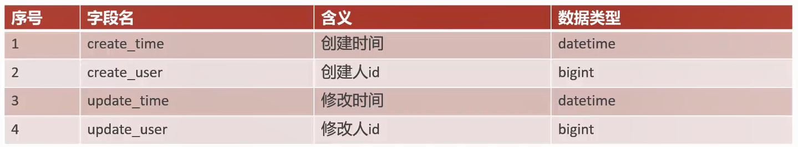
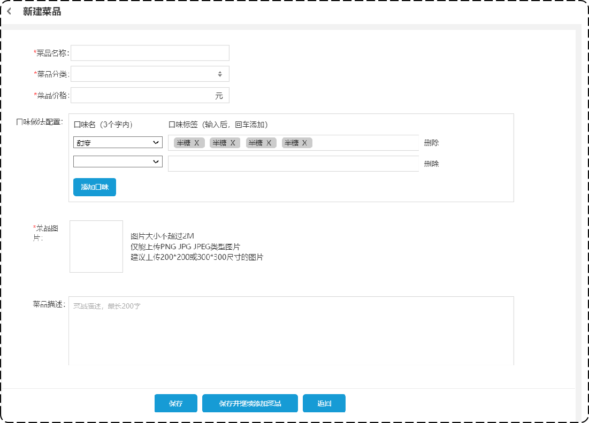
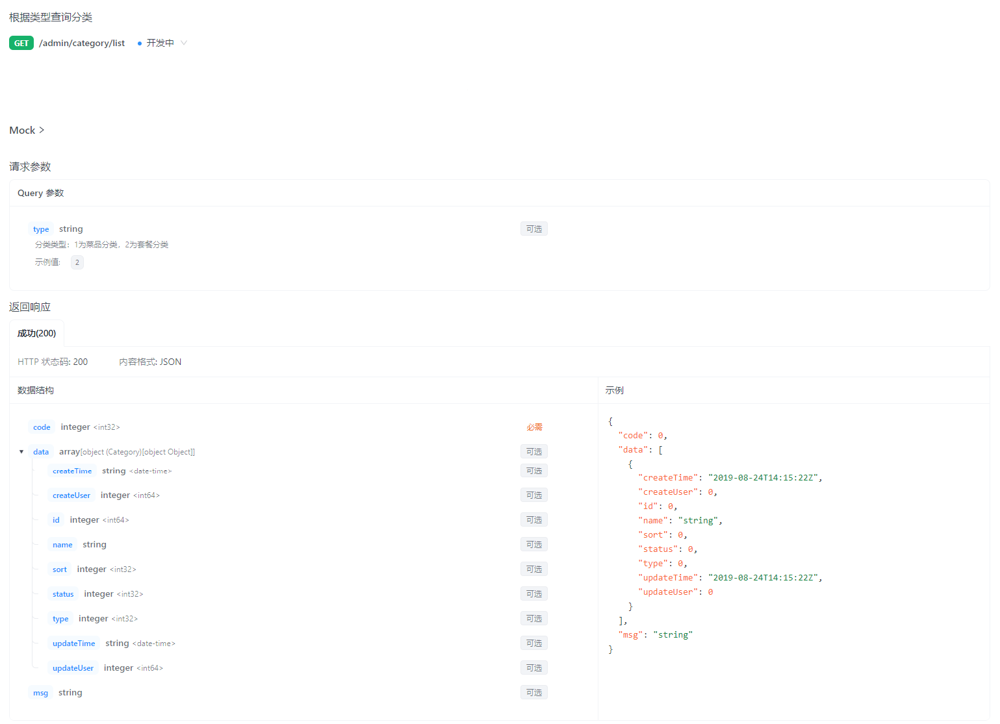
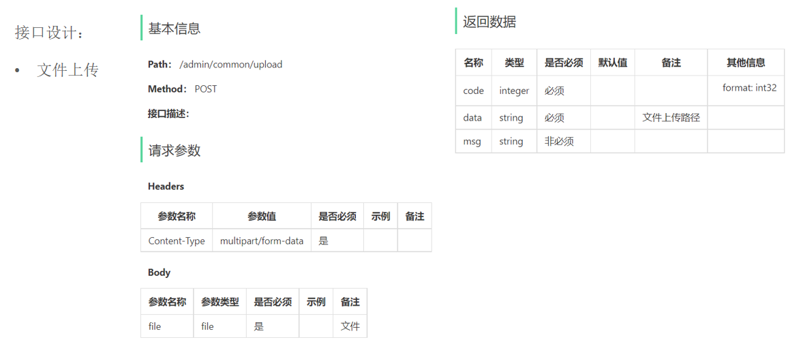
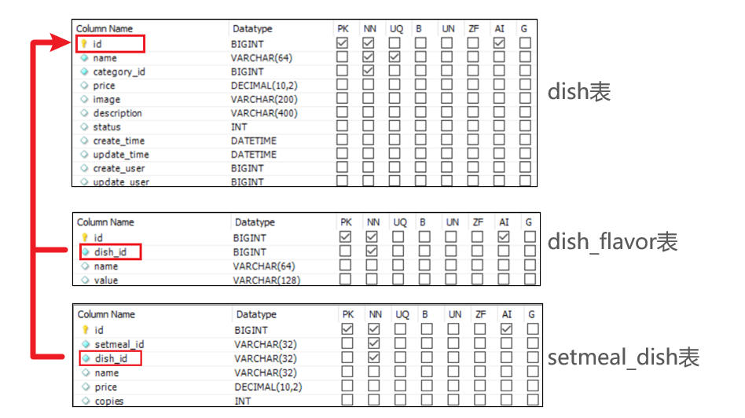

- [sky-take-out-Gitee仓库](https://gitee.com/gjt_1538048299/sky-take-out)

# 菜品管理

# 公共字段自动填充

## 问题分析

业务表中的公共字段:



问题:代码冗余、不便于后期维护

## 实现思路


## 代码实现

AutoFill:自定义注解

```java
package com.sky.annotation;

import com.sky.enumeration.OperationType;

import java.lang.annotation.ElementType;
import java.lang.annotation.Retention;
import java.lang.annotation.RetentionPolicy;
import java.lang.annotation.Target;

/**
 *自定义注解,用于标识某个方法需要进行功能字段的自动填充处理
 */
@Target(ElementType.METHOD)
@Retention(RetentionPolicy.RUNTIME)
public @interface AutoFill {
    // 数据库操作类型:UPDATE、INSERT
    OperationType value();
}
```

OperationType:数据库操作类型

```java
package com.sky.enumeration;

/**
 * 数据库操作类型
 */
public enum OperationType {

    /**
     * 更新操作
     */
    UPDATE,

    /**
     * 插入操作
     */
    INSERT

}
```

AutoFillConstant:公共字段自动填充相关常量

```java
package com.sky.constant;

/**
 * 公共字段自动填充相关常量
 */
public class AutoFillConstant {
    /**
     * 实体类中的方法名称
     */
    public static final String SET_CREATE_TIME = "setCreateTime";
    public static final String SET_UPDATE_TIME = "setUpdateTime";
    public static final String SET_CREATE_USER = "setCreateUser";
    public static final String SET_UPDATE_USER = "setUpdateUser";
}
```

AutoFillAspect:自定义切面

```java
package com.sky.aspect;

import com.sky.annotation.AutoFill;
import com.sky.constant.AutoFillConstant;
import com.sky.context.BaseContext;
import com.sky.enumeration.OperationType;
import lombok.extern.slf4j.Slf4j;
import org.aspectj.lang.JoinPoint;
import org.aspectj.lang.annotation.Aspect;
import org.aspectj.lang.annotation.Before;
import org.aspectj.lang.annotation.Pointcut;
import org.aspectj.lang.reflect.MethodSignature;
import org.springframework.stereotype.Component;

import java.lang.reflect.Method;
import java.time.LocalDateTime;

/**
 * 自定义切面,实现公共字段自动填充
 */
@Slf4j
@Aspect
@Component
public class AutoFillAspect {
    // 切入点
    @Pointcut("execution(* com.sky.mapper.*.*(..))  && @annotation(com.sky.annotation.AutoFill)")
    public void autoFillPointCut() {

    }

    // 前置通知,在通知中进行公共字段的赋值
    @Before("autoFillPointCut()")
    public void autoFill(JoinPoint joinPoint) {
        log.info("开始进行公共字段的自动填充...");
        // 获取到当前被拦截的方法上的数据库操作类型
        // 获取方法签名对象
        MethodSignature signature = (MethodSignature) joinPoint.getSignature();
        // 获取方法上的注解对象
        AutoFill autoFill = signature.getMethod().getAnnotation(AutoFill.class);
        // 获取操作类型
        OperationType operationType = autoFill.value();

        // 获取到当前被拦截的方法的参数--实体对象
        Object[] args = joinPoint.getArgs();
        if (args == null || args.length == 0) {
            return;
        }
        // 规定实体对象统一放在方法第一个参数的位置
        Object entity = args[0];

        // 准备赋值的数据
        LocalDateTime now = LocalDateTime.now();
        Long currentId = BaseContext.getCurrentId();

        // 根据当前不同的操作类型,为对应的属性通过反射来赋值
        if (operationType == OperationType.INSERT) {
            try {
                Method setCreateTime = entity.getClass().getDeclaredMethod(AutoFillConstant.SET_CREATE_TIME, LocalDateTime.class);
                Method setCreateUser = entity.getClass().getDeclaredMethod(AutoFillConstant.SET_CREATE_USER, Long.class);
                Method setUpdateTime = entity.getClass().getDeclaredMethod(AutoFillConstant.SET_UPDATE_TIME, LocalDateTime.class);
                Method setUpdateUser = entity.getClass().getDeclaredMethod(AutoFillConstant.SET_UPDATE_USER, Long.class);

                // 通过反射为对象属性赋值
                setCreateTime.invoke(entity, now);
                setCreateUser.invoke(entity, currentId);
                setUpdateTime.invoke(entity, now);
                setUpdateUser.invoke(entity, currentId);
            } catch (Exception e) {
                e.printStackTrace();
            }
        } else if (operationType == OperationType.UPDATE) {
            try {
                Method setUpdateTime = entity.getClass().getDeclaredMethod(AutoFillConstant.SET_UPDATE_TIME, LocalDateTime.class);
                Method setUpdateUser = entity.getClass().getDeclaredMethod(AutoFillConstant.SET_UPDATE_USER, Long.class);

                // 通过反射为对象属性赋值
                setUpdateTime.invoke(entity, now);
                setUpdateUser.invoke(entity, currentId);
            } catch (Exception e) {
                e.printStackTrace();
            }
        }
    }
}
```

CategoryMapper中的INSERT、UPDATE添加自定义注解:

```java
package com.sky.mapper;

import com.github.pagehelper.Page;
import com.sky.annotation.AutoFill;
import com.sky.dto.CategoryPageQueryDTO;
import com.sky.entity.Category;
import com.sky.enumeration.OperationType;
import org.apache.ibatis.annotations.Delete;
import org.apache.ibatis.annotations.Insert;
import org.apache.ibatis.annotations.Mapper;

import java.util.List;

@Mapper
public interface CategoryMapper {
    /**
     * 插入数据
     *
     * @param category
     */
    @AutoFill(value = OperationType.INSERT)
    @Insert("insert into category(type, name, sort, status, create_time, update_time, create_user, update_user) " +
            "VALUES " +
            "(#{type},#{name}, #{sort}, #{status}, #{createTime}, #{updateTime}, #{createUser}, #{updateUser})")
    void insert(Category category);

    /**
     * 分类分页查询
     *
     * @param categoryPageQueryDTO
     * @return
     */
    Page<Category> pageQuery(CategoryPageQueryDTO categoryPageQueryDTO);

    /**
     * 根据id删除分类
     *
     * @param id
     */
    @Delete("delete from category where id = #{id}")
    void deleteById(Long id);

    /**
     * 修改分类
     *
     * @param category
     */
    @AutoFill(value = OperationType.UPDATE)
    void update(Category category);

    /**
     * 根据类型查询分类
     * @param type
     * @return
     */
    List<Category> list(Integer type);
}
```

EmployeeMapper中的INSERT、UPDATE添加自定义注解:

```java
package com.sky.mapper;

import com.github.pagehelper.Page;
import com.sky.annotation.AutoFill;
import com.sky.dto.EmployeePageQueryDTO;
import com.sky.entity.Employee;
import com.sky.enumeration.OperationType;
import org.apache.ibatis.annotations.Insert;
import org.apache.ibatis.annotations.Mapper;
import org.apache.ibatis.annotations.Select;

@Mapper
public interface EmployeeMapper {

    /**
     * 根据用户名查询员工
     *
     * @param username
     * @return
     */
    @Select("select * from employee where username = #{username}")
    Employee getByUsername(String username);

    /**
     * 新增员工
     *
     * @param employee
     */
    @AutoFill(value = OperationType.INSERT)
    @Insert("insert into employee(name, username, password, phone, sex, id_number, status, create_time, update_time, create_user, update_user) " +
            "VALUES " +
            "(#{name},#{username},#{password},#{phone},#{sex},#{idNumber},#{status},#{createTime},#{updateTime},#{createUser},#{updateUser})")
    void insert(Employee employee);

    /**
     * 员工分页查询
     *
     * @param employeePageQueryDTO
     * @return
     */
    Page<Employee> pageQuery(EmployeePageQueryDTO employeePageQueryDTO);


    /**
     * 根据员工id更新员工数据
     *
     * @param employee
     */
    @AutoFill(value = OperationType.UPDATE)
    void update(Employee employee);

    /**
     * 根据员工id查询员工信息
     *
     * @param id
     * @return
     */
    @Select("select id, name, username, password, phone, sex, id_number, status, create_time, update_time, create_user, update_user " +
            "from employee where id = #{id}")
    Employee getById(Long id);
}
```

在CategoryServiceImpl和EmployeeServiceImpl中,删除添加公共字段的代码

# 新增菜品

## 需求分析



业务规则:
1. 菜品名称必须是唯一的
2. 菜品必须属于某个分类下,不能单独存在
3. 新增菜品时可以根据情况选择菜品的口味
4. 每个菜品必须对应一张图片

## 接口设计

1. 根据类型查询分类
2. 文件上传
3. 新增菜品

### 根据类型查询分类



### 文件上传



### 新增菜品


## 代码开发

### 文件上传

AliOssProperties.java:

```java
package com.sky.properties;

import lombok.Data;
import org.springframework.boot.context.properties.ConfigurationProperties;
import org.springframework.stereotype.Component;

@Component
@ConfigurationProperties(prefix = "sky.alioss")
@Data
public class AliOssProperties {

    private String endpoint;
    private String accessKeyId;
    private String accessKeySecret;
    private String bucketName;

}
```

application.yml:

```yml
# 阿里云OSS
alioss:
endpoint: ${sky.alioss.endpoint}
access-key-id: ${sky.alioss.access-key-id}
access-key-secret: ${sky.alioss.access-key-secret}
bucket-name: ${sky.alioss.bucket-name}
```

application-dev.yml:

```yml
alioss:
endpoint: 
access-key-id: 
access-key-secret: 
bucket-name: 
```

OssConfiguration.java:

```java
package com.sky.config;

import com.sky.properties.AliOssProperties;
import com.sky.utils.AliOssUtil;
import lombok.extern.slf4j.Slf4j;
import org.springframework.boot.autoconfigure.condition.ConditionalOnMissingBean;
import org.springframework.context.annotation.Bean;
import org.springframework.context.annotation.Configuration;

/**
 * 配置类,用于创建ALiOssUtil对象
 */
@Configuration
@Slf4j
public class OssConfiguration {
    @Bean
    @ConditionalOnMissingBean
    public AliOssUtil aliOssUtil(AliOssProperties aliOssProperties) {
        log.info("开始创建阿里云文件上传工具类对象...");
        return new AliOssUtil(aliOssProperties.getEndpoint(),
                aliOssProperties.getAccessKeyId(),
                aliOssProperties.getAccessKeySecret(),
                aliOssProperties.getBucketName());
    }
}
```

CommonController.java:

```java
package com.sky.controller.admin;

import com.sky.result.Result;
import com.sky.utils.AliOssUtil;
import io.swagger.annotations.Api;
import io.swagger.annotations.ApiOperation;
import lombok.extern.slf4j.Slf4j;
import org.springframework.beans.factory.annotation.Autowired;
import org.springframework.web.bind.annotation.PostMapping;
import org.springframework.web.bind.annotation.RequestMapping;
import org.springframework.web.bind.annotation.RestController;
import org.springframework.web.multipart.MultipartFile;

import java.io.IOException;
import java.util.UUID;

/**
 * 通用接口
 */
@RestController("adminCommonController")
@RequestMapping("/admin/common")
@Api(tags = "通用接口")
@Slf4j
public class CommonController {
    @Autowired
    private AliOssUtil aliOssUtil;

    /**
     * 文件上传
     *
     * @param file
     * @return
     */
    @PostMapping("/upload")
    @ApiOperation("文件上传")
    public Result upload(MultipartFile file) {
        log.info("文件上传:{}", file);
        try {
            // 原始文件名
            String originalFilename = file.getOriginalFilename();
            // 截取原始文件名的后缀
            assert originalFilename != null;
            String extension = originalFilename.substring(originalFilename.lastIndexOf("."));
            // 构造新文件的名称
            String fileName = UUID.randomUUID() + extension;
            // 文件的请求路径
            String filePath = aliOssUtil.upload(file.getBytes(), fileName);
            return Result.success(filePath);
        } catch (IOException e) {
            log.error("文件上传失败...,{}", e);
            e.printStackTrace();
        }
        return Result.error(MessageConstant.UPLOAD_FAILED);
    }
}
```

### 新增菜品

DishServiceImpl.java:

```java
/**
 * 新增菜品和对应的口味
 *
 * @param dishDTO
 */
@Override
@Transactional
public void saveWithFlavor(DishDTO dishDTO) {
    Dish dish = new Dish();
    // 对象属性拷贝
    BeanUtils.copyProperties(dishDTO, dish);
    // 向菜品表插入1条数据
    dishMapper.insert(dish);
    // 获取insert语句生成的主键值
    Long dishId = dish.getId();

    List<DishFlavor> flavors = dishDTO.getFlavors();
    if (flavors != null && flavors.size() > 0) {
        flavors.forEach(dishFlavor -> dishFlavor.setDishId(dishId));
        // 向口味表插入n条数据
        dishFlavorMapper.insertBatch(flavors);
    }
}
```

DishMapper.java:

```java
/**
 * 根据分类id查询菜品数量
 *
 * @param categoryId
 * @return
 */
@Select("select count(id) from dish where category_id = #{categoryId}")
Integer countByCategoryId(Long categoryId);

/**
 * 向菜品表插入1条数据
 *
 * @param dish
 */
@AutoFill(value = OperationType.INSERT)
void insert(Dish dish);
```

DishMapper.xml:

```xml
<!--向菜品表插入1条数据-->
<insert id="insert" useGeneratedKeys="true" keyProperty="id">
    insert into dish(name, category_id, price, image, description, status, create_time, update_time,
                        create_user, update_user)
    values (#{name}, #{categoryId}, #{price}, #{image}, #{description}, #{status}, #{createTime}, #{updateTime},
            #{createUser}, #{updateUser})
</insert>
```

DishFlavorMapper.java:

```java
/**
 * 批量插入口味数据
 *
 * @param flavors
 */
void insertBatch(List<DishFlavor> flavors);
```

DishFlavorMapper.xml:

```xml
<!--批量插入口味数据-->
<insert id="insertBatch">
    insert into dish_flavor(dish_id, name, value)
    values
    <foreach collection="flavors" item="df" separator=",">
        (#{df.dishId},#{df.name},#{df.value})
    </foreach>
</insert>
```

# 菜品分页查询

## 需求分析


需求:
1. 根据页码展示菜品信息
2. 每页展示10条数据
3. 分页查询时可以根据需要输入菜品名称、菜品分类、菜品状态进行查询

## 接口设计


## 代码开发

DishPageQueryDTO.java:

```java
package com.sky.dto;

import lombok.Data;

import java.io.Serializable;

@Data
public class DishPageQueryDTO implements Serializable {

    private int page;

    private int pageSize;

    //菜品名称
    private String name;

    //分类id
    private Integer categoryId;

    //状态 0表示禁用 1表示启用
    private Integer status;

}
```

DishVO.java:

```java
package com.sky.vo;

import com.sky.entity.DishFlavor;
import lombok.AllArgsConstructor;
import lombok.Builder;
import lombok.Data;
import lombok.NoArgsConstructor;
import java.io.Serializable;
import java.math.BigDecimal;
import java.time.LocalDateTime;
import java.util.ArrayList;
import java.util.List;

@Data
@Builder
@NoArgsConstructor
@AllArgsConstructor
public class DishVO implements Serializable {

    private Long id;
    //菜品名称
    private String name;
    //菜品分类id
    private Long categoryId;
    //菜品价格
    private BigDecimal price;
    //图片
    private String image;
    //描述信息
    private String description;
    //0 停售 1 启售
    private Integer status;
    //更新时间
    private LocalDateTime updateTime;
    //分类名称
    private String categoryName;
    //菜品关联的口味
    private List<DishFlavor> flavors = new ArrayList<>();

}
```

DishController.java:

```java
/**
 * 菜品分页查询
 *
 * @param dishPageQueryDTO
 * @return
 */
@GetMapping("/page")
@ApiOperation("菜品分页查询")
public Result<PageResult> page(DishPageQueryDTO dishPageQueryDTO) {
    log.info("菜品分页查询:{}", dishPageQueryDTO);
    PageResult pageResult = dishService.pageQuery(dishPageQueryDTO);
    return Result.success(pageResult);
}
```

DishService.java:

```java
/**
 * 菜品分页查询
 *
 * @param dishPageQueryDTO
 * @return
 */
PageResult pageQuery(DishPageQueryDTO dishPageQueryDTO);
```

DishServiceImpl.java:

```java
/**
 * 菜品分页查询
 *
 * @param dishPageQueryDTO
 * @return
 */
@Override
public PageResult pageQuery(DishPageQueryDTO dishPageQueryDTO) {
    PageHelper.startPage(dishPageQueryDTO.getPage(), dishPageQueryDTO.getPageSize());
    Page<DishVO> page = dishMapper.pageQuery(dishPageQueryDTO);
    return new PageResult(page.getTotal(), page.getResult());
}
```

DishMapper.java:

```java
/**
 * 菜品分页查询
 *
 * @param dishPageQueryDTO
 * @return
 */
Page<DishVO> pageQuery(DishPageQueryDTO dishPageQueryDTO);
```

DishMapper.xml:

```xml
<!--菜品分页查询-->
<select id="pageQuery" resultType="com.sky.vo.DishVO">
    select d.*, c.name as categoryName
    from dish d
    left outer join category c on d.category_id = c.id
    <where>
        <if test="name != null">
            and d.name like concat('%',#{name},'%')
        </if>
        <if test="categoryId != null">
            and d.category_id = #{categoryId}
        </if>
        <if test="status != null">
            and d.status = #{status}
        </if>
    </where>
    order by d.create_time desc
</select>
```

# 删除菜品

## 需求分析

需求:
1. 可以一次删除一个菜品,也可以批量删除菜品
2. 启售中的菜品不能删除
3. 被套餐关联的菜品不能删除
4. 删除菜品后,关联的口味数据也需要删除掉

## 接口设计


## 数据库设计



## 代码开发

DishController.java:

```java
/**
 * 菜品批量删除
 *
 * @param ids
 * @return
 */
@DeleteMapping
@ApiOperation("菜品批量删除")
public Result delete(@RequestParam List<Long> ids) {
    log.info("菜品批量删除:{}", ids);
    dishService.deleteBatch(ids);
    return Result.success();
}
```

DishService.java:

```java
/**
 * 菜品批量删除
 *
 * @param ids
 */
void deleteBatch(List<Long> ids);
```

DishServiceImpl.java:

```java
/**
 * 菜品批量删除
 *
 * @param ids
 */
@Transactional
@Override
public void deleteBatch(List<Long> ids) {
    // 判断当前菜品是否能够删除--是否存在启售中的菜品
    for (Long id : ids) {
        Dish dish = dishMapper.getById(id);
        if (dish.getStatus() == StatusConstant.ENABLE) {
            // 当前菜品处于启售中,不能删除
            throw new DeletionNotAllowedException(MessageConstant.DISH_ON_SALE);
        }
    }

    // 判断当前菜品是否能够删除--是否被套餐关联
    List<Long> setmealIds = setmealDishMapper.getSetmealIdsByDishIds(ids);
    if (setmealIds != null && setmealIds.size() > 0) {
        // 当前菜品被套餐关联,不能删除
        throw new DeletionNotAllowedException(MessageConstant.DISH_BE_RELATED_BY_SETMEAL);
    }

    // 删除菜品表中的菜品数据、菜品关联的口味数据
    for (Long id : ids) {
        // 删除菜品表中的菜品数据
        dishMapper.deleteById(id);
        // 删除菜品关联的口味数据
        dishFlavorMapper.deleteByDishId(id);
    }
}
```

DishMapper.java:

```java
/**
 * 根据主键id查询菜品
 *
 * @param id
 * @return
 */
@Select("select * from dish where id = #{id}")
Dish getById(Long id);

/**
 * 根据主键id删除菜品
 *
 * @param id
 */
@Delete("delete from dish where id = #{id}")
void deleteById(Long id);
```

SetmealDishMapper.java:

```java
/**
 * 根据菜品id查询对应的套餐id
 *
 * @param dishIds
 * @return
 */
List<Long> getSetmealIdsByDishIds(List<Long> dishIds);
```

SetmealDishMapper.xml:

```xml
<select id="getSetmealIdsByDishIds" resultType="java.lang.Long">
    select setmeal_id from setmeal_dish where dish_id in
    <foreach collection="dishIds" item="dishId" separator="," open="(" close=")">
        #{dishId}
    </foreach>
</select>
```

DishFlavorMapper.java:

```java
/**
 * 根据菜品id删除对应的口味数据
 *
 * @param id
 */
@Delete("delete from dish_flavor where dish_id = #{dishId}")
void deleteByDishId(Long dishId);
```

## 代码优化

将原先的删除菜品数据、菜品关联的口味数据

DishServiceImpl.java:

```java
// 删除菜品表中的菜品数据、菜品关联的口味数据
for (Long id : ids) {
    // 删除菜品表中的菜品数据
    dishMapper.deleteById(id);
    // 删除菜品关联的口味数据
    dishFlavorMapper.deleteByDishId(id);
}
```

整合成根据菜品id集合批量删除菜品数据、菜品关联的口味数据

DishServiceImpl.java:

```java
// 删除菜品表中的菜品数据、菜品关联的口味数据
// for (Long id : ids) {
//     // 删除菜品表中的菜品数据
//     dishMapper.deleteById(id);
//     // 删除菜品关联的口味数据
//     dishFlavorMapper.deleteByDishId(id);
// }

// 根据菜品id集合批量删除菜品数据
dishMapper.deleteByIds(ids);

// 根据菜品id集合批量删除菜品关联的口味数据
dishFlavorMapper.deleteByDishIds(ids);
```

DishMapper.java:

```java
/**
 * 根据菜品id集合批量删除菜品数据
 *
 * @param ids
 */
void deleteByIds(List<Long> ids);
```

DishMapper.xml

```xml
<!--根据菜品id集合批量删除菜品数据-->
<delete id="deleteByIds">
    delete from dish where id in
    <foreach collection="ids" item="id" separator="," open="(" close=")">
        #{id}
    </foreach>
</delete>
```

DishFlavorMapper.java

```java
/**
 * 根据菜品id集合批量删除菜品关联的口味数据
 *
 * @param ids
 */
void deleteByDishIds(List<Long> dishIds);
```

DishFlavorMapper.xml

```xml
<!--根据菜品id集合批量删除菜品关联的口味数据-->
<delete id="deleteByDishIds">
    delete from dish_flavor where dish_id in
    <foreach collection="dishIds" item="dishId" separator="," open="(" close=")">
        #{dishId}
    </foreach>
</delete>
```

# 修改菜品

## 需求分析


## 接口设计

1. 根据id查询菜品


2. 根据类型查询分类(已实现)
3. 文件上传(已实现)
4. 修改菜品


## 代码开发

DishController.java:

```java
/**
 * 根据id查询菜品
 *
 * @param id
 * @return
 */
@GetMapping("/{id}")
@ApiOperation("根据id查询菜品")
public Result<DishVO> getById(@PathVariable Long id) {
    log.info("根据id查询菜品:{}", id);
    DishVO dishVO = dishService.getByIdWithFlavor(id);
    return Result.success(dishVO);
}

/**
 * 修改菜品
 *
 * @param dishDTO
 * @return
 */
@PutMapping
@ApiOperation("修改菜品")
public Result update(@RequestBody DishDTO dishDTO) {
    log.info("修改菜品:{}", dishDTO);
    dishService.updateWithFlavor(dishDTO);
    return Result.success();
}
```

DishService.java:

```java
/**
 * 根据id查询菜品和对应的口味数据
 *
 * @param id
 * @return
 */
DishVO getByIdWithFlavor(Long id);

/**
 * 根据id修改菜品基本信息和对应的口味信息
 *
 * @param dishDTO
 */
void updateWithFlavor(DishDTO dishDTO);
```

DishServiceImpl.java:

```java
/**
 * 根据id查询菜品和对应的口味数据
 *
 * @param id
 * @return
 */
@Override
public DishVO getByIdWithFlavor(Long id) {
    // 根据id查询菜品
    Dish dish = dishMapper.getById(id);
    // 根据id查询口味数据
    List<DishFlavor> dishFlavors = dishFlavorMapper.getByDishId(id);
    // 将查询到的数据封装到DishVO中
    DishVO dishVO = new DishVO();
    // 属性拷贝
    BeanUtils.copyProperties(dish, dishVO);
    dishVO.setFlavors(dishFlavors);
    return dishVO;
}

/**
 * 根据id修改菜品基本信息和对应的口味信息
 *
 * @param dishDTO
 */
@Override
public void updateWithFlavor(DishDTO dishDTO) {
    Dish dish = new Dish();
    BeanUtils.copyProperties(dishDTO, dish);
    // 修改菜品基本信息
    dishMapper.update(dish);
    // 删除原有的口味数据
    dishFlavorMapper.deleteByDishId(dishDTO.getId());
    // 重新插入口味数据
    List<DishFlavor> flavors = dishDTO.getFlavors();
    if (flavors != null && flavors.size() > 0) {
        flavors.forEach(dishFlavor -> {
            dishFlavor.setDishId(dishDTO.getId());
        });
        // 向口味表插入n条数据
        dishFlavorMapper.insertBatch(flavors);
    }
}
```

DishFlavorMapper.java:

```java
/**
 * 根据菜品id查询口味数据
 *
 * @param DishId
 * @return
 */
@Select("select id, dish_id, name, value from dish_flavor where dish_id = #{DishId}")
List<DishFlavor> getByDishId(Long DishId);
```

DishMapper.java:

```java
/**
 * 修改菜品基本信息
 *
 * @param dish
 */
@AutoFill(value = OperationType.UPDATE)
void update(Dish dish);
```

DishMapper.xml:

```xml
<!--修改菜品基本信息-->
<update id="update">
    update dish
    <set>
        <if test="name != null">
            name = #{name},
        </if>
        <if test="categoryId != null">
            category_id = #{categoryId},
        </if>
        <if test="price != null">
            price = #{price},
        </if>
        <if test="image != null">
            image = #{image},
        </if>
        <if test="description != null">
            description = #{description},
        </if>
        <if test="status != null">
            status = #{status},
        </if>
        <if test="updateTime != null">
            update_time = #{updateTime},
        </if>
        <if test="updateUser != null">
            update_user = #{updateUser},
        </if>
    </set>
    where id = #{id}
</update>
```

# 菜品启售停售

## 需求分析

## 接口设计


## 代码开发

DishController.java:

```java
/**
 * 菜品启售停售
 *
 * @param status
 * @return
 */
@PostMapping("/status/{status}")
@ApiOperation("菜品启售停售")
@CacheEvict(cacheNames = "dish", allEntries = true)
public Result status(@PathVariable Integer status, Long id) {
    log.info("菜品:{} 启售停售状态:{}", id, status);
    dishService.startOrStop(status, id);
    return Result.success();
}
```

DishService.java:

```java
/**
 * 菜品启售停售
 *
 * @param status
 * @param id
 */
void startOrStop(Integer status, Long id);
```

DishServiceImpl.java:

```java
/**
 * 菜品启售停售
 *
 * @param status
 * @param id
 */
public void startOrStop(Integer status, Long id) {
    Dish dish = Dish.builder()
            .id(id)
            .status(status)
            .build();
    dishMapper.update(dish);
}
```