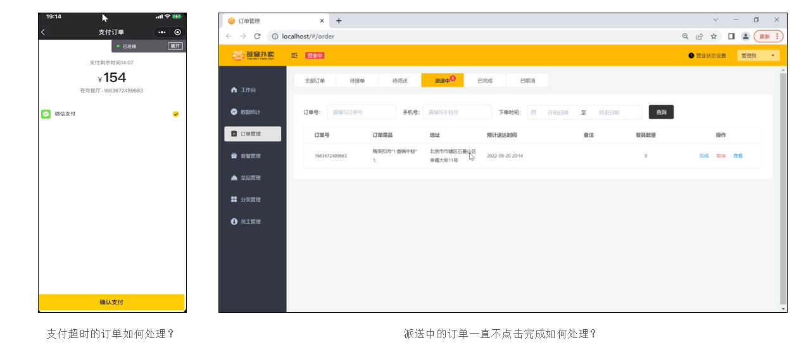
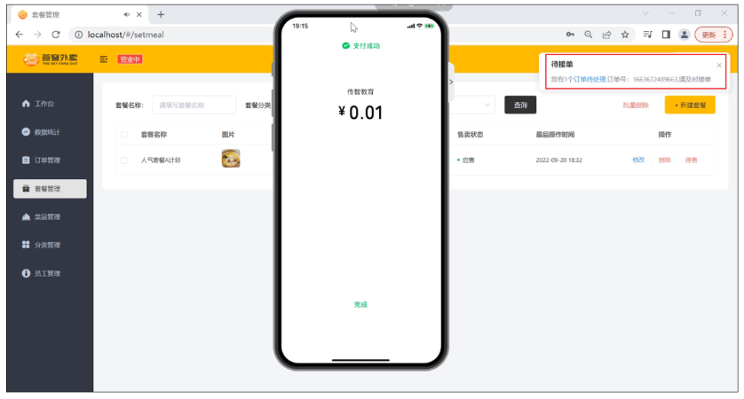
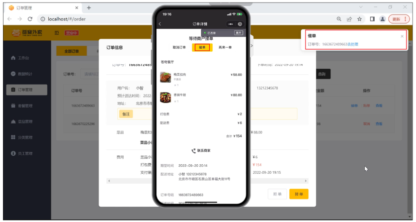
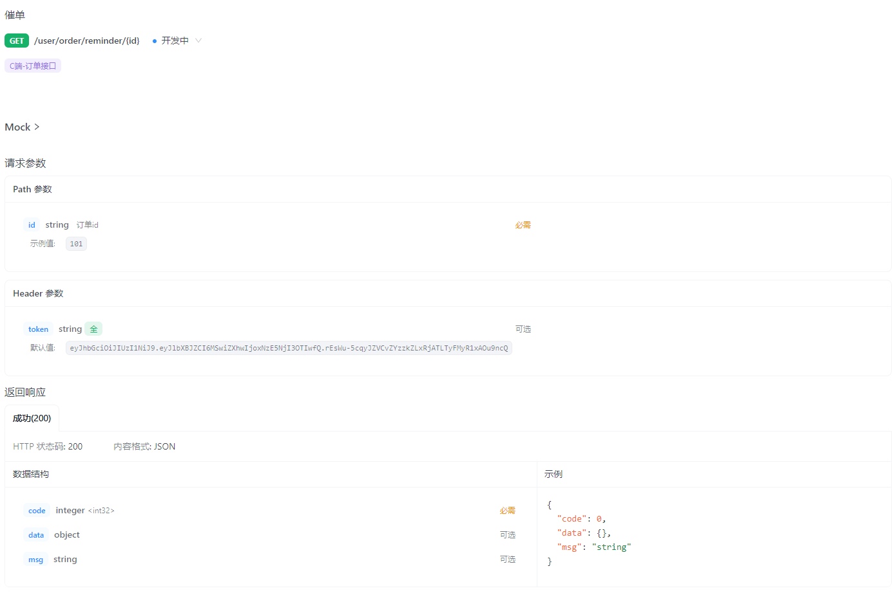

- [sky-take-out-Gitee仓库](https://gitee.com/gjt_1538048299/sky-take-out)

# 订单状态定时处理

## 需求分析

业务规则:
- 下单后未支付,订单一直处于"待支付"状态
- 用户收货后,服务端未点击完成按钮,订单一直处于"派送中"状态



对于上面两种情况需要通过定时任务来修改订单状态,具体逻辑为:
- 通过定时任务**每分钟检查一次**是否存在支付超时订单(下单后超过15分钟仍未支付则判定为支付超时订单),如果存在则修改订单状态为"已取消"
- 通过定时任务**每天凌晨1点检查一次**是否存在"派送中"的订单,如果存在则修改订单状态为"已完成"

## 代码开发

OrderTask.java:

```java
/**
 * 处理用户未支付超时的订单,每5分钟触发一次
 */
@Scheduled(cron = "0 0/5 * * * ?")
public void processTimeOutOrder() {
    log.info("处理用户未支付超时的订单:{}", LocalDateTime.now());
    // 处理用户未支付超时的订单
    List<Orders> ordersList = orderMapper.getByStatusAndOrderTimeLT(Orders.PENDING_PAYMENT, LocalDateTime.now().plusMinutes(-15));
    if (ordersList != null && ordersList.size() > 0) {
        for (Orders orders : ordersList) {
            orders.setStatus(Orders.CANCELLED);
            orders.setCancelReason("订单支付超时,自动取消");
            orders.setCancelTime(LocalDateTime.now());
            orderMapper.update(orders);
        }
    }
}

/**
 * 处理一直派送中服务端未点击完成的订单,每天凌晨1:00触发一次
 */
@Scheduled(cron = "0 0 1 * * ?")
public void processDeliveryOrder() {
    log.info("处理一直派送中服务端未点击完成的订单:{}", LocalDateTime.now());
    // 处理一直派送中服务端未点击完成的订单
    List<Orders> ordersList = orderMapper.getByStatusAndOrderTimeLT(Orders.DELIVERY_IN_PROGRESS, LocalDateTime.now().plusHours(-1));
    if (ordersList != null && ordersList.size() > 0) {
        for (Orders orders : ordersList) {
            orders.setStatus(Orders.COMPLETED);
            orderMapper.update(orders);
        }
    }
}
```

OrderMapper.java:

```java
/**
 * 根据订单状态和下单时间查询订单
 *
 * @param status
 * @param orderTime
 * @return
 */
@Select("select id, number, status, user_id, address_book_id, order_time, checkout_time, pay_method, pay_status, " +
        "amount, remark, phone, address, user_name, consignee, cancel_reason, rejection_reason, cancel_time, " +
        "estimated_delivery_time, delivery_status, delivery_time, pack_amount, tableware_number, tableware_status " +
        "from orders where status = #{status} and order_time < #{orderTime}")
List<Orders> getByStatusAndOrderTimeLT(Integer status, LocalDateTime orderTime);
```

# 来单提醒

## 需求分析

用户下单并且支付成功后,需要第一时间通知外卖商家,通知形式:语音播报、弹出提示框



## 设计

1. 通过WebSocket实现管理端页面和服务端保持长连接状态
2. 当客户支付后,调用WebSocket的相关API实现服务端向客户端推送消息
3. 客户端浏览器解析服务端推送的消息,判断是来单提醒还是客户催单,进行相应的消息提示和语音播报
4. 约定服务端发送给客户端浏览器的数据格式为JSON,字段包括:type,orderId,content
- type为消息类型,1为来单提醒,2为客户催单
- orderId为订单id
- content为消息内容

## 代码开发

Maven依赖引入(已完成):

```xml
<dependency>
	<groupId>org.springframework.boot</groupId>
	<artifactId>spring-boot-starter-websocket</artifactId>
</dependency>
```

WebSocketConfiguration.java:

```java
package com.sky.config;

import org.springframework.context.annotation.Bean;
import org.springframework.context.annotation.Configuration;
import org.springframework.web.socket.server.standard.ServerEndpointExporter;

/**
 * WebSocket配置类,用于注册WebSocket的Bean
 */
@Configuration
public class WebSocketConfiguration {

    @Bean
    public ServerEndpointExporter serverEndpointExporter() {
        return new ServerEndpointExporter();
    }

}
```

WebSocketServer.java:

```java
package com.sky.websocket;

import org.springframework.stereotype.Component;
import javax.websocket.OnClose;
import javax.websocket.OnMessage;
import javax.websocket.OnOpen;
import javax.websocket.Session;
import javax.websocket.server.PathParam;
import javax.websocket.server.ServerEndpoint;
import java.util.Collection;
import java.util.HashMap;
import java.util.Map;

/**
 * WebSocket服务
 */
@Component
@ServerEndpoint("/ws/{sid}")
public class WebSocketServer {

    //存放会话对象
    private static Map<String, Session> sessionMap = new HashMap();

    /**
     * 连接建立成功调用的方法
     */
    @OnOpen
    public void onOpen(Session session, @PathParam("sid") String sid) {
        System.out.println("客户端:" + sid + "建立连接");
        sessionMap.put(sid, session);
    }

    /**
     * 收到客户端消息后调用的方法
     *
     * @param message 客户端发送过来的消息
     */
    @OnMessage
    public void onMessage(String message, @PathParam("sid") String sid) {
        System.out.println("收到来自客户端:" + sid + "的信息:" + message);
    }

    /**
     * 连接关闭调用的方法
     *
     * @param sid
     */
    @OnClose
    public void onClose(@PathParam("sid") String sid) {
        System.out.println("连接断开:" + sid);
        sessionMap.remove(sid);
    }

    /**
     * 群发
     *
     * @param message
     */
    public void sendToAllClient(String message) {
        Collection<Session> sessions = sessionMap.values();
        for (Session session : sessions) {
            try {
                //服务器向客户端发送消息
                session.getBasicRemote().sendText(message);
            } catch (Exception e) {
                e.printStackTrace();
            }
        }
    }
}
```

OrderServiceImpl.java:

```java
/**
 * 订单支付
 *
 * @param ordersPaymentDTO
 * @return
 */
@Override
public OrderPaymentVO payment(OrdersPaymentDTO ordersPaymentDTO) throws Exception {
    // 当前登录用户id
    Long userId = BaseContext.getCurrentId();
    User user = userMapper.getById(userId);

    //调用微信支付接口,生成预支付交易单
//        JSONObject jsonObject = weChatPayUtil.pay(
//                ordersPaymentDTO.getOrderNumber(), //商户订单号
//                new BigDecimal(0.01), //支付金额,单位 元
//                "苍穹外卖订单", //商品描述
//                user.getOpenid() //微信用户的openid
//        );
//
//        if (jsonObject.getString("code") != null && jsonObject.getString("code").equals("ORDERPAID")) {
//            throw new OrderBusinessException("该订单已支付");
//        }

    JSONObject jsonObject = new JSONObject();
    jsonObject.put("code", "ORDERPAID");
    OrderPaymentVO vo = jsonObject.toJavaObject(OrderPaymentVO.class);
    vo.setPackageStr(jsonObject.getString("package"));

    //为替代微信支付成功后的数据库订单状态更新,多定义一个方法进行修改
    Integer OrderPaidStatus = Orders.PAID; //支付状态,已支付
    Integer OrderStatus = Orders.TO_BE_CONFIRMED;  //订单状态,待接单

    //发现没有将支付时间 check_out属性赋值,所以在这里更新
    LocalDateTime check_out_time = LocalDateTime.now();

    //获取订单号码
    String orderNumber = ordersPaymentDTO.getOrderNumber();

    orderMapper.updateStatus(OrderStatus, OrderPaidStatus, check_out_time, orderNumber);

    Orders orders = orderMapper.getByNumber(orderNumber);
    
    // 通过WebSocket向客户端浏览器推送消息type,orderId,content
    Map map = new HashMap();
    // type:1表示来单提醒,2表示客户催单
    map.put("type", 1);
    map.put("orderId", orders.getId());
    map.put("content", "订单号:" + orderNumber);

    String jsonStr = JSON.toJSONString(map);
    webSocketServer.sendToAllClient(jsonStr);

    return vo;
}
```

## 代码调整

以下这段WebSocket的代码:

```java
// 通过WebSocket向客户端浏览器推送消息type,orderId,content
Map map = new HashMap();
// type:1表示来单提醒,2表示客户催单
map.put("type", 1);
map.put("orderId", orders.getId());
map.put("content", "订单号:" + orderNumber);

String jsonStr = JSON.toJSONString(map);
webSocketServer.sendToAllClient(jsonStr);
```

理论上应该是放在支付成功回调(paySuccessNotify)时,进行业务处理,修改订单状态、来单提醒(paySuccess)中,但是由于跳过调用微信支付接口,所以这段代码直接放在了支付订单(payment)中

# 客户催单

## 需求分析

用户催单(订单处于已支付、待接单的状态)后,需要第一时间通知外卖商家,通知形式:语音播报、弹出提示框



## 接口设计

1. 通过WebSocket实现管理端页面和服务端保持长连接状态
2. 当客户点击催单按钮后,调用WebSocket的相关API实现服务端向客户端推送消息
3. 客户端浏览器解析服务端推送的消息,判断是来单提醒还是客户催单,进行相应的消息提示和语音播报
4. 约定服务端发送给客户端浏览器的数据格式为JSON,字段包括:type,orderId,content
- type为消息类型,1为来单提醒,2为客户催单
- orderId为订单id
- content为消息内容



## 代码开发

(user)OrderController.java:

```java
/**
 * 客户催单
 *
 * @param id
 * @return
 */
@GetMapping("/reminder/{id}")
@ApiOperation("客户催单")
public Result reminder(@PathVariable Long id) {
    orderService.reminder(id);
    log.info("客户催单:{}", id);
    return Result.success();
}
```

OrderService.java:

```java
/**
 * 客户催单
 *
 * @param id
 */
void reminder(Long id);
```

OrderServiceImpl.java:

```java
/**
 * 客户催单
 *
 * @param id
 */
@Override
public void reminder(Long id) {
    Orders orders = orderMapper.getById(id);

    // 校验订单是否存在
    if (orders == null) {
        throw new OrderBusinessException(MessageConstant.ORDER_STATUS_ERROR);
    }

    // 通过WebSocket向客户端浏览器推送消息type,orderId,content
    Map map = new HashMap();
    // type:1表示来单提醒,2表示客户催单
    map.put("type", 2);
    map.put("orderId", id);
    map.put("content", "订单号:" + orders.getNumber());

    String jsonStr = JSON.toJSONString(map);
    webSocketServer.sendToAllClient(jsonStr);
}
```