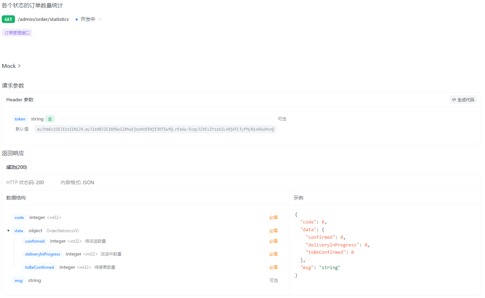
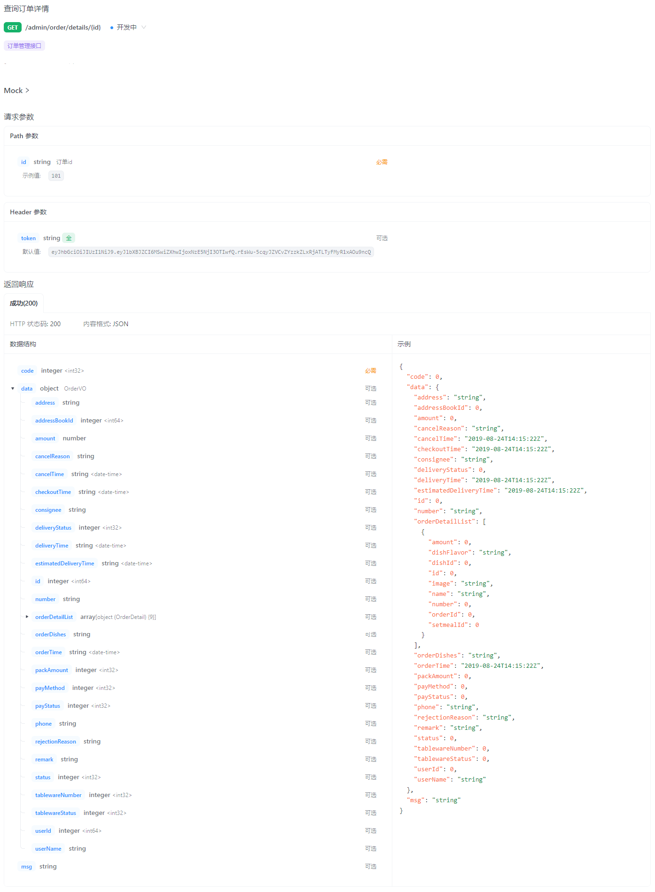
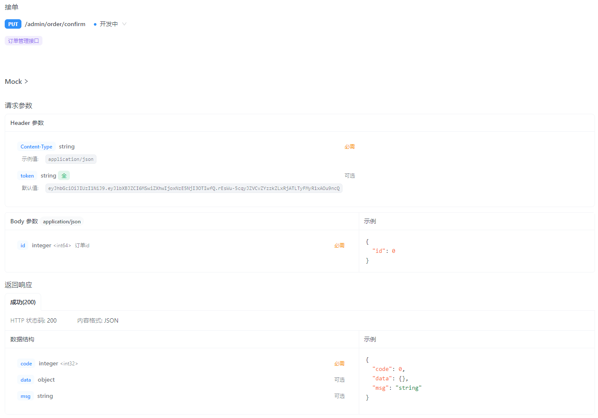
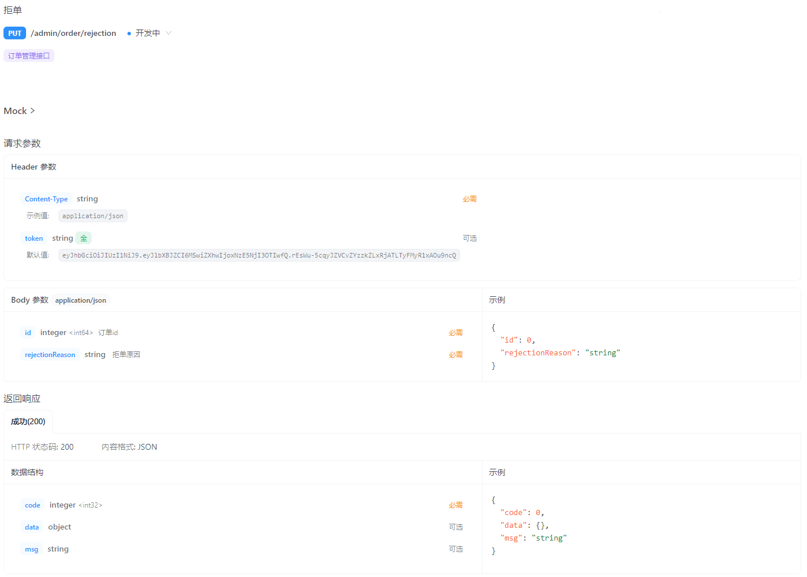
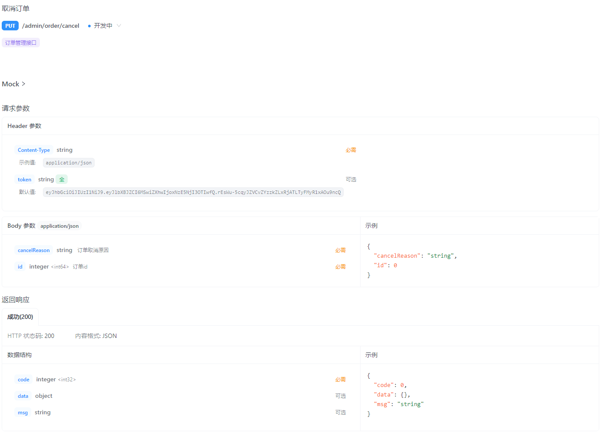
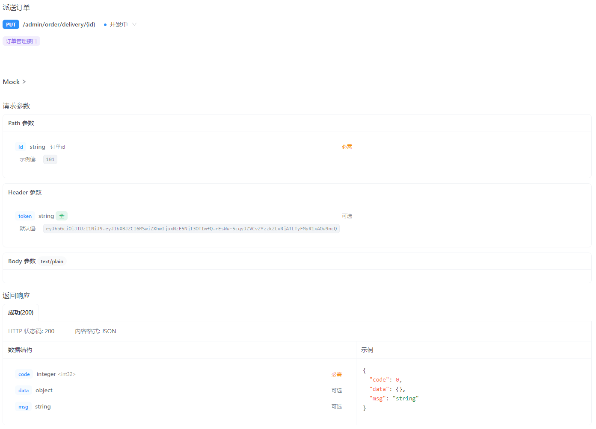
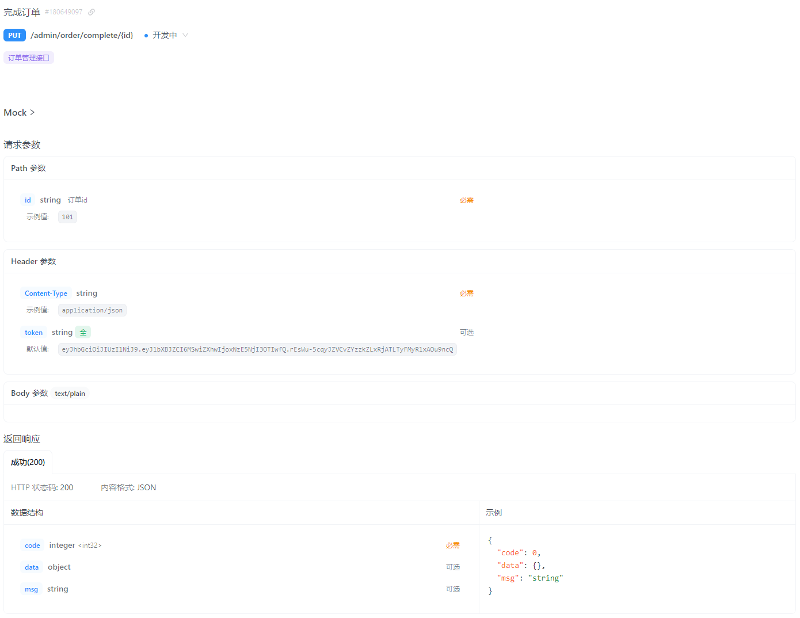

- [sky-take-out-Gitee仓库](https://gitee.com/gjt_1538048299/sky-take-out)

# 订单管理

## 需求分析

# 订单搜索

## 接口设计

业务规则:
1. 输入订单号/手机号进行搜索,支持模糊搜索
2. 根据订单状态进行筛选
3. 下单时间进行时间筛选
4. 搜索内容为空,提示未找到相关订单
5. 搜索结果页,展示包含搜索关键词的内容
6. 分页展示搜索到的订单数据

## 代码开发

OrderController.java:

```java
/**
 * 订单搜索
 *
 * @param ordersPageQueryDTO
 * @return
 */
@GetMapping("/conditionSearch")
@ApiOperation("订单搜索")
public Result<PageResult> conditionSearch(OrdersPageQueryDTO ordersPageQueryDTO) {
    log.info("订单搜索:{}", ordersPageQueryDTO);
    PageResult pageResult = orderService.conditionSearch(ordersPageQueryDTO);
    return Result.success(pageResult);
}
```

OrderService.java:

```java
/**
 * 订单搜索
 *
 * @param ordersPageQueryDTO
 * @return
 */
PageResult conditionSearch(OrdersPageQueryDTO ordersPageQueryDTO);
```

OrderServiceImpl.java:

```java
/**
 * 订单搜索
 *
 * @param ordersPageQueryDTO
 * @return
 */
@Override
public PageResult conditionSearch(OrdersPageQueryDTO ordersPageQueryDTO) {
    // 设置分页
    PageHelper.startPage(ordersPageQueryDTO.getPage(), ordersPageQueryDTO.getPageSize());

    Page<Orders> page = orderMapper.pageQuery(ordersPageQueryDTO);

    // 部分订单状态,需要额外返回订单菜品信息,将orders对象转换为orderVO对象
    List<OrderVO> orderVOList = getOrderVOList(page);

    return new PageResult(page.getTotal(), orderVOList);
}

// 部分订单状态,需要额外返回订单菜品信息,将orders对象转换为orderVO对象
private List<OrderVO> getOrderVOList(Page<Orders> page) {
    List<OrderVO> orderVOList = new ArrayList<>();
    // 根据分页查询获得订单列表
    List<Orders> ordersList = page.getResult();

    ordersList.stream().map(orders -> {
        // 将orders里面的菜品信息重新复制到orderVO中
        OrderVO orderVO = new OrderVO();
        BeanUtils.copyProperties(orders, orderVO);

        // 获取订单的详细地址,分装到orderVO中
        orderVO.setAddress(addressBookMapper.getById(orders.getAddressBookId()).getDetail());

        // 获取订单的菜品信息,封装到orderVO中
        String orderDishes = getOrderDishesStr(orders);
        orderVO.setOrderDishes(orderDishes);

        return orderVO;
    }).forEach(orderVOList::add);

    return orderVOList;
}

// 获取订单的菜品信息,封装成字符串
private String getOrderDishesStr(Orders orders) {
    // 查询订单详情(订单中的菜品和其对应的数量)
    List<OrderDetail> orderDetailList = orderDetailMapper.getByOrderId(orders.getId());

    // 将每一条订单菜品信息拼接为字符串,格式:菜品名称*菜品数量;
    List<String> orderDishList = new ArrayList<>();
    orderDetailList.stream().map(orderDetail -> {
        return orderDetail.getName() + "*" + orderDetail.getNumber() + ";";
    }).forEach(orderDishList::add);
    return orderDishList.toString();
}
```

# 各个状态的订单数量统计

## 接口设计



## 代码开发

OrderController.java:

```java
/**
 * 各个状态的订单数量统计
 *
 * @return
 */
@GetMapping("/statistics")
@ApiOperation("各个状态的订单数量统计")
public Result<OrderStatisticsVO> statistics() {
    log.info("各个状态的订单数量统计");
    OrderStatisticsVO statisticsVO = orderService.statistics();
    return Result.success(statisticsVO);
}
```

OrderService.java:

```java
/**
 * 各个状态的订单数量统计
 *
 * @return
 */
OrderStatisticsVO statistics();
```

OrderServiceImpl.java:

```java
/**
 * 各个状态的订单数量统计
 *
 * @return
 */
@Override
public OrderStatisticsVO statistics() {
    // 根据状态,分别查询出待接单、待派送、派送中的订单数量
    Integer toBeConfirmed = orderMapper.countStatus(Orders.TO_BE_CONFIRMED);
    Integer confirmed = orderMapper.countStatus(Orders.CONFIRMED);
    Integer deliveryInProgress = orderMapper.countStatus(Orders.DELIVERY_IN_PROGRESS);

    // 将查询出的数据封装到orderStatisticsVO中响应
    OrderStatisticsVO orderStatisticsVO = new OrderStatisticsVO();
    orderStatisticsVO.setToBeConfirmed(toBeConfirmed);
    orderStatisticsVO.setConfirmed(confirmed);
    orderStatisticsVO.setDeliveryInProgress(deliveryInProgress);
    return orderStatisticsVO;
}
```

OrderMapper.java:

```java
/**
 * 根据状态统计订单数量
 *
 * @param status
 */
@Select("select count(id) from orders where status = #{status}")
Integer countStatus(Integer status);
```

# 查询订单详情

## 接口设计

业务规则:
1. 订单详情页面需要展示订单基本信息(状态、订单号、下单时间、收货人、电话、收货地址、金额等)
2. 订单详情页面需要展示订单明细数据(商品名称、数量、单价)



## 代码开发

OrderController.java:

```java
/**
 * 查询订单详情
 *
 * @param id
 * @return
 */
@GetMapping("/details/{id}")
@ApiOperation("查询订单详情")
public Result<OrderVO> details(@PathVariable Long id) {
    log.info("查询订单详情:{}", id);
    OrderVO orderVO = orderService.details(id);
    return Result.success(orderVO);
}
```

# 接单

## 接口设计



## 代码开发

OrderController.java:

```java
/**
 * 接单
 *
 * @param ordersConfirmDTO
 * @return
 */
@PutMapping("/confirm")
@ApiOperation("接单")
public Result confirm(@RequestBody OrdersConfirmDTO ordersConfirmDTO) {
    log.info("接单:{}", ordersConfirmDTO);
    orderService.confirm(ordersConfirmDTO);
    return Result.success();
}
```

OrderService.java:

```java
/**
 * 接单
 *
 * @param ordersConfirmDTO
 */
void confirm(OrdersConfirmDTO ordersConfirmDTO);
```

OrderServiceImpl.java:

```java
/**
 * 接单
 *
 * @param ordersConfirmDTO
 */
@Override
public void confirm(OrdersConfirmDTO ordersConfirmDTO) {
    Orders orders = new Orders();
    orders.setId(ordersConfirmDTO.getId());
    orders.setStatus(Orders.CONFIRMED);
    orderMapper.update(orders);
}
```

# 拒单

## 接口设计

业务规则:
1. 商家拒单其实就是将订单状态修改为"已取消"
2. 只有订单处于"待接单"状态时可以执行拒单操作
3. 商家拒单时需要指定拒单原因
4. 商家拒单时,如果用户已经完成了支付,需要为用户退款



## 代码开发

OrderController.java:

```java
/**
 * 拒单
 *
 * @param ordersRejectionDTO
 * @return
 */
@PutMapping("/rejection")
@ApiOperation("拒单")
public Result rejection(@RequestBody OrdersRejectionDTO ordersRejectionDTO) throws Exception {
    log.info("拒单:{}", ordersRejectionDTO);
    orderService.rejection(ordersRejectionDTO);
    return Result.success();
}
```

OrderService.java:

```java
/**
 * 拒单
 *
 * @param ordersRejectionDTO
 */
void rejection(OrdersRejectionDTO ordersRejectionDTO) throws Exception;
```

OrderServiceImpl.java:

```java
/**
 * 拒单
 *
 * @param ordersRejectionDTO
 */
@Override
public void rejection(OrdersRejectionDTO ordersRejectionDTO) throws Exception {
    // 根据id查询订单
    Orders orders = orderMapper.getById(ordersRejectionDTO.getId());

    // 订单只有存在且状态为2(待接单)才可以拒单
    if (orders == null || !orders.getStatus().equals(Orders.TO_BE_CONFIRMED)) {
        throw new OrderBusinessException(MessageConstant.ORDER_STATUS_ERROR);
    }

    // 如果用户已支付,需要退款
//        if (Objects.equals(orders.getPayStatus(), Orders.PAID)) {
//            String refund = weChatPayUtil.refund(
//                    orders.getNumber(),
//                    orders.getNumber(),
//                    new BigDecimal("0.01"),
//                    new BigDecimal("0.01"));
//        }

    // 更新订单状态、拒单原因、取消原因、取消时间
    orders.setStatus(Orders.CANCELLED);
    orders.setRejectionReason(ordersRejectionDTO.getRejectionReason());
    orders.setCancelReason(ordersRejectionDTO.getRejectionReason());
    orders.setCancelTime(LocalDateTime.now());
    orderMapper.update(orders);
}
```

# 取消订单

## 接口设计

业务规则:

1. 取消订单其实就是将订单状态修改为"已取消"
2. 商家取消订单时需要指定取消原因
3. 商家取消订单时,如果用户已经完成了支付,需要为用户退款



## 代码开发

OrderController.java:

```java
/**
 * 取消订单
 *
 * @return
 */
@PutMapping("/cancel")
@ApiOperation("取消订单")
public Result cancel(@RequestBody OrdersCancelDTO ordersCancelDTO) throws Exception {
    log.info("取消订单:{}", ordersCancelDTO);
    orderService.cancel(ordersCancelDTO);
    return Result.success();
}
```

OrderService.java:

```java
/**
 * 取消订单
 *
 * @param ordersCancelDTO
 */
void cancel(OrdersCancelDTO ordersCancelDTO) throws Exception;
```

OrderServiceImpl.java:

```java
/**
 * 取消订单
 *
 * @param ordersCancelDTO
 */
@Override
public void cancel(OrdersCancelDTO ordersCancelDTO) throws Exception {
    // 根据id查询订单
    Orders orders = orderMapper.getById(ordersCancelDTO.getId());

    // 如果用户已支付,需要退款
//        if (Objects.equals(orders.getPayStatus(), Orders.PAID)) {
//            String refund = weChatPayUtil.refund(
//                    orders.getNumber(),
//                    orders.getNumber(),
//                    new BigDecimal("0.01"),
//                    new BigDecimal("0.01"));
//        }

    // 管理端取消订单需要退款,根据订单id更新订单状态、取消原因、取消时间
    orders.setStatus(Orders.CANCELLED);
    orders.setCancelReason(ordersCancelDTO.getCancelReason());
    orders.setCancelTime(LocalDateTime.now());
    orderMapper.update(orders);
}
```

# 派送订单

## 接口设计

业务规则:
1. 派送订单其实就是将订单状态修改为"派送中"
2. 只有状态为"待派送"的订单可以执行派送订单操作



## 代码开发

OrderController.java:

```java
/**
 * 派送订单
 *
 * @param id
 * @return
 */
@PutMapping("/delivery/{id}")
@ApiOperation("派送订单")
public Result delivery(@PathVariable Long id) {
    log.info("派送订单:{}", id);
    orderService.delivery(id);
    return Result.success();
}
```

OrderService.java:

```java
/**
 * 派送订单
 *
 * @param id
 */
void delivery(Long id);
```

OrderServiceImpl.java:

```java
/**
 * 派送订单
 *
 * @param id
 */
@Override
public void delivery(Long id) {
    // 根据id查询订单
    Orders orders = orderMapper.getById(id);

    // 校验订单是否存在,并且状态为3(已接单)
    if (orders == null || !orders.getStatus().equals(Orders.CONFIRMED)) {
        throw new OrderBusinessException(MessageConstant.ORDER_STATUS_ERROR);
    }

    // 更新订单状态,状态转为派送中
    orders.setStatus(Orders.DELIVERY_IN_PROGRESS);
    orderMapper.update(orders);
}
```

# 完成订单

## 接口设计

业务规则:
1. 完成订单其实就是将订单状态修改为"已完成"
2. 只有状态为"派送中"的订单可以执行订单完成操作



## 代码开发

OrderController.java:

```java
/**
 * 完成订单
 *
 * @return
 */
@PutMapping("/complete/{id}")
@ApiOperation("完成订单")
public Result complete(@PathVariable Long id) {
    log.info("完成订单:{}", id);
    orderService.complete(id);
    return Result.success();
}
```

OrderService.java:

```java
/**
 * 完成订单
 *
 * @param id
 */
void complete(Long id);
```

OrderServiceImpl.java:

```java
/**
 * 完成订单
 *
 * @param id
 */
public void complete(Long id) {
    // 根据id查询订单
    Orders orders = orderMapper.getById(id);

    // 校验订单是否存在,并且状态为4(派送中)
    if (orders == null || !orders.getStatus().equals(Orders.DELIVERY_IN_PROGRESS)) {
        throw new OrderBusinessException(MessageConstant.ORDER_STATUS_ERROR);
    }

    // 更新订单状态,状态转为完成
    orders.setStatus(Orders.COMPLETED);
    orders.setDeliveryTime(LocalDateTime.now());
    orderMapper.update(orders);
}
```