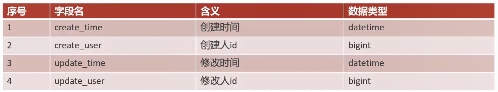
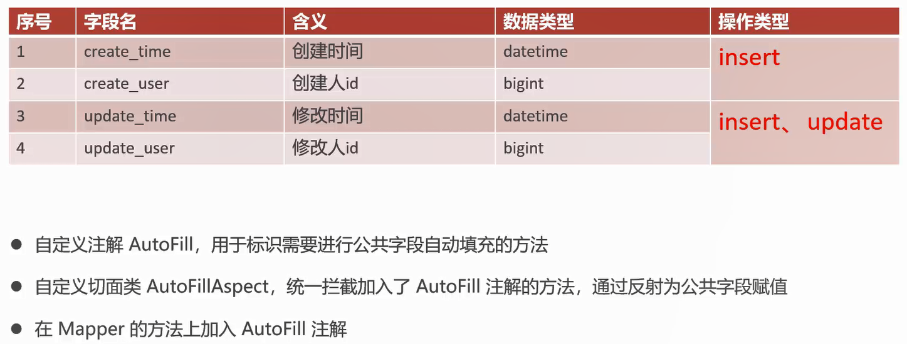
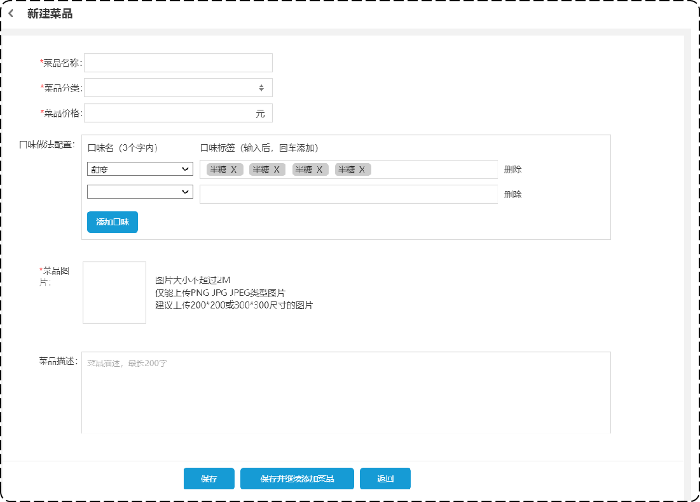
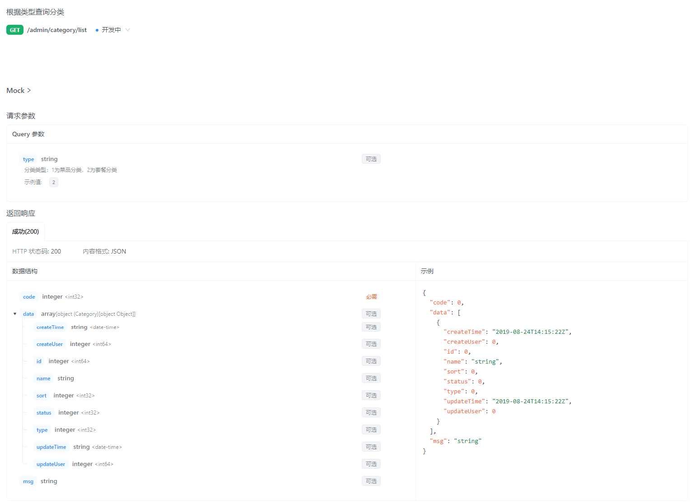
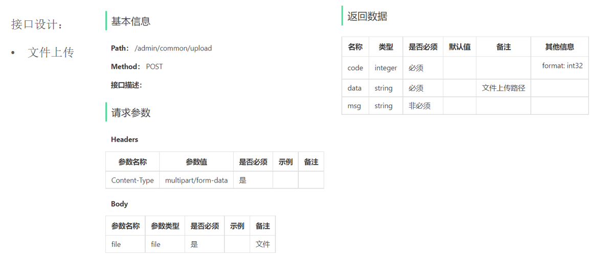
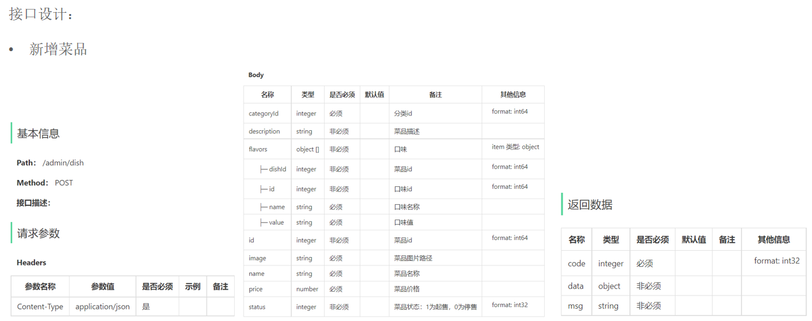

- [sky-take-out-Gitee仓库](https://gitee.com/gjt_1538048299/sky-take-out)

# 菜品管理

# 公共字段自动填充

## 问题分析

业务表中的公共字段:



问题:代码冗余、不便于后期维护

## 实现思路



## 代码实现

AutoFill:自定义注解

```java
package com.sky.annotation;

import com.sky.enumeration.OperationType;

import java.lang.annotation.ElementType;
import java.lang.annotation.Retention;
import java.lang.annotation.RetentionPolicy;
import java.lang.annotation.Target;

/**
 *自定义注解,用于标识某个方法需要进行功能字段的自动填充处理
 */
@Target(ElementType.METHOD)
@Retention(RetentionPolicy.RUNTIME)
public @interface AutoFill {
    // 数据库操作类型:UPDATE、INSERT
    OperationType value();
}
```

OperationType:数据库操作类型

```java
package com.sky.enumeration;

/**
 * 数据库操作类型
 */
public enum OperationType {

    /**
     * 更新操作
     */
    UPDATE,

    /**
     * 插入操作
     */
    INSERT

}
```

AutoFillConstant:公共字段自动填充相关常量

```java
package com.sky.constant;

/**
 * 公共字段自动填充相关常量
 */
public class AutoFillConstant {
    /**
     * 实体类中的方法名称
     */
    public static final String SET_CREATE_TIME = "setCreateTime";
    public static final String SET_UPDATE_TIME = "setUpdateTime";
    public static final String SET_CREATE_USER = "setCreateUser";
    public static final String SET_UPDATE_USER = "setUpdateUser";
}
```

AutoFillAspect:自定义切面

```java
package com.sky.aspect;

import com.sky.annotation.AutoFill;
import com.sky.constant.AutoFillConstant;
import com.sky.context.BaseContext;
import com.sky.enumeration.OperationType;
import lombok.extern.slf4j.Slf4j;
import org.aspectj.lang.JoinPoint;
import org.aspectj.lang.annotation.Aspect;
import org.aspectj.lang.annotation.Before;
import org.aspectj.lang.annotation.Pointcut;
import org.aspectj.lang.reflect.MethodSignature;
import org.springframework.stereotype.Component;

import java.lang.reflect.Method;
import java.time.LocalDateTime;

/**
 * 自定义切面,实现公共字段自动填充
 */
@Slf4j
@Aspect
@Component
public class AutoFillAspect {
    // 切入点
    @Pointcut("execution(* com.sky.mapper.*.*(..))  && @annotation(com.sky.annotation.AutoFill)")
    public void autoFillPointCut() {

    }

    // 前置通知,在通知中进行公共字段的赋值
    @Before("autoFillPointCut()")
    public void autoFill(JoinPoint joinPoint) {
        log.info("开始进行公共字段的自动填充...");
        // 获取到当前被拦截的方法上的数据库操作类型
        // 获取方法签名对象
        MethodSignature signature = (MethodSignature) joinPoint.getSignature();
        // 获取方法上的注解对象
        AutoFill autoFill = signature.getMethod().getAnnotation(AutoFill.class);
        // 获取操作类型
        OperationType operationType = autoFill.value();

        // 获取到当前被拦截的方法的参数--实体对象
        Object[] args = joinPoint.getArgs();
        if (args == null || args.length == 0) {
            return;
        }
        // 规定实体对象统一放在方法第一个参数的位置
        Object entity = args[0];

        // 准备赋值的数据
        LocalDateTime now = LocalDateTime.now();
        Long currentId = BaseContext.getCurrentId();

        // 根据当前不同的操作类型,为对应的属性通过反射来赋值
        if (operationType == OperationType.INSERT) {
            try {
                Method setCreateTime = entity.getClass().getDeclaredMethod(AutoFillConstant.SET_CREATE_TIME, LocalDateTime.class);
                Method setCreateUser = entity.getClass().getDeclaredMethod(AutoFillConstant.SET_CREATE_USER, Long.class);
                Method setUpdateTime = entity.getClass().getDeclaredMethod(AutoFillConstant.SET_UPDATE_TIME, LocalDateTime.class);
                Method setUpdateUser = entity.getClass().getDeclaredMethod(AutoFillConstant.SET_UPDATE_USER, Long.class);

                // 通过反射为对象属性赋值
                setCreateTime.invoke(entity, now);
                setCreateUser.invoke(entity, currentId);
                setUpdateTime.invoke(entity, now);
                setUpdateUser.invoke(entity, currentId);
            } catch (Exception e) {
                e.printStackTrace();
            }
        } else if (operationType == OperationType.UPDATE) {
            try {
                Method setUpdateTime = entity.getClass().getDeclaredMethod(AutoFillConstant.SET_UPDATE_TIME, LocalDateTime.class);
                Method setUpdateUser = entity.getClass().getDeclaredMethod(AutoFillConstant.SET_UPDATE_USER, Long.class);

                // 通过反射为对象属性赋值
                setUpdateTime.invoke(entity, now);
                setUpdateUser.invoke(entity, currentId);
            } catch (Exception e) {
                e.printStackTrace();
            }
        }
    }
}
```

CategoryMapper中的INSERT、UPDATE添加自定义注解:

```java
package com.sky.mapper;

import com.github.pagehelper.Page;
import com.sky.annotation.AutoFill;
import com.sky.dto.CategoryPageQueryDTO;
import com.sky.entity.Category;
import com.sky.enumeration.OperationType;
import org.apache.ibatis.annotations.Delete;
import org.apache.ibatis.annotations.Insert;
import org.apache.ibatis.annotations.Mapper;

import java.util.List;

@Mapper
public interface CategoryMapper {
    /**
     * 插入数据
     *
     * @param category
     */
    @AutoFill(value = OperationType.INSERT)
    @Insert("insert into category(type, name, sort, status, create_time, update_time, create_user, update_user) " +
            "VALUES " +
            "(#{type},#{name}, #{sort}, #{status}, #{createTime}, #{updateTime}, #{createUser}, #{updateUser})")
    void insert(Category category);

    /**
     * 分类分页查询
     *
     * @param categoryPageQueryDTO
     * @return
     */
    Page<Category> pageQuery(CategoryPageQueryDTO categoryPageQueryDTO);

    /**
     * 根据id删除分类
     *
     * @param id
     */
    @Delete("delete from category where id = #{id}")
    void deleteById(Long id);

    /**
     * 修改分类
     *
     * @param category
     */
    @AutoFill(value = OperationType.UPDATE)
    void update(Category category);

    /**
     * 根据类型查询分类
     * @param type
     * @return
     */
    List<Category> list(Integer type);
}
```

EmployeeMapper中的INSERT、UPDATE添加自定义注解:

```java
package com.sky.mapper;

import com.github.pagehelper.Page;
import com.sky.annotation.AutoFill;
import com.sky.dto.EmployeePageQueryDTO;
import com.sky.entity.Employee;
import com.sky.enumeration.OperationType;
import org.apache.ibatis.annotations.Insert;
import org.apache.ibatis.annotations.Mapper;
import org.apache.ibatis.annotations.Select;

@Mapper
public interface EmployeeMapper {

    /**
     * 根据用户名查询员工
     *
     * @param username
     * @return
     */
    @Select("select * from employee where username = #{username}")
    Employee getByUsername(String username);

    /**
     * 新增员工
     *
     * @param employee
     */
    @AutoFill(value = OperationType.INSERT)
    @Insert("insert into employee(name, username, password, phone, sex, id_number, status, create_time, update_time, create_user, update_user) " +
            "VALUES " +
            "(#{name},#{username},#{password},#{phone},#{sex},#{idNumber},#{status},#{createTime},#{updateTime},#{createUser},#{updateUser})")
    void insert(Employee employee);

    /**
     * 员工分页查询
     *
     * @param employeePageQueryDTO
     * @return
     */
    Page<Employee> pageQuery(EmployeePageQueryDTO employeePageQueryDTO);


    /**
     * 根据员工id更新员工数据
     *
     * @param employee
     */
    @AutoFill(value = OperationType.UPDATE)
    void update(Employee employee);

    /**
     * 根据员工id查询员工信息
     *
     * @param id
     * @return
     */
    @Select("select id, name, username, password, phone, sex, id_number, status, create_time, update_time, create_user, update_user " +
            "from employee where id = #{id}")
    Employee getById(Long id);
}
```

在CategoryServiceImpl和EmployeeServiceImpl中,删除添加公共字段的代码

# 新增菜品

## 需求分析



业务规则:
1. 菜品名称必须是唯一的
2. 菜品必须属于某个分类下,不能单独存在
3. 新增菜品时可以根据情况选择菜品的口味
4. 每个菜品必须对应一张图片

## 接口设计

1. 根据类型查询分类
2. 文件上传
3. 新增菜品

### 根据类型查询分类



### 文件上传



### 新增菜品



## 代码开发

### 文件上传

AliOssProperties.java:

```java
package com.sky.properties;

import lombok.Data;
import org.springframework.boot.context.properties.ConfigurationProperties;
import org.springframework.stereotype.Component;

@Component
@ConfigurationProperties(prefix = "sky.alioss")
@Data
public class AliOssProperties {

    private String endpoint;
    private String accessKeyId;
    private String accessKeySecret;
    private String bucketName;

}
```

application.yml:

```yml
# 阿里云OSS
alioss:
endpoint: ${sky.alioss.endpoint}
access-key-id: ${sky.alioss.access-key-id}
access-key-secret: ${sky.alioss.access-key-secret}
bucket-name: ${sky.alioss.bucket-name}
```

application-dev.yml:

```yml
alioss:
endpoint: 
access-key-id: 
access-key-secret: 
bucket-name: 
```

OssConfiguration.java:

```java
package com.sky.config;

import com.sky.properties.AliOssProperties;
import com.sky.utils.AliOssUtil;
import lombok.extern.slf4j.Slf4j;
import org.springframework.boot.autoconfigure.condition.ConditionalOnMissingBean;
import org.springframework.context.annotation.Bean;
import org.springframework.context.annotation.Configuration;

/**
 * 配置类,用于创建ALiOssUtil对象
 */
@Configuration
@Slf4j
public class OssConfiguration {
    @Bean
    @ConditionalOnMissingBean
    public AliOssUtil aliOssUtil(AliOssProperties aliOssProperties) {
        log.info("开始创建阿里云文件上传工具类对象...");
        return new AliOssUtil(aliOssProperties.getEndpoint(),
                aliOssProperties.getAccessKeyId(),
                aliOssProperties.getAccessKeySecret(),
                aliOssProperties.getBucketName());
    }
}
```

CommonController.java:

```java
package com.sky.controller.admin;

import com.sky.result.Result;
import com.sky.utils.AliOssUtil;
import io.swagger.annotations.Api;
import io.swagger.annotations.ApiOperation;
import lombok.extern.slf4j.Slf4j;
import org.springframework.beans.factory.annotation.Autowired;
import org.springframework.web.bind.annotation.PostMapping;
import org.springframework.web.bind.annotation.RequestMapping;
import org.springframework.web.bind.annotation.RestController;
import org.springframework.web.multipart.MultipartFile;

import java.io.IOException;
import java.util.UUID;

/**
 * 通用接口
 */
@RestController
@RequestMapping("/admin/common")
@Api(tags = "通用接口")
@Slf4j
public class CommonController {
    @Autowired
    private AliOssUtil aliOssUtil;

    /**
     * 文件上传
     *
     * @param file
     * @return
     */
    @PostMapping("/upload")
    @ApiOperation("文件上传")
    public Result upload(MultipartFile file) {
        log.info("文件上传:{}", file);
        try {
            // 原始文件名
            String originalFilename = file.getOriginalFilename();
            // 截取原始文件名的后缀
            assert originalFilename != null;
            String extension = originalFilename.substring(originalFilename.lastIndexOf("."));
            // 构造新文件的名称
            String fileName = UUID.randomUUID() + extension;
            // 文件的请求路径
            String filePath = aliOssUtil.upload(file.getBytes(), fileName);
            return Result.success(filePath);
        } catch (IOException e) {
            log.error("文件上传失败...,{}", e);
            e.printStackTrace();
        }
        return Result.error(MessageConstant.UPLOAD_FAILED);
    }
}
```

### 新增菜品

DishServiceImpl.java:

```java
package com.sky.service.impl;

import com.sky.dto.DishDTO;
import com.sky.entity.Dish;
import com.sky.entity.DishFlavor;
import com.sky.mapper.DishFlavorMapper;
import com.sky.mapper.DishMapper;
import com.sky.service.DishService;
import lombok.extern.slf4j.Slf4j;
import org.springframework.beans.BeanUtils;
import org.springframework.beans.factory.annotation.Autowired;
import org.springframework.stereotype.Service;
import org.springframework.transaction.annotation.Transactional;

import java.util.List;

@Service
@Slf4j
public class DishServiceImpl implements DishService {
    @Autowired
    private DishMapper dishMapper;

    @Autowired
    private DishFlavorMapper dishFlavorMapper;

    /**
     * 新增菜品和对应的口味
     *
     * @param dishDTO
     */
    @Override
    @Transactional
    public void saveWithFlavor(DishDTO dishDTO) {
        Dish dish = new Dish();
        // 对象属性拷贝
        BeanUtils.copyProperties(dishDTO, dish);
        // 向菜品表插入1条数据
        dishMapper.insert(dish);
        // 获取insert语句生成的主键值
        Long dishId = dish.getId();

        List<DishFlavor> flavors = dishDTO.getFlavors();
        if (flavors != null && flavors.size() > 0) {
            flavors.forEach(dishFlavor -> dishFlavor.setId(dishId));
            // 向口味表插入n条数据
            dishFlavorMapper.insertBatch(flavors);
        }
    }
}
```

DishMapper.java:

```java
package com.sky.mapper;

import com.sky.annotation.AutoFill;
import com.sky.entity.Dish;
import com.sky.enumeration.OperationType;
import org.apache.ibatis.annotations.Mapper;
import org.apache.ibatis.annotations.Select;

@Mapper
public interface DishMapper {

    /**
     * 根据分类id查询菜品数量
     *
     * @param categoryId
     * @return
     */
    @Select("select count(id) from dish where category_id = #{categoryId}")
    Integer countByCategoryId(Long categoryId);

    /**
     * 向菜品表插入1条数据
     *
     * @param dish
     */
    @AutoFill(value = OperationType.INSERT)
    void insert(Dish dish);
}
```

DishMapper.xml:

```xml
<?xml version="1.0" encoding="UTF-8" ?>
<!DOCTYPE mapper PUBLIC "-//mybatis.org//DTD Mapper 3.0//EN"
        "http://mybatis.org/dtd/mybatis-3-mapper.dtd" >
<mapper namespace="com.sky.mapper.DishMapper">
    <!--向菜品表插入1条数据-->
    <insert id="insert" useGeneratedKeys="true" keyProperty="id">
        insert into dish(name, category_id, price, image, description, status, create_time, update_time,
                         create_user, update_user)
        values (#{name}, #{categoryId}, #{price}, #{image}, #{description}, #{status}, #{createTime}, #{updateTime},
                #{createUser}, #{updateUser})
    </insert>
</mapper>
```

DishFlavorMapper.java:

```java
package com.sky.mapper;

import com.sky.entity.DishFlavor;
import org.apache.ibatis.annotations.Mapper;

import java.util.List;

@Mapper
public interface DishFlavorMapper {
    /**
     * 批量插入口味数据
     *
     * @param flavors
     */
    void insertBatch(List<DishFlavor> flavors);
}
```

DishFlavorMapper.xml:

```xml
<?xml version="1.0" encoding="UTF-8" ?>
<!DOCTYPE mapper PUBLIC "-//mybatis.org//DTD Mapper 3.0//EN"
        "http://mybatis.org/dtd/mybatis-3-mapper.dtd" >
<mapper namespace="com.sky.mapper.DishFlavorMapper">
    <!--批量插入口味数据-->
    <insert id="insertBatch">
        insert into dish_flavor(dish_id, name, value)
        values
        <foreach collection="flavors" item="df" separator=",">
            (#{df.dishId},#{df.name},#{df.value})
        </foreach>
    </insert>
</mapper>
```

# 菜品分页查询

# 删除菜品

# 修改菜品