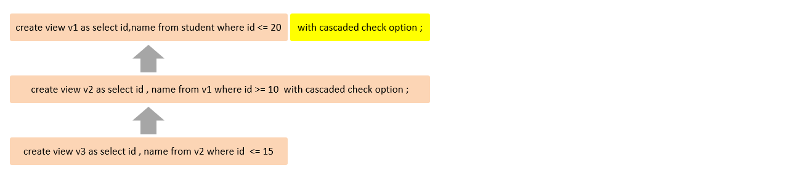

# 视图

视图(View)是一种虚拟存在的表              

视图中的数据并不在数据库中实际存在,行和列数据来自定义视图的查询中使用的表(基表),并且是在使用视图时动态生成的

通俗的讲,视图只保存了查询的SQL逻辑,不保存查询结果

所以在创建视图的时候,主要的工作就落在创建这条SQL查询语句上

# 语法

## 创建

`create [or replace] view 视图名称[(列名列表)] as select语句 [with [cascaded | local | check option]];`

**select语句关联的表即视图的查询中使用的表(基表)**

## 查看

- `show create view 视图名称;`:查看创建视图

- `select * from 视图名称 ...;`:查看视图数据

## 修改

1. `create [or replace] view 视图名称[(列名列表)] as select语句 [with [cascaded | local | check option]];`

2. `alter view 视图名称[(列名列表)] as select语句 [with [cascaded | local | check option]];`

## 删除

`drop view [if exists] 视图名称 [,视图名称] ...;`

## 范例

```sql
# 创建视图
create view stu_v_1 as
select id, name
from student
where id <= 10;

# 查看视图
# 查看创建视图语句
show create view stu_v_1;
# 查看视图数据
select *
from stu_v_1;

# 修改视图
# 方式一
create or replace view stu_v_1 as
select id, name, no
from student
where id <= 10;
# 方式二
alter view stu_v_1 as
select id, name, no
from student
where id <= 10;

# 删除视图
drop view stu_v_1;
```

# 检查选项

当使用`with check option`子句创建视图时,MySQL会通过视图检查正在更改的每个行,例如插入,更新,删除,以使其符合视图的定义           

MySQL允许基于另一个视图创建视图,它还会检查依赖视图中的规则以保持一致性           

为了确定检查的范围,MySQL提供了两个选项:`cascaded`和`local`,默认值为`cascaded`

## cascaded-级联

范例:



比如v2视图是基于v1视图的,v3视图是基于v2视图的         

如果在v2视图创建的时候指定了检查选项为`cascaded`,但是v1视图和v3视图创建时未指定检查选项                 

则在执行检查时,不会检查v3视图,只会检查v2视图和视图v1     

## local-本地

范例:


比如v2视图是基于v1视图的,v3视图是基于v2视图的        

如果在v2视图创建的时候指定了检查选项为`local`,但是v1视图和v3视图创建时未指定检查选项         

则在执行检查时,只会检查v2视图,不会检查v3视图和视图v1

# 更新

**要使视图可更新,视图中的行与基础表中的行之间必须存在一对一的关系**           

如果视图包含以下任何一项,则该视图不可更新:

1. 聚合函数或窗口函数(sum()、min()、max()、count()等)
2. distinct
3. group by
4. having
5. union或者union all

# 作用

1. 简单
视图不仅可以简化用户对数据的理解,也可以简化他们的操作        
那些被经常使用的查询可以被定义为视图,从而使得用户不必为以后的操作每次指定全部的条件

2. 安全
数据库可以授权,但不能授权到数据库特定行和特定的列上                          
通过视图用户只能查询和修改他们所能见到的数据               

3. 数据独立
视图可帮助用户屏蔽真实表结构变化带来的影响                 

# 范例

1. 为了保证数据库表的安全性,开发人员在操作tb_user表时,只能看到的用户的基本字段,屏蔽手机号和邮箱两个字段

```sql
create view tb_user_view as
select id, name, profession, age, gender, status, createtime
from tb_user;
```

2. 查询每个学生所选修的课程(三张表联查),这个功能在很多的业务中都有使用到,为了简化操作,定义一个视图

```sql
create view tb_stu_course_view as
select s.name student_name,
       s.no   student_no,
       c.name course_name
from student s,
     student_course sc,
     course c
where s.id = sc.studentid
  and sc.courseid = c.id;
```