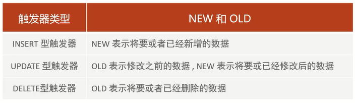

# 触发器

触发器是与表有关的数据库对象,指在`insert`/`update`/`delete`之前(before)或之后(after),触发并执行触发器中定义的SQL语句集合      

触发器的这种特性可以协助应用在数据库端确保数据的完整性,日志记录,数据校验等操作            

使用别名`old`和`new`来引用触发器中发生变化的记录内容,这与其他的数据库是相似的               

现在触发器还只支持行级触发,不支持语句级触发      

# 分类



# 语法

## 创建

```sql
create trigger 触发器名
before/after insert/update/delete
on 表名 for each row 
begin
    trigger_statement;
end;
```

## 查看

`show triggers;`

## 删除

`drop trigger [数据库名] 触发器名`

细节:**如果没有指定数据库名(schema_name),默认为当前数据库**

# 范例

通过触发器记录tb_user表的数据变更日志,将变更日志插入到日志表user_logs中,包含增加,修改,删除

```sql
# 准备工作
create table user_logs
(
    id             int(11)     not null auto_increment,
    operation      varchar(20) not null comment '操作类型,insert/update/delete',
    operate_time   datetime    not null comment '操作时间',
    operate_id     int(11)     not null comment '操作的ID',
    operate_params varchar(500) comment '操作参数',
    primary key (`id`)
) comment '用户日志表' engine = innodb
                       default charset = utf8;

# 插入数据触发器
create trigger tb_user_insert_trigger
    after insert
    on tb_user
    for each row
begin
    insert into user_logs(id, operation, operate_time, operate_id, operate_params)
    values (null, 'insert', now(), new.id,
            concat('插入的数据为:id=', new.id, ',name=', new.name, ',phone=', new.phone, ',email=', new.email,
                   ',profession=', new.profession));
end;

# 测试插入
insert into tb_user(id, name, phone, email, profession, age, gender, status, createtime)
VALUES (25, '三皇子', '18809091212', 'erhuangzi@163.com', '软件工程', 23, '1', '1', now());

# 更新数据触发器
create trigger tb_user_update_trigger
    after update
    on tb_user
    for each row
begin
    insert into user_logs(id, operation, operate_time, operate_id, operate_params)
    values (null, 'update', now(), new.id,
            concat('更新之前的数据为:id=', old.id, ',name=', old.name, ',phone=', old.phone, ',email=', old.email,
                   ',profession=', old.profession,
                   '更新之后的数据为:id=', new.id, ',name=', new.name, ',phone=', new.phone, ',email=', new.email,
                   ',profession=', new.profession));
end;

# 测试更新
update tb_user
set profession = '会计'
where id = 23;

# 删除数据触发器
create trigger tb_user_delete_trigger
    after delete
    on tb_user
    for each row
begin
    insert into user_logs(id, operation, operate_time, operate_id, operate_params)
    values (null, 'delete', now(), old.id,
            concat('删除之前的数据为:id=', old.id, ',name=', old.name, ',phone=', old.phone, ',email=', old.email,
                   ',profession=', old.profession));
end;

# 测试删除
delete
from tb_user
where id = 26;

# 展示所有的触发器
show triggers;
```