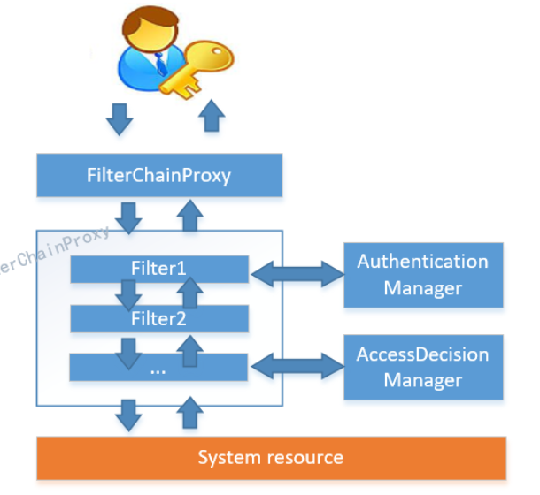
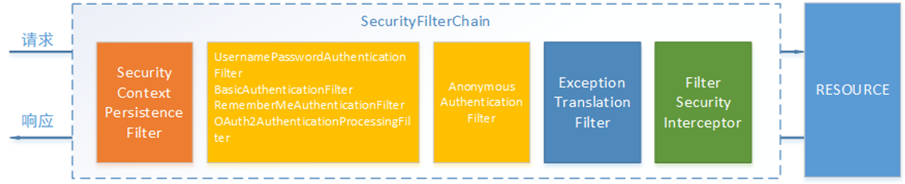
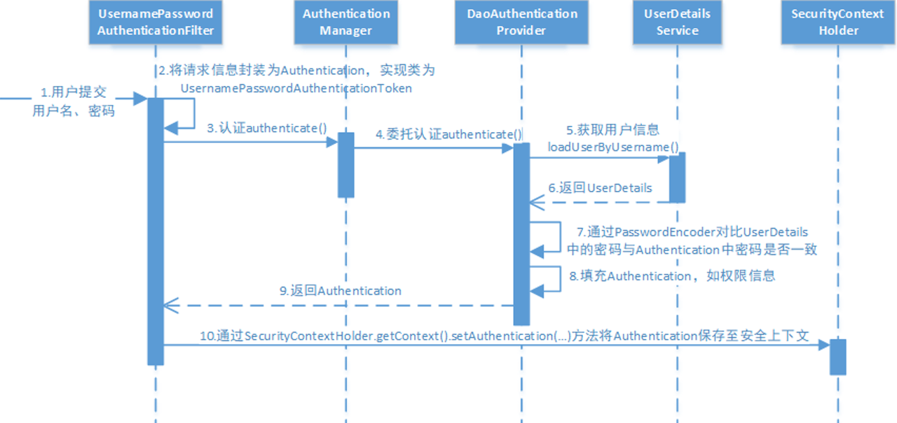
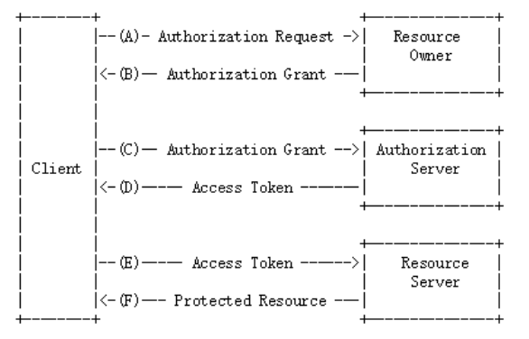
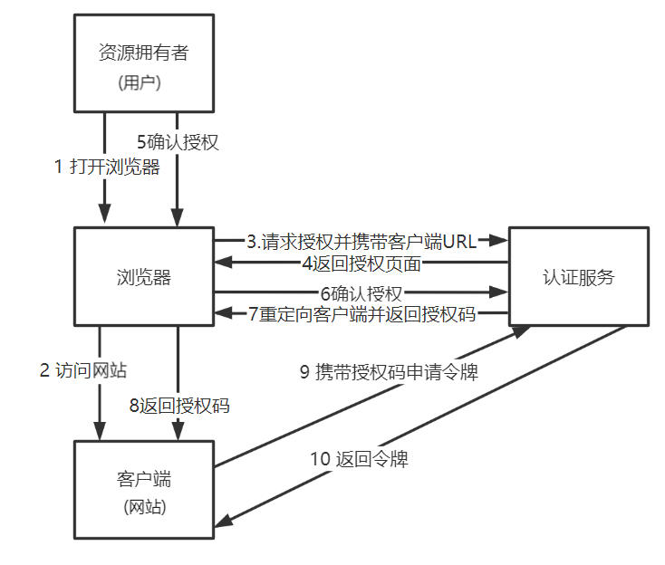
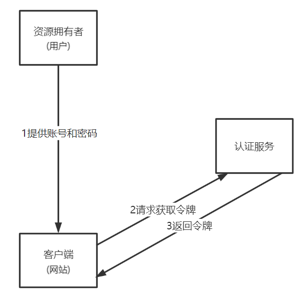
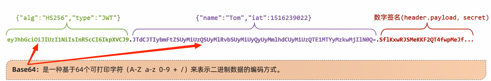
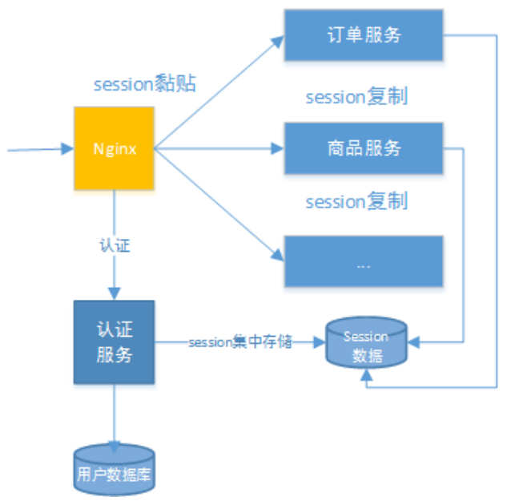
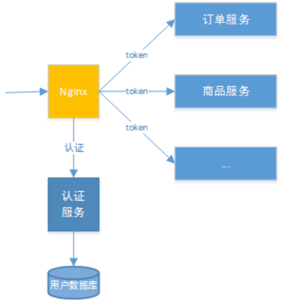
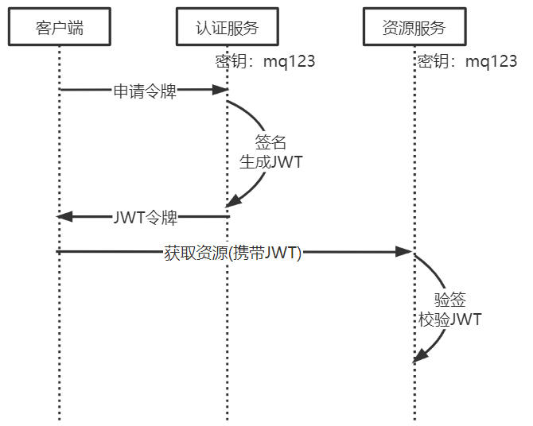

# 认证授权

用户身份认证即用户去访问系统资源时系统要求验证用户的身份信息,身份合法方可继续访问

常见的用户身份认证的表现形式有:用户名密码登录,微信扫码等方式

用户认证通过后去访问系统的资源,系统会判断用户是否拥有访问资源的权限,只允许访问有权限的系统资源,没有权限的资源将无法访问,这个过程叫用户授权

# Spring Security

认证功能几乎是每个项目都要具备的功能,并且它与业务无关,市面上有很多认证框架,如：Apache Shiro、CAS、Spring Security等

Spring Security是一个功能强大且高度可定制的身份验证和访问控制框架,它是一个专注于为Java应用程序提供身份验证和授权的框架

[Spring Cloud Security官网](https://spring.io/projects/spring-cloud-security)

## 工作原理

Spring Security所解决的问题就是**安全访问控制**,而安全访问控制功能其实就是对所有进入系统的请求进行拦截,校验每个请求是否能够访问它所期望的资源

当初始化Spring Security时,会创建一个名为SpringSecurityFilterChain的Servlet过滤器,类型为org.springframework.security.web.FilterChainProxy,它实现了javax.servlet.Filter,因此外部的请求会经过此类

FilterChainProxy是一个代理,真正起作用的是FilterChainProxy中SecurityFilterChain所包含的各个Filter,同时这些Filter作为Bean被Spring管理,它们是Spring Security核心,各有各的职责,但他们并不直接处理用户的**认证**,也不直接处理用户的**授权**,而是把它们交给了认证管理器(AuthenticationManager)和决策管理器(AccessDecisionManager)进行处理

Spring Security功能的实现主要是由一系列过滤器链相互配合完成

过滤器链中主要的几个过滤器及其作用:

- `SecurityContextPersistenceFilter`:这个Filter是整个拦截过程的入口和出口(也就是第一个和最后一个拦截器),会在请求开始时从配置好的SecurityContextRepository中获取SecurityContext,然后把它设置给SecurityContextHolder,在请求完成后将SecurityContextHolder持有的SecurityContext再保存到配置好的SecurityContextRepository,同时清除securityContextHolder所持有的SecurityContext

- `UsernamePasswordAuthenticationFilter`:用于处理来自表单提交的认证,该表单必须提供对应的用户名和密码,其内部还有登录成功或失败后进行处理的AuthenticationSuccessHandler和AuthenticationFailureHandler,这些都可以根据需求做相关改变

- `FilterSecurityInterceptor`:用于保护web资源的,使用AccessDecisionManager对当前用户进行授权访问

- `ExceptionTranslationFilter`:能够捕获来自FilterChain所有的异常,并进行处理,但是它只会处理两类异常:AuthenticationException和AccessDeniedException,其它的异常它会继续抛出

## 执行流程

1. 用户提交用户名、密码被SecurityFilterChain中的UsernamePasswordAuthenticationFilter过滤器获取到,封装为请求Authentication,通常情况下是UsernamePasswordAuthenticationToken这个实现类

2. 然后过滤器将Authentication提交至认证管理器(AuthenticationManager)进行认证

3. 认证成功后,AuthenticationManager身份管理器返回一个被填充满了信息的(包括上面提到的权限信息,身份信息,细节信息,但密码通常会被移除)Authentication实例

4. SecurityContextHolder安全上下文容器将第3步填充了信息的Authentication,通过SecurityContextHolder.getContext().setAuthentication(…)方法,设置到其中

5. 可以看出AuthenticationManager接口(认证管理器)是认证相关的核心接口,也是发起认证的出发点,它的实现类为ProviderManager,而Spring Security支持多种认证方式,因此ProviderManager维护着一个List<AuthenticationProvider>列表,存放多种认证方式,最终实际的认证工作是由AuthenticationProvider完成的,web表单的对应的AuthenticationProvider实现类为DaoAuthenticationProvider,它的内部又维护着一个UserDetailsService负责UserDetails的获取,最终AuthenticationProvider将UserDetails填充至Authentication

# OAuth协议

OAuth协议为用户资源的授权提供了一个安全的、开放而又简易的标准,同时,任何第三方都可以使用OAuth认证服务,任何服务提供商都可以实现自身的OAuth认证服务,因而OAuth是开放的

业界提供了OAuth的多种实现如PHP、JavaScript,Java,Ruby等各种语言开发包,大大节约了程序员的时间,因而OAuth是简易的

互联网很多服务如Open API,很多大公司如Google,Yahoo,Microsoft等都提供了OAuth认证服务,这些都足以说明OAuth标准逐渐成为开放资源授权的标准

OAuth协议目前发展到2.0版本,1.0版本过于复杂,2.0版本已得到广泛应用。

[OAuth2协议](https://tools.ietf.org/html/rfc6749)

## 认证流程

OAuth2包括以下角色:

1. 客户端
    本身不存储资源,需要通过资源拥有者的授权去请求资源服务器的资源,比如:手机客户端、浏览器等

2. 资源拥有者
    通常为用户,也可以是应用程序,即该资源的拥有者
    A表示客户端请求资源拥有者授权
    B表示资源拥有者授权客户端

3. 授权服务器(也称认证服务器)
    认证服务器对资源拥有者进行认证,还会对客户端进行认证并颁发令牌
    C客户端携带授权码请求认证
    D认证通过颁发令牌

4. 资源服务器
    存储资源的服务器
    E表示客户端携带令牌请求资源服务器获取资源
    F表示资源服务器校验令牌通过后提供受保护资源

## 授权模式

Spring Security支持OAuth2认证,OAuth2提供授权码模式、密码模式、简化模式、客户端模式等四种授权模式

OAuth2的几个授权模式是根据不同的应用场景以不同的方式去获取令牌,最终目的是要获取认证服务颁发的令牌,最终通过令牌去获取资源

### 授权码模式

授权码模式简单理解是使用授权码去获取令牌,要想获取令牌先要获取授权码,授权码的获取需要资源拥有者亲自授权同意才可以获取

1. 资源拥有者即用户打开浏览器
2. 通过浏览器访问客户端即网站
3. 用户通过浏览器向认证服务请求授权,请求授权时会携带客户端的URL,此URL为下发授权码的重定向地址
4. 认证服务向资源拥有者返回授权页面
5. 资源拥有者亲自授权同意
6. 通过浏览器向认证服务发送授权同意
7. 认证服务向客户端地址重定向并携带授权码
8. 客户端收到授权码
9. 客户端携带授权码向认证服务申请令牌
10. 认证服务向客户端颁发令牌

### 密码模式

密码模式简单理解是使用账号和密码去获取令牌,不需要授权码,直接通过账号和密码向认证服务申请令牌,认证服务校验账号和密码正确颁发令牌

1. 资源拥有者即用户提供账号和密码
2. 客户端即网站向认证服务申请令牌,请求中携带账号和密码
3. 认证服务校验账号和密码正确颁发令牌

## OAuth2在学成在线项目的应用

OAuth2是一个标准的开放的授权协议,应用程序可以根据自己的要求去使用OAuth2,学成在线项目使用OAuth2实现如下目标:

1. 学成在线访问第三方系统的资源
    学成在线项目要接入微信扫码登录,所以要使用OAuth2协议访问微信中的用户信息

2. 外部系统访问学成在线的资源
    同样当第三方系统想要访问学成在线网站的资源也可以基于OAuth2协议

3. 学成在线前端(客户端)访问学成在线微服务的资源
    学成在线项目是前后端分离架构,前端访问微服务资源也可以基于OAuth2协议进行认证

# JWT令牌

JSON Web Token(JWT)是一种使用JSON格式传递数据的网络令牌技术,它是一个开放的行业标准(RFC 7519),它定义了一种简洁的、自包含的协议格式,用于在通信双方传递json对象,传递的信息经过数字签名可以被验证和信任,它可以使用HMAC算法或使用RSA的公钥/私钥对来签名,防止内容篡改

[JWT官网](https://jwt.io/)

## 优缺点

JWT令牌的优点:

1. jwt基于json,非常方便解析
2. 可以在令牌中自定义丰富的内容,易扩展
3. 通过非对称加密算法及数字签名技术,JWT防止篡改,安全性高
4. 资源服务使用JWT可不依赖认证服务即可完成授权

缺点:JWT令牌较长,占存储空间比较大

## 组成

1. 第一部分:Header(头),记录令牌类型、签名算法等                     
例如:`{"alg":"HS256","type":"JWT"}`

2. 第二部分:Payload(有效载荷),携带一些自定义信息、默认信息等             
例如:`{"name":"Tom","iat":1516239022}`

3. 第三部分:Signature(签名),防止Token被篡改、确保安全性,签名是header、payload、secret(指定秘钥)通过指定签名算法计算而来

## 无状态认证

使用JWT可以实现**无状态认证**

传统的基于session的方式是有状态认证,用户登录成功将用户的身份信息存储在服务端,这样加大了服务端的存储压力,并且这种方式不适合在分布式系统中应用

如下图,当用户访问应用服务,每个应用服务都会去服务器查看session信息,如果session中没有该用户则说明用户没有登录,此时就会重新认证,而解决这个问题的方法是Session复制、Session黏贴

如果是基于令牌技术在分布式系统中实现认证则服务端不用存储session,可以将用户身份信息存储在令牌中,用户认证通过后认证服务颁发令牌给用户,用户将令牌存储在客户端,去访问应用服务时携带令牌去访问,服务端从jwt解析出用户信息,这个过程就是无状态认证

## 防止篡改

第三部分使用签名算法对第一部分和第二部分的内容进行签名,常用的签名算法是HS256,常见的还有md5,sha等,签名算法需要使用密钥进行签名,密钥不对外公开,并且签名是不可逆的,如果第三方更改了内容那么服务器验证签名就会失败,要想保证验证签名正确必须保证内容、密钥与签名前一致

从上图可以看出认证服务和资源服务使用相同的密钥,这叫对称加密,对称加密效率高,如果一旦密钥泄露可以伪造jwt令牌

JWT还可以使用非对称加密,认证服务自己保留私钥,将公钥下发给受信任的客户端、资源服务,公钥和私钥是配对的,成对的公钥和私钥才可以正常加密和解密,非对称加密效率低但相比对称加密非对称加密更安全一些

# 网关认证

所有访问微服务的请求都要经过网关,在网关进行用户身份的认证可以将很多非法的请求拦截到微服务以外,叫做网关认证

网关的职责:

1. 路由转发

2. 网站白名单维护
    针对不用认证的URL全部放行

3. 校验jwt的合法性
    除了白名单剩下的就是需要认证的请求,网关需要验证jwt的合法性,jwt合法则说明用户身份合法,否则说明身份不合法则拒绝继续访问

