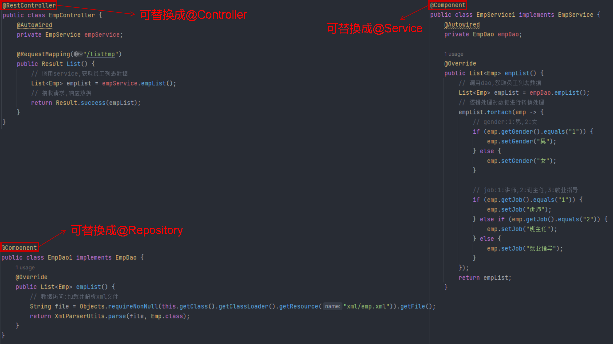

# 前端控制器


# 请求响应

## 简单参数

- 原始方式获取请求参数                    
1.Controller方法形参中声明`HttpServletRequest`对象                       
2.调用对象的getParameter(参数名)

- SpringBoot中接收简单参数              
1.请求参数名与方法形参变量名相同                     
2.会自动进行类型转换

- `@RequestParam`注解                         
1.方法形参名称与请求参数名称不匹配时,通过该注解完成映射                        
2.该注解的required属性默认是true,代表请求参数必须传递

范例:

```java
// 原始方式
@RequestMapping("/simpleParam1")
public String simpleParam(HttpServletRequest request) {
    String name = request.getParameter("name");
    String ageStr = request.getParameter("age");
    int age = Integer.parseInt(ageStr);
    System.out.println(name + ":" + age);
    return "OK";
}

// 基于SpringBoot方式
@RequestMapping("/simpleParam2")
public String simpleParam(String name, Integer age) {
    System.out.println(name + ":" + age);
    return "OK";
}

// @RequestParam注解   
@RequestMapping("/simpleParam3")
public String simpleParam(@RequestParam(name = "name", required = false) String username, Integer age) {
    System.out.println(username + ":" + age);
    return "OK";
}
```

## 实体参数

请求参数名称与形参对象属性名相同,即可直接接收

范例:

简单实体参数:


```java
@RequestMapping("/simplePojo")
public String simplePojo(User user) {
    System.out.println(user);
    return "OK";
}
```

复杂实体参数:


```java
@RequestMapping("/complexPojo")
public String complexPojo(User user) {
    System.out.println(user);
    return "OK";
}
```

## 数组集合参数

- 数组:请求参数名与形参中数组变量名相同,可以直接使用数组封装
- 集合:请求参数名与形参中集合变量名相同,通过`@RequestParam`绑定参数关系

范例:

```java
@RequestMapping("/arrayParam")
public String arrayParam(String[] hobby) {
    System.out.println(Arrays.toString(hobby));
    return "OK";
}

@RequestMapping("/listParam")
public String listParam(@RequestParam List<String> hobby) {
    System.out.println(hobby);
    return "OK";
}
```

## 日期时间参数

使用`@DateTimeFormat`注解完成日期时间参数的格式转换

范例:

```java
@RequestMapping("/dateParam")
    public String dateParam(@DateTimeFormat(pattern = "yyyy-MM-dd HH:mm:ss") LocalDateTime updateTime) {
        System.out.println(updateTime);
        return "OK";
    }
```

## JSON参数

JSON数据键名与形参对象属性名相同,定义类型形参即可接收数据,需要使用`@RequestBody`(将JSON格式的数据封装到对象中)标识

范例:

```java
@RequestMapping("/jsonParam")
public String jsonParam(@RequestBody User user) {
    System.out.println(user);
    return "OK";
}
```

## 路径参数

通过请求URL直接传递参数,使用`{...}`来标识该路径参数,需要使用`@PathVariable`获取路径参数

范例:

```java
@RequestMapping("/path/{id}")
public String pathParam(@PathVariable Integer id) {
    System.out.println(id);
    return "OK";
}

@RequestMapping("/path/{id}/{name}")
public String pathParam2(@PathVariable Integer id, @PathVariable String name) {
    System.out.println(id);
    System.out.println(name);
    return "OK";
}
```

## ResponseBody注解


统一响应结果:Result(code,msg,data)

```java
// 统一响应结果封装类
public class Result {

    // 成功1,失败0
    private Integer code;

    // 提示信息
    private String msg;

    // 数据
    private Object data;

    public Result() {
    }

    public Result(Integer code, String msg, Object data) {
        this.code = code;
        this.msg = msg;
        this.data = data;
    }

    public Integer getCode() {
        return code;
    }

    public void setCode(Integer code) {
        this.code = code;
    }

    public String getMsg() {
        return msg;
    }

    public void setMsg(String msg) {
        this.msg = msg;
    }

    public Object getData() {
        return data;
    }

    public void setData(Object data) {
        this.data = data;
    }

    public static Result success(Object data) {
        return new Result(1, "success", data);
    }

    public static Result success() {
        return new Result(1, "success", null);
    }

    public static Result error(String msg) {
        return new Result(0, msg, null);
    }

    @Override
    public String toString() {
        return "Result{" +
                "code=" + code +
                ", msg='" + msg + '\'' +
                ", data=" + data +
                '}';
    }
}
```

范例:

```java
@RequestMapping("/hello")
    public Result hello() {
        System.out.println("Hello World ~");
        return Result.success("Hello World ~");
    }

@RequestMapping("/getAddr")
public Result getAddr() {
    Address addr = new Address();
    addr.setProvince("广东");
    addr.setCity("深圳");
    return Result.success(addr);
}

@RequestMapping("/listAddr")
public Result listAddr() {
    List<Address> list = new ArrayList<>();

    Address addr = new Address();
    addr.setProvince("广东");
    addr.setCity("深圳");

    Address addr2 = new Address();
    addr2.setProvince("陕西");
    addr2.setCity("西安");

    list.add(addr);
    list.add(addr2);
    return Result.success(list);
}
```

# 范例

效果:


存储数据的XML文件emp.xml:

```html
<?xml version="1.0" encoding="UTF-8" ?>
<emps>
    <emp>
        <name>金毛狮王</name>
        <age>55</age>
        <image>https://web-framework.oss-cn-hangzhou.aliyuncs.com/web/1.jpg</image>
        <!-- 1:男,2:女 -->
        <gender>1</gender>
        <!-- 1:讲师,2:班主任,3:就业指导 -->
        <job>1</job>
    </emp>

    <emp>
        <name>白眉鹰王</name>
        <age>65</age>
        <image>https://web-framework.oss-cn-hangzhou.aliyuncs.com/web/2.jpg</image>
        <gender>1</gender>
        <job>1</job>
    </emp>

    <emp>
        <name>青翼蝠王</name>
        <age>45</age>
        <image>https://web-framework.oss-cn-hangzhou.aliyuncs.com/web/3.jpg</image>
        <gender>1</gender>
        <job>2</job>
    </emp>

    <emp>
        <name>紫衫龙王</name>
        <age>38</age>
        <image>https://web-framework.oss-cn-hangzhou.aliyuncs.com/web/4.jpg</image>
        <gender>2</gender>
        <job>3</job>
    </emp>
</emps>
```

解析XML的工具类XmlParserUtils.java:

```java
package com.jinzhao.utils;

import org.dom4j.Document;
import org.dom4j.Element;
import org.dom4j.io.SAXReader;

import java.io.File;
import java.lang.reflect.Constructor;
import java.util.ArrayList;
import java.util.List;

public class XmlParserUtils {

    public static <T> List<T> parse(String file, Class<T> targetClass) {
        // 封装解析出来的数据
        ArrayList<T> list = new ArrayList<T>(); 
        try {
            // 获取一个解析器对象
            SAXReader saxReader = new SAXReader();
            // 利用解析器把xml文件加载到内存中,并返回一个文档对象
            Document document = saxReader.read(new File(file));
            // 获取到根标签
            Element rootElement = document.getRootElement();
            // 通过根标签来获取user标签
            List<Element> elements = rootElement.elements("emp");

            // 遍历集合,得到每一个user标签
            for (Element element : elements) {
                // 获取name属性
                String name = element.element("name").getText();
                // 获取age属性
                String age = element.element("age").getText();
                // 获取image属性
                String image = element.element("image").getText();
                // 获取gender属性
                String gender = element.element("gender").getText();
                // 获取job属性
                String job = element.element("job").getText();

                // 组装数据
                Constructor<T> constructor = targetClass.getDeclaredConstructor(String.class, Integer.class, String.class, String.class, String.class);
                constructor.setAccessible(true);
                T object = constructor.newInstance(name, Integer.parseInt(age), image, gender, job);

                list.add(object);
            }
        } catch (Exception e) {
            e.printStackTrace();
        }
        return list;
    }
}
```

前端页面emp.html:

```html
<!DOCTYPE html>
<html lang="en">
<head>
    <meta charset="UTF-8">
    <meta http-equiv="X-UA-Compatible" content="IE=edge">
    <meta name="viewport" content="width=device-width, initial-scale=1.0">
    <title>员工信息</title>
</head>

<link rel="stylesheet" href="element-ui/index.css">
<script src="./js/vue.js"></script>
<script src="./element-ui/index.js"></script>
<script src="./js/axios-0.18.0.js"></script>

<body>
<h1 align="center">员工信息列表展示</h1>
<div id="app">
    <el-table :data="tableData" style="width: 100%" stripe border>
        <el-table-column prop="name" label="姓名" align="center" min-width="20%"></el-table-column>
        <el-table-column prop="age" label="年龄" align="center" min-width="20%"></el-table-column>
        <el-table-column label="图像" align="center" min-width="30%">
            <template slot-scope="scope">
                <el-image :src="scope.row.image" style="width: 80px; height: 50px;"></el-image>
            </template>
        </el-table-column>
        <el-table-column prop="gender" label="性别" align="center" min-width="20%"></el-table-column>
        <el-table-column prop="job" label="职位" align="center" min-width="20%"></el-table-column>
    </el-table>
</div>
</body>

<style>
    .el-table .warning-row {
        background: oldlace;
    }

    .el-table .success-row {
        background: #f0f9eb;
    }
</style>

<script>
    new Vue({
        el: "#app",
        data() {
            return {
                tableData: []
            }
        },
        mounted() {
            axios.get("/listEmp").then(res => {
                if (res.data.code) {
                    this.tableData = res.data.data;
                }
            });
        },
        methods: {}
    });
</script>
</html>
```

统一响应结果封装类Result.java:

```java
package com.jinzhao.project;

// 统一响应结果封装类
public class Result {

    // 成功1,失败0
    private Integer code;

    // 提示信息
    private String msg;

    // 数据
    private Object data;

    public Result() {
    }

    public Result(Integer code, String msg, Object data) {
        this.code = code;
        this.msg = msg;
        this.data = data;
    }

    public Integer getCode() {
        return code;
    }

    public void setCode(Integer code) {
        this.code = code;
    }

    public String getMsg() {
        return msg;
    }

    public void setMsg(String msg) {
        this.msg = msg;
    }

    public Object getData() {
        return data;
    }

    public void setData(Object data) {
        this.data = data;
    }

    public static Result success(Object data) {
        return new Result(1, "success", data);
    }

    public static Result success() {
        return new Result(1, "success", null);
    }

    public static Result error(String msg) {
        return new Result(0, msg, null);
    }

    @Override
    public String toString() {
        return "Result{" +
                "code=" + code +
                ", msg='" + msg + '\'' +
                ", data=" + data +
                '}';
    }
}
```

Javabean类Emp.java:

```java
package com.jinzhao.project;

public class Emp {
    private String name;
    private Integer age;
    private String image;
    private String gender;
    private String job;

    public Emp() {
    }

    public Emp(String name, Integer age, String image, String gender, String job) {
        this.name = name;
        this.age = age;
        this.image = image;
        this.gender = gender;
        this.job = job;
    }

    public String getName() {
        return name;
    }

    public void setName(String name) {
        this.name = name;
    }

    public Integer getAge() {
        return age;
    }

    public void setAge(Integer age) {
        this.age = age;
    }

    public String getImage() {
        return image;
    }

    public void setImage(String image) {
        this.image = image;
    }

    public String getGender() {
        return gender;
    }

    public void setGender(String gender) {
        this.gender = gender;
    }

    public String getJob() {
        return job;
    }

    public void setJob(String job) {
        this.job = job;
    }

    @Override
    public String toString() {
        return "Emp{" +
                "name='" + name + '\'' +
                ", age=" + age +
                ", image='" + image + '\'' +
                ", gender='" + gender + '\'' +
                ", job='" + job + '\'' +
                '}';
    }
}
```

Controller类EmpController.java:

```java
package com.jinzhao.controller;

import com.jinzhao.project.Emp;
import com.jinzhao.project.Result;
import com.jinzhao.utils.XmlParserUtils;
import org.springframework.web.bind.annotation.RequestMapping;
import org.springframework.web.bind.annotation.RestController;

import java.util.List;
import java.util.Objects;

@RestController
public class EmpController {
    @RequestMapping("/listEmp")
    public Result empList() {
        // 数据访问:加载并解析xml文件
        String file = Objects.requireNonNull(this.getClass().getClassLoader().getResource("xml/emp.xml")).getFile();
        List<Emp> empList = XmlParserUtils.parse(file, Emp.class);

        // 逻辑处理对数据进行转换处理
        empList.forEach(emp -> {
            // gender:1:男,2:女
            if (emp.getGender().equals("1")) {
                emp.setGender("男");
            } else {
                emp.setGender("女");
            }

            // job:1:讲师,2:班主任,3:就业指导
            if (emp.getJob().equals("1")) {
                emp.setJob("讲师");
            } else if (emp.getJob().equals("2")) {
                emp.setJob("班主任");
            } else {
                emp.setJob("就业指导");
            }
        });

        // 接收请求,响应数据
        return Result.success(empList);
    }
}
```

# 三层架构


范例:


## 分层解耦

- 内聚:各个功能模块内部的功能联系
- 耦合:衡量各个层/模块之间的依赖、关联程度
- **设计原则:高内聚,低耦合**

分层解耦范例:


## IOC

控制反转:Inversion Of Control,**IOC**,对象的创建控制权由程序自身转移到外部(容器),这种思想称为控制反转

## Bean

Bean对象:IOC容器中创建、管理的对象,称之为**bean**




Bean组件扫描:
- 前面声明bean的4大注解,要想生效,还需要被组件扫描注解`@ComponentScan`扫描                  
- `@ComponentScan`注解虽然没有显式配置,但是实际上已经包含在启动类声明注解`@SpringBootApplication`中,**默认扫描的范围是启动类所在包及其子包**

## DI

依赖注入:Dependency Injection,**DI**,容器为应用程序提供运行时,所依赖的资源,称之为依赖注入


补充:`@Autowired`和`@Resource`的区别
1. `@Autowired`是Spring框架提供的注解,而`@Resource`是JDK提供的注解
2. `@Autowired`默认是按照类型注入的,而`@Resource`默认是按照名称注入的